# HetPipe: Enabling Large DNN Training on (Whimpy) Heterogeneous GPU Clusters through Integration of Pipelined Model Parallelism and Data Parallelism

## Abstract
深度神经网络（DNN）模型的规模不断扩大，以提高模型的准确性和质量。此外，对于大型DNN模型的训练，由于新GPU架构的发布周期较短，异构GPU的使用是不可避免的。在本文中，我们研究了如何在异构 GPU 集群上训练大型 DNN 模型，该集群可能包含性能不佳的 GPU，但作为独立的 GPU 无法用于训练。我们提出了一种 DNN 训练系统 HetPipe，它将 PMP 与 DP 集成在一起。在 HetPipe 中，一组多个 GPU（称为 virtual worker ）以流水线方式处理小批量，并且多个这样的 VW 利用 DP 来获得更高的性能。我们还提出了一种新颖的参数同步模型，我们将其称为波同步并行（WSP），以适应 VW 的 PMP 和 DP，并提供 WSP 的收敛证明。我们在给定异构设置上的实验结果表明，使用 HetPipe，DNN 模型的收敛速度比最先进的 DP 技术快 49%。

## 1 Introduction

深度神经网络已广泛用于解决各种问题，为了提高模型的准确性和质量并处理数据的复杂特征，DNN 模型的规模（即参数数量）不断增加。用于训练的输入数据和 batchsize 也有所增加，以实现更高的准确性和吞吐量。

为了训练大型 DNN 模型，数据并行（使用参数服务器或 AllReduce 通信使用多个GPU）和模型并行（将 DNN 模型的网络层划分为通常会利用多个分区并将每个分区分配给不同的 GPU。此外，为了缓解朴素模型并行的 GPU 利用率低的关键问题，最近提出了流水线模型并行，其中小批量连续不断送到 GPU 并以流水线方式进行处理。

对于训练 DNN 模型，GPU 集群的使用现在很常见。在这样的环境下，由于新GPU架构的发布周期较短，异构GPU的使用是不可避免的。

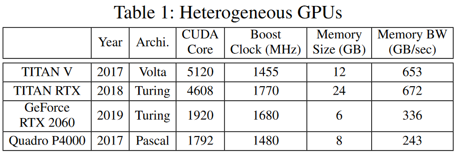

\
表 1 显示了我们机构在过去三年内购买的四种不同类型 GPU 的硬件规格及其市场发布年份。在购买时，每一个都是（接近）最先进的，在我们可以筹集的预算范围内。随着技术的快速发展，这些系统已经过时了。有些系统已经成为过时的技术，无法单独运行当今常见的大型 DNN 模型。异构 GPU 集群的这种情况现在应该很常见。

使用异构资源进行 DNN 训练有很多好处。首先，它允许使用较低级别的 GPU 进行大模型训练。虽然由于资源有限而无法单独训练，但将它们聚集在一起可以用于训练。这些原本可能已经过时的 GPU 变得可用，可能用于创建表现出与高级 GPU 相似性能的（虚拟的）worker。其次，低级 GPU 可以通过将（旧）低级系统的资源逐步添加到（新）高级系统来提高高级 GPU 的性能。我们将一组可以满足资源限制并用于训练的聚合 GPU 称为 VW。在内部，这样的 VW 可以利用 PMP 来处理小批量，而在外部，许多 VW 可以利用数据并行（DP）来获得更高的性能。

在本文中，我们探索 PMP 和 DP 的集成，以最大化 DNN 模型训练的并行性。特别是，我们研究了一个 DNN 模型训练系统，该系统同时采用 PMP 和 DP，用于异构 GPU 集群，该集群可能包括性能不佳的 GPU，而这些 GPU 作为独立的，无法用于训练大型模型。将 DP 集成到 PMP 听起来可能微不足道，但实际上，这是相当具有挑战性的。在此设置中，每个 VW 以流水线方式连续处理多个小批量，因此所有 VW 可以处于不同的状态。因此，这里的关键问题是，每个 VW 应该使用什么权重版本来与其他 VW 同步？要回答这个问题需要回答许多问题：1）在等待参数服务器的全局更新时可以开始处理多少个新的小批量？ 2）同步可以在处理小批量的任何点发生吗？ 3）当发生这种同步时如何保证收敛？ 4）当之前的小批量仍在每个 VW 中执行时，下一个小批量使用什么版本的参数？此外，要理想地利用异构 GPU 集群进行 DNN 训练还需要克服许多挑战：如何将异构 GPU 划分并分配给 VW ？当我们考虑 DP 时，我们如何减少 VW 的掉队者？我们如何对模型进行分区以最大化使用异构 GPU 的 PMP 性能？

虽然 DP 、PMP 和训练的异构性已被单独考虑，但据我们所知，这是第一篇解决这些问题的论文试图回答上述一些问题。在这项工作中，我们设计了一个 DNN 训练系统 HetPipe（异构流水线），它集成了 VW 的 PMP，该 VW 由多个（可能是不同的）异构 GPU 组成，并且 VW 的 DP 使用参数服务器来启用和加速大模型的训练。 HetPipe 可以聚合来自多个 GPU 的异构资源形成 VW ，使得每个 VW 的性能彼此相似，从而减少掉队问题。对于 HetPipe ，我们提出了一种新颖的参数同步模型，我们将其称为波同步并行（WSP）。 WSP 改编自陈旧同步并行 (SSP) 模型，与现有同步模型不同，可以适应多个 VW 的 PMP 和 DP。我们还证明了 WSP 的收敛性。请注意，虽然 HetPipe 可以在同构 GPU 集群中工作来训练无法加载到单个 GPU 内存中的大型模型，但随着更新的 GPU 架构的快速周转，最终更有可能得到一组异构 GPU。这就是我们的目标环境。

我们通过修改 TensorFlow 来实现 HetPipe。我们使用由四种不同类型的 GPU 组成的异构 GPU 集群来评估两个 DNN 模型的 HetPipe 性能。我们的实验结果表明，HetPipe 的性能优于使用 AllReduce 通信 的通过 Horovod 的最先进的 DP。这是因为 HetPipe 缓解了掉队问题，还因为它使每个 VW 和参数服务器能够针对所有参数更新进行内部通信，从而显着减少通信开销。与 Horovod 相比，具有大参数集的 VGG-19 的收敛速度快了 49%，而 ResNet-152 太大而无法加载到我们集群中的四个 GPU 中，通过使用所有 GPU（包括那些不同的 GPU）。

之前的研究已经探讨了利用 PMP 的策略。与这些相比，我们的研究在三个方面取得了进步。首先，我们将 VW 的 PMP 泛化为与 VW 的 DP 一起使用，增加了 DNN 模型训练的并行性。因此，这会加快训练速度。其次，我们考虑异构 GPU 集群，它允许使用 GPU，否则 GPU 无法用于训练。最后，我们提出了一个保证收敛的参数同步模型，并为使用 PMP 和 DP 的训练模型提供了证明。我们在第 2.2 节中对这些研究进行了更深入的比较讨论。

## 2 Background

### 2.1 Data Parallelism

数据并行 (DP) 利用多个 GPU 来加速 DNN 模型的训练。它将训练数据集划分为子集，并为每个 GPU 分配不同的子集。每个 GPU 都有一个 DNN 模型的副本，并处理子集中的每个小批量，从而计算权重更新。因此，如果DNN模型无法加载到单个 GPU 的内存中，则无法使用 DP 。

在多个worker之间，使用参数服务器或 AllReduce 通信来同步。对于批量同步并行 (BSP)，每个 GPU 必须等待所有其他 GPU 完成当前小批量 p，然后才能开始处理下一个小批量 p + 1，以便它可以使用更新后版本的权重更新 minibatch p + 1。对于异步并行 (ASP)，每个 GPU 无需等待其他 GPU 完成小批量 p，可能使用权重的过时版本。使用 BSP，参数服务器和 AllReduce 通信时，系统可能会遭受高同步开销，特别是在异构 GPU 集群中，其中每个具有不同 GPU 的 worker 提供不同的训练性能。另一方面，虽然 ASP（对于参数服务器来说是可能的）没有同步开销，但众所周知 ASP 不能确保收敛。

一种介于 BSP 和 ASP 之间的方法是 Stale Synchronous Parallel (SSP) 。通过 SSP，每个 GPU 都可以使用过时的权重版本进行小批量训练，该权重版本可能无法反映其他 GPU 计算的最新更新。因此，每当完成小批量的处理时，GPU 不需要与其他 GPU 同步。因此，可能会出现参数过时的情况。然而，这种陈旧程度是由用户定义的，称为陈旧阈值。由于 SSP 在 worker 性能有差异时是有益的，因此特别是在异构系统的背景下对其进行了探索。 

在SSP中，每个 worker 定期将权重更新推送到参数服务器。这个同步间隔称为时钟。因此，每个 worker 每次迭代都会将其本地时钟增加一，这是小批量的训练周期。对于给定的陈旧阈值 s（其中 s ≥ 0），每个具有时钟 c 的工作人员都可以使用权重的旧版本，其中包括从迭代 0 到 c − s − 1 的所有更新，以及 iteration c − s − 1 之后可能的更新。也就是说，worker 可以继续训练下一个小批量，其参数的更新可能会在最近 s 个小批量中丢失。

### 2.2 Model Parallelism and Pipeline Execution
模型并行 (MP) 通常用于大型 DNN 模型，这些模型太大而无法加载到单个 GPU 的内存中。具体来说，由多层组成的 DNN 模型被分为 k 个分区，每个分区分配给不同的GPU。每个 GPU 对指定分区的层执行前向和反向传播。请注意，在同一个 GPU 上执行分区的前向和反向传播非常重要，因为前向传播期间为小批量计算的激活结果需要保留在 GPU 内存中，直到同一小批量的反向传播以实现高效收敛，正如 Narayanan 等人所讨论的那样。否则，通过重计算或内存管理来管理激活将产生相当大的额外开销。

在 MP 的基本形式中，k 个 GPU 充当一个 VW 来处理小批量，如下所示：对于每个小批量，前向传播的执行从 GPU1 开始一直到 GPU k。当每个 GPU i（其中 1 ≤ i < k）完成分配分区的前向传播时，它仅将其分区中最后一层的计算激活发送到 GPU i+1。一旦 GPU k 完成其分区的前向传播，小批量的反向传播将从 GPU k 向下执行到 GPU 1。当每个 GPU i′ （其中 1 < i′ ≤ k）完成反向传播时，它会发送计算出的局部梯度。MP 的这种基本形式会导致 GPU 利用率较低，因为只有一个 GPU 正在主动执行前向或反向传播。尽管如此，MP 仍允许执行对于单个 GPU 来说太大的 DNN 模型。

为了提高 VW 中 GPU 的利用率，可以以流水线方式处理小批量。一旦 GPU 完成前一个小批量的处理，后续的小批量就会被逐一送入 MP 中的第一个 GPU（即 GPU 1）。这允许多个 GPU 同时执行不同小批量的分配层的前向或反向传播。这称为流水线模型并行性 (PMP)。

这种 PMP 策略已在之前的研究中进行过研究。 PipeDream 利用单个 VW 的 PMP 来避免 DP 的参数通信开销。仅考虑同构 GPU ，当 PipeDream 将模型划分为多个流水级以最大化流水线性能时，它没有考虑取决于流水级的 GPU 内存需求。因此，PipeDream 处理有限数量的小批量（其大小足以使流水线饱和），以减少内存开销。 PipeDream 也提供了一种 DP 形式，但它在 VW 内考虑 DP，以加快滞后层的执行速度。 PipeDream 中没有提供单流水线收敛的证明。请注意，如果没有 WSP 等参数同步模型，则无法通过参数服务器或 AllReduce 通信在多个 PipeDream VW 上正确运行 DP。

GPipe 是一种利用单个 VW 的 PMP 来支持大型 DNN 模型的方案，也在同构 GPU 集群中。在 GPipe 中，一个小批量被分成多个微批量，这些微批量被注入到流水线中。使用相同的权重，GPipe 对所有微批次执行前向传播，然后对它们执行反向传播。当最后一个微批次的反向传播完成时，它会一起更新该小批次的权重。 GPipe 会导致频繁的流水线刷新，可能导致 GPU 利用率低。在 GPipe 中，多个 VW 的 DP 可以使用现有的同步方案（例如 BSP）来完成，因为 VW 一次处理一个小批次。 GPipe 通过在反向传播中重计算激活而不是在内存中保留前向传递中计算的激活来节省 GPU 内存。尽管没有根本原因禁止它，但我们不使用这种优化。表 2 给出了 HetPipe 与之前研究的比较。

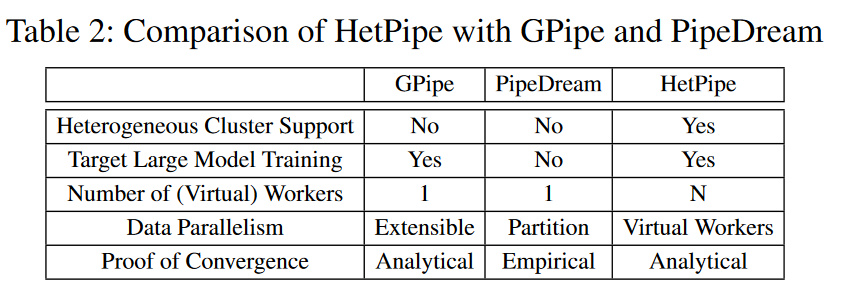

## 3 System Overview

我们提出的系统侧重于在由具有不同计算能力和内存容量的各种类型的 GPU 组成的异构 GPU 集群中训练大型 DNN 模型。在这样的设置中，对于集群中某些类型的 GPU，DNN 模型可能太大而无法加载到单个 GPU 的内存中。我们在本文中提出的系统利用流水线模型并行 (PMP) 和数据并行 (DP) 来训练此类大型 DNN 模型，并在此过程中提高性能以及异构 GPU 集群的利用率。

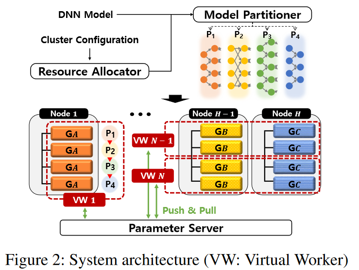

\
图 2 显示了所提出的由 H 个节点组成的集群系统的架构。每个节点都包含一组同构的 GPU，但节点本身的 GPU（和内存容量）可以是异构的。该架构存在两个关键的新颖之处。首先，DP 通过 VW 的概念来支持，该 VW 由 k 个（可能是异构的）GPU 组成，并封装了典型 DNN 系统中 worker 的概念。即使用 VW 来训练 DNN 模型。在图 2 中，请注意，有 N 个 VW ，每个 VW 有 4 个 GPU，即 k = 4，并且组成 VW 的 GPU 可能不同。虽然在本文中我们认为 k 对于每个 VW 来说都是常数，但我们的设计并不限制它如此；这只是我们为了简单起见而做出的选择。这里的关键方面是，即使单个 GPU 资源有限， VW 也可能通过聚合 GPU 来允许 DP。

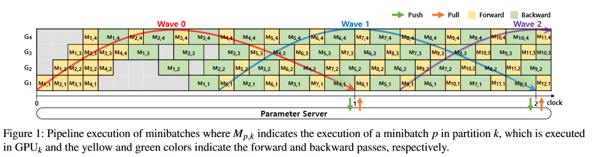

第二个新颖之处是，每个 VW 基于模型并行以流水线方式处理每个小批量，以充分利用 GPU 资源，如图 1 所示，以适应大型 DNN 模型。虽然 PMP 之前已经被提出过（我们在第 2.2 节中进行比较），但据我们所知，我们是第一个在异构环境中提出 PMP 的人。我们将我们的系统称为 HetPipe，因为它是异构的，在 GPU 中，跨 VW，甚至可能在 VW 内部，并利用 VW 中的流水线来提高资源效率。

为了在 VW 中训练基于流水线模型并行的 DNN 模型，资源分配器首先根据资源分配策略为每个 VW 分配 k 个 GPU（将在 8.1 节中讨论）。请注意，为了将异构 GPU 分配给 VW ，资源分配策略必须考虑多个因素，例如各个 GPU 的性能以及在 VW 内发送激活和梯度以及同步 VW 之间的权重所导致的通信开销。然后，对于给定的 DNN 模型和分配的 k 个 GPU，模型分区器将模型划分为 VW 的 k 个分区，以便可以最大化 VW 中执行的流水线的性能。

与任何典型的 DP 一样，多个 VW 必须通过参数服务器或 AllReduce 通信定期同步全局参数；在HetPipe中，参数服务器用于维护全局权重。每个 VW 都有全局权重的本地副本，并定期与参数服务器同步权重。显然，在管理 VW 内部和 VW 之间的权重时，需要允许两种类型的陈旧性：本地陈旧性和全局陈旧性，以提高 DNN 训练的性能。本地陈旧是指 VW 内部的陈旧。由于每个 VW 以流水线方式处理小批量，因此有多个小批量正在并行处理。因此，陈旧是不可避免的，因为小批量看到的权重可能无法反映其之前所​​有小批量的更新

另一方面，全局陈旧性与等人提出的陈旧性概念类似。即系统需要减少参数服务器和 VW 之间的通信开销，并且，在我们的例子中，还可以减轻可能由异构 VW 引起的同步开销。因此，与 SSP 类似，每个 VW 都应该被允许继续训练，而无需查询每个小批量的全局权重，除非其本地副本太旧，以至于缺少太多其他 VW 所做的最新更新。请注意，这种陈旧条件是由用户设置的。

对于我们的系统，我们提出了波同步并行（WSP）模型来同步权重。波是在 VW 中同时处理的一系列小批量。设一次 Wave 中的小批量数量为 Nm。在一个波内，允许继续处理第 i 个小批量，而无需等待前面的小批量 i' 完成，其中 1 < i ≤ Nm 且 1 ≤ i' < i。也就是说，同一波中小批量使用的权重之间不存在依赖性。由于即使从 Wave 中的第一个小批量开始，VW 也不会强制执行更新，以反映在最后一个小批量使用的权重中，因此 WSP 中的本地过时阈值为 Nm − 1。此外，每个 VW 仅推送聚合更新从 Wave 中的所有小批量（而不是每个小批量）发送到参数服务器。这导致通信开销显着减少。我们在第 6 节中展示了我们方法的收敛性。

请注意，HetPipe 使用参数服务器，这可能会产生同步和通信开销。然而，HetPipe 通过允许 VW 之间的全局陈旧性并在每个 VW 中执行流水线来减轻此类开销，以便在等待参数更新时继续处理已注入的小批量。我们相信 HetPipe 可以通过采用去中心化的方法进一步优化，但将其留到未来的工作中。

## 4 Pipelined Model Parallelism Within a VW
流水线中的小批量数量：在我们的系统中，每个 VW 以流水线方式同时处理最多 $N_m$ 个小批量，以便小批量的执行可以重叠。给定一个 DNN 模型和 k 个 GPU，VW 中同时执行的最大小批量数量 $Max_m$ 基本上由训练模型的内存需求决定。对于需要大量内存用于输出激活和权重的模型，$Max_m$ 可能小于 k。请注意，在这种情况下，每个 GPU 的利用率不太可能很高。

$N_m$，流水线中实际的小批量数量将是 $N_m ≤ Max_m$，并且基本上是根据流水线的吞吐量来确定的。注意，每个 VW 中的 $N_m$ 必须相同，因此，$N_m$ 被设置为所有 VW 中最小的 $Max_m$ 。 $N_m$ 将影响我们在本节后面讨论的本地陈旧性。

模型分区：为了训练 DNN 模型，通过资源分配策略将一组 k 个 GPU 分配给 VW ，我们将在 8.1 节中讨论。现在，我们假设 k（可能的异构 GPU 的数量）和 $N_m$ 已给出。然后，采用分区算法将模型的多个层划分为 k 个分区，并将它们分配给 k 个不同的 GPU。分区算法的目标是最大化流水线的性能，同时满足每个分区处理 $N_m$ 个小批量的内存需求。

特别是，在本研究中，对于内存，我们考虑到实际内存需求将根据 GPU 使用的流水级而变化。例如，对比图 1 中的 GPU 4 和 GPU 1。GPU 4 是处理流水线最后流水级的 GPU，一次仅处理一个小批量，并立即处理该小批量，如黄色（前向传播）和绿色（反向传播）$M_{i,4}$ 。相反，对于 GPU 1，黄色和绿色 $M_{i,1}$ 相距很远，这意味着前向传播 $M_{i,1}$ 需要保留内存，直到反向传播 $M_{i,1}$ 完成执行。因此，对于 GPU 1，内存要求很高，因为它需要保留流水线所有流水级的前向传播结果。在划分层时考虑了内存需求的这种差异。

划分层时还必须考虑执行时间。为此，我们将分区的执行时间计算为分区中所有层的计算时间以及接收激活（在前向传递中）和局部梯度（在反向传递中）所需的通信时间的总和）。我们的分区算法尝试在满足内存需求的范围内最小化分区的最大执行时间。

分区调度：设置分区后，需要为每个 GPU 调度分区。负责分区 q 的每个 GPU q 一次可能有多个前向传播和反向传播任务需要调度。每个 GPU 通过强制执行以下条件来调度任务：

1. 只有在每个小批量 p′ 的前向传播任务完成后，才会执行小批量 p 的前向传递任务，其中 1 ≤ p′ < p。 
2. 类似地，只有在完成每个小批量 p' 的反向传播任务（其中 1 ≤ p' < p）后，才会执行小批量 p 的反向传播任务
3. 多个前向和反向传播任务中，采用先进先出的调度策略。

请注意，在最后一个分区中，对于小批量，处理前向传播和反向传播是作为单个任务执行的。

考虑陈旧性：考虑到流水线的描述，需要考虑所使用的权重的陈旧性问题。也就是说，在安排小批量时，各层可能没有使用最新的权重。例如，在图 1 中，当开始处理前向传播 $M_{2,1}$（第二个小批量）时，它必须使用旧权重因为第一个小批量尚未完成，因此，由于第一个小批量而导致的权重变化尚未得到适当反映，这与一次处理一个小批量的典型处理形成对比。我们现在讨论如何考虑这个陈旧问题。

令本地陈旧度为允许小批量在 VW 中进行的最近小批量中丢失更新的最大数量。由于 $N_m$ 个小批量的训练可以在 VW 中并行进行，因此本地陈旧阈值 $s_{local} 被确定为 $N_m − 1$ ，其中 $ 1 ≤ N_m ≤ Max_m$ 。如果 $N_m = 1$ ，则行为与朴素模型并行完全相同。随着执行大量并发小批量，较大的 $N_m$ 可能会提高流水线吞吐量，但局部陈旧性会增加，可能会影响训练的收敛性。在实际设置中，$N_m$ 通常不会大到足以影响收敛，因为它受到 VW 的 GPU 内存总量的限制。

这种局部陈旧性也存在于 PipeDream 中。由于 PipeDream 基本上采用权重存储，即使用每个分区上可用的最新版本的权重来执行小批量的前向传播，因此对于同一小批量，跨分区使用不同版本的权重。不幸的是，PipeDream 仅显示了使用权重存储时收敛的经验证据。请注意，PipeDream 也讨论了垂直同步，这与 HetPipe 类似，但它在评估中排除了垂直同步。

现在让 $w_p$ 为小批量 p 使用的权重。然后，最初，我们可以假设权重的初始版本 $w_0$ 被赋予 VW 。然后，以流水线方式处理前 $(s_{local} + 1)$ 个小批量，其中 $w_0 = w_1 = · · · = w_{slocal} = w_{slocal +1}$。

为了适应我们系统中的陈旧性，当小批量 p 的处理完成时，VW 将权重的本地版本 $w_local$ 更新为 $w_{local} = w_{local} + u_p$，其中 $u_p$ 是通过处理小批量 p 计算出的更新。因此，在 HetPipe 中，权重不是逐层更新的，$w_{local}$ 是跨分区权重的一致版本。当 VW 开始处理新的小批量时，它会使用 $w_{local}$ 的最新值，而无需等待其他小批量更新其权重。例如，一旦 VW 完成小批量 1 并使用 $u_1$ 更新 $w_{local}$，它将开始使用更新的权重处理小批量 $s_{local + 2}$，而无需等待小批量 2 到 $s_{local + 1}$ 完成。同样，当 VW 完成 minibatch $s_{local + 1}$ 并使用 $u_{s_{local+1}}$ 更新 $w_{local}$ 时，它将开始处理 minibatch $2 × (s_{local} + 1)$，而无需等待之前最近的 $s_{local}$ minibatch 完成。因此，除了初始小批量 1 到 $s_{local}$ + 1 之外，对于小批量 p，VW 将使用反映（至少）从小批量 1 到 $p − (s_{local} + 1)$ 的所有本地更新的权重版本。请注意，对于每个小批量 p，$w_p$ 必须保存在 GPU 内存中，直到执行 p 的反向传播。

请注意，SSP 中的陈旧性是由多个 worker 之间的小批量处理速度不同引起的。因此，在 SSP 中，陈旧性被用作减少同步和通信开销的一种手段。然而，HetPipe 中的本地陈旧性是由于在 VW 中以流水线方式处理小批量而造成的。

## 5 Data Parallelism with Multiple VWs
在本节中，我们将讨论 VW 的数据并行（DP）。VW 支持 DP 的第一个也是最重要的观察结果是，VW 可能由异构 GPU 组成。众所周知，DP 有助于加速 DNN 执行，但在典型系统中，如果单个 GPU 没有足够的资源来处理 DNN 模型，特别是大型 DNN，则 DP 是不可能实现的。通过允许 VW 由多个缺乏资源的 GPU 组成，我们的系统即使在性能不佳的 GPU 上也可以实现 DP。使用 VW 正确支持 DP 的另一个关键观察结果是，每个 VW 现在都保留了第 4 节中讨论的本地陈旧性。确保，尽管存在这种本地陈旧性，我们理解并表明从 VW 之间的 DP 获得的结果全局收敛是一个必须解决的重要问题。本节的其余部分详细阐述了这个问题。

WSP 的工作原理：如系统概述中所述，HetPipe 使用参数服务器。我们假设这种同步发生在 clock 单元中，这一概念取自 SSP。准确地说，一个 clock 单元被定义为完成一个 wave 的进度。回想一下第 3 节（和图 1），wave 是并发执行的 $s_{local} + 1 个小批量的序列，这样 VW 就可以处理 wave 中较晚的小批量，而无需来自同一 wave 中较早小批量的更新。

与SSP类似（然而，它只在 DP 中考虑权重的陈旧性），每个 VW 维护一个本地时钟 $c_{local}，而参数服务器维护一个全局时钟 $c_{global}$，它保存所有 VW 的最小 $c_{local}$ 值。最初，本地时钟和全局时钟均为 0。在每个时钟 c 结束时，每个 VW 完成第 c 波中所有小批量的执行。此时，VW 计算从小批量 $c × (s_{local} + 1) + 1$ 到小批量 $(c +1)×(s_{local} +1)$ 的聚合更新，并将更新 ̃u 推送到参数服务器。我们看到，与 SSP 类似， ̃u 与时钟值 c 同步。例如，如图 1 所示，其中 $s_{local} = 3$，在时钟 0 结束时，VW 推送第 0 波的聚合更新，该更新由 1 到 4 的小批量组成，而在时钟 1 结束时，第一波的聚合更新，由 5 到 8 个小批量组成，依此类推。需要注意的是，在 WSP 中，VW 为每个 Wave 推送 ̃u 到参数服务器，而不是为每个小批量推送 ̃u ，这将显着减少通信开销。

当参数服务器从 VW 接收到更新 ̃u 时，参数服务器将权重的全局版本更新为 $w_{global} = w_{global}+ ̃u$ 。请注意，只有在每个 VW 推送了第 c 波的聚合更新后，参数服务器才会将其 $c_{global}$ 更新为 c + 1。

在 WSP 中，每个 VW 都可以进行训练，而无需检索每个 wave 的全局权重。因此，VW 可以使用从全局角度来看可能是过时的权重版本，因为参数服务器接收到的最新更新可能不会反映在权重的本地版本中。我们讨论 VW 的全局陈旧性如何受到限制。

__全局陈旧界限__：令时钟距离为系统中最快和最慢 VW 之间的 $c_{local}$ 差异。因此，具有本地时钟 c（其中 c ≥ D + 1）的 VW 必须使用包含从第 0 波到 c − D − 1 的所有（聚合）更新的权重版本。此外，权重版本可能包括其他 VW 最近的一些全局更新以及 c – D – 1 波之后 VW 内的一些最近本地更新。

当 VW 在时钟 c 结束时拉动全局权重以维持此距离时，它可能需要等待其他 VW 在波 c – D 完成后推送其更新。然而，当 VW 等待其他 VW时，由于 worker 可能在时钟 c 结束时赶上，因此允许本地处理继续进行第 c + 1 波的局部小批量，因为小批量是以流水线方式执行的。

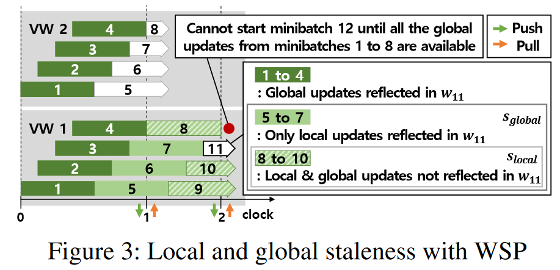

以图 3（和图 1）中 D = 0 且 $s_{local} = 3$ 的情况为例。作为 VW1 完成小批量 4，它计算第 0 波（由小批量 1 到 4 组成）的聚合更新 ̃u 并将 ̃u 推送到参数服务器。 VW1 现在等待其他 VW 完成第 0 波，然后再继续处理第 8 个小批量。但是，请注意，如图所示，VW1 已经开始处理属于第 1 波的小批量 5、6 和 7，而其本地时钟仍然是 0。类似地，一旦完成小批量 8，它会将第 1 波的聚合更新（由小批量 5 到 8 组成）推送到参数服务器；同时，它已经开始处理属于第 2 波的小批量 9、10 和 11，而其时钟仍为 1。

请注意，VW 中本地小批量的这种处理不会违反本地陈旧界限。另请注意，当 D = 0 时，每个 VW 必须在每个时钟结束时相互等待，以同步每个波的权重，这是每个 VW 中具有流水线执行的类似 BSP 的行为。

现在让我们将全局陈旧界限 $s_{global}$ 定义为最近小批量中丢失更新的最大数量，由系统中的所有其他 VW 全局计算，允许小批量在 VW 中进行。我们希望根据迄今为止的讨论来识别 $s_{global}$。这将允许每个 VW 确定是否可以继续其当前的小批量。

最初，所有 VW 开始处理前（D + 1）个 wave 且无需从参数服务器查询全局权重。此外，在接收包括上述最近更新的全局权重之前，他们可以开始处理下一波的局部小批量。因此，对于那些初始小批量，VW 使用 $w_0$ 或可能包含一些最近本地更新的权重版本。

对于此后的任何小批量 p，即，其中 $p > (D +1) × (s_{local} + 1) + s_{local}$，p 必须使用至少反映来自所有其他 VW 的所有全局更新的权重版本从小批量 1 到小批量 $p − (s_{global} + 1)$，其中 $s_{global} = (D + 1) × (s_{local} + 1) + s_{local} − 1$。该等式的第一项是由于允许 VW 继续进行下一个 (D + 1) 波（即 (D + 1) × (s_{local} + 1) 个小批量），第二项是由于流水线执行而可以启动的额外 $s_{local}$ 小批量。继续图 3 中的示例，其中 D = 0 且 $s_{local} = 3$，VW1 继续进行小批量 11 的训练，而无需来自第 1 波（小批量 5 至 8）的全局和/或本地更新或来自小批量 9 和 10 的两个本地更新（即 $s_{global} = 6$）。因此，它必须具有一个包含从小批量 1 到 4 的所有全局更新的权重版本。实际上，用于小批量 11 的权重版本包括来自小批量 5、6 和 7 的三个本地更新以及所有全局更新从第 0 波开始。对于小批量 12，只有收到小批量 8 的全局更新后才能开始训练。

## 6 Convergence Analysis

## 7 Partitioning Algorithm
回想一下，我们的分区算法的目标是在满足内存需求的范围内最小化分区的最大执行时间。为了获得一个性能模型来预测异构 GPU 中模型每一层的执行时间，我们首先在集群中每个不同类型的 GPU 上分析 DNN 模型，其中我们测量异构 GPU 中每一层的计算时间。模型。对于 GPU 内存使用情况，我们仅测量一种 GPU 类型上每一层的使用情况（通过使用 TensorFlow 的日志记录功能）（因为所有 GPU 类型的情况大致相同）。为了分析异构节点上的内存使用情况，我们使用小批量大小测量每个层的内存使用情况，然后将其乘以目标批量大小。为了计算给定分区的内存需求，我们考虑了存储数据以处理各层的总内存使用量以及同时分配给该分区的最大小批量数。

对于模型中各层之间的通信时间，我们首先从模型图中导出前向和反向传播中每层的输入数据量。对于给定的数据大小，我们根据 PCI-e 带宽预测节点内通信，然后将其乘以按比例缩小的常数（这与 Paleo [46] 中的做法类似），因为在实践中，不可能利用峰值带宽。缩小常数是通过运行合成模型得出的，该模型将各种大小的数据从一个 GPU 发送到同一节点中的另一个 GPU。对于节点间通信（通过 InfiniBand），我们使用线性回归来估计给定数据大小的通信时间。为了构建预测模型，我们通过训练实验中使用的两个具有任意分区的 DNN 模型来收集 27 个样本。请注意，在这项工作中，没有考虑网络性能的异构性，例如慢速网络链接（如[33]）。然而，对于这种情况，我们可以扩展分区算法，在估计通信时间时考虑两个节点之间不同的网络性能。此外，更准确地估计每个阶段的内存需求的模型将有助于以更平衡的方式划分 DNN 模型。

为了找到 DNN 模型的最佳划分，我们使用 CPLEX，它是一个用于解决线性规划问题的优化器。流水线上每个分区支持 $N_m$ 并发小批量的内存需求作为优化器的约束提供。仅当算法找到满足给定 GPU 内存要求的分区时，才会返回具有特定批量大小的模型的分区。此外，优化器还会检查单个 VW 的给定异构 GPU 的所有不同顺序，以在其上分区和放置 DNN 模型的层。

## 8 Experimental Results

### 8.1 Methodology

__异构 GPU 集群__：在我们的实验中，我们使用四个节点，其中两个节点具有通过 InfiniBand (56 Gbps) 连接的两个 Intel Xeon Octa-core E5-2620 v4 处理器 (2.10 GHz)。每个节点有 64 GB 内存和 4 个同构 GPU。每个节点都配置了不同类型的 GPU，如表 1 所示。因此，我们集群中的 GPU 总数为 16 个。每个 GPU 配备 PCIe-3×16 (15.75 GB/s)。使用带有 Linux 内核版本 4.4 的 Ubuntu 16.04 LTS。我们通过使用 CUDA 10.0 和 cuDNN 7.4 修改 TensorFlow 1.12 version，基于 WSP 模型实现了 HetPipe。

__DNN 模型和数据集__ 我们的主要性能指标是训练 DNN 模型的吞吐量（图像/秒）。我们将 ResNet-152 和 VGG-19 与 ImageNet 结合使用。对于每个 DNN 模型，使用的 bachsize 为 32。对于所有其他超参数，我们使用 ResNet-152 和 VGG-19 的基准中指定的默认设置。

__VW 的资源分配__：对于任何异构 GPU 集群，可以有多种方法将资源分配给多个 VW 。对于我们的实验，我们考虑平台范围内的分配策略。因此，给定 16 个 GPU，HetPipe 使用 4 个 VW ，每个 VW 配置有 4 个 GPU，并遵循以下三种分配策略。
(1)节点分区 (NP)：此策略为每个 VW 分配一个节点。因此，每个 VW 都由同构 GPU 组成。因此，由于节点是异构的，每个 VW 的 DNN 模型的层划分是不同的。 NP 可将每个 VW 内的通信开销降至最低，因为 GPU 之间的通信通过 PCI-e 在同一节点内进行，而不是通过 InfiniBand 跨多个节点进行通信。另一方面，由于每个 VW 的性能各不相同，落后者可能会降低 DP 的性能。
(2)均等分配 (ED)：此策略将 GPU 从每个节点均匀分配给每个虚拟工作者。因此，每个虚拟工作者都被分配了四个不同的 GPU，但每个虚拟工作者都拥有完全相同的资源。因此，模型划分是相同的，因此，不同 VW 的性能时一样的。这减轻了掉队者的问题。然而，ED 会导致每个 VW 内部的通信开销较高。
(3)混合分配 (HD)：该策略是 NP 和 ED 的混合。对于我们的集群，两种 GPU 类型的组合被分配给每个 VW，以便它们在聚合计算能力和 GPU 内存量方面的性能彼此相似。做出此选择是为了缓解掉队问题，同时减少每个 VW 内的通信开销。因为，从计算能力来看，V > R > G > Q，从 GPU 显存量来看，R > V > Q > G，两个 VW 分配为 VVQQ，另外两个分配为 RRGG，其中 V、R、G 和 Q 分别指 TITAN V、TITAN RTX、GeForce RTX 2060 和 Quadro P4000。

表3显示了三种资源分配策略下每个虚拟工作者的资源分配。

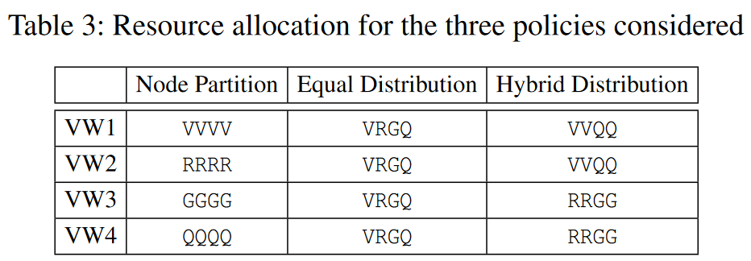

__参数放置__：在我们的实验中，对于DP，我们在所有节点上定位参数服务器，每个参数服务器仅处理一部分模型参数。对于可与我们所有三种资源分配策略一起使用的默认放置策略，我们以循环方式将模型层放置在所有参数服务器上，如 TensorFlow 中一样。然而，对于 ED，可以采取另一种政策，我们将其称为“ED-local”。使用“ED-local”，我们将分区的各层放置在同一节点上运行的参数服务器上，不会在节点之间产生用于参数同步的实际网络流量。这是可能的，因为可以将模型的相同分区本地分配给每个 VW 的同一节点上的 GPU。对于下文报告的所有结果，均使用 “默认” 策略，“EDlocal” 除外。

### 8.2 Performance of a single virtual worker

我们首先研究根据表 3 中的分配方案可能的 7 个不同的单独 VW 的性能。图 4 显示了 VW 中不同 $N_m$ 值的吞吐量，$N_m$ 是同时执行的小批量的数量。 $N_m = 1$ 时的结果以及 ResNet-152 和 VGG-19 的四个分区之间的最大平均 GPU 利用率。显示的数字（在框中）以及分配策略是 $N_m = 1$ 时的绝对吞吐量（图像/秒）。请注意，未显示较大 $N_m$ 的一些结果。这是因为 GPU 内存无法适应这种情况，因此无法运行。

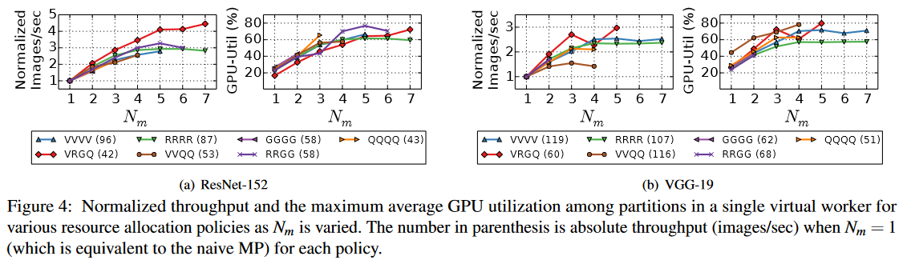

从结果中我们可以看到，随着 $N_m$ 的增加，VW 的归一化吞吐量以及最大 GPU 利用率通常会增加。请注意，尽管未显示，但总 GPU 内存利用率往往会随着 $N_m$ 的增加而增加。然而，根据资源分配方案（导致模型的不同分区）以及 DNN 模型，具有较大 $N_m$ 的效果会有所不同。当 VW 配置同构 GPU 时，每个分区的平均 GPU 利用率彼此相似。然而，当配置异构 GPU 时，存在第一个或最后一个分区的 GPU 利用率高于其他分区的趋势。对于此配置，在划分模型时会考虑 GPU 的不同计算能力和内存容量。由于某些 GPU 可能只分配了少量层，因此总体 GPU 利用率可能会较低。

### 8.3 Performance of multiple virtual workers

图 5 显示了使用三种资源分配策略训练每个模型的吞吐量，其中 “Horovod” 表示通过使用 AllReduce 通信的 Horovod 的最先进的 DP。在这些实验中，对于每个资源分配策略，$N_m$ 被设置为使得性能最大化，同时每个 VW 使用相同的 $N_m$ 值，因为这是 HetPipe 背后的假设。对于ResNet-152，整个模型太大，无法加载到单个 G 类型的 GPU 中，因此 Horovod 仅使用 12 个 GPU。

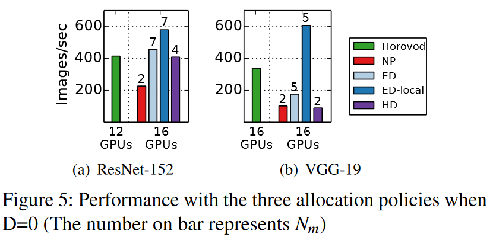

图 5 中的结果表明，DNN 训练的性能很大程度上受到异构 GPU 分配给 VW 的方式的影响。从结果中，我们可以得出以下结论：首先，对于参数大小为 548MB 的 VGG-19，减少参数同步通信开销的 Horovod 的性能优于 NP、ED 和 HD。然而，对于参数大小为 230MB 的 ResNet-152，利用具有相似性能的 VW 的 ED 和 HD 表现出比 Horovod（具有 12 个 GPU）更好或相似的性能。其次，对于 NP，ResNet-152 和 VGG-19 的训练性能较低，因为 $N_m$ 受到具有最小 GPU 内存的 VW 的限制。第三，通过 ED-local，每个 GPU 和参数服务器之间发生内部通信，显着减少了节点之间的通信开销，特别是对于 VGG-19 这种具有大参数集的模型。对于 VGG-19，ED-local 的每个小批量在节点之间传输的数据量（即 103 MB）比 Horovod 的数据量（即 515MB）小得多。因此，ED-local 的性能（也缓解了落后者问题）比 Horovod 高 1.8 倍。对于 ResNet-152，使用 ED-local 传输的数据量（即 298MB）大于使用 Horovod 传输的数据量（即 211MB），因为要在分区之间发送的输出激活的大小很大，即使参数大小为相对较小。不过，ED-local 的吞吐量仍然比 Horovod 高40%。这是因为Hetpipe 允许每个 VW 同时处理大量的小批量。与 NP 和 HD 相比，ED-local（或 ED）通常在每个 VW 中具有更大的 $N_m$ ，从而提高吞吐量。

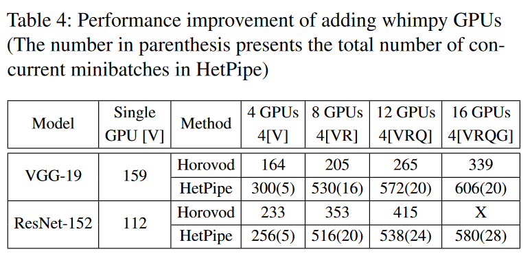

接下来，我们研究当额外使用 GPU 进行训练时，吞吐量是如何提高的。表 4 显示了当通过 Horovod 的 DP 和带有 ED-local 的 HetPipe 在不同组的异构 GPU 上使用时以及使用单个 V GPU 时，VGG-19 和 ResNet-152 的吞吐量。对于这些实验，HetPipe 配置为使用四个虚拟工作线程，但使用单个虚拟工作线程的“4 个 GPU”除外。表中还给出了每个实验使用的 GPU 数量和类型。从结果中我们可以看到，当使用额外的 GPU 进行训练时，Horovod 和 HetPipe 的性能都会提高。借助额外的 GPU，HetPipe 可以增加处理的并发小批量的总数，加速速度高达 2.3 倍。这种情况可以被认为是购买新的、更高端的节点，但不知道如何处理现有节点时的一种答案。结果表明，利用奇特的系统可以更快地训练更大的模型。

### 8.4 Convergence

我们基于 WSP 模型的 HetPipe 保证收敛，如第 6 节所证明的那样。在本节中，我们使用 ResNet-152 和 VGG-19 分析 HetPipe 与 ED-local 的收敛性能。对于我们的实验，ResNet-152 和 VGG-19 的期望目标准确度分别为 74% 和 67%。

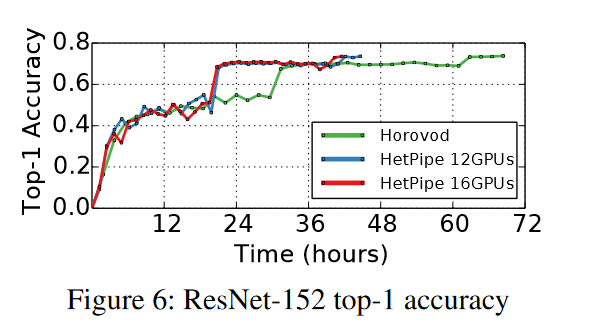

图 6 显示了使用 Horovod（12 个 GPU）、HetPipe（12 个 GPU）和 HetPipe（16 个 GPU）的 ResNet-152 的 top-1 精度，其中 HetPipe 的 D 设置为 0。对于12个GPU的实验，不使用4G类型的GPU。当使用同一组 GPU 时，通过减少异构环境中的落后问题并同时利用 PMP 和 DP，HetPipe 的收敛速度比 Horovod 快 35%。此外，通过添加四个出色的 G GPU，HetPipe 进一步提高了训练性能，收敛速度比 Horovod 快了 39%。

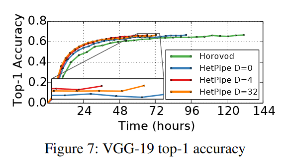

图 7 显示了当我们将 D 更改为 0、4 和 32 时，VGG-19 与 Horovod 和 HetPipe 的 top-1 精度。在实验中，使用了所有 16 个 GPU。该图显示，HetPipe 的类似 BSP 配置（即 D = 0）的收敛速度比 Horovod 的收敛速度大约快 29%。当我们将 D 增加到 4 时，stragger 效应就会减轻，并且参数同步导致的通信开销也会减少。因此，与 D = 0 和 Horovod 相比，收敛速度分别快了 28% 和 49%。在与ED-local（其中每个 VW 的训练速度相似）的实验中，当 D 变得非常大（即 32）时，与 D = 4 相比，吞吐量保持相似，但收敛性能下降 4.7%。这是因为最快和最慢 VW 之间的时钟距离不太可能变成 32 那么大，但较高的全局陈旧性会降低收敛性能（与[18]中的讨论类似）。请注意，虽然未显示，但使用较大的 D 对具有 NP、ED 和 HD 资源分配的 HetPipe 具有更大的影响，并且不同的资源分配仅影响每个 VW 使用的异构 GPU 集，而不会影响收敛行为。

我们还分析了 D 变化时的同步开销。我们发现，随着 D 的增加， VW 接收更新的全局权重的等待时间减少。在我们的实验中，发现 D = 4 时的平均等待时间是 D = 0 时的62％。此外，实际空闲时间仅为等待时间的 18％，因为 VW 可以在等待时间继续在流水线中执行。

## 9 Discussion
与 PipeDream 的比较 PipeDream [38] 是最接近的相关研究，它优化单个虚拟工作者的 PMP，仅在同构环境中的虚拟工作者内采用 DP 来处理滞后层。为了适应异构环境，必须对其分区算法进行扩展，以考虑异构GPU的不同性能和内存大小、用于管道的异构节点的不同顺序以及分区的GPU的内存需求。

我们使用 PipeDream 运行 ResNet-152 的训练，PipeDream 在 PyTorch [37] 上实现，在第 8.1 节中描述的异构 GPU 集群中。由于分区算法不考虑异构 GPU，因此对于每种 GPU 类型，我们对 ResNet-152 进行分析，然后假设我们的集群配置了该类型的同构 GPU，则生成模型的分区，最后使用以下参数测量 PipeDream 的吞吐量：分区。管道的所有计算配置都会产生大量（即 12 或 14 个）分区。例如，对于 Q，配置为 4-2-1-1-1-1-1-1-1-1-1-1 表示模型分为 12 个分区，其中第一个分区由 4 个 GPU 执行使用 DP，第二个由两个具有 DP 的 GPU 执行，依此类推。对于这些配置，我们对四个不同节点的不同顺序进行了实验并使用多个批量大小进行测试。（请注意，由于内存不足错误，我们无法对某些配置进行训练。）使用 PipeDream 测量的最佳吞吐量为 158。回想一下，Horovod（具有 12 个 GPU）和 HetPipe 的吞吐量分别为 415 和 580。在这种情况下，发现 ResNet-152 的 PipeDream 性能较低，因为除了次优分区之外，大量分区会导致较高的网络开销。因此，仅使用 PMP（即单个虚拟工作者），当模型被划分为多个分区时，性能优势可能会受到限制。在这种情况下，使用多个虚拟工作者（如 HetPipe）运行 DP 可以提高训练的并行性，并进一步提高性能，而不是增加分区。

不平衡分区的影响 我们的分区算法尝试在满足内存要求的同时平衡分区。然而，根据 DNN 模型，计算的分区可能会不平衡。例如，对于由少量层组成的模型，如果与其他层相比，一层的执行时间要长得多，则分区最终可能具有不同的执行时间。在这种情况下，与任何其他基于管道的系统一样，管道的性能将会下降。请注意，为慢速分区运行 DP 以在所有分区（如 PipeDream [38]）中具有相似的处理速率将是 HetPipe 的可能扩展。

## 10 Related Work
流水线已被用来提高机器学习系统的性能[6,7,19,32,38]。采用流水线方案来处理昂贵的反向传播[7]。 Pipe-SGD 通过管道处理小批量，以隐藏基于 AllReduce 的系统中的通信时间 [32]。提出了一种权重预测技术来解决流水线模型并行性中的陈旧问题[6]。第 2.2 节提供了 HetPipe 与 PipeDream [38] 和 GPipe [19] 的详细比较。请注意，PipeDream [38] 中提出的重叠计算和通信的功能也将提高我们系统的性能。 PipeDream 采用一前一后向调度算法进行管道执行。复杂的调度程序考虑了各种因素，例如异构配置、分区数量以及虚拟工作线程中并发小批量的数量，可以潜在地提高 HetPipe 的性能。人们已经研究了优化学习率的技术 [15]，这些技术也可以应用于 HetPipe 以帮助更快地收敛。

考虑异构环境的去中心化训练系统也得到了研究[33, 34]。然而，这些技术没有考虑 DP 与 PMP 的集成，这允许支持不适合单个 GPU 内存的大型模型。在 AD-PSGD 中，一旦处理了一个小批量，工作人员就会通过仅与随机选择的一个邻居进行平均来更新参数 [33]。这是异步完成的，允许更快的工作人员继续。理论上，AD-PSGD的收敛速度与SGD相同。原则上，AD-PSGD 的贡献与 HetPipe 的贡献是正交的，因为当参数服务器出现瓶颈时，我们可以通过采用 AD-PSGD 中异步分散更新的思想来进一步扩展 HetPipe。在实验评估方面，AD-PSGD 的性能是针对大小为 1MB、60MB 和 100MB 的 DNN 模型进行评估的，这些模型比我们在 HetPipe 中考虑的模型要小。对于去中心化训练系统，Hop [34] 考虑了有限的陈旧性和备份工作人员，并使用 CIFAR-10 对 CNN 模型进行性能评估。

早期已经尝试使用 DP 和/或 MP 进行模型训练。 Adam 项目使用 DP 和 MP 在 CPU 上训练机器学习模型 [8]。帕尔等人。以与我们的系统类似的方式组合 DP 和 MP，但不考虑流水线或异构 GPU [43]。 STRADS 利用 MP 来解决参数收敛不均匀和参数依赖性问题 [27]。 FlexFlow考虑利用样本、运算符、属性和参数等各个维度的并行性来最大化并行化性能[23]。 Jiang 等人已经探索了有限的陈旧性。提出了基于 SSP 模型的异构感知参数同步算法 [24]，而 Cui 等人。分析有限陈旧性的影响[11]。

分层AllReduce 在两个级别执行AllReduce 操作[22]。该技术并不能解决异构 GPU 集群中的落后问题，因为第二级的主 GPU 将具有不同的 GPU 类型。 BlueConnect是一个考虑异构网络的高效AllReduce通信库[9]；不幸的是，它也无法处理异构 GPU 造成的落后问题。

## 11 Conclusion
在本文中，我们提出了一种 DNN 训练系统 HetPipe，它将管道模型并行性与数据并行性集成在一起。 HetPipe 利用多个虚拟工作线程（每个虚拟工作线程由多个可能非常奇怪的异构 GPU 组成），使得高效训练大型 DNN 模型成为可能。我们证明了 HetPipe 的收敛性，并给出了显示 DNN 模型与 HetPipe 快速收敛的结果。
