# Whale: Efficient Giant Model Training over Heterogeneous GPUs

## Abstract：
扩大DNN已被证明能有效提高模型质量，但在训练效率、可编程性和资源适应性方面也面临着一些挑战。
   
我们提出了巨型模型的通用高效分布式训练框架 Whale。__为了支持各种并行策略及其混合策略，Whale 以模型注释的形式定义了两个新的原语，从而统一了编程接口，允许纳入用户提示。Whale runtime 利用这些注释并执行图优化，以转换本地深度学习 DAG 图，用于分布式多 GPU 执行。Whale 还引入了一种新颖的硬件感知并行策略，以平衡的方式提高了异构 GPU 上模型训练的性能__。

Whale 部署在一个拥有 512 个 GPU 的生产集群中，成功训练了一个拥有超过 10 万亿个模型参数的行业级多模态模型（命名为 M6），展示了极高的可扩展性和效率。

## Introduction
异构场景：在工业领域，数百个同构高端 GPU 的调度通常需要较长的排队时间。与此同时，获得异构 GPU（例如 P100 和 V100 的混合物）也更加容易。但使用异构 GPU 进行高效训练则更加困难，因为在建立模型时需要同时考虑 GPU 的计算单元和内存容量。此外，由于 GPU 的动态调度，用户在建立模型时并不知道硬件规格，这就造成了模型开发与硬件环境之间的差距。

我们提出了 Whale--一个专为训练巨型模型而设计的深度学习框架。与上述自动搜索高效模型分区或向用户暴露低级系统抽象和实现细节的方法不同，我们认为深度学习框架应适当提供高级抽象，以利用用户提示支持复杂的并行策略，尤其是在考虑使用异构 GPU 资源时。在这一原则的指导下，Whale 在 TensorFlow 的基础上扩展了两个必要的原语，从而实现了平衡。通过用这些原语注释本地 DL 模型，Whale 支持所有现有的并行策略及其组合，并通过自动重写深度学习执行图来实现。这种设计选择将并行策略与模型代码分离，并将其简化为数据流图，不仅减少了用户的工作量，还实现了图优化和资源感知优化，提高了效率和可扩展性。这样，Whale 就能让用户从模型训练的复杂执行细节中解脱出来，例如在多个设备上调度并行执行，以及在异构 GPU 之间平衡计算工作量。此外，Whale 还在生成分布式执行计划时引入了硬件感知负载均衡算法，从而在模型开发与异构运行环境之间架起了一座桥梁。

贡献：

1.为了仔细平衡用户工作和分布式图优化需求，Whale 引入了两个新的高级原语，用于表达所有现有的并行策略及其混合策略。

2.通过使用进行图优化的注释，Whale 可以将本地模型转化为分布式模型，并在多个 GPU 上高效、自动地对其进行训练。

3.Whale 提出了一种硬件感知负载均衡算法，该算法与并行策略无缝集成，可加速异构 GPU 上的训练。

4.Whale 在训练具有十万亿个模型参数的最大多模态预训练模型 M6 方面树立了新的里程碑，证明了自己的能力。只需修改四行代码即可扩展模型，并在 512 个英伟达 V100M32 GPU 上运行。

## Background and Motivation

此外，不同的并行策略也适用于不同的模型分区。例如，大规模图像分类模型（即 10 万个类别）由图像特征提取分区和分类分区组成。图像特征提取分区需要对较少的模型参数进行大量计算。相反，分类分区包括低计算量的全连接层和softmax层，其模型大小往往是图像特征提取分区的 10 倍。因此，采用同构并行策略会影响这两个分区的性能。图 3 展示了一种更好的混合并行方法，即在特征提取分区中采用数据并行，在分类分区中采用张量模型并行，并将两者连接起来。
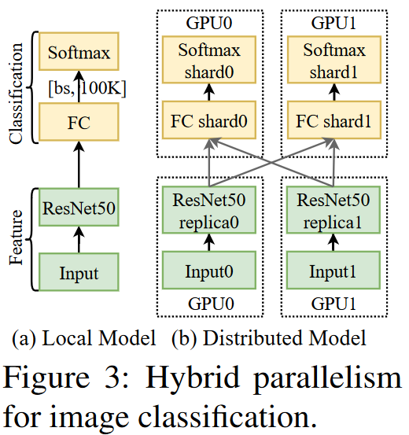

GPU集群中的异构性：

训练巨型模型相当耗费资源。此外，分布式模型训练通常要求资源同时到达。在工业界，用于巨型模型训练的共享集群通常与各种类型的 GPU（如 V100、P100 和 T4）混合使用，用于模型训练和推理。在异构 GPU 上训练巨型模型可降低同时收集所有所需 GPU（如数百或数千个 GPU）的难度，从而加快模型探索和实验的速度。然而，深度学习框架在有效利用异构资源方面遇到了挑战。不同类型的 GPU 在 GPU 内存容量（例如，P100 为 16GB，V100 为 32GB）和 GPU 计算能力方面各不相同，这自然会在计算图分割和深度学习算子分配方面带来不平衡。

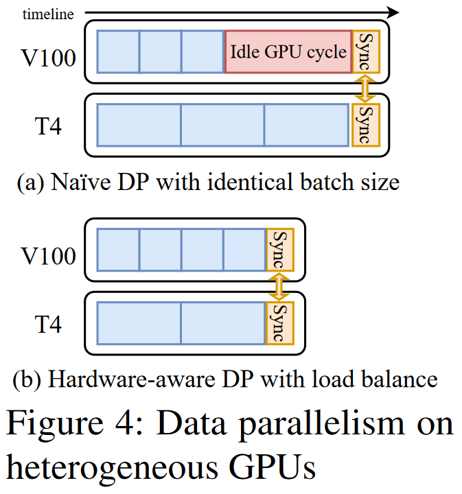

图 4 展示了在两个异构 GPU（即 V100 和 T4）上利用数据并行训练模型的情况。当平均分配训练样本时，V100 能更快地完成前向和反向的训练，从而在每个 mini-batch 结束时梯度同步之前留下空闲的 GPU 周期。通过动态生成执行计划时对硬件感知，Whale 为 V100 分配了更多的训练样本（即批量大小=4），为 T4 分配了其余 2 个样本，以消除空闲等待时间。

结合先进的并行策略和异构 GPU 混合技术，不同的 GPU 内存容量和功能在对模型进行分区以实现有效重叠时需要进一步考虑，这是一个复杂的过程。模型开发人员在编程时很难考虑到所有资源问题，我们认为开发人员不应该这样做。对于通用深度学习框架来说，更好的方法是自适应地自动生成异构资源的执行计划。

Whale 通过引入新的统一原语，用户可以专注于实现模型算法本身，同时只需更改注释即可在各种并行策略之间进行切换。Whale runtime 利用用户注释作为提示，在有限的搜索范围内通过自动图优化尽最大努力选择并行策略。Whale 还使用平衡算法进一步考虑了异构硬件能力，使资源异构对用户透明。

## 设计

在本节中，我们首先介绍了关键抽象和并行基元，它们可以通过简单的编程应用程序接口表达灵活的并行策略（第 3.1 节）。然后，我们将介绍我们的并行规划器，它可以通过分割任务图、插入桥层连接混合策略以及将任务图放置在分布式设备上（第 3.2 节），将带有并行基元的本地模型转换为分布式模型。最后，我们提出了一种硬件感知负载平衡算法，以加快异构 GPU 集群的训练速度（第 3.3 节）。

### 3.1 抽象

3.1.1 Internal Key Concepts

Whale 引入了两个内部关键概念，即任务图（TaskGraph）和虚拟设备（VirtualDevice）。任务图用于模块化操作，以应用并行策略。虚拟设备隐藏了将操作映射到物理设备的复杂性。这两个概念是内部系统设计的抽象概念，不会暴露给用户。

任务图（TG）是并行转换和执行模型的子集。一个模型可以有一个或多个不重叠的任务图。我们可以对每个任务图应用并行策略。通过将模型操作模块化为任务图，Whale 可以对不同的模型部分应用不同的策略，也可以在流水线中调度任务图的执行。任务图可以进一步复制或分割。例如，在数据并行中，整个模型就是一个任务图，可以复制到多个设备上。在流水线并行中，一个流水线阶段就是一个 TaskGraph。在张量模型并行中，我们可以将 TaskGraph 分割成多个子模块来实现并行。

虚拟设备（VD）是计算资源的逻辑表示，一个虚拟设备拥有一个或多个物理设备。VirtualDevice 向用户隐藏了设备拓扑、计算能力和设备放置的复杂性。一个虚拟设备分配给一个任务图。不同的虚拟设备可以拥有不同或相同的物理设备。例如，VD0 包含物理设备 GPU0 和 GPU1，VD1 包含物理设备 GPU2 和 GPU3（与 VD0 不同），VD2 包含物理设备 GPU0 和 GPU1（与 VD0 相同）。

并行原语：

并行原语是一个 Python 上下文管理器，其中定义的操作被模块化为一个 TaskGraph。每个并行原语都必须配置一个参数 device_count，用于通过映射物理设备的 device_count 数量生成一个 VirtualDevice。Whale 允许用户使用两个统一的原语（即 replicate 和 split）来建议并行策略。这两个原语可以表达所有现有的并行策略，也可以表达它们的混合策略。

replicate(device_count) 对要复制的任务图进行注解。device_count 是用于计算任务图副本的设备数量。如果没有设置 device_count，Whale 会为每个设备分配一个任务图副本。如果任务图被注释为 replicate(2)，它就会被复制到 2 个设备上，每个任务图副本消耗 mini-batch 的一半。因此，一个模型副本的 mini-batch 大小保持不变。

split(device_count) 对应用intra-tensor分片的任务图进行注解。device_count 表示要分片的分区数量。每个分片的分区都放在一个设备上。例如，split(2) 会将 TaskGraph 分割成 2 个分区，分别放在 2 个设备上。

并行原语可以组合使用，对模型的不同分区应用不同的并行策略。此外，Whale 还提供了 JSON Config API 来实现系统优化。配置 auto_parallel 用于在给定分区数量 num_task_graph 的情况下启用自动任务图分区，这进一步简化了用户的编程，并且在资源分配是动态的情况下，对于硬件感知优化是必要的（第 3.3 节）。在 Whale 中，流水线并行被视为一种高效的 inter-TG 执行策略。Whale使用配置 num_micro_batch，当其值大于 1 时，可在任务图之间实现高效的流水线并行。通过这种方式，Whale 将任务图的生成与流水线并行策略的选择分离开来。该系统可以轻松扩展，纳入更多流水线策略（例如，交换图 1 中 M1 的 B0 和 F1 的执行顺序）。

除了并行策略或流水线并行的组合，Whale 还进一步支持整个并行模型的嵌套数据并行。当可用设备数量是任务图要求的设备总数的整数倍时，数据并行就会自动启用。

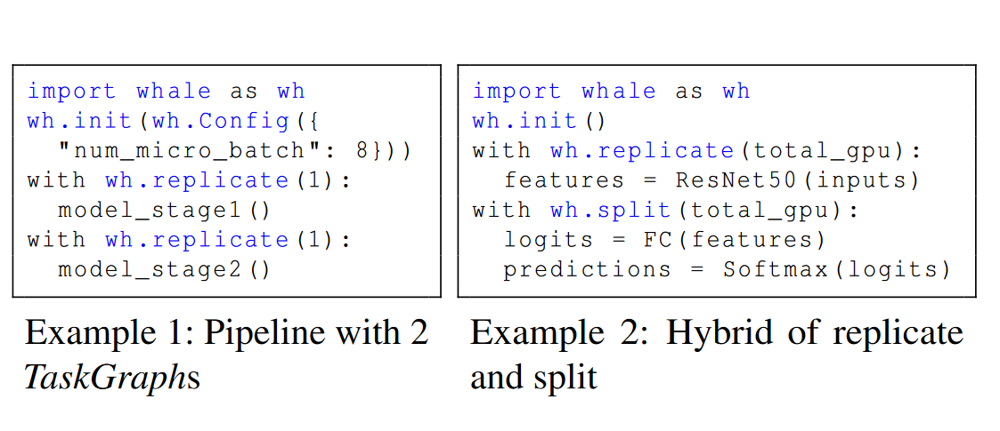

例 1 显示了两个任务图的流水线并行示例，每个任务图配置 1 个设备。通过将 pipeline.num_micro_batch 配置为 8 启用了流水线并行。如果可用设备数为 8，即总设备数的 4 倍，Whale 将在流水线之外应用 4 度数据并行。相反，当使用两个可用设备时，则是纯流水线。例 2 展示了一种混合策略，即在复制 ResNet50 特征部分的同时，拆分图 3 示例中的分类模型部分。

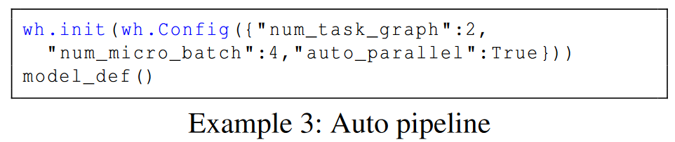

例 3 展示了一个包含两个任务图的自动流水线示例。启用 auto_parallel 后，Whale 会根据计算资源容量和模型结构自动将模型划分为任务图。(第 3.3 节）

## 3.2 并行规划器
并行规划器负责生成高效的并行执行计划，这是 Whale runtime的核心。

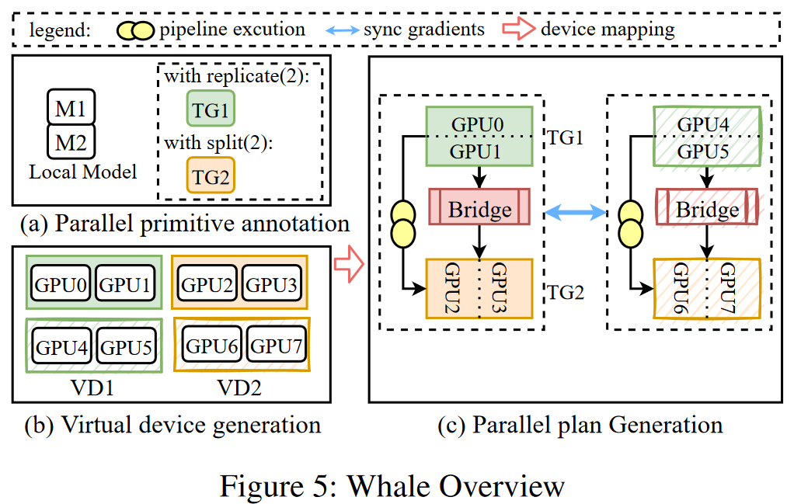

图 5 显示了并行规划器的概览。工作流程可描述如下：(a) 并行规划器采用带有可选用户注释的本地模型、计算资源以及其它输入的配置信息。模型超参数（如批量大小和学习率）和计算资源（如 GPU 和 Worker）由用户手动决定。而并行原语注释和配置（如 num_task_graph 和 num_micro_batch）既可以由用户手动决定，也可以由 Whale 自动决定；(b) 根据计算资源和可选注释自动生成虚拟设备（第3.2.1节）；和 (c) 将模型划分为任务图（TaskGraph），如果进行了 split 注释，则在内部对任务图进行进一步划分。由于我们允许对不同的任务图采用不同的策略，因此任务图之间可能存在输入/输出不匹配的情况。在这种情况下，规划器会在两个任务图之间自动插入相应的桥接层（第3.2.3节）。

3.2.1 虚拟设备生成

虚拟设备是根据每个任务图所需的设备数量生成的。给定 K 个物理设备 $GPU_0、GPU_1、......、GPU_K$ 和一个包含 N 个任务图的模型，对应的设备编号为 $d_1、d_2、......d_N$ 。对于第 i 个任务图，Whale 将生成一个虚拟设备（VirtualDevice），其物理设备数量为 $d_i$ 。每个 VirtualDevice 按顺序获取物理设备。如第 3.1.2 节所述，当可用设备数 K 除以所有任务图请求的设备总数 $\sum_{i}^{N} d_i$ 时, Whale 将对整个模型应用 DP。在这种情况下，我们也会为任务图副本复制相应的虚拟设备。默认情况下，任务图之间不共享设备。在某些模型分片情况下，可以通过设置集群配置来启用共享，以提高训练性能。Whale 倾向于在一个节点内放置一个模型副本（包含一个或多个任务图），并跨节点复制模型副本。通过设置上述配置，可以实现高级行为，如在一个节点内放置任务图副本，利用 NVLINK 进行 AllReduce 通信。例如，如图 5 所示，有两个任务图，每个任务图请求 2 个 GPU。为两个任务图生成了两个虚拟设备 VD1 和 VD2。VD1 包含 GPU0 和 GPU1，VD2 包含 GPU2 和 GPU3。由于可用 GPU 的数量为 8（可被 4 个任务图的 GPU 总数整除），因此可以生成虚拟设备的副本，但物理设备各不相同。

3.2.2 任务图划分

Whale 首先通过显式注释或系统自动分区将模型划分为任务图（TaskGraph）。如果给出了用户注释，那么在某些并行原语注释中定义的操作就会组成一个任务图。否则，系统将根据给定的配置参数 num_task_graph 和硬件信息生成任务图。硬件感知模型分区的详情将在第 3.3 节中介绍。

如果任务图被注释为 split(k)，Whale 就会通过匹配和替换分片模式，以分布式实现的方式自动对其进行分片。在介绍分片模式之前，我们先介绍张量模型并行化的两个术语：1) ShardingUnit 是分片的基本单位，可以是一个操作，也可以是包含多个操作的层；2) ShardingInfo 是张量分片信息，表示为一个列表[ $s_0, s_1, ..., s_n$ ]，给定一个有 n 个维度的张量，其中 $s_i$ 表示是否分割第 i 个维度，1 表示为真，0 表示为假。例如，给定一个形状为[6, 4]的张量，ShardingInfo [0, 1]表示在第二个张量维度上进行拆分，而[1, 1]表示在两个维度上都进行拆分。分片模式（SP）是从分片单元（ShardingUnit）和输入的分片信息（ShardingInfo）到其分布式实现的映射。
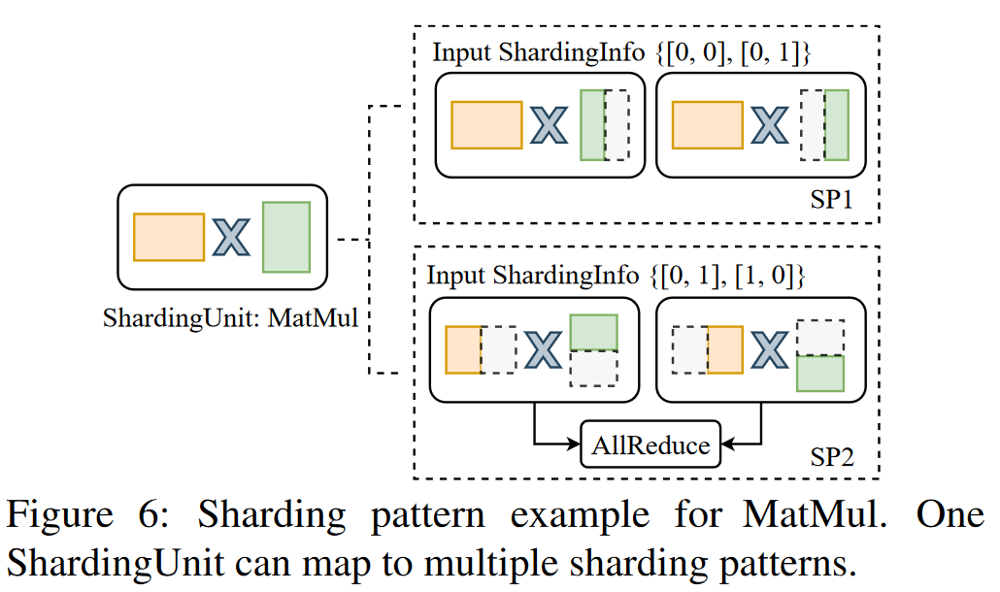
例如，图6显示了分片单元MatMul的两种分片模式SP1和SP2，它们的输入分片信息各不相同。

为了划分任务图，Whale 首先通过hooking TensorFlow 操作 API 将任务图中的操作分组为多个 ShardingUnits。任务图分片过程的第一步是按照拓扑顺序将分片单元与预定义的分片模式相匹配。一个模式由一个分片单元和输入的分片信息匹配。如果匹配到多个模式，则选择通信成本较低的模式。Whale会用它的分布式实现替换原始 ShardingUnit 的匹配模式。

3.2.3 Bridge layer

当对不同的任务图采用不同的并行策略时，输入/输出张量的数量和形状可能会因并行程度不同或并行策略不同而发生变化，从而导致任务图之间输入/输出张量形状的不匹配。为了解决这种不匹配问题，Whale 提出了一个桥接层来收集分布式张量，并将其输入到下一个任务图中。

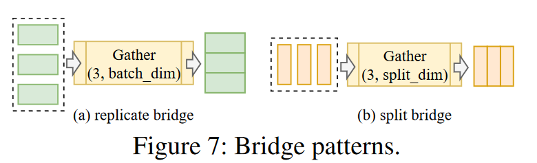

Whale 分别为复制和拆分设计了两种桥接模式，如图 7 所示。在复制时，任务图被复制到 N 个设备上，并有不同的输入批次。桥接层收集不同批次的输出，在批次维度 batch_dim 中进行连接。对于分割，TaskGraph 的输出在分割维度 split_dim 中进行分割。桥接层收集 TaskGraph 的输出，以便在 split_dim 中进行连接。通过使用桥接层，每个任务图都能获得一个完整的输入张量。如果桥接层的收集维度与后继任务图的输入分区维度相同，Whale 将通过融合上述两种操作进行优化，以减少通信开销。举例来说，如果任务图的输出聚集在第一个维度，而后继任务图的输入分割在同一个维度，那么 Whale 将取消上述聚集和分割操作。

## 3.3 Whale的硬件感知负载均衡

在本节中，我们将介绍如何利用硬件信息来平衡任务图之间的工作负载，从而在异构 GPU 集群中也能实现高性能。在启动训练任务时，Whale 并行规划器会从集群调度器中获取硬件信息，并负责任务图内和任务图间的负载均衡。

3.3.1 Intra-TaskGraph负载均衡
当分配的设备是同质的，Whale 默认会将任务图中的工作负载平均分配到多个设备上。但是，如果分配的是具有不同计算能力的异构 GPU（如 V100 和 P100），上述相同的分配方式就会产生次优性能。如图 4（a）所示，这种性能可归因于任务图执行结束时的同步障碍，它导致速度较快的 GPU 闲置 GPU 时间较长。

为了提高异构 GPU 的整体利用率，我们需要根据设备的计算能力来平衡计算。任务图内负载均衡试图最小化任务图内的空闲时间，这是通过在内存限制下平衡与设备计算能力成比例的工作负载来实现的。对于注释了 replicate 的任务图，Whale 会通过调整每个任务图副本的批量大小来平衡工作量。异构设备上的本地批量大小可能会因负载平衡策略而不同（Whale 保持全局批量大小不变）。如果存在对批次敏感的算子（如 BatchNorm），本地批次差异可能会产生统计学影响。然而，在 Whale 中使用异构训练时，没有用户遇到收敛问题，这可能是由于 DL 的鲁棒性。此外，SyncBatchNormaliazaion 等技术也可能有所帮助。对于注释了 split 的任务图，Whale 通过在多个设备之间不均匀分片来平衡分区操作的 FLOP。

我们以 $TG_{flop}$ 表示任务图 TG 的单精度浮点运算（FLOP），以 $TG_{mem}$ 表示峰值内存消耗。给定 N 个 GPU，我们收集设备 i 的信息，包括以 $DF_i$ 表示的每秒单精度 FLOP 和以 $DM_i$ 表示的内存容量。假定设备 i 上的分区负载率为 $L_i$ ，我们需要找到一个解决方案，使 GPU 的总体浪费最小，如公式 1 所示。

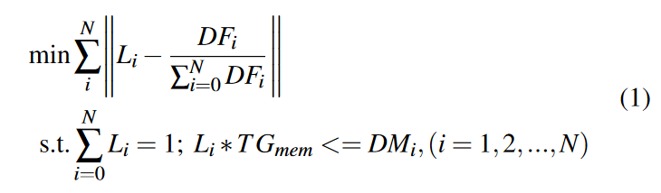

我们试图最小化每个设备 $L_i$ 的实际模型计算负载与设备计算能力与集群总计算能力之比 $DF_i / \sum_{i=0}^{N} DF_i$，最大负载以设备内存容量 $DM_i$ 为限制。

每个设备中的负载比例 $L_i$ 与设备的计算能力成正比进行初始化，理想情况下可实现最均衡的分区。但是，当内存约束无法满足时，我们需要调整负载分配，以避免出现内存不足（OOM）错误，同时努力实现良好的性能。Whale 提出了一种内存约束平衡算法，用于平衡设备间的工作负载。该算法的主要思想是将工作负载从内存过载设备转移到计算负载最低的无内存设备上。算法的具体细节如算法 1 所示。

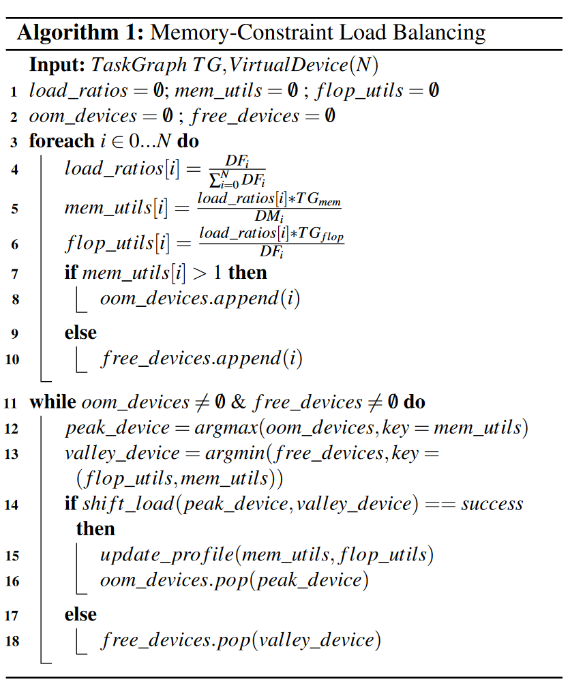

它将任务图 TG 和包含 N 个物理设备的虚拟设备作为输入。算法首先初始化（第 3-10 行）分析结果，包括：1）设备工作负载率 load_ratios；2）设备内存利用率 mem_utils；3）设备 FLOP 利用率 flop_utils；4）oom_devices 记录 mem_utils 值大于 1 的内存超载设备；5）free_devices 记录有空闲内存空间的设备。然后，算法迭代地将负载从内存过载的设备转移到内存可用的设备上（第 11-18 行）。它首先从 oom_devices 中找到内存利用率最高的 peak_device，然后找到内存空间可用且 FLOP 利用率最低的 valley_device。shift_load 函数试图将工作量从peak设备转移到valley设备。对于数据并行，peak设备的批处理量减少b，valley设备的批处理量增加b。b 为从 peak_device 处获取负载后，valley_device 不会发生 OOM 的最大值。工作负载转移成功后，每个设备的 profiling 信息都会更新。上述过程反复进行，直到 oom_device 为空或 free_device 为空。

3.3.2 Inter-TaskGraph负载均衡

当多个任务图在流水线中执行时，我们需要在异构 GPU 上平衡任务图之间的工作负载。正如我们在第 2.1 节中介绍的，流水线并行通过在多个微批次之间交错执行前向/后向任务来实现高效执行。对于具有 N 个任务图的模型，第 i 个 TG 需要缓存 N - i 个前向激活。值得注意的是，第 i 个 TG 必须多缓存一个微批次前向激活相较前一个任务图。由于激活内存与批量大小成正比，通常会占用峰值内存的很大一部分，例如，批量大小为 256 的激活内存 VGG16 模型就占用了峰值内存的 74% 左右，从而导致不同任务图之间的内存消耗不均衡。任务图对内存的要求不同，这促使我们将较早的任务图放在内存容量较大的设备上。这可以通过按内存容量从高到低对相应 VirtualDevice 中的设备进行排序实现。

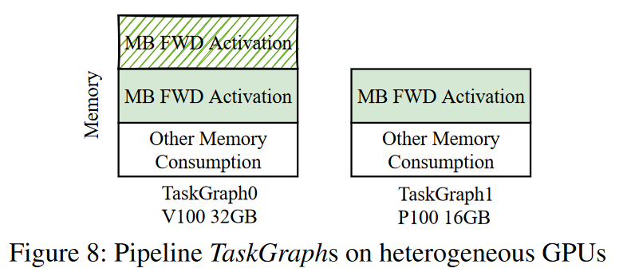

图 8 显示了在异构 GPU V100（32GB）和 P100（16GB）上有两个任务图的流水线示例（图 1）的内存明细，我们倾向于将任务图 0 放在内存配置较高的 V100 上。对于常见的基于 transformer 的模型（即图 18 中的 BertLarge 和 T5），任务图放置启发式是高效的。后期阶段可能会出现包含巨大的层（即大量稀疏嵌入）的情况，这可以通过算法 1 处理 OOM 错误来解决。根据内存需求对虚拟设备重排序后，我们按拓扑排序将模型操作划分到任务图中，并应用算法 1 平衡各操作之间的计算 FLOP，但以每个设备的内存容量为限。

## 实现
Whale 以独立库的形式实现，无需修改深度学习框架，兼容 TensorFlow1.12 和 TensorFlow1.15。Whale 的源代码包括 13179 行 Python 代码和 1037 行 C++ 代码。我们已将 Whale 框架开源4 ，以帮助更多用户获得巨型模型训练。

Whale 利用相位信息、并行性注释等增强信息丰富本地模型，这些信息对并行性的实现至关重要。为了在不修改用户代码的情况下协助分析用户模型，Whale 检查并覆盖 TensorFlow 内置函数，以捕获增强信息。例如，在调用 t f .gradients 或 compute_gradients 函数时，操作会被标记为向后操作。

并行策略是通过重写计算图来实现的。为了便于图的重写，我们实现了一个通用的图编辑器模块，其中包括子图克隆、节点替换、依赖控制等功能。为了实现数据并行化，Whale 首先克隆本地任务图中定义的所有操作和张量，并将设备替换为模型副本。然后，它插入 NCCL AllReduce 操作，同步每个任务图副本的梯度。为了实现张量模型并行化，Whale 通过匹配一系列预定义模式来分割任务图，用相应的分布式实现来替换它们，并在需要的时候插入通信操作。为了实现流水线并行，Whale 构建了一个流水线策略模块，支持最先进的策略。默认情况下，Whale 采用与 PipeDream 类似的后向优先策略。流水线策略是通过首先将迷你批次分割成微批次来实现的。通过在不同任务图的入口和出口操作之间插入控制依赖操作，实现前后微批处理的交错执行。

为了协助硬件感知优化，Whale 实现了剖析工具，用于剖析模型 FLOPS 和峰值内存消耗。并行规划器从我们的内部 GPU 集群获取硬件信息，通过平衡异构 GPU 上的计算工作量，生成高效的并行规划。

此外，Whale 还集成了一系列优化技术，如 ZERO、重计算、CPU-offload、amp、通信优化、XLA等，在计算效率和内存利用率方面都进行了高度优化。

## Load Balance 性能实验
我们通过评估数据并行性和流水线并行性，展示了硬件感知负载均衡算法的优势。

在数据并行方面，我们评估了三种典型模型，包括 ResNet50、BertLarge 和 GNMT。实验在由 8 个 32GB V100 GPU 和 8 个 16GB P100 GPU 组成的异构 GPU 上进行。我们为所有模型副本设置了与baseline相同的批量大小。然后我们对每个模型应用硬件感知算法，如图 17 所示，与baseline性能相比速度有所提升。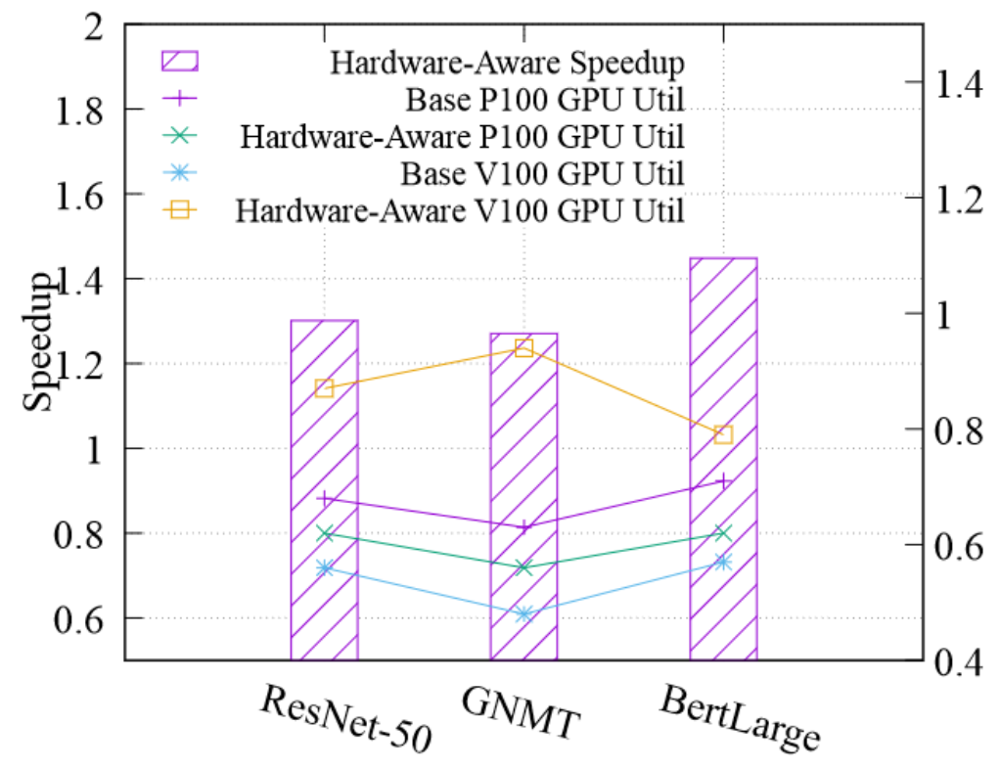在所有三个模型中，Whale 的性能都比基线高出 1.3 倍到 1.4 倍。我们还测量了 GPU 利用率，并报告了每种 GPU 的平均指标。在三个模型中，硬件感知策略大大提高了 V100 的 GPU 利用率，提高了 1.39 倍到 1.96 倍，从而提高了整体训练性能。

在流水线并行性方面，我们评估了两个模型，包括 BertLarge 和 T5-Large。训练在由 4 个 32GB V100 GPU 和 4 个 16GB P100 GPU 组成的异构 GPU 上进行。BertLarge 和 T5-Large 都分为 4 个流水级。我们进一步将 DP 应用于流水线。我们将平均分配的模型设定为基线。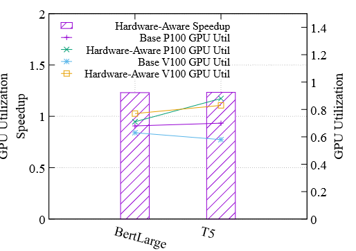如图 18 所示，我们使用硬件感知策略进行训练，两个模型的速度都提高了约 20%。硬件感知负载均衡策略的 GPU 利用率比 V100 的 GPU 利用率提高了约 40%，这表明了硬件感知负载均衡算法的效率。

