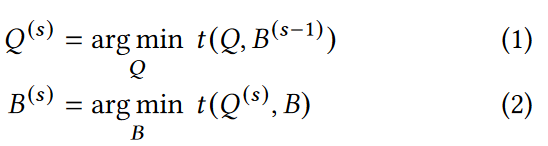
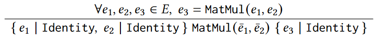

# HAP: SPMD DNN Training on Heterogeneous GPU Clusters with Automated Program Synthesis

## Abstract
单程序多数据（Single-Program-Multiple-Data，SPMD）并行最近被用于训练DNN。很少有研究探讨其在异构集群上的适用性，以充分利用现有资源进行大型模型学习。__本文介绍的 HAP 是一个自动化系统，旨在加快异构集群上的 SPMD DNN 训练。HAP 联合优化了张量切分策略、异构设备间的切分比率以及张量交换的通信方法，从而优化了具有 SPMD 分布式训练。我们新颖地将模型分区表述为程序合成问题，即在分布式指令集上从头生成一个分布式程序，该程序在语义上与为单个设备设计的程序相似，并利用基于 A* 的搜索算法系统地探索解空间__。通过将其表述为线性规划问题，我们得出了最佳张量分片比率。此外，HAP 还探索了异构集群中的张量通信优化，并将其作为程序合成过程的一部分，用于自动选择最佳集合通信原语和应用 sufficient factor broadcasting （SFB）技术。

## 1 Introduction
现有的大多数方案都集中在同构集群上进行 DNN 训练，在这种集群中，所有设备都是同一类型，互连网络具有相同的带宽。

利用异构集群的一种普遍方法是将多个训练任务分配到集群的不同同构子集上。然而，这种方法对最大模型大小造成了限制，因为它受到子集容量的约束。

现有有限的异构感知 DNN 训练设计大多支持数据并行和模型并行。对于数据并行，每个设备根据设备的内存分配，针对数据集的不同部分训练 DNN 模型，并在每次训练迭代结束时同步模型梯度。模型并行涉及将 DNN 模型中的不同 operations 放在不同设备上，并在训练期间在设备间传输中间张量。为了更好地利用 GPU，跨设备模型并行训练通常以流水线方式进行调度，同时在不同设备上处理 micro-batch 数据。由于 GPU 的内存容量有限，对于训练大型 DNN 模型来说，纯粹的数据并行或模型并行可能并不可行或效率不高。例如，在带有 MoE 层的模型中，单个张量可能会超过 GPU 的内存限制。在这种情况下，就有必要采用张量并行，将张量分割开来，并将分区分配到不同的设备上。由于策略空间巨大，在异构设备集群中设计高效的张量分片和部署策略尤其具有挑战性。

HAP研究了在异构集群上高效训练大型 DNN 的单程序多数据（SPMD）并行性。__SPMD 并行将数据并行和层内模型并行性与任意维度的张量分片和跨设备的输入数据分区相结合。事实证明，它能有效地训练各种最先进的模型。

在一组异构资源上实现高效的 SPMD 训练有助于更好地利用可用资源，从而大幅降低大模型学习的成本。在异构集群中应用 SPMD 并行性涉及三个关键决策：__(i) 分片策略，即决定对每个张量划分哪个维度（分片维度）；(ii) 设备间的分片比率，即根据异构设备的计算和内存容量，为其分配不同大小的张量分区，以优化设备利用率、(iii) 选择通信方法，即决定每个张量的每个集合通信操作的实现方式，以最大限度地满足不同张量大小和不同设备间互连带宽的需要__。这三个决定是相互关联的。例如，如果设备间的分片比率相对均匀，设备间的通信模式就类似于同构集群，标准的集合通信通常会有良好的表现。相反，如果各设备之间的分片比率相差很大，则需要进行异构感知通信。

我们提出了异构集群 SPMD DNN 训练系统 HAP，该系统可自动决定最佳张量切分的维度/比率和通信方法，以加快训练速度并优化资源利用。我们在设计 HAP 方面做出了以下贡献：

⊲ 我们设计了一个迭代优化过程，在固定 SPMD 分片策略或分片比率的同时，交替优化另一个。与只对每个方面优化一次的现有方法相比，我们的迭代优化使我们能够接近全局最优，同时还能保持可接受的优化时间（第 3 节）。

⊲ 我们将 SPMD 模型划分新颖地表述为一个程序合成问题，即在分布式指令集上构建一个分布式程序，以模拟在单设备指令集上实现的给定张量程序。我们通过分析单设备程序来建立语义约束的背景理论 $\tau$ ，然后利用语法指导合成和基于 A* 的搜索算法来自动合成分布式程序，以实现最小的训练时间，该程序等同于理论 $\tau$ 下的单设备程序（第 4 节）。

⊲ 我们设计了一个线性代价模型，并将切分比率优化表述为一个线性规划问题，并使用现成的求解器对其进行优化求解（第 5 节）。

⊲ 我们探索了两种通信优化技术，并将其集成到程序合成中，以优化异构集群上的通信和 SPMD 分片。第一种优化技术涉及异构集群上两种 All-Gather 实现之间的权衡，第二种是自动应用sufficient factor broadcasting，以减少某些操作的通信量（第 4.4 节）。

⊲ 我们在 PyTorch 上实现了 HAP，并在云上的 64 GPU 异构集群上对其进行了评估。HAP 的用户 API 类似于 PyTorch 的内置 DDP 模块。四种具有代表性的图像分类和语言模型进行的实验表明，HAP 在异构集群上的性能始终优于现有系统，在同构集群上的性能也很有竞争力，同时在程序合成中只引入了几秒钟的开销。

## 2 Background and Motivation

### 2.1 Large Neural Networks and SPMD Parallelism
要有效地训练大模型，就必须对模型进行分区，并在多个设备上部署其分区。

DNN 模型中的张量是浮点数的多维数组。一个张量可以通过在任意维度上分割（又称分片）成更小的张量。例如，minibatch处理训练中的大部分激活张量（根据模型输入计算出的中间结果）都有一个 "batch size "维度。对这一维度进行分割就会产生所谓的数据并行。利用 SPMD 并行性，同一程序可在多台设备上执行，共同产生与单台设备程序相同的结果。现有的 SPMD 训练系统通常通过为每个 operator 从固定集合中选择一种分片策略来分割单设备程序中的operator。例如，AccPar为每个 MatMul 算子考虑了三种分片策略（"batch size"、"hidden"和 "reduction"为维度上的分片）。Flexflow 通过在样本、算子、属性和参数维度上对算子进行分片，支持 4 个维度的并行性。当张量的输出和需要的输入分片方式不兼容时（希望张量的分片维度与实际分片维度不同），就会插入集合通信算子，根据预定义的规则切换张量的分片维度。例如，如果一个张量在批量大小维度上进行了分片，而用户期望的是一个完整大小的张量，那么就可以使用 All-Gather 跨设备收集张量的分片，以便在所有设备上恢复相同的完整大小的张量。

###  2.2 Collective Communication

在分布式 DNN 训练中，通常使用四种 MPI 类型的集合通信操作。如图 1 所示，All-Gather(e, d) 将张量 e 的不同设备上的切片沿维度 d 连接。All-Reduce(e)对张量 e 在各设备上的副本进行元素求和。Reduce-Scatter(e) 等同于执行 All-Reduce，然后在每个设备上对结果进行分片，但其实现方式更高效。All-To-All( e, d1, d2) 将在 d1 维上分片的张量 e 作为输入，并输出在 d2 维上分片的张量。

__目前的集合通信库是针对同构集群开发的，当应用于设备间带宽不同的集群中不同大小的张量时，可能无法表现出最佳性能__ 。例如，NCCL要求所有的张量都具有相同大小，以便进行All-Gather。为了在不均匀分片的张量上执行这一通信操作，必须先将张量分片填充为相同大小，然后在操作完成后进行修剪，这就造成了带宽浪费和额外的内存访问。作为替代方案，All-Gather 可以通过多个广播操作来实现，以支持不均匀分片的张量碎片，而无需填充，但内核启动开销较高。

### 2.3 Syntax-Guided Synthesis
语法指导生成是程序生成的一种类型，其输入包括定义程序空间的语法规范、描述合成程序所需属性的语义正确性规范，以及验证给定程序是否满足语义正确性规范的背景理论。自动程序合成已成功应用于优化各种程序，如 SQL 和 Datalog 。与用通用编程语言实现的程序相比，这些程序通常具有更简单的结构，更容易进行语义分析。实现 DNN 的张量程序具有相同的特点，因为它们是非递归的，没有副作用。

我们利用语法指导生成来系统地生成可行的 SPMD 并行分布式程序，以便找出能最大限度提高训练速度的最佳程序。大多数文献使用人工定义的背景理论，如线性整数运算（LIA）。我们通过自动分析单设备程序，以 Hoare 三元组的形式为每个单设备程序构建背景理论。在分布式程序的合成过程中，只利用模型输出和模型输入之间的数学关系。因此，我们将分布式程序的性能与所提供的单设备程序的实现细节分离开来。此外，在程序合成过程中，我们会自动探索实现相同数学效果的其他操作实现方式。现有的一些分布式 DNN 训练系统可归类为一种 "转换程序合成 "形式，即根据一组重写规则对初始程序进行连续修改。举例来说，Unity 可以在建议的并行计算图进行模式匹配和替代来转换程序。这一过程中的每个优化步骤都会根据应用的重写规则的正确性产生一个完整而正确的程序。相比之下，我们的方法则不同，它在整个综合过程中探索不完整和可能不正确的程序，并利用从单设备程序中得出的背景理论验证所生成的分布式程序的语义。

### 2.4 Optimal Sharding Ratios

在纯数据并行的情况下，可以通过分析不同设备的计算速度，并根据设备的计算速度设定分片比例，来确定最佳的分片比例。在 SPMD 并行中，All-Gather 和 Reduce-Scatter 被用来连接张量分片或聚合张量副本，然后将结果分片到不同设备上。在这些通信操作中，设备发送和接收的张量碎片大小与分片比例成正比。因此，__通信时间取决于最大分片的大小。当张量均匀分片时，通信时间最短，因为在这种情况下，最大分片的大小最小__。

为了证明这一点，我们在两台机器上训练了一个具有张量并行的 Transformer 模型，其中一台配备了两块 P100 GPU，另一台配备了两块 A100 GPU。模型中的张量以两种方式在 GPU 上分片：CP，分片比例与设备的计算能力成正比；EV，均匀分片。我们操纵模型的隐藏特征维度来改变计算与通信的比例。图 2 显示，当计算时间占主导地位时，CP 性能更好，因为它能平衡不同设备上的计算时间；而当通信成为瓶颈时，EV 性能更好。EV 缩短了 All-Gather 和 Reduce-Scatter 操作的通信时间，在计算与通信比值较低时更受欢迎。当计算时间和通信时间相近时，CP 和 EV 之间可能存在一个 "甜蜜点"，在不同设备的负载均衡和快速通信操作之间实现最佳权衡。此外，__由于模型的不同层可能表现出不同的计算与通信比率，因此各层的最佳分片比率也可能不同。在 HAP 中，我们将分片比率优化表述为线性规划问题，以确定模型各部分的最佳比率__。

### 2.5 Communication Optimization
当张量被不均匀分割时，同构集群的集合通信就无法达到最佳性能。为了探索异构感知通信的机会，我们研究了一些可能有利于异构环境中集合通信的技术，并表明这些优化需要与分片策略和分片比例选择共同决定。

2.5.1 Padded All-Gather and Grouped Broadcast.
NCCL 实现的 All-Gather 和 Reduce-Scatter 操作要求所有分片的大小相同。要对不均匀分区的张量执行这些操作，我们可以在通信前将分片填充为相同大小，或者使用 NCCL 组调用单独广播每个分片。图 3 展示了这两种方法。
这两种方法的选择在很大程度上取决于所采用的张量分割比率。__当张量几乎被平均分割时，所需的填充量最小，由于 NCCL 的优化，填充式 all-gather 方法的性能优于其他方法。与此相反，当张量在各设备间使用严重倾斜的比率进行分片时，分组广播方法会产生更好的性能__。图 4 展示了这一现象，我们在由两台机器组成的集群中对 4MB 张量的两种方法进行了测试，每台机器都配备了两颗 A100 GPU。我们将最大的分片分配给第一台设备，并将剩余的分片平均分配给其他设备。第一台设备上的分片率决定了分片的倾斜度，如图 4 中的 x 轴所示。带宽的计算方法是将整个张量的大小除以通信时间，不考虑任何填充。
__由于两种实现方式的性能取决于分片比率，因此当我们优化分片比率时，通信方式也应相应更新，以实现最佳的整体性能__。在 HAP 中，我们将两种方法的选择纳入了程序合成过程，并将其优化与分片比率优化交错进行。

2.5.2 Sufficient Factor Broadcasting (SFB).
SFB利用梯度张量中的低秩结构来减少参数同步通信，它将梯度张量上的 All-Reduce 操作替换为较小张量（称为sufficient factors）上的 All-Gather 操作，后者足以计算梯度。图 5 给出了一个 MatMul 操作的 SFB 例子。输出是一个 f × h 张量，即全连接层中参数的梯度。输入是形状为b × h的激活张量，输出的梯度是形状为f × b，其中，b 是每个设备的局部批量大小，B 是全局批量大小。当 b 较小时，梯度（f × h 张量）不是满秩的，而两个聚合张量（B × h 和 f × B 张量）是其sufficient factor，因为梯度可以从这两个张量中计算出来，无需进一步通信。如图 5(b)所示，在标准数据并行的情况下，梯度是通过 All-Reduce 在设备间聚合的。使用 SFB 时，首先使用 All-Gather 收集输入张量，然后每个设备独立计算完整的梯度。__SFB 将通信过程从传输梯度变为传输充分因子，当全局批量大小 B 较小时，充分因子的大小可以更小__。

SFB 的性能主要取决于批量大小和所涉及的设备数量。TAG提出了一种基于整数线性规划的技术，用于自动识别在同构集群中训练的 DNN 模型中对张量应用 SFB 的好处。然而，异构资源中不均衡的张量分割给这一问题带来了额外的复杂性。正如第 2.5.1 节所分析的，__All-Gather 的性能受分片比率的影响，而 SFB 是否有益也取决于分片比率。此外，在 SFB 的情况下，每个设备都会以完整的批大小 B 执行 MatMul 操作，这可能会给速度较慢的设备带来巨大的计算开销__。因此，SFB 在异构集群中的权衡有所不同。在 HAP 中，我们将 SFB 集成到程序合成中，以确保在更新分片比率时优化 SFB 的应用。

## 3 Design Overview
我们提出的 HAP 可共同决定 DNN 模型中所有张量的分片策略、分片比率和通信方法，从而在异构集群上进行有效的 SPMD 模型训练。HAP 的输入包括单设备 DNN 模型（为单设备编写的 DNN 训练程序）（以计算图 (V , E) 表示）和由 m 个虚拟设备组成的集群规格说明。虚拟设备可以指一个单独的计算单元（如 GPU）或一小群同质的物理设备（如包含多个 GPU 的机器）。我们考虑的是虚拟设备层面的分布式训练策略。在后一种情况下，我们假设在每个虚拟设备内采用数据并行，因为机器内的相互连接通常具有高带宽（如 NVLink），数据并行往往会产生不错的性能。

### 3.1 Main Components
HAP 包括两个关键组件：程序合成器和负载均衡器。程序合成器为 DNN 模型中给定的张量分片比率 B 生成最佳分布式程序 Q，而负载均衡器则为固定的分布式程序 Q 生成最佳分片比率 B。张量分片策略和通信方法隐含在 Q 中。

目标是找到分布式程序和分片比率（Q∗, B∗）的最佳组合，使 DNN 每次迭代训练时间 t (Q, B) 最小化。HAP 采用迭代优化方法。在每一步 s 中，我们固定两个决策方面中的一个，并确定另一个方面的最优解：

从初始分片比率 $B^{(0)}$ 开始，我们首先执行程序合成器，按照公式 (1) 生成 $Q^{(1)}$ 。然后根据 $Q^{(1)}$ 利用公式 (2) 计算 $B^{(1)}$。然后根据 $B^{(1)}$ 计算 $Q^{(2)}$，以此类推，直到求解达到收敛或振荡为止。在振荡的情况下，我们使用优化过程中成本最低的一对 Q 和 B。

### 3.2 Cost Modeling
直接分析 (Q, B) 每种组合的训练性能将耗费大量资源。我们通过模拟分布式程序 Q 和 B 在异构集群上的执行情况，估算出每次迭代的训练时间 t (Q, B)。

集合通信通常要求每个参与设备同时向所有其他参与设备发送和接收数据。因此，假设所有设备在通信操作开始前都已同步是合理的。这样，我们就可以将分布式程序的执行分为几个阶段，每个阶段从通信操作开始，然后是一系列计算操作（除了第一阶段只包含计算），如图 6 所示。例如，图 11 中程序 7 的前两条指令属于该程序的第一阶段，另外两条指令属于第二阶段。在一个阶段开始时，所有设备都是同步的。

让 $comm^{(i)}$ 和 $comp^{(i)}_j$ 分别表示第 i 个阶段在第 j 个设备上的通信时间和计算时间。由于每个阶段都是全局同步的，因此迭代时间是所有阶段的执行时间之和。一个阶段的执行时间由该阶段在所有设备上的最大运行时间决定。因此我们得到[m] = {1, . . ., m} 是设备列表。$comp^{(i)}_j(B_j)$ 可根据第 j 个设备的每秒剖析触发次数和第 i 阶段计算操作的触发次数估算得出。具体来说，DNN 中常见操作的触发次数与输入张量的某些维度成线性关系。如果其中一个维度被分片，则该操作在设备上的触发次数与该设备的分片率成正比；否则，触发次数不变。因此，计算时间 $comp^{(i)}_j(B_j)$ 是分片率 $B_j$ 的线性函数，计算方法是将第 i 阶段的每个操作数除以第 j 个设备的每秒操作数。在代表机器（每个机器可能包含多个 GPU）的虚拟设备上运行 HAP 时，我们将根据阶段中的内部带宽和参数大小估算的内部通信时间加到 $comp^{(i)}_j(B_j)$ 中。$comm^{(i)}(B)$ 是根据集群操作类型、分片比率 B 和 NCCL 对集群网络的剖析数据确定的。我们使用不同大小的张量在集群上运行每项集合操作，并将延迟和带宽拟合到线性模型中。

## 4 Distributed Program Synthesis
在张量分片策略搜索中，可以考虑 SFB（第 2.5.2 节）和集合通信的不同实现（第 2.5.1 节）等各种优化方法，而之前的 SPMD 训练框架并未对此进行全面研究。在 HAP 中，我们将张量分片策略设计表述为程序合成问题，从而以一种新颖的方式系统地解决了这一问题。我们不需要为每个算子选择一种分片方法来修改单设备程序，而是采用一种新的方法来设计张量分片策略，我们在分布式指令集上从零开始合成一个分布式程序模拟单设备程序，如图 7 所示。为了确保合成的程序等同于原始的单设备程序，我们将单设备程序的语义形式化，然后生成分布式程序，其约束条件是生成的程序必须对任何输入产生与单设备程序语义等同的输出。

### 4.1 Distributed Programs
分布式程序 Q 被定义为一系列符号，其语法如图 8 所示。指令是一种计算操作或集体通信操作，以一组张量作为输入，并产生一个张量作为输出。分布式指令集中的计算指令与单设备指令集（即 PyTorch 等 DNN 框架提供的张量运算符）大体相似，除了一些专门的操作，如 Placeholder-Shard，它类似于单设备程序中用于读取模型输入的 Placeholder 操作，但假设输入张量是按特定维度分割的。执行分布式指令涉及在所有设备上执行相同的指令，而输入是每个设备上的本地张量。

### 4.2 Program Semantics
要生成与单设备程序等价的分布式程序，我们首先要分析单设备程序的语义，形成背景理论 T，并在程序合成时利用它来表达语义约束。
程序的语义由一系列属性组成。为了正式定义这些属性，我们引入了分布式张量，它是由分布式程序产生并在分布式程序中使用的张量。分布式张量是同一张量在所有设备上的实例集合（即分片张量的分片和复制张量的复制）。分布式张量的属性描述了它与参考张量的数学关系，参考张量指的是单设备图（V , E）中的张量。分布式张量 ̄ e 的属性用 e | I 表示，其中 e∈E 是一个参考张量，I 是一条指令，以 ̄ e 作为输入执行 I 会产生一个分布式张量，其在所有设备上的实例都等于 e。例如，如果分布式张量 e 拥有属性 𝑒 | All-Gather(0)，那么在执行 All-Gather( e, 0)（0 表示分片维度）后，所有设备都将拥有一个与 e 等价的张量。程序 Q 生成的张量集合用 E (Q) 表示，程序 Q 的属性定义为 E (Q) 中所有张量的属性，用 P (Q) 表示。背景理论 $\tau$ 表示为一组 Hoare 三元组。一个 Hoare 三元组表示为: 

{ 𝑝𝑟𝑒𝑐𝑜𝑛𝑑𝑖𝑡𝑖𝑜𝑛 } 𝑖𝑛𝑠𝑡𝑟𝑢𝑐𝑡𝑖𝑜𝑛 { 𝑝𝑜𝑠𝑡𝑐𝑜𝑛𝑑𝑖𝑡𝑖𝑜𝑛 }

前提条件满足后，执行指令就建立了后置条件。指令可以是计算操作，也可以是在所有设备上同时运行的集体通信操作。前提条件和后置条件以属性集的形式表示。如果一个程序包含前提条件中的所有属性，那么将指令附加到程序中，就会产生一个包含后置条件中的属性的新程序。我们用一组预定义规则分析单设备计算图，从而推导出背景理论 T，这些规则编码了常见张量运算的数学特征。图 9 举例说明了四种集体通信操作和 MatMul 操作的规则。为简洁起见，我们不明确命名操作产生的张量，而只是用 e 来指代与参考张量 e 相关的前提条件中具有该属性的分布式张量。例如，在图 9 的第一条规则中，前置条件 e | All-Reduce 意味着在运行 All-Reduce 的程序中存在一个张量 ̄ e，它产生的分布式张量等于参考张量 e。当满足这个条件时，将指令 All-Reduce( ̄ e) 添加到程序中，就会产生一个满足后置条件 e | Identity 的新程序，这意味着新程序产生的分布式张量等同于参考张量 e（Identity 是一个返回输入的运算符）。再举个例子，图 9 中的最后一条规则描述了 MatMul 通常所说的还原并行性：如果 e1 在其第二维度上进行了分片，而 e2 在其第一维度上进行了分片，那么 MatMul 操作可以在所有设备上使用这两个张量的实例来执行，但需要对结果使用额外的 All-Reduce，才能得到一个与单设备 MatMul 相当的张量。

单设备图 (V , E) 的背景理论 $\tau$ 是通过枚举单设备图中的所有规则并找到匹配规则，然后从匹配规则中收集 Hoare 三元组而获得的。分布式程序 Q 的语义约束定义为 (l | All-Reduce) ∈ P (Q)，其中 l 是单设备图的输出张量（通常是训练损失）。如果能证明分布式程序在理论 T 下具有属性 l | All-Reduce，那么它就被视为等价于单设备图，因为它产生的输出与单设备图相同。我们将利用这种语义约束来生成具有不同张量分片和通信策略的等价分布式程序。

### 4.3 Program Search Algorithm
生成最佳分布式程序 Q（与 B 的迭代时间最小）的一种简单方法是枚举所有可能的程序，按照图 8 中的语法，将张量按不同维度分片，并使用不同的合适集体通信方式生成。我们可以以广度优先搜索的方式生成程序，并验证结果程序是否与单设备程序在语义上等价。然而，可能的分布式程序数量与指令数量呈指数增长。对于拥有数百个或更多算子的 DNN 模型来说，穷举搜索是不切实际的。

我们基于以下想法提出了一种更高效的程序搜索算法：(i) 我们估算部分程序的成本下限（执行时间），如果部分程序的成本下限高于当前最佳程序，则停止基于该部分程序的进一步搜索；(ii) 如果两个程序都能得到相同的属性集，我们放弃成本较高的程序。如果 l | All-Reduce ∈ P (Q)，说明程序 Q 在语义上已经等同于单设备程序，不需要额外的指令，那么程序 Q 就被认为是完整的。搜索过程中构建的不完整程序称为部分程序。

如图 10 所示，我们使用 A* 算法结合动态规划思想来搜索最优分布式程序 Q∗。我们维护一个优先级队列 S，其中包含部分程序及其分数。部分程序 Q 的得分是对以 Q 为起点的最优完整程序 Qc 每次迭代执行时间的估计：score(Q) = cost(Q) + ecost(Q)，其中 cost(Q) 是部分程序 Q 的执行时间，ecost(Q) 是一个启发式函数，用于估计程序 cost(Qc ) - cost(Q) 的未来成本。为了让 A* 算法找到最优程序，启发式函数 ecost 不能高估未来成本,否则，该程序将被排除在潜在解决方案之外。假设设备间的通信带宽为无限，我们将程序 Q 所需的最短执行时间作为其生态成本。对于完整程序 Q，cost(Q) = t (Q, B)，可通过第 3.2 节中的成本建模获得。对于不完整程序，cost(Q) 的计算方法类似，但只包括到达最后一个同步点（如图 6 中的同步点 2）的时间。

在算法的每个循环中，我们都会从优先级队列 S 中取出得分最低的程序 Q（第 6 行），并找到一条可以附加到该程序中的指令（第 7 行）。我们希望得到的程序比 Q 具有更多的属性；否则，得到的程序严格来说会比 Q 差，因为它包含更多的指令（因此成本更高），但并不更接近于一个完整的程序。因此，我们会枚举 T 中的 Hoare 三元组，找出其前提条件已满足但后置条件包含 P (Q) 中没有的属性的指令（第 7 行），这样将这些指令附加到 Q 中就能保证生成一个包含比 Q 更多属性的新程序 Q′。我们也会删除 S 中严格劣于 Q′的程序（第 12 行至第 14 行）。最后，如果 Q′ 是完整的，我们将其与当前最佳完整程序进行比较，如果 Q′ 更好，则替换最佳程序（第 16 行）。如果 Q′不完整，则将其添加到 S 中并进入下一个循环（第 18 行）。

生成的程序包含计算操作和通信操作（如指令）。在合成通信操作和特殊操作（如 "占位符-分片"）时，分片策略会隐含在生成的程序中。根据我们的语义约束，生成的集体通信可以保证正确处理计算产生的张量。例如，All-Gather( ̄ e1, 0) 只会在张量 ̄ e1 的 0 维分片后生成。类似地，只有当执行 All-Reduce( ̄ e2) 操作产生的张量等于单设备图中的张量 e2 时，才会生成 All-Reduce(̄ e2)。

图 11 举例说明了搜索过程。假设单设备程序包含 4 条指令，如图中左上方所示。占位符操作检索一批输入样本。参数操作加载模型的参数张量。然后计算两个张量的矩阵乘积，并计算其元素和作为损失。从一个空的分布式程序开始，假设我们找到了以下匹配规则：的先决条件已满足（因为它没有任何属性）。我们将指令 Placeholder-Shard(0) 追加到空程序中，得到程序 1 ○。假设没有其他规则的前提条件为空，那么 1 ○ 现在是优先级队列中的唯一元素。为简洁起见，我们只考虑在第一个维度（维度 0）上对 e1 进行分区，在第二个维度（维度 1）上对 e2 进行分区，本例中不包括通信优化。在第二个循环中，我们从优先级队列中取出 1 ○，并通过枚举 T 将不同的指令附加到其上，从而得到程序 2 ○ 和 3 ○。在第三个循环中，我们从优先级队列中取出 2 ○，并附加一个 MatMul 操作，得到程序 4 ○。请注意，我们删除了有关 e1 和 e2 的属性，因为这两个张量在程序的其余部分将不再使用。我们将在第 4.5 节介绍这一优化的细节。然后在第四个循环中，我们根据 3 ○ 求出 5 ○ 和 6 ○。在第五次循环中，我们会得到程序 7 ○，它是一个完整的程序，因为它具有损益 | 全减属性。由于其成本不高于 5 ○ 和 6 ○（优先级队列中的两个程序）的得分，搜索结束并返回最优程序 7 ○。

### 4.4 Communication Optimization

利用我们的程序合成方法，我们可以很容易地将两种通信优化技术（第 2.5 节）融入到分布式程序搜索中，在异构集群上与分片策略共同优化通信。

如第 2.5.1 节所述，异构集群上可能有两种 All-Gather 实现，它们在不同的分片比率下表现出不同的性能。为了在给定的分片比率 B 下自动选择更好的实现，我们可以在程序搜索时添加以下规则：
该规则的前提条件和后置条件与图 9 中的 All-Gather 指令相同（指填充式 All-Gather 实现），但表示使用多个广播操作来实现 All-Gather。只要部分程序满足先决条件，我们的 A* 搜索就会尝试执行这两条指令，并只保留估计性能更好的指令，如图 10 中的第 9 行至第 14 行。

为了支持充分因数广播（图 5(c)），我们只需在图 9 的基础上增加以下规则：表示所有设备都用相同的输入数据重复相同的计算。将图 9 中的这条规则和第五条规则应用于图 5（a）中的单设备程序（该程序位于我们的 A* 算法的搜索空间内），我们就能生成图 5（c）中描述的程序。通过为 DNN 中的常见运算符添加类似规则，HAP 的程序合成过程可以自动探索 SFB 的其他可能应用。

### 4.5 Search Time Optimization
随着操作次数的增加，我们的 A* 算法的执行时间可能仍然会相当长。我们进一步提出了三种启发式方法，以平衡分片策略的搜索时间和性能。

我们的第一项优化涉及将具有空前提条件的 Hoare 三元组与其消费者融合在一起。例如，对于单设备图中产生参考张量 e 的占位符操作，我们可以创建一个 Hoare 三元组 { ∅ }。Placeholder { e | Identity }。由于它的前提条件为空，因此代码可能出现在 e 的第一个消费者之前的程序中的任何位置，我们的搜索算法将在搜索过程中探索此类指令的所有可能位置。为了减少开销，我们将这些 Hoare 三元组与它们的消费者融合在一起，生成带有两条连续指令的新 Hoare 三元组。具体来说，对于两个 Hoare 三元组 { Pre1 }Inst1 { Post1 } 和 { Pre2 } Inst2 { Post2 }。Inst2 { Post2 }，如果 Pre1 = ∅ 且 Post1 ⊆ Pre2，我们会从 T 中删除第一个三元组，并插入一个新的 Hoare 三元组 { Pre2 \ Post1 }。Inst1 ∪ Inst2 { Post1 ∪ Post2 }。这样就确保了所有带空前提条件的指令都直接出现在它们的第一个消费者之前，并消除了对它们在程序中位置的枚举。

我们的第二项优化是不允许重复发送相同的参考张量。我们还不允许由 Placeholder 和 Parameter 生成的张量进行通信，它们可以通过专门的指令 Placeholder-Shard 和 Parameter-Shard 直接生成分片张量。如果不进行这种优化，HAP 会尝试为每个张量附加多条通信指令，是因为它们为程序引入了新的属性，尽管这些属性中的大部分并没有被使用。对于产生参考张量 e 通信指令的 Hoare 三元组，我们在其前提条件中附加了特殊属性 e | ¬Communicated，在其后条件中附加了 e | Communicated。这样，同一参考张量的通信指令就会相互冲突，因此在一个分布式程序中最多只能出现其中一条。

我们的第三项优化是删除部分程序中的冗余属性，以增加我们可以剪枝的程序数量，如图 10 中的第 9 行至第 14 行。如果一个属性没有出现在任何后置条件⊈ P (Q) 的指令的前置条件中，那么这个属性对部分程序 Q 来说就是多余的。例如，部分程序 2 ○ 中的属性 e1 | All-Gather(0)只出现在两种指令的前提条件中：e1 的通信操作和 MatMul(e1,e2)。我们的第二次优化不考虑前者。因此，在插入 MatMul 指令形成 4 ○ 之后，前置条件中包含 e1 | All-Gather(0)的指令都不会满足后置条件 ⊈ P( 4 ○)，我们可以放心地从 P ( 4 ○) 中删除这一属性，而不会影响最终结果。

## 5 Load Balancing
接下来，我们将详细介绍负载均衡器的设计，它能为固定的分布式程序 Q 生成最佳的分片比率 B，即求解 $arg min_B\quad t(Q, B)$ 。

### 5.1 A Base Case
我们首先考虑一种基本情况，即 DNN 模型中的每个张量都使用相同的设备分片比率。由于集合通信操作涉及所有设备，并由速度最慢的参与方构成瓶颈，因此第 i 阶段（第 3.2 节）的通信时间 $comm^{(i)} (B)$ 由张量分片的最大通信时间决定，即 $comm^{(i)} (B)$ 是 $max_{j ∈[m]} (B_j)$ 的线性函数。由于我们在每个阶段开始时同步所有设备，并且各设备之间的集合通信操作耗时相同（图 6），因此第 i 阶段的计算时间是各设备之间的最大计算时间，即 $max_j comp^{(i)}_j (B_j)$。然后，我们求解以下问题，得到 B：

目标函数是所有阶段的通信时间和计算时间之和，也就是我们要最小化的每次迭代训练时间。在 HAP 中，函数 $comm^{(i)}$ 和  $comp^{(i)}_j$ 被建模为带宽和闪存的线性函数（第 3.2 节）。因此，优化问题是一个线性程序，可以用现成的求解器高效求解。

在获得最佳划分解后，我们将每个张量的分片大小舍入为整数，并确保它们相加等于分片维度的总长度。我们首先将分片尺寸设置为最接近的整数。如果总和大于或小于原始大小，我们会重复将引入最小舍入误差的分片大小减小或增大一个，直到分片张量的大小与原始张量相加。

### 5.2 Different Sharding Ratios across the Model

如果 DNN 模型包含许多层，且各层的计算通信比不同，那么在整个模型中使用相同的分片比率可能并不理想。由于模型中的张量数量庞大，为每个张量计算一组不同的分片比率可能会产生很高的计算开销。相反，我们将模型 E 中的张量划分为 g 个部分，用 $E_k$ 表示，1 ≤ k ≤ g，并确定每个模型部分的分片比率。

模型段的划分可以由用户指定（如使用模型的层数），也可以使用分区算法（如 METIS [20]，该算法在平衡分区大小的同时使切分处上的张量大小最小）来确定。分片比率 B 随后成为一个 g×m 矩阵，其中 $B_{k,j}$ 表示第 j 个设备上第 k 个模型段中张量的分片比率。

如果第 k 个分段中的张量是由其他分段中的张量生成的（这些分段的分片比率可能不为 $B_k$），则会插入一个 All-To-All 操作来协调分片比率。为了简化执行，我们总是在段的边界插入 All-To-All 操作，而不管两个段之间的分片比率是否相同。因此，分段边界存在同步点，而每个阶段都完全在一个模型分段内。这样，对于每个段，我们都可以独立解决（3）中的优化问题，以确定该段中张量的最佳分片比率。

## 6 Implementation

HAP 是在 PyTorch 1.13.1 上实现的，程序合成器使用了 2789 行 Rust 代码，负载平衡器使用了 69 行 Rust 代码，剖析器、集体操作和用户 API 使用了 362 行 Python 代码。

图 12 显示了我们在 HAP 中实现的模块。单设备程序用 PyTorch fx 图表示。集群规范包含虚拟设备（GPU 和机器）的信息，包括设备的profiled flops-per-second 以及该集群上每个集合通信原语的延迟和带宽。程序合成器（第 4 节）和负载均衡器（第 5 节）在 CPU 上运行，以确定最佳分布式程序 Q 和分片比率 B。

在模型训练开始时，HAP 会向所有 Worker（虚拟设备）广播 Q 和 B，这些 Worker 会在 PyTorch runtime 上运行它们。每个 Worker 首先使用相同的种子在 CPU 中初始化原始的单设备模型。对于 Q 中的每个 Parameter-Shard(d)操作，第 j 个 Worker 都会沿其 d 维切分相应的参数并且仅仅保持切片 $\sum_{x=1}^{j-1}B_x$ 到 $\sum_{x=1}^{j}B_x$ 的比例。分片参数被加载到 GPU 中进行训练。

在每次训练迭代中，worker根据分片比例各自加载一个小批量输入数据。然后执行 Q，并在执行集体通信时相互同步。运行 Q 后，每个 Worker 将梯度应用于自己的参数分片。集合通信操作是通过 PyTorch 的 API 和 NCCL 后端实现的。

当 HAP 在代表机器的虚拟设备上运行时，发送到机器的程序 Q 会复制到机器中的所有 GPU。机器中的 GPU 之间定期进行数据并行训练。Q 中的每个集合操作都由三步通信操作取代：首先使用 Gather 或 Reduce 将用于通信的张量从所有 GPU 聚合到 GPU 0；GPU 0 使用聚合的张量参与全局集体通信；然后 GPU 0 使用 Scatter 或 Broadcast 将结果广播给机器中的其他 GPU。

HAP 的用户 API 类似于 PyTorch 内置的 DDP 模块：用户使用单设备 PyTorch 模型和设备规格的 Python Dict 调用 hap.HAP 函数，该函数返回一个分布式模型，该模型可使用 PyTorch 的 torch.distributed 模块在集群上运行。我们开源 HAP。

## 7 Evaluation

### 7.1 Experimental Setup

测试平台。我们在公共云中的 8 台机器上进行实验，这些机器上共有 64 个 GPU。其中两台机器分别配备了 8 个英伟达 V100 GPU 和 NVLink。其他机器则各配备了 8 个英伟达 P100 GPU。测得的机器间带宽约为 10.4Gbps。集群提供了网络隔离和稳定的带宽。

基准。我们训练了表 1 中列出的 4 个具有代表性的 DNN 模型。VGG19 是一个用于图像分类的卷积神经网络（CNN）。ViT是一种用于图像分类的基于 transformer 的神经网络。BERT-Base 是一种基于 transformer 的语言建模模型。Bert-MoE 在 BERT-Base 模型的基础上增加了 MoE 层，方法与 GShard 类似，每两层替换一个FFN。我们遵循 MoE 模型与设备数量成比例关系的惯例，因此模型大小取决于设备数量m。我们采用弱缩放，将全局批量大小与设备数量成正比，BERT-MoE 的每个设备批量大小为 32，其他模型为 64。我们使用 Cifar-10 数据集完成图像分类任务，使用 WikiText-2 数据集完成语言建模任务。

Baseline：我们将 HAP 与四种相关设计进行了比较：(1) DP-EV 是相等分片比率的数据并行。(2) DP-CP 是分片比例与设备计算速度成正比的数据并行。我们使用 PyTorch 的 DDP 模块来实现 DP-EV 和 DP-CP。(3) DeepSpeed支持基于ZeRO的数据并行，并为MoE层实现了张量并行。(4) TAG 是一个异构感知 DNN 训练系统。TAG 支持数据并行和张量并行。它通过为梯度同步选择参数服务器或 All-Reduce，并自动应用 SFB 来优化通信。

HAP、DP-EV、DP-CP 和 DeepSpeed 基于 PyTorch，并使用相同的基准模型实现。TAG 基于 TensorFlow 实现。我们只能用 TAG 训练 VGG19 和 BERT-Base。由于在所有设备上复制整个模型，DP-CP 和 DP-EV 在训练 BERT-MoE 时会导致OOM。