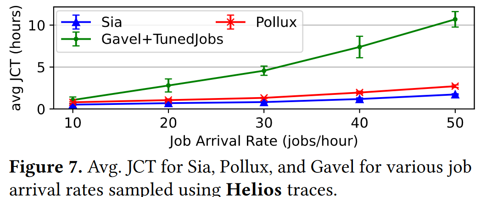
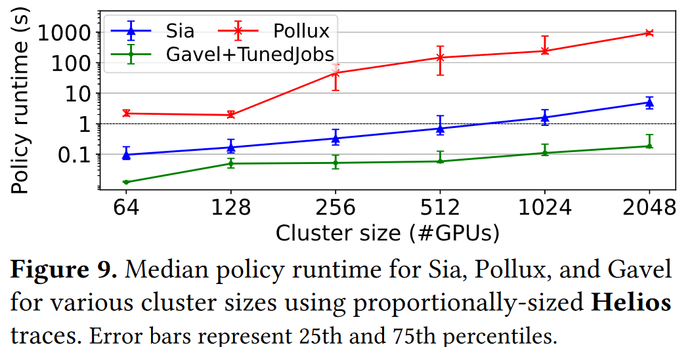

# Sia: Heterogeneity-aware, goodput-optimized ML-cluster scheduling

## Abstract
Sia scheduler 可高效地将异构深度学习（DL）集群资源分配给弹性资源自适应作业。尽管最近的一些调度器解决了一个或另一个方面的问题（如异构性或资源自适应性），但没有一个调度器能解决所有问题，而且大多数调度器即使不考虑组合调度问题的全部复杂性，也很难扩展到大型集群和/或繁重的工作负载。Sia 引入了一种新的调度方案，它可以扩展搜索空间的大小，并有意将作业及其配置与 GPU 类型和数量相匹配，同时适应集群负载和作业组合随时间的变化。Sia 还引入了一种low-profiling-overhead方法，用于引导（针对每个新作业）吞吐量模型，以评估可能的资源分配，它还是首个支持混合并行作业弹性扩展的集群调度器。

广泛的评估表明，Sia 的性能优于最先进的调度程序。例如，即使在相对较小的 44 至 64 GPU 集群上，Sia 也能将平均作业完成时间（JCT）缩短 30-93%，将第 99 百分位数的 JCT 和 makespan 缩短 28-95%，并将来自 3 个实际环境的工作负载的 GPU 使用时间缩短 1255%。其他实验证明，Sia 至少可以扩展到 2000 个 GPU 集群，提高了公平性，而且不会对调度器参数设置过于敏感。

## Introduction
大型深度学习（DL）集群通常由多个用户共享，针对不同的问题训练深度学习模型。调度器用于为提交的作业分配集群资源。随着时间的推移和 GPU 设计的进步，深度学习集群越来越多地由不同类型 GPU 组成。

目前没有一种调度器能很好地利用异构 DL 集群。
现有的调度器主要分为两类：
（1）异构感知调度器（allox，Gavel，Gandiva）：考虑了集群中不同类型 GPU 之间的差异，但这种类型的调度器只能适应刚性作业（刚性作业必须在用户指定的 GPU 数量下运行，不允许弹性扩展，也不适应资源分配）。
（2）自适应调度器（Optimus, Pollux, Singularity）：考虑了非刚性作业如何自适应（如批量大小调整）并在不同数量的GPU执行，但这种调度假设集群的GPU都是同一类型。

图 1 展示了由此产生的问题。当只有一种自由度（异构 GPU 或自适应作业）存在时，最先进的调度器可以提供良好的性能。但当两者都存在时，由于现有的调度程序没有考虑到这两个因素，因此失去了很多机会（见中间树状图的平均 JCTs-job completion times 降低了 40-70%）。更糟糕的是，对于更高强度的工作负载，差距会越来越大（如图 7 和图 9），

因为这些调度器随着争用（Gavel）和集群规模（Pollux）的扩大而扩展不佳。

Sia 是一种新的调度程序，专为资源自适应的 DL 训练作业和异构资源而设计。从概念上讲，在每一轮调度中，Sia 都会考虑当前作业的每一种可能的 GPU 分配（数量和类型），估算它们的总 "goodput"（包括任何作业调整成本），并为下一段时间选择最佳的集群资源分配。这是一项具有挑战性的工作，其根本原因有二：
(1) 对于一个相当大的集群而言，搜索空间是巨大的，而当存在多种 GPU 类型，且每个作业都可以使用和适应任意数量、任意类型的 GPU 时，搜索空间就会变得更大；
(2) 当比较一种 GPU 类型和另一种 GPU 类型时，当增加 GPU 数量时，不同的 DL 作业会经历不同的性能变化（即一种 GPU 的扩展性可能比另一种 GPU 的扩展性更好）、例如，不同类型的 GPU 可能具有不同的计算与网络带宽比）时，不同的 DL 作业会出现不同的性能变化，而针对所有可能的资源分配对每个 DL 作业进行剖析的成本又过于昂贵。

为了应对这些挑战，Sia 采用了新的求解公式来处理规模问题，并采用新的方法来在线学习每个作业、每个 GPU 类型的吞吐量模型。Sia 的新 ILP 方案，加上实用的的搜索空间剪枝，使其即使在负载和集群规模增长的情况下，也能高效地为所有待处理作业找到 GPU 类型、GPU 数量和批量大小的分配。Sia 的新吞吐量建模方法（GPU 类型、GPU 数量和批量大小的函数）避免了大量的profiling，因为 profiling 可能会忽略调度的优势。相反，Sia 仅使用每种 GPU 类型的一个最小尺寸配置的配置文件来启动每个新作业的吞吐量模型，最初假设在未知配置间进行简单的扩展/投影，并且在工作中使用不同配置时，动态完善模型。实验证实，Sia 的方法能以较低的 profiling 开销产生良好的决策。

通过对来自三个真实集群环境的工作负载进行广泛评估，我们发现Sia的有效性、可扩展性和优于三个最先进的调度器（Pollux、Gavel和Shockwave）以及其他调度器。Sia 在开源 AdaptDL 框架中作为插件兼容的调度器替代品实现，使我们能够与公开的 Pollux 实现进行正面比较。在 44-GPU 3-GPU 类型集群上使用 Sia、Pollux 和 Gavel 进行的实验表明，Sia 的 avgJCT 分别比 Pollux 和 Gavel 低 35% 和 50%。重要的是，这些实验还重新验证了 Pollux 中的模拟器，我们用它进行了更广泛的探索，包括比我们能获得的更大的集群和更高强度的工作负载。

总之，研究结果表明，对于异构集群上的自适应作业而言，动态调整作业资源分配（GPU 类型和数量）至关重要，这使得 Sia 在所有性能指标上都优于所有三种最先进的调度程序：平均 JCT 降低了 30-93%，p99 JCT 降低了 28-95%，makespan 降低了 38-65%，GPU 使用时间降低了 12-60%。在公平性指标上，Sia 也优于其他调度器，包括最坏情况下完成时间公平性降低 64%，不公平作业分数降低 99%，尽管 Shockwave 就是为提供公平性而设计的。其他结果还证实了 Sia 的以下能力：（1）即使在许多作业不允许改变批量大小或 GPU 数量的情况下，也能提高集群效率；（2）能调度并弹性扩展 Megatron 式流水线模型并行作业（使用 DP 进行扩展）；(3) 调度器runtime可扩展至大型集群（多达 2000 个 GPU），(4) 对调度器参数默认值的鲁棒性，以及 (5) 对初始粗略引导的吞吐量模型的轻微惩罚。

本文有五个主要贡献：(1) 它揭示了最先进调度程序中的一个空白点，而这一空白点留下了大量尚未开发的机会；(2) 它引入了一种新的调度程序（Sia），该程序采用 ILP 表述，可解决异构 GPU 类型和作业适应性的复合复杂性问题；(3) 它表明，每个作业、每个 GPU 类型的吞吐量模型可通过前期观察几个 minibatch 进行引导，然后随着作业在 Sia 优化配置中运行而快速有效地完善；(4) 它提出了首个能够弹性扩展混合并行作业的集群调度器；(5) 它表明 Sia 在其目标领域可与最先进的调度器媲美，并在其领域复杂性的结合方面明显优于它们。研究结果还显示了 Sia 的可扩展性、公平性和参数化鲁棒性。

## Conclusion

Sia 可在异构资源上高效调度自适应 DL 作业，共同调整每个作业的 GPU 数量、GPU 类型和批量大小分配，从而提高 DL 集群性能。实验表明，与现有调度器相比，Sia 的平均 JCT 降低了 30-93%，p99 JCT 和 makespan 降低了 28-95%，不公平作业部分降低了 22-31%。因此，Sia 为新兴的异构 DL 集群提供了一个关键部分。