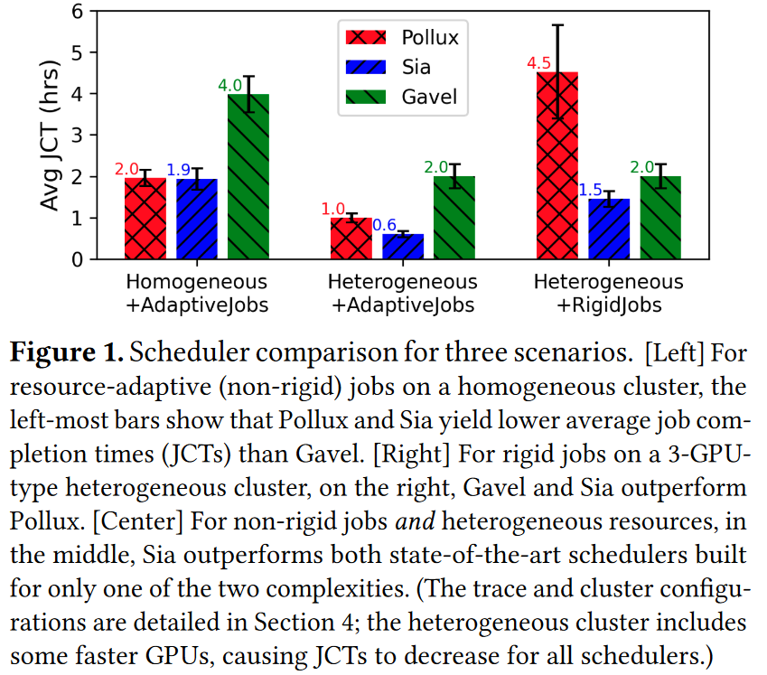

# Sia: Heterogeneity-aware, goodput-optimized ML-cluster scheduling

## Abstract
Sia scheduler 可高效地将异构深度学习（DL）集群资源分配给弹性资源自适应作业。尽管最近的一些调度器解决了一个或另一个方面的问题（如异构性或资源自适应性），但没有一个调度器能解决所有问题，而且大多数调度器即使不考虑组合调度问题的全部复杂性，也很难扩展到大型集群和/或繁重的工作负载。Sia 引入了一种新的调度方案，它可以扩展搜索空间的大小，并有意将作业及其配置与 GPU 类型和数量相匹配，同时适应集群负载和作业组合随时间的变化。Sia 还引入了一种low-profiling-overhead方法，用于引导（针对每个新作业）吞吐量模型，以评估可能的资源分配，它还是首个支持混合并行作业弹性扩展的集群调度器。

广泛的评估表明，Sia 的性能优于最先进的调度程序。例如，即使在相对较小的 44 至 64 GPU 集群上，Sia 也能将平均作业完成时间（JCT）缩短 30-93%，将第 99 百分位数的 JCT 和 makespan 缩短 28-95%，并将来自 3 个实际环境的工作负载的 GPU 使用时间缩短 1255%。其他实验证明，Sia 至少可以扩展到 2000 个 GPU 集群，提高了公平性，而且不会对调度器参数设置过于敏感。

## Introduction
大型深度学习（DL）集群通常由多个用户共享，针对不同的问题训练深度学习模型。调度器用于为提交的作业分配集群资源。随着时间的推移和 GPU 设计的进步，深度学习集群越来越多地由不同类型 GPU 组成。

目前没有一种调度器能很好地利用异构 DL 集群。
现有的调度器主要分为两类：
（1）异构感知调度器（allox，Gavel，Gandiva）：考虑了集群中不同类型 GPU 之间的差异，但这种类型的调度器只能适应刚性作业（刚性作业必须在用户指定的 GPU 数量下运行，不允许弹性扩展，也不适应资源分配）。
（2）自适应调度器（Optimus, Pollux, Singularity）：考虑了非刚性作业如何自适应（如批量大小调整）并在不同数量的GPU执行，但这种调度假设集群的GPU都是同一类型。

图 1 展示了由此产生的问题。当只有一种自由度（异构 GPU 或自适应作业）存在时，最先进的调度器可以提供良好的性能。但当两者都存在时，由于现有的调度程序没有考虑到这两个因素，因此失去了很多机会（见中间树状图的平均 JCTs-job completion times 降低了 40-70%）。更糟糕的是，对于更高强度的工作负载，差距会越来越大（如图 7 和图 9），

因为这些调度器随着争用（Gavel）和集群规模（Pollux）的扩大而扩展不佳。

Sia 是一种新的调度程序，专为资源自适应的 DL 训练作业和异构资源而设计。从概念上讲，在每一轮调度中，Sia 都会考虑当前作业的每一种可能的 GPU 分配（数量和类型），估算它们的总 "goodput"（包括任何作业调整成本），并为下一段时间选择最佳的集群资源分配。这是一项具有挑战性的工作，其根本原因有二：
(1) 对于一个相当大的集群而言，搜索空间是巨大的，而当存在多种 GPU 类型，且每个作业都可以使用和适应任意数量、任意类型的 GPU 时，搜索空间就会变得更大；
(2) 当比较一种 GPU 类型和另一种 GPU 类型时，当增加 GPU 数量时，不同的 DL 作业会经历不同的性能变化（即一种 GPU 的扩展性可能比另一种 GPU 的扩展性更好）、例如，不同类型的 GPU 可能具有不同的计算与网络带宽比）时，不同的 DL 作业会出现不同的性能变化，而针对所有可能的资源分配对每个 DL 作业进行剖析的成本又过于昂贵。

为了应对这些挑战，Sia 采用了新的求解公式来处理规模问题，并采用新的方法来在线学习每个作业、每个 GPU 类型的吞吐量模型。Sia 的新 ILP 方案，加上实用的的搜索空间剪枝，使其即使在负载和集群规模增长的情况下，也能高效地为所有待处理作业找到 GPU 类型、GPU 数量和批量大小的分配。Sia 的新吞吐量建模方法（GPU 类型、GPU 数量和批量大小的函数）避免了大量的profiling，因为 profiling 可能会忽略调度的优势。相反，Sia 仅使用每种 GPU 类型的一个最小尺寸配置的配置文件来启动每个新作业的吞吐量模型，最初假设在未知配置间进行简单的扩展/投影，并且在工作中使用不同配置时，动态完善模型。实验证实，Sia 的方法能以较低的 profiling 开销产生良好的决策。

通过对来自三个真实集群环境的工作负载进行广泛评估，我们发现Sia的有效性、可扩展性和优于三个最先进的调度器（Pollux、Gavel和Shockwave）以及其他调度器。Sia 在开源 AdaptDL 框架中作为插件兼容的调度器替代品实现，使我们能够与公开的 Pollux 实现进行正面比较。在 44-GPU 3-GPU 类型集群上使用 Sia、Pollux 和 Gavel 进行的实验表明，Sia 的 avgJCT 分别比 Pollux 和 Gavel 低 35% 和 50%。重要的是，这些实验还重新验证了 Pollux 中的模拟器，我们用它进行了更广泛的探索，包括比我们能获得的更大的集群和更高强度的工作负载。

总之，研究结果表明，对于异构集群上的自适应作业而言，动态调整作业资源分配（GPU 类型和数量）至关重要，这使得 Sia 在所有性能指标上都优于所有三种最先进的调度程序：平均 JCT 降低了 30-93%，p99 JCT 降低了 28-95%，makespan 降低了 38-65%，GPU 使用时间降低了 12-60%。在公平性指标上，Sia 也优于其他调度器，包括最坏情况下完成时间公平性降低 64%，不公平作业分数降低 99%，尽管 Shockwave 就是为提供公平性而设计的。其他结果还证实了 Sia 的以下能力：（1）即使在许多作业不允许改变批量大小或 GPU 数量的情况下，也能提高集群效率；（2）能调度并弹性扩展 Megatron 式流水线模型并行作业（使用 DP 进行扩展）；(3) 调度器runtime可扩展至大型集群（多达 2000 个 GPU），(4) 对调度器参数默认值的鲁棒性，以及 (5) 对初始粗略引导的吞吐量模型的轻微惩罚。

本文有五个主要贡献：(1) 它揭示了最先进调度程序中的一个空白点，而这一空白点留下了大量尚未开发的机会；(2) 它引入了一种新的调度程序（Sia），该程序采用 ILP 表述，可解决异构 GPU 类型和作业适应性的复合复杂性问题；(3) 它表明，每个作业、每个 GPU 类型的吞吐量模型可通过前期观察几个 minibatch 进行引导，然后随着作业在 Sia 优化配置中运行而快速有效地完善；(4) 它提出了首个能够弹性扩展混合并行作业的集群调度器；(5) 它表明 Sia 在其目标领域可与最先进的调度器媲美，并在其领域复杂性的结合方面明显优于它们。研究结果还显示了 Sia 的可扩展性、公平性和参数化鲁棒性。

## 2 DL cluster scheduling and related work
深度学习（DL）训练任务在数据集上对深度神经网络（DNN）模型进行多个历元的迭代训练。在每个epoch和epoch中的每个minibatch，优化器都会通过最小化minibatch样本的损失函数来更新模型参数。由于小批量样本的大小通常在较长时间的训练（如果不是整个训练）中都是固定的，因此大多数 DL 作业完成一个小批量样本所需的时间是一致且可预测的。这些作业通常也是可抢占的，因为我们可以在任何一个 minibatch 处理之后对作业的状态（包括模型和优化器状态）进行检查点（checkpoint），并从检查点恢复作业，而不会损失太多作业进度。由于梯度计算可在单个节点上的多个 GPU 和多个节点上并行进行，因此它们也易于扩展。

虽然存在各种并行化策略，但大多数训练任务都使用同步数据并行化（DP）--给定一组 GPU，每个 GPU 接收一个模型副本，并在 minibatch 的一个分区上计算梯度，该分区的大小称为local batch size。在所有 GPU 的梯度被还原为一个小批量梯度后（如通过all-reduce），优化器（如 SGD 或 Adam）会应用梯度在每个 GPU 上生成更新的模型参数。给定 DL 作业的扩展性取决于作业特性（如计算强度和模型参数数量）、GPU 和 GPU 间网络：对于每个minibatch，梯度计算阶段在 GPU 之间分配，而 reduce 阶段则使它们同步。先前的工作表明，作业可扩展性可以通过相对较少的测量来有效建模。

当训练的模型过大而无法在单个 GPU 内存中容纳时，一些 DL 作业会使用模型并行的形式，如流水线模型并行（PMP）或张量模型并行（TMP）。强大的优化器可对不同配置的性能进行建模，并在 GPU 之间分割模型，以最大限度地提高性能。最近，一些研究通过混合多种并行类型来提高规模--例如，Megatron-LM 在中等规模时混合 PMP 和 TMP，然后采用同步数据并行来扩展到 100 个节点。

弹性和资源自适应的 DL 作业：数据并行 DL 作业可以通过检查点（checkpoint），然后在不同数量的 GPU 上重新启动（每个 minibatch 的样本划分不同），从而随着时间的推移弹性地调整大小。此外，如果作业的设计符合分配资源的要求，那么作业的工作方式也可以根据分配资源进行调整。例如，可以调整 minibatch 的大小，比如在使用更多 GPU 时增加其大小，以增加每个 minibatch 的每 GPU 计算量，从而提高可扩展性。不同的 minibatch size 确实会对统计效率产生不同的影响，而且这种影响取决于任务特性，而且也是可以测量的。

其他 DL 作业通常以预定配置提交给调度器，更改配置通常需要重新运行混合并行优化器。不过，如上所述，它们也可以通过复制原始配置，使用数据并行方式进行扩展：例如，一个需要 4 个 GPU 用于模型和特定的的 minibatch size 的 PMP 作业，可以使用 8 个 GPU 和一个加倍的minibatch size。

资源异构性：GPU 有多种类型，代表了不同供应商生产的不同产品线和不同世代的产品，它们在 GPU 内存大小、计算和通信性能方面自然也各不相同。一个 DL 集群通常包含多种 GPU 类型。出现这种情况的部分原因是，许多集群都是随着时间的推移而部署和发展的，每次购买和添加新硬件时，都可以选择最具成本效益的方案。展望未来，新型 DL 加速器（包括一些针对特定 DL 模型的加速器）的快速发展将使多种 "GPU 类型 "成为一种设计特征，而不是部署的结果。不难理解，一个 DL 作业在不同类型的 GPU 上可能会有不同的表现，而且它在不同类型的 GPU 上也可能会有不同的扩展（例如，因为计算与网络的比例发生了变化）。此外，如图 2 所示，不同的 DL 作业可能会有不同的速度提升和可扩展性。

DL 集群调度器：在实践中，DLT 作业是作为请求提交给共享集群的，调度器分配资源以实现整个集群的目标。许多调度器只能满足指定固定 GPU 数量的请求，而忽略了弹性、资源自适应性和异构性带来的机会。其他的调度器确实能解决其中的一些问题。Sia 致力于解决所有这些问题。

### 2.1 Related work in DL cluster scheduling
据我们所知，目前还没有一种调度器能优化异构 DL 集群上资源适应性作业的分配。本节按未解决的问题对先前的调度器进行分组。

__异源 DL 集群的调度（无资源自适应作业）__。在专为处理集群内异构性而设计的 DL 调度器中，没有一个能自适应调整分配的 GPU 数量，也没有一个能考虑到 DL 作业的其他潜在适应性。取而代之的是，用户为提交的每个作业指定 GPU 的数量。

Gavel是目前性能最好的异构DL集群调度程序，它采用快速线性规划方法，可扩展到大型集群规模。然而，Gavel 不支持作业自适应，只能根据作业提交者指定的 minibatch size 和 GPU 数量优化分配的 GPU 类型。这种方法可能会因为批量太小而导致更新、更强大的 GPU 利用率不足。此外，当集群拥堵时，Gavel 会在作业之间分时共享资源，从而在检查点恢复操作上浪费 GPU 时间。

最重要的是，扩展 Gavel 以处理作业适应性并非易事：Gavel 使用由（作业_id、GPU_类型）对填充的吞吐量矩阵来表达调度选项。如果只是简单地扩展吞吐量矩阵，使其包含每个适应性选择（job_id、GPU_type、num_GPUs、minibatch_size）的条目，就会产生两个问题：（1）填充矩阵的非重要部分需要对每个作业进行大量profiling；（2）由此产生的优化程序过于庞大，无法快速求解。

__弹性和资源自适应作业的调度（无异构性）__。在专为调整弹性和资源自适应作业而设计的 DL 调度器中，没有一个考虑到 GPU 的异构性--它们假设集群中的所有 GPU 都是相同的。

Pollux 是最先进的 DL 集群调度程序，用于同构集群的弹性资源自适应作业。Pollux 使用每个作业的 goodput 模型来为每个当前作业分配 GPU 数量和 batchsize，并根据更新的作业行为和作业队列信息在每个调度周期重新考虑所有分配。通过这种方式，它可以利用弹性来避免 GPU 资源的闲置或过度投入。每个作业的 goodput 模型由两个组件模型组成：一个是作为批量大小函数的统计效率模型（基于梯度噪声标度的每个样本的训练进展率），另一个是作为 GPU 数量和批量大小函数的吞吐量模型（每秒处理的样本数）。每项工作如何随 GPU 数量的增加而增加，是通过将其放大、测量每个尝试过的数量并对其他数量进行内插来了解的。Pollux 将每个作业模型与遗传算法结合使用，为所有当前作业搜索资源分配空间（以及相应的批量大小），以最大限度地提高整个集群的公平加权总产出。遗憾的是，Pollux 的无预先确定吞吐量建模方法阻碍了对 GPU 异构性的考虑。更糟糕的是，Pollux 将调度问题表述为遗传优化问题，导致即使对于拥有 100 多块 GPU 的同构集群，集群规模的扩展性也非常差，而这种情况只会随着 GPU 的异构性而恶化。

这是因为 Pollux 考虑了大量的适应性选择：对于每一对（作业、GPU_count），它都会考虑在所有节点上放置该作业的每一种可能方式。因此，可能的解决方案数量与节点数量和每个节点的 GPU 数量成指数关系。对于拥有 1000 多个 GPU 的集群来说，对集群变化的响应速度太慢，因为遗传算法需要数十分钟才能终止（见图 9）。

__同构 DL 集群上的刚性作业调度__。大多数现有的 DL 调度器都要求提交者为每个作业指定 GPU 数量（和作业配置）。这些调度器不会根据当前作业的负载或可扩展性/效率来调整分配的 GPU 数量。它们也不考虑 GPU 类型的差异，而是假设集群中的所有 GPU 都是相同的。因此，这些调度程序使用 DL 集群资源的效率低于前两类调度程序。最近的一个例子是 Shockwave，与之前的调度器相比，它提高了性能和公平性，我们将其纳入了评估。一些batch-scheduler（如 Kubeflow 和 Volcano）可以调整 GPU 数量以提高 GPU 利用率，但不能同时调整batch-size、GPU 数量和类型。

__非集群调度器的并行性优化器__。有各种优化器 [7, 23, 39, 53-55, 60]，用于在获取云资源或将作业提交给集群调度器之前选择单个作业的配置。此类优化器对于混合并行方法尤为重要和流行。然而，它们不能被视为集群调度器，因为它们孤立地考虑单个作业，而不考虑集群负载或将特定资源分配给一个作业而不是另一个作业时的权衡。据我们所知，即使对于同构集群，也没有任何现有的调度器能共同优化非数据并行作业配置和集群资源分配。

## 3 Sia Design and Implementation
Sia 是一种抢占式、round-based 调度器，可优化一组作业的分配，以最大限度地提高整个集群的吞吐量。在每一轮中，作业会收到资源包（CPU、GPU 和网络，就像云计算中的虚拟机），Sia 使用检查点恢复抢占来优化作业适应性。

### 3.1 Sia components and job life cycle

图 3 展示了 Sia 下作业 J 的生命周期。用户向 Sia 提交作业 J (①) 并声明执行的最大批量大小 (max_bsz) 和 GPU 数量 (max_ngpus)。然后，Sia 使用每种类型的一个 GPU (②)，在几种批量大小上对 J 的吞吐量进行profiling。Goodput Estimator 会使用这些 profiles 在每种类型的 GPU 上为 J 引导一个吞吐量模型。J 在各种资源配置上的良好吞吐量估计值将提供给策略优化器（⑧），以便进行有依据的调度。任务 J 会留在队列 (④) 中，直到 Sia 为其分配了一些 GPU，然后进入一个循环，在此循环中，Sia 会对其适应性进行如下持续优化。

__持续优化作业适应性__。Sia 策略使用来自每个作业的Goodput Estimator 的吞吐量估算值，并在集群中的作业之间找到集群资源的最佳分配，例如给作业 J 提供 2 个 GREEN 类型的 GPU（图 3 中为 ⑤）。(Goodput Estimator 结合了 Sia 的吞吐量模型和借鉴自 Pollux 的统计效率模型）。然后，Placer 会根据当前分配给作业的 GPU 来确定分配给作业 J 的 2 个 GPU（⑥），并尝试减少由于资源碎片化而导致的不必要的作业迁移。Sia 在自适应执行器上运行作业，这些执行器支持：（1）透明的检查点恢复，以实现低开销的作业抢占和资源扩展；（2）batchsize 自适应，以最大限度地提高运算效率；以及（3）频繁报告当前分配的梯度和吞吐量统计数据（默认 = 30 秒）。J 开始在自适应执行器上运行后，Goodput 估算器使用 J 的梯度和吞吐量统计数据（由自适应执行器报告）更新 J 在 GPU 类型 GREEN(⑦)上的 goodput 模型。在下一轮调度中，Sia Policy 会查询 J 在所有 GPU 类型 (⑧) 上的更新良好吞吐量估计值，并在 Sia 架构中完成循环（⑤ → ⑥ → ⑦ → ⑧ ...... ），使我们能够持续优化 J 的goodput ，直至其终止/完成。

__异构执行__。Sia 可以透明地处理 GPU 在数量和功能上的异构性--GPU 内存容量、互连速度和吞吐量都在 goodput 估算器中建模，Adaptive Executors 会在一组固定资源的情况下对高吞吐量进行优化。如果统计效率要求的批处理量大于 GPU 内存限制所支持的批处理量，则会使用梯度累加法，对于内存较大的 GPU，会在更大的单位 GPU 批处理量范围内优化良好吞吐量，充分利用任何类型的 GPU 来优化作业进度。

__作业扩展策略__。Sia 使用一种简单的扩展策略--每个作业开始时只需 1 个 GPU，然后在每一轮调度中最多扩展 2 倍。如果一个作业需要最小的 min_ngpus 才能开始执行，Sia 将尊重这个最小值，并忽略所有小于 min_ngpus 的分配。作业也可能被缩减到 min_ngpus 的最小值，以容纳集群中更多的作业（由调度目标决定）。

__分配与放置解耦__。Sia 将问题分解为两个阶段：(a) 分配阶段（⑤）确定分配给每个作业的资源数量和类型；(b) 放置阶段（⑥）确定满足所有作业分配的确切物理资源（和网络拓扑结构）。这种解耦使我们能够限制分配的放置空间（对于给定的分配，存在许多放置方案）。Sia 在 Placer 中使用了三条规则来获得放置：(a) 部分节点（GPU 数量少于每个节点所需的最大 GPU 数量）分配不得在两个节点之间分割；(b) 整个节点分配必须使用整个节点；(c) 如果不存在满足(a)和(b)（资源碎片化）的分配位置，则驱逐部分作业并重试。由资源碎片导致的驱逐非常罕见，通常一次驱逐的作业少于 3 个。正如我们将在第 3.3 节中看到的，将分配限制在一个特定的集合中，可以保证 Sia 输出的所有有效分配都能得到安排。

### 3.2 Bootstrapping of throughput models
要为每种 GPU 类型构建每个作业的吞吐量模型（作为 GPU 数量和批量大小的函数），就需要对每种 GPU 类型的各种多 GPU 分配进行 profiling，以收集计算和通信时间。这种  profiling 开销与 GPU 类型数量和每种 GPU 类型的节点数量呈线性增长。Sia 采用了一种不同的方法，从最少的profiling 信息开始，并根据观察到的分配情况进行改进。

对于每个作业，Sia 会为每个 GPU 类型学习一个吞吐量模型，并为该作业学习一个统计效率模型。假设 J 需要每个数据并行工作者使用 min_GPU_count=> 1 个 GPU。Sia 首先在每种类型的一个 GPU 上对 J 进行profiling（图 3 中对应②）。从最小 batchsize 开始，Sia 对越来越大的批量进行profiling ，直到达到 GPU 内存极限（通常每种 GPU 类型profiling 10 个批量）；总之，每种 GPU 类型每个任务的平均 profiling 成本小于 20 GPU 秒。这为我们提供了两个关键信息：(1) GPU 类型和 batchsize 不同组合的计算时间；(2) 不同 GPU 类型的计算时间比较。重要的是，计算时间与 GPU 数量的增加无关（因为我们通过数据并行与all-reduce进行扩展），因此只需预测通信时间。

Sia 使用每种 GPU 类型的 1-GPU profiles 初始化 J 的吞吐量模型。Sia 使用这些吞吐量模型将 J 放置在某个类型的 1-GPU 上，比如 A。一旦 J 开始在单个 A 型 GPU 上运行，在线 profiling 就会被用于：(a) 学习 J 作为 batchsize 函数的统计效率模型；(b) 完善 J 在 A 型 1-GPU 上的吞吐量模型。然而，这些吞吐量模型由于无法估算通信时间，因此 Sia 做了一个一次性简化假设来估算 J 在 A 的 2 个 GPU 上的吞吐量：两个数据并行副本的吞吐量是单个副本吞吐量的两倍（即完美缩放，通信时间为零）。假设 Sia 将 A 类型的 2 个 GPU 分配给 J。通过在线profiling，Sia 利用在多 GPU 分配中测量到的通信时间，完善了 J 对 A GPU 的吞吐量模型。现在，Sia 可以使用改进后的吞吐量模型来估算 J 在 A GPU 的多 GPU 分配上的吞吐量，因为它能准确模拟计算和通信时间。但是，由于 J 尚未在 B 型 GPU 的多 GPU 分配上运行，因此 B 型 GPU 的吞吐量模型无法模拟 B 型 GPU 上的通信时间，因为它是从最初的 profile 中学到的，因此无法用于估算 J 在例如 4 个 B 型 GPU 上的吞吐量。为了解决这个问题，Sia 将 J 针对 A 型 GPU 学习到的吞吐量模型与 A 型和 B 型 GPU 的初始单 GPU 吞吐量 profile 相结合，从而获得针对 B 型 GPU 的粗略引导吞吐量模型。在我们的示例中，J 在 N 个 B 型 GPU 上的吞吐量是通过吞吐量模型 est-xputB 估算的，其值为:，
其中 $\frac{xput_B}{xput_A}$ 是 1 个 GPU 吞吐量的比率，xputA(N)是 N 个 A 型 GPU 的吞吐量。这种简单的估算方法假定，如果我们不知道 B 的通信时间，那么 B 的计算：通信比的比例与 A（已知）相同。在第 5.7 节中，我们将展示引导吞吐量模型的准确性，足以指导 Sia 采取有用的探索步骤。

我们使用 $est-xput_B$ 来估计 B 个 GPU 上多 GPU 分配的良好吞吐量，如果 J 在 B 个 GPU 上以多 GPU 分配运行，我们就可以放心地放弃吞吐量模型（来自公式 (1)）。这是因为利用在线profiling ，Sia 可以改进 $xput_B$ 以准确预测 B 个 GPU 上的通信时间（现在已经知道了），从而无需使用粗略的引导模型 $est-xput_B$。

### 3.3 Configurations
配置代表一束资源（CPU、GPU、网络等），类似于云计算中虚拟机的大小。配置可表示为一个 3 元组 - (n, r, t)，其中 n 是节点数，包含总计 r 个 t 类型的资源。例如，(2, 16, T4) 表示一个配置，包含 2 个节点，总计 16 个 T4 GPU。

Sia 的策略支持高效的作业适应性，通过优化一小部分有效配置集的分配来简化 Placer 中的布局逻辑。这组配置可分解为两组：单节点配置组，包含不跨越节点边界的配置（即 n = 1）；多节点配置组，包含跨越节点边界的配置（即 n > 1）。下面我们将介绍这些集合的构造。

考虑一个有 N 个物理节点的集群，每个节点包含 R 个 X 类型的 GPU，配置集 C 由单节点集和多节点集的联合给出：
，
单节点集限制节点内的分配为 2 的幂次，最多为 R，即节点内 GPU 的数量。如果 R 不是 2 的幂次，则可以将 R 分解为 2 的幂次之和，并将具有 R 个 GPU 的每个物理节点建模为具有不同 GPU 数量的多个虚拟节点。多节点集限制所有分配使用节点中所有可用的 GPU（即 GPU 数量是 R 的倍数）。利用这些分配和资源集，我们可以依靠现有文献（Submesh Shape Covering theorem [60]）来保证所有有效分配的位置，其中没有两个分布式作业共享任何节点。这一点尤为可取，因为它消除了网卡上的资源争用，而网卡上的资源争用会导致所有争用作业的运行速度明显降低。

在同构集群中，尽管 Sia 优化的配置集较小，但其性能与 Pollux 相当（表 4）。Pollux 对每个作业的全部（GPU 数量 x 配置）选择空间 $（O (N^R)）$ 进行优化，而 Sia 则将集群中 N 个节点和每个节点 R 个 GPU 的配置集限制为 $ (N + log_2^R)$ 大小。这表明我们的限制不会对作业运行时间产生重大影响。问题复杂度的降低使得 Sia 的优化可以扩展到拥有数千个 GPU 的集群（见第 5.6 节），并且运行时间实用。

### 3.4 Scheduler objective
本节将介绍 Sia 调度器的目标。让 $J = {J_1，J_2}$ 成为调度器队列中的作业集，这两个作业都至少需要 1 个 GPU 才能运行。

__有效配置__。利用第 3.3 节中描述的规则，我们构建了有效的 Sia 配置集 C。对于示例集群，C = {(1, 1, A), (1, 2, A), (1, 1, B), (1, 2, B), (1, 4, B)} 。回想一下，如果 Sia 为一个作业分配了一个配置 c = (n, m, X ) ∈ C，那么该作业就会在 n 个节点上运行 m 个 X 类型的 GPU。在一轮调度中，作业要么得不到任何资源，要么得到一组由有效配置确定的资源。

__吞吐量估算__。Sia 为每个（作业、GPU_类型）组合使用一个吞吐量模型，以有效模拟作业和硬件的异构性。Sia 优化的是整个集群的高吞吐量，因此我们使用每个作业的统计效率模型来推导 goodput 估计值，每个（作业、GPU_类型）组合使用一个估计值。让 $(f_A, f_B)$ 和 $(g_A, g_B)$ 分别成为作业 $J_1$ 和 $J_2$ 以及 GPU 类型 A 和 B 的 goodput 估计值。我们定义了大小为 $|J| × |C|$ 的 goodput 矩阵 G，其中 $G_{ij}$ 是作业 $J_i ∈ J$ 使用配置 $c_j ∈ C$ 所定义的资源时的估计 goodput。对于给定的工作 $J_i$，该行中的所有值都可比较：$G_{ij} > G_{ik}$ 表示对于工作 $J_i$ 而言，配置 $c_j$ 优于 $c_k$。但是，对于给定的配置 $c_j$，$G_{mj} > G_{nj}$ 并不能得出 $J_m$ 应该在配置 $c_j$ 中运行而不是作业 $J_n$。 我们采用简单的行归一化技术，使 G 中的值在每个配置的作业间具有可比性。

__归一化 goodput 矩阵__。对于每个任务 $J_i$，所需的 GPU 数量最少为 $N_{min}^{i},,
其中，$min_j G_{ij}$ 是作业 $J_i$ 在 C 的所有配置中的最小 goodput 值。结果矩阵 G 称为归一化 goodput 矩阵。

使用行最小值对 G 中的每一行进行归一化有两个好处。首先，我们可以将 G 解释为工作 J 的效用矩阵，其中 $G_{ij}$ 表示配置 $C_j$ 对工作 $J_i$ 的效用。其次，我们可以比较给定配置在不同工作类型中的效用。选择 G 中作业行中值最高的配置会使该作业取得最大进展，而 G 中配置列中值最高的作业则最适合使用该配置。

每个新作业都会在 G 中添加一行，作业完成后会删除相应的一行，这样就能让 G 始终保持最新，只显示活动作业的良好吞吐量。如果作业的统计效率发生变化，或其吞吐量模型更加完善，G 就会更新，以跟踪最新值。在我们运行的示例中，表 1 显示了归一化的 goodput 矩阵 G。

__调度目标__。G 代表配置集 C 对 J 中作业集的效用，而 Sia 则选择能使所选配置中作业的归一化良好产出总和最大化的（作业、配置）配对。每个配置映射到一个唯一的分配，通过限制分配资源的数量，可以确定一个有效的调度。

我们定义了一个与 G 形状相同的二进制矩阵 A，其中，如果任务 $J_i$ 选择了配置 $c_j$，则 $A_{ij} = 1$，否则为 0。我们将选择最佳配对的问题（如上所述）表述为以下关于 A 的优化问题：
其中 $||𝑣 ||_1$ 表示 向量 𝑣 的 ℓ1 范数。该目标由两部分组成：作业在所有已选配置下的归一化 goodput 总和，以及调度策略不为每个作业选择任何配置的惩罚--如果为作业 $J_i$ 选择了某种配置，则无惩罚（对于某些j，$A_{ij} = 1$，因此 $||A_i||_1 = 1$），否则为常数惩罚λ。惩罚 λ 也可被视为降低调度队列占用率的激励机制：如果 λ 较大，那么 Sia 将至少为集群中的每个作业分配一个 GPU（如果有的话）。

我们将 Sia 调度器的目标表述为一个（二进制）整数线性规划任务，以二进制矩阵 A 作为优化变量，并添加以下约束条件：1.每个任务最多选择一种配置：$||A_i||_1 ≤ 1$ 2.分配的 GPU 数量不超过每个 GPU 类型的可用 GPU 数量

解决优化问题可得到一个二进制解矩阵 A，其中包含下一轮调度的分配情况：如果 $||A_i||_1 = 0$，作业 $J_i$ 不会获得任何资源；否则（必须存在 $A_{ij} = 1$），它将在下一轮调度的配置 $c_j$ 下运行。对于表 1 所示的归一化 goodput 矩阵 G，优化等式(2)可得到如下分配：：$J_1$ 获得配置（1，4，B），$J_2$ 获得配置（1，2，A）。表 1 中用方框标出了 G 中的相应条目。

__重启因子__。为了防止频繁的作业重启损害性能，我们使用重新分配因子 $r_i$ 来调整 G 中的效用，以适应不同于每个作业 $J_i$ 当前分配配置的配置。由于深度学习作业的重启成本可能很高（例如表 2 所列模型的重启时间为 25-250 秒），因此有必要使用这个乘法因子，通过将历史重启率预测到未来来模拟此类配置的预期产出。考虑一个年龄为 $T_i$ 的作业 $J_i$，每次重启操作会浪费 $S_i$ GPU 秒，并且之前已经重启过 $N_i$ 次。作业 $J_i$ 的重新分配系数 $r_i$ 计算如下：

如果作业 $J_i$ 当前在配置 $c_k$ 下运行，我们会将需要重启的所有其他配置 $c_j ≠ c_k$ 的 goodput 值按重启因子进行折减：$G_{ij} ← r_i - G_{ij}。如果没有重启因子，G 的每一个微小变化都会导致一些作业资源的改变和额外的检查点恢复开销。通过只对 G 中需要重启作业的效用值应用重启因子，Sia 只在不重启作业会导致其调度目标的最优值大幅降低时才重启作业。

__平衡高吞吐量与公平性__。我们提供了一个简单的旋钮来调整 Sia 中分配的公平性--参数 p，可用于通过将元素提高到 p 的幂级数来操纵无标度矩阵 G。如果 p < 0，我们会改变目标的符号（即最小化原始目标，而不是最大化），以保留其语义。我们在第 5.7 节中研究了 p 对 Sia 调度器指标的影响，结果表明在 -1.0 和 1.0 之间的设置范围内，它都能提供稳健的公平性，对效率指标的负面影响最小。我们使用的默认值为-0.5。P > 0 时，Sia 的完整调度目标如下：

__支持有限的适应性__。Sia 支持在禁用某些适应性（批量大小、GPU 数量和/或类型）的情况下执行作业。大的批量规模会带来高吞吐量和 GPU 利用率，但可能会导致训练模型的泛化差距：即最终模型在未见样本上表现不佳。Sia 支持自适应程度不同的不同作业类型，以适应自适应能力有限的各种原因：强缩放作业以固定的批量大小运行，但允许对 GPU 数量和类型进行优化；而刚性作业以固定的批量大小和 GPU 数量运行，只允许对 GPU 类型进行优化。强缩放和刚性作业都通过固定批量大小来保持模型质量和训练语义，但允许 Sia 以有限的方式优化作业执行。在批量大小固定的情况下，goodput 与吞吐量成正比；因此对于强缩放作业，Sia 在公式 (4) 中直接使用吞吐量代替 goodput。对于刚性作业，我们在等式 (4) 中添加了以下目标：
其中，$J_R$ 是刚性作业的集合，$N_g$ 是 GPU 类型的数量，$T_{ig}$ 是作业 $J_i$ 在 GPU 类型 g 上的 goodput，$r_i$ 是作业的重启次数。然后，我们更新 ILP 的约束条件，以限制在所有活动作业中为每种 GPU 类型分配的 GPU 总数。
类似地，只需对等式（4）和优化程序约束进行少量修改，Sia 灵活的调度公式就能支持调度自定义资源请求和作业，并根据特定 GPU 数量、类型和/或批量大小调整用户定义的并行性。

__抢占和保留__。Sia 假设所有作业都是抢占式的，但也能支持集群中的少量非抢占式作业（只要能满足它们的总需求）：对于每个非抢占式作业，我们都会在公式（4）中添加一个约束条件，以强制分配所请求的资源。该约束可确保非抢占式任务优先分配，从而保证每一轮调度都不会出现抢占。保留的实现方式与此类似。

__支持其他并行化技术__。一般来说，Sia 只要求作业提供一个能在有效配置上进行评估的 goodput 估算器。
这种设计使 Sia 能够支持采用更先进并行化策略的作业。我们扩展了 Sia 的吞吐量模型，以支持结合使用流水线和数据并行的作业，从而使 Sia 能够调度具有数十亿参数模型的作业。

这些工作混合使用了数据并行和流水线并行，其中流水线并行策略将大型模型分割到多个 GPU 上，而数据并行则用于扩大训练规模（见第 5.3 节）。每个模型分区都会映射到一个或多个 GPU 上，比如所有分区都有 P 个 GPU。一个有 N 个数据并行副本的任务正好使用 N×P 个 GPU。给定迷你批量大小为 M，微批量大小为 m，每个副本在本地使用 P 个 GPU 上每个大小为 m 的 M mN 个微批量计算梯度。然后，这些流水线的 N 个副本使用梯度全还原同步，从而完成一次训练迭代。不同的计算和通信阶段使我们能够利用 Sia 的吞吐量模型，对不同批次规模的良好吞吐量进行估算。由于这些工作以 P 个 GPU 为单位进行扩展，因此我们在调度目标中添加了附加项和适当的约束条件（类似于公式 (5)）。我们将在第 5.3 节更详细地讨论这种混合并行模型的适应性。

现有的混合并行优化器耗时较长，因此我们将在不固定非数据并行度的情况下实现高效弹性扩展的问题作为未来工作的重点。

__调度其他工作负载类型__。Sia 利用了深度学习训练所独有的特性，但我们相信，通过使用针对每种工作负载类型定制的良好输出估计器，它还可以处理其他批处理工作负载。例如，我们可以使用 Sia 调度在大型数据集上运行推理的批量深度学习推理作业。在这里，吞吐量可用作良好吞吐量的代理，从而产生一个简单的良好吞吐量估算器。对于对延迟敏感的推理作业，可以使用 Sia 挑选合适的资源集：如果配置可以在承诺的延迟限制内支持推理，则良好输出=1，否则为 0。

### 3.5 Implementation

我们使用开源的 AdaptDL 框架来实现 Sia，并用自己的调度器和数据加载器取代其实现，因为基于 PyTorch 的框架为在 Kubernetes 管理的 GPU 集群上动态调整 DL 训练作业的批量大小和 GPU 数量提供了原生支持。对于数据并行的 DL 训练任务，我们使用 AdaptDL 数据加载器在训练过程中改变批量大小，并使用 all-reduce 同步各工作者的梯度。Sia Adaptive Executor 会定期（默认 30s）对迷你批次运行时间和梯度统计进行持续剖析，使用这些剖析优化良好输出模型参数，并将新的良好输出模型参数传送给 Sia Policy。它还会根据所分配的资源，选择能使吞吐量最大化的批次大小，并使用可配置的学习率缩放规则，根据所选的批次大小缩放学习率。对于表 2 中列出的模型，我们对使用 AdamW [33] 优化器的模型使用平方根学习率缩放规则[29]，对使用 SGD 优化器的模型使用 AdaScale[24] 缩放规则。

Sia Policy 作为 Kubernetes 服务运行，并在每个调度轮开始时，为每个作业使用最新的goodput 模型，以使用（公式（4））优化资源分配。我们使用 CVXPY 包 [13] 中的 GLPK_MI [35] 求解器将方程 (4) 表述为混合整数线性规划，并使用输出解来确定作业分配。

__通过检查点恢复进行抢占__。如果 DL 训练作业的分配发生变化，Sia 仅在当前小批量处理完成后才会抢占该作业，因此不会进行任何通信。首先，Sia 检查最新的模型权重、数据加载器（例如采样器和迭代器状态）和优化器状态（例如 Adam 的梯度统计）以共享持久存储并释放分配给该作业的所有 GPU。然后，在新资源上，Sia 为每个 GPU 启动一个自适应执行器，从磁盘上的检查点恢复训练状态，并恢复模型训练。

Sia 还使用检查点恢复机制从工作节点故障中恢复。在每个 epoch 之后，Sia 都会将模型权重和优化器状态检查点写入磁盘，因此如果某些工作线程在下一个 epoch 中失败，则可以从不同资源上上次保存的检查点恢复模型训练。

## Conclusion

Sia 可在异构资源上高效调度自适应 DL 作业，共同调整每个作业的 GPU 数量、GPU 类型和批量大小分配，从而提高 DL 集群性能。实验表明，与现有调度器相比，Sia 的平均 JCT 降低了 30-93%，p99 JCT 和 makespan 降低了 28-95%，不公平作业部分降低了 22-31%。因此，Sia 为新兴的异构 DL 集群提供了一个关键部分。