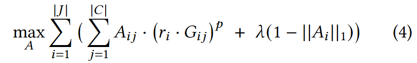

# Sia: Heterogeneity-aware, goodput-optimized ML-cluster scheduling

## Concept：

__DL 集群调度器__：在实践中，DLT 作业是作为请求提交给共享集群的，调度器分配资源以实现整个集群的最优。

__"goodput"__ : 一种深度学习效率指标，结合了样本处理吞吐量和计算效率来反映训练速度。

__资源异构性__：一个 DL 集群通常包含多种 GPU ，GPU 内存、计算和通信能力存在差异。不难理解，一个 DL 作业在不同类型的 GPU 上可能会有不同的表现，而且它在不同类型的 GPU 上也可能会有不同的扩展性（例如，因为计算与网络的比例发生了变化）。此外，如图 2 所示，不同的 DL 作业可能会有不同的速度提升和可扩展性。

__弹性和资源适应性的 DL 作业__：数据并行 DL 作业可以随着时间的推移弹性地调整大小，即作业的工作方式也可以根据所分配的资源进行调整。例如，可以调整 minibatch 的大小，比如在使用更多 GPU 时增加batchsize，从而提高扩展性。其他 DL 作业也可以通过复制原始配置，使用 DP 进行扩展：例如，一个需要 4 个 GPU 用于模型和特定的的 minibatch size 的 PMP 作业，可以使用 8 个 GPU 和一个加倍的minibatch size。

## Motivation

目前没有一种调度器能很好地利用异构 DL 集群。现有的调度器主要分为两类：

（1）异构感知调度器（allox，Gavel，Gandiva）：考虑了集群中不同类型 GPU 之间的差异，但这种类型的调度器只能适应刚性作业（刚性作业必须在用户指定的 GPU 数量下运行，不允许弹性扩展，也不适应资源分配）。比如Gavel，只能根据作业提交者指定的 minibatch size 和 GPU 数量优化分配的 GPU 类型

（2）自适应调度器（Optimus, Pollux, Singularity）：考虑了非刚性作业如何自适应（如批量大小调整）并在不同数量的GPU执行，但这种调度假设集群的GPU都是同一类型。比如 Pollux ，用于同构集群的弹性资源自适应作业。Pollux 使用每个作业的 goodput 模型来为每个当前作业分配 GPU 数量和 batchsize，并根据更新的作业行为和作业队列信息在每个调度周期重新考虑所有分配。但是 Pollux 缺乏对 GPU 异构性的考虑。

（PS：有既没有弹性自适应，也没有考虑异构的调度，比如Shockwave）

Sia：既考虑集群中不同类型GPU之间的差异，作业又能资源自适应。每一轮调度中，Sia 都会考虑当前作业的每一种可能的 GPU 分配（数量和类型），估计它们的总 "goodput"，并选择下一个时间段的最佳集群资源分配。

这样做有两个问题：

(1) 对于一个大集群，搜索空间巨大，而当存在多种 GPU 类型，且每个作业都可以使用和适应任意数量、任意类型的 GPU 时，搜索空间就会变得更大；

(2) 当比较一种 GPU 类型和另一种 GPU 类型时，当增加 GPU 数量时，由于不同类型的 GPU 可能具有不同的计算与网络带宽比，不同的 DL 作业会出现不同的性能变化，而针对所有可能的资源分配对每个 DL 作业进行 profiling 的成本又过于昂贵。

## Sia
Sia 是一种抢占式、round-based 调度器，可优化一组作业的分配，以最大限度地提高整个集群的吞吐量。在每一轮中，作业会收到资源包（CPU、GPU 和网络，就像云计算中的虚拟机），Sia 使用检查点恢复抢占来优化作业适应性。

图 3 展示了 Sia 下作业 J 的生命周期。用户向 Sia 提交作业 J (①) 并声明执行的最大批量大小 (max_bsz) 和 GPU 数量 (max_ngpus)。然后，Sia 使用每种类型的一个 GPU (②)，在几种批量大小上对 J 的吞吐量进行profiling。Goodput Estimator 会使用这些 profiles 在每种类型的 GPU 上为 J 引导一个吞吐量模型。J 在各种资源配置上的 goodput 估计值将提供给 Policy（⑧），以便进行有依据的调度。任务 J 会留在队列 (④) 中，直到 Sia 为其分配了一些 GPU，然后进入一个循环，在此循环中，Sia 会对其适应性进行如下持续优化。

__持续优化作业适应性__。Sia 策略使用来自每个作业的Goodput Estimator (Sia使用的 Goodput Estimator 结合了 Sia 的吞吐量模型和借鉴自 Pollux 的计算效率模型）的吞吐量估算值，并为集群中的作业找到集群资源的最佳分配，例如给作业 J 提供 2 个 GREEN 类型的 GPU（图 3 中为 ⑤）。然后，Placer 会根据当前分配策略给作业 J 分配 2 个 GPU（⑥）。Sia 在自适应执行器 Adaptive Executors 上运行作业，这些 Executors 支持：（1）透明的检查点恢复，以实现低开销的作业抢占和资源扩展；（2）batchsize 自适应，以最大限度地提高运算效率；（3）频繁报告当前分配的梯度和吞吐量统计数据（默认 = 30 秒）。J 开始在自适应执行器上运行后，Goodput Estimator 使用 J 的梯度和吞吐量统计数据（由 Adaptive Executors 报告）更新 J 在 GPU 类型 GREEN(⑦)上的 goodput 模型。在下一轮调度中，Sia Policy 会查询 J 在所有 GPU 类型 (⑧) 上的更新 goodput 估计值，并在 Sia 架构中完成循环（⑤ → ⑥ → ⑦ → ⑧ ...... ），使我们能够持续优化 J 的 goodput ，直至其终止/完成。

__异构执行__。Sia 透明地处理 GPU 在数量和功能上的异构性--GPU 内存容量、互连速度和吞吐量都在 Goodput Estimator 中建模，Adaptive Executors 会在一组固定资源的情况下对 goodput 进行优化。如果 statistical efficiency 要求的 batchsize 大于 GPU 内存限制所支持的 batchsize，则会使用梯度累加法，对于内存较大的 GPU，会在更大的单位 GPU 批处理量范围内优化 goodput ，充分利用任何类型的 GPU 来优化作业速度。

__作业扩展策略__。Sia 使用一种简单的扩展策略--每个作业开始时只需 1 个 GPU，然后在每一轮调度中最多扩展 2 倍。如果一个作业指定了最小的 min_ngpus 才能开始执行，Sia 将使用指定值，作业也可能被缩减到 min_ngpus 的最小值，以容纳集群中更多的作业（由调度目标决定）。

__分配与放置解耦__。Sia 将问题分解为两个阶段：(a) 分配阶段（⑤）确定分配给每个作业的资源数量和类型；(b) 放置阶段（⑥）确定满足所有作业分配的确切物理资源（和网络拓扑结构）。这种解耦使我们能够限制分配的放置空间（对于给定的分配，存在许多放置方案）。Sia 在 Placer 中使用了三条规则来获得放置：(a) 部分节点（GPU 数量少于每个节点所需的最大 GPU 数量）分配不得在两个节点之间分割；(b) 整个节点分配必须使用整个节点；(c) 如果不存在满足(a)和(b)（资源碎片化）的分配位置，则驱逐部分作业并重试。

### Sia 的吞吐量模型
要为每种 GPU 类型构建每个作业的吞吐量模型（为 GPU num 和batchsize 的函数），就需要对每种 GPU 类型的各种多 GPU 分配进行 profiling，以收集计算和通信时间。这种 profiling 开销与 GPU 类型数量和每种 GPU 类型的节点数量呈线性增长。怎么解决搜索空间太大的问题呢？__Sia 采用了一种不同的方法，从最少的profiling 信息开始，并根据观察到的分配情况进行改进__。

对于每个作业，Sia 会为每个 GPU 类型学习一个吞吐量模型，并为该作业学习一个 statistical efficiency 模型。假设 J 需要每个 DP worker 使用 min_GPU_count >= 1 个 GPU。Sia 首先在每种类型的一个 GPU 上对 J 进行 profiling（图 3 中对应②）。从最小 batchsize 开始，Sia 对越来越大的 batchsize 进行profiling ，直到达到 GPU 内存极限（通常每种 GPU 类型profiling 10 种 batchsize）；总之，每种 GPU 类型每个任务的平均 profiling 成本小于 20 GPU 秒。这为我们提供了两个关键信息：(1) GPU 类型和 batchsize 不同组合的计算时间；(2) 不同 GPU 类型的计算时间比较。

Sia 使用每种 GPU 类型的 1-GPU profiles 初始化 J 的吞吐量模型。Sia 使用这些吞吐量模型将 J 放置在某个类型的 1-GPU 上，比如 A。一旦 J 开始在单个 A 型 GPU 上运行，在线 profiling 就会被用于：(a) 学习 J 作为 batchsize 函数的 statistical efficiency 模型；(b) 完善 J 在 A 型 1-GPU 上的吞吐量模型。然而，这些吞吐量模型由于无法估算通信时间，因此 Sia 做了一个假设来简单估算 J 在 A 的 2 个 GPU 上的吞吐量：两个数据并行副本的吞吐量是单个副本吞吐量的两倍（即通信时间为 0 ）。假设 Sia 将 A 类型的 2 个 GPU 分配给 J。通过在线 profiling ，Sia 利用在多 GPU 分配中测量到的通信时间，完善了 J 对 A GPU 的吞吐量模型。现在，Sia 可以使用改进后的吞吐量模型来估算 J 在 A GPU 的多 GPU 分配上的吞吐量，因为它能准确模拟计算和通信时间。但是，由于 J 尚未在 B 型 GPU 的多 GPU 分配上运行，因此 B 型 GPU 的吞吐量模型无法模拟 B 型 GPU 上的通信时间，因为它是从最初的 profile 中学到的，因此无法用于估算 J 在例如 4 个 B 型 GPU 上的吞吐量。为了解决这个问题，Sia 将 J 针对 A 型 GPU 学习到的吞吐量模型与 A 型和 B 型 GPU 的初始单 GPU 吞吐量 profile 相结合，从而获得针对 B 型 GPU 的简单吞吐量模型。在我们的示例中，J 在 N 个 B 型 GPU 上的吞吐量是通过吞吐量模型 est-xputB 估算的，其值为:

其中 $\frac{xput_B}{xput_A}$ 是 1 个 GPU 吞吐量的比率，$xput_A(N)$是 N 个 A 型 GPU 的吞吐量。这种简单的估算方法假定，如果我们不知道 B 的通信时间，那么 B 的计算：通信比的比例与 A（已知）相同。在第 5.7 节中，我们将展示吞吐量模型的准确性，足以指导 Sia 采取有用的探索步骤。

我们使用 $est-xput_B$ 来估计 B 个 GPU 上多 GPU 分配的 goodput，如果 J 在 B 个 GPU 上以多 GPU 分配运行，我们就可以放心地放弃吞吐量模型（来自公式 (1)）。这是因为利用在线 profiling ，Sia 可以改进 $xput_B$ 以准确预测 B 个 GPU 上的通信时间，从而无需使用 $est-xput_B$。

### Configurations
配置代表一束资源（CPU、GPU、网络等），可表示为一个 3 元组 - (n, r, t)，其中 n 是节点数，包含总计 r 个 t 类型的资源。例如，(2, 16, T4) 表示一个配置，包含 2 个节点，总计 16 个 T4 GPU。

Sia 的策略支持高效的作业适应性，通过优化一小部分有效配置集的分配来简化 Placer 中的分配逻辑。这组配置可分解为两组：单节点配置组，包含不跨节点的配置（即 n = 1）；多节点配置组，包含跨节点的配置（即 n > 1）。下面我们将介绍这些集合的构造。

考虑一个有 N 个物理节点的集群，每个节点包含 R 个 X 类型的 GPU，配置集 C 由单节点集和多节点集的联合给出：
，

单节点集限制节点内的分配为 2 的幂次，最多为 R，即节点内 GPU 的数量。如果 R 不是 2 的幂次，则可以将 R 分解为 2 的幂次之和，并将具有 R 个 GPU 的每个物理节点建模为具有不同 GPU 数量的多个虚拟节点。

多节点集限制所有分配使用节点中所有可用的 GPU（即 GPU 数量是 R 的倍数）。利用这些分配和资源集，__我们可以依靠现有文献（Submesh Shape Covering theorem）保证所有有效分配的位置，其中没有两个分布式作业共享任何节点。这一点尤为可取，因为它消除了网卡上的资源争用，而网卡上的资源争用会导致所有争用作业的运行速度明显降低__。

### Scheduler 目标
本节将介绍 Sia 调度器的目标。让 $J = \{J_1，J_2\}$ 成为调度器队列中的作业集，这两个作业都至少需要 1 个 GPU 才能运行。

__有效配置__。有效的 Sia 配置集用 C 表示。对于示例集群，C = {(1, 1, A), (1, 2, A), (1, 1, B), (1, 2, B), (1, 4, B)} 。回想一下，如果 Sia 为一个作业分配了一个配置 c = (n, m, X ) ∈ C，那么该作业就会在 n 个节点上运行 m 个 X 类型的 GPU。在一轮调度中，作业要么得不到任何资源，要么得到一组由有效配置确定的资源。

__吞吐量估算__。Sia 为每个（作业、GPU_类型）组合使用一个吞吐量模型，以有效模拟作业和硬件的异构性。Sia 优化的是整个集群的吞吐量，因此我们使用每个作业的 Statistical Efficiency 模型来推导 goodput 估计值，每个（作业、GPU_类型）组合使用一个估计值。让 $(f_A, f_B)$ 和 $(g_A, g_B)$ 分别成为作业 $J_1$ 和 $J_2$ 以及 GPU 类型 A 和 B 的 goodput 估计值。我们定义了大小为 $|J| × |C|$ 的 goodput 矩阵 G，其中 $G_{ij}$ 是作业 $J_i ∈ J$ 使用配置 $c_j ∈ C$ 所定义的资源时的估计 goodput。对于给定的工作 $J_i$，该行中的所有值都可比较：$G_{ij} > G_{ik}$ 表示对于工作 $J_i$ 而言，配置 $c_j$ 优于 $c_k$。但是，对于给定的配置 $c_j$，$G_{mj} > G_{nj}$ 并不能得出 $J_m$ 应该在配置 $c_j$ 中运行而不是作业 $J_n$。 我们采用简单的行归一化技术，使 G 中的值在每个配置的作业间具有可比性。

__归一化 goodput 矩阵__。对于每个任务 $J_i$，所需的 GPU 数量最少为 $N_{min}^{i}$,,

其中，$min_j G_{ij}$ 是作业 $J_i$ 在 C 的所有配置中的最小 goodput 值。结果矩阵 G 称为归一化 goodput 矩阵。

使用行最小值对 G 中的每一行进行归一化有两个好处。首先，我们可以将 G 解释为工作 J 的效用矩阵，其中 $G_{ij}$ 表示配置 $C_j$ 对工作 $J_i$ 的效用。其次，我们可以比较给定配置在不同工作类型中的效用。选择 G 中作业行中值最高的配置会使该作业取得最大进展，而 G 中配置列中值最高的作业则最适合使用该配置。

每个新作业都会在 G 中添加一行，作业完成后会删除相应的一行，这样就能让 G 始终保持最新，只显示活动作业的良好吞吐量。如果作业的统计效率发生变化，或其吞吐量模型更加完善，G 就会更新，以跟踪最新值。在我们运行的示例中，表 1 显示了归一化的 goodput 矩阵 G。

__调度目标__。G 代表配置集 C 对 J 中作业集的效用，而 Sia 则选择能使所选配置中作业的归一化 goodput 总和最大化的（作业、配置）配对。每个配置映射到一个唯一的分配，通过限制分配资源的数量，可以确定一个有效的调度。

我们定义了一个与 G 形状相同的二进制矩阵 A，其中，如果任务 $J_i$ 选择了配置 $c_j$，则 $A_{ij} = 1$，否则为 0。我们将选择最佳配对的问题（如上所述）表述为以下关于 A 的优化问题：

其中 $||𝑣 ||_1$ 表示 向量 𝑣 的 ℓ1 范数。该目标由两部分组成：作业在所有已选配置下的归一化 goodput 总和，以及调度策略不为每个作业选择任何配置的惩罚--如果为作业 $J_i$ 选择了某种配置，则无惩罚（对于某些j，$A_{ij} = 1$，因此 $||A_i||_1 = 1$），否则为常数惩罚λ。惩罚 λ 也可被视为降低调度队列占用率的激励机制：如果 λ 较大，那么 Sia 将至少为集群中的每个作业分配一个 GPU（如果有的话）。

我们将 Sia 调度器的目标表述为一个（二进制）整数线性规划任务，以二进制矩阵 A 作为优化变量，并添加以下约束条件：1.每个任务最多选择一种配置：$||A_i||_1 ≤ 1$ ；2.分配的 GPU 数量不超过每个 GPU 类型的可用 GPU 数量

解决优化问题可得到一个二进制解矩阵 A，其中包含下一轮调度的分配情况：如果 $||A_i||_1 = 0$，作业 $J_i$ 不会获得任何资源；否则（必须存在 $A_{ij} = 1$），它将在下一轮调度的配置 $c_j$ 下运行。对于表 1 所示的归一化 goodput 矩阵 G，优化等式(2)可得到如下分配：：$J_1$ 获得配置（1，4，B），$J_2$ 获得配置（1，2，A）。表 1 中用方框标出了 G 中的相应条目。

__重启因子__。为了防止频繁的作业重启损害性能，可以使用重启因子 $r_i$ 来调整 G 中的效用，以适应不同于每个作业 $J_i$ 当前分配配置的配置。考虑一个年龄为 $T_i$ 的作业 $J_i$，每次重启操作会浪费 $S_i$ GPU 秒，并且之前已经重启过 $N_i$ 次。作业 $J_i$ 的重新分配系数 $r_i$ 计算如下：

如果作业 $J_i$ 当前在配置 $c_k$ 下运行，我们会将需要重启的所有其他配置 $c_j ≠ c_k$ 的 goodput 值按重启因子进行折减：$G_{ij} ← r_i - G_{ij}。如果没有重启因子，G 的每一个微小变化都会导致一些作业资源的改变和额外的检查点恢复开销。通过只对 G 中需要重启作业的效用值应用重启因子，Sia 只在不重启作业会导致其调度目标的最优值大幅降低时才重启作业。

__平衡高吞吐量与公平性__。我们提供了一个简单的旋钮来调整 Sia 中分配的公平性--参数 p，可用于通过将元素提高到 p 的幂级数来操纵无标度矩阵 G。如果 p < 0，我们会改变目标的符号（即最小化原始目标，而不是最大化），以保留其语义。我们在第 5.7 节中研究了 p 对 Sia 调度器指标的影响，结果表明在 -1.0 和 1.0 之间的设置范围内，它都能提供稳健的公平性，对效率指标的负面影响最小。我们使用的默认值为-0.5。P > 0 时，Sia 的完整调度目标如下：

__支持有限的适应性__。Sia 支持在禁用某些适应性（批量大小、GPU 数量和/或类型）的情况下执行作业。大的批量规模会带来高吞吐量和 GPU 利用率，但可能会导致训练模型的泛化差距：即最终模型在未见样本上表现不佳。Sia 支持自适应程度不同的不同作业类型，以适应自适应能力有限的各种原因：强 scaling 作业以固定的 batchsize 运行，但允许对 GPU 数量和类型进行优化；而 rigid 作业以固定的 batchsize 和 GPU 数量运行，只允许对 GPU 类型进行优化。强 scaling 和 rigid 作业都通过固定 batchsize 来保持模型质量和训练语义，但允许 Sia 以有限的方式优化作业执行。在批量大小固定的情况下，goodput 与吞吐量成正比；因此对于强 scaling 作业，Sia 在公式 (4) 中直接使用吞吐量代替 goodput。对于 rigid 作业，我们在等式 (4) 中添加了以下目标：

其中，$J_R$ 是刚性作业的集合，$N_g$ 是 GPU 类型的数量，$T_{ig}$ 是作业 $J_i$ 在 GPU 类型 g 上的 goodput，$r_i$ 是作业的重启次数。然后，我们更新 ILP 的约束条件，以限制在所有活动作业中为每种 GPU 类型分配的 GPU 总数。
类似地，只需对等式（4）和优化程序约束进行少量修改，Sia 灵活的调度公式就能支持调度自定义资源请求和作业，并根据特定 GPU 数量、类型和/或批量大小调整用户定义的并行性。

__抢占和保留__。Sia 假设所有作业都是抢占式的，但也能支持集群中的少量非抢占式作业（只要能满足它们的总需求）：对于每个非抢占式作业，我们都会在公式（4）中添加一个约束条件，以强制分配所请求的资源。该约束可确保非抢占式任务优先分配，从而保证每一轮调度都不会出现抢占。保留的实现方式与此类似。

__支持其他并行化技术__。一般来说，Sia 只要求作业提供一个能在有效配置上进行评估的 goodput 估算器。
这种设计使 Sia 能够支持采用更先进并行化策略的作业。我们扩展了 Sia 的吞吐量模型，以支持结合使用流水线和数据并行的作业，从而使 Sia 能够调度具有数十亿参数模型的作业。

这些工作混合使用了数据并行和流水线并行，其中流水线并行策略将大型模型分割到多个 GPU 上，而数据并行则用于扩大训练规模（见第 5.3 节）。每个模型分区都会映射到一个或多个 GPU 上，比如所有分区都有 P 个 GPU。一个有 N 个数据并行副本的任务正好使用 N×P 个 GPU。给定迷你批量大小为 M，微批量大小为 m，每个副本在本地使用 P 个 GPU 上每个大小为 m 的 M mN 个微批量计算梯度。然后，这些流水线的 N 个副本使用梯度全还原同步，从而完成一次训练迭代。不同的计算和通信阶段使我们能够利用 Sia 的吞吐量模型，对不同批次规模的良好吞吐量进行估算。由于这些工作以 P 个 GPU 为单位进行扩展，因此我们在调度目标中添加了附加项和适当的约束条件（类似于公式 (5)）。我们将在第 5.3 节更详细地讨论这种混合并行模型的适应性。

现有的混合并行优化器耗时较长，因此我们将在不固定非数据并行度的情况下实现高效弹性扩展的问题作为未来工作的重点。

__调度其他工作负载类型__。Sia 利用了深度学习训练所独有的特性，但我们相信，通过使用针对每种工作负载类型定制的良好输出估计器，它还可以处理其他批处理工作负载。例如，我们可以使用 Sia 调度在大型数据集上运行推理的批量深度学习推理作业。在这里，吞吐量可用作良好吞吐量的代理，从而产生一个简单的良好吞吐量估算器。对于对延迟敏感的推理作业，可以使用 Sia 挑选合适的资源集：如果配置可以在承诺的延迟限制内支持推理，则良好输出=1，否则为 0。

__通过检查点恢复进行抢占__。如果 DL 训练作业的分配发生变化，Sia 仅在当前小批量处理完成后才会抢占该作业，因此不会进行任何通信。首先，Sia 检查最新的模型权重、数据加载器（例如采样器和迭代器状态）和优化器状态（例如 Adam 的梯度统计）以共享持久存储并释放分配给该作业的所有 GPU。然后，在新资源上，Sia 为每个 GPU 启动一个自适应执行器，从磁盘上的检查点恢复训练状态，并恢复模型训练。

Sia 还使用检查点恢复机制从工作节点故障中恢复。在每个 epoch 之后，Sia 都会将模型权重和优化器状态检查点写入磁盘，因此如果某些工作线程在下一个 epoch 中失败，则可以从不同资源上上次保存的检查点恢复模型训练。

## Experiments
我们使用源自真实环境的工作负载，将 Sia 与同构和异构集群中最先进的调度程序进行比较。本节介绍工作负载、配置和使用的调度程序。

### Workloads and Traces
我们使用来自三个生产 DL 集群的跟踪，使用最近工作中的通用方法 [40,44,61]。我们根据跟踪中的每个作业的总 GPU 时间对其进行分类：小型（0-1 小时）、中型（1-10 小时）、大型（10-100 小时）和超大（XL，>100 小时）。我们将每个类别映射到表 2 中列出的一个或多个代表性工作。XXL 模型仅用于第 5.3 节中的混合并行实验。

Philly 来自 Microsoft 的多租户集群，在两个月内执行了 10 万个作业，该集群具有多种 GPU 类型

Helios是来自土星星团中Helios星团的痕迹[17]。原始跟踪包含六个月内在具有超过 6k GPU 的异构集群中记录的 330 万个作业。与 Philly 相比，Helios 作业需要更多 GPU，运行时间更长，从而导致集群负载更高。

我们通过使用 20 个作业/小时的平均作业到达率随机采样相应现实世界跟踪中的 8 个最繁忙小时，得出每个工作负载的 10 个跟踪，从而在 8 小时窗口内总共提交了 160 个作业。

newTrace 是来自深度学习作业生产系统的最新跟踪，该系统跨越具有数千个 GPU 的多个集群。与 Microsoft Philly 跟踪 [21] 类似，该生产系统将虚拟机 (VM) 分配给 DL 训练作业，其中每个 VM 实例都配置了预先配置的 CPU、GPU 和内存资源量。与其他生产环境类似，我们观察到各种资源请求表现出昼夜模式，并通过作业提交脚本（例如，超参数调整）爆发资源请求。我们在 48 小时内以 20 个作业/小时的平均到达率对 10 个跟踪进行采样（每个跟踪中总共提交了 960 个作业）。

较长的 48 小时 newTrace 跟踪用于评估更现实的设置，在该设置中，由于长时间运行的作业而在集群中缓慢形成拥塞。 newTrace 发现，在 48 小时的作业提交窗口中，作业到达率存在显着差异，从 5 到 100 个作业/小时，这为我们提供了有关调度程序如何处理集群负载拥塞和差异的宝贵见解。

### Hardware measurements and simulator

我们的大多数实验都使用 Pollux 作者开源的离散时间模拟器 [3]，其保真度已通过之前的工作 [44] 和我们自己的测量得到验证。我们在模拟器中添加了 Gavel 实现和开源 Shockwave [61]，并扩展了 Pollux 的原始版本以支持异构集群。该模拟器允许我们对一系列集群大小和硬件配置进行实验。

我们在实验中使用四种不同类型的 GPU：由 16 个 t4 实例组成的集群 [44] 和三种本地节点类型（3x rtx、2x a100 和 1xquad）：

t4 – [Cloud] g4dn.12xlarge AWS EC2 实例配备 4 个 NVIDIA T4 (16GB VRAM) GPU。 
rtx – [本地] 商品节点，配备 8 个 NVIDIA RTX 2080Ti (11GB VRAM) GPU 和 50Gb/s 以太网。 
a100 – [本地]高性能 NVIDIA DGX-A100 节点，配备 8 个 NVIDIA A100 (40GB VRAM) GPU 和 1.6Tb/s Infiniband。 
Quad – [本地] 工作站节点，配备 4 个 NVIDIA Quadro RTX6000 (24GB VRAM) GPU 和 200 Gb/s Infiniband。

我们能够在本地节点上获得有限的专用时间，从而可以在 44-GPU、3-GPU 类型的集群上进行直接实验。结果（第 5.1 节）证实了 Sia 的功效和模拟器的保真度。 

[44] 中的原始模拟器对所有作业都使用相同的恒定延迟来模拟检查点恢复，我们将其替换为特定于模型的检查点恢复延迟。

### Evaluated settings
我们在以下三种设置中比较调度程序：
• 物理：具有3 个rtx、2 个a100 和1 个四节点的物理集群，总共44 个GPU。在秒。 5.1，我们将 Sia 与 Pollux 和 Gavel 进行比较。
• 同质：具有16 个t4 节点（64 个GPU）的模拟集群。在秒。 5.2 中，我们将 Sia 与 Pollux（一种用于同质集群的最先进的作业自动缩放调度程序）以及非弹性调度程序 Shockwave [61]、Themis [34] 和 Gavel [40] 进行比较。
异构：具有 6 个 t4、3 个 rtx 和 2 个 a100 节点（总共 64 个 GPU）的模拟集群。在 5.2 节，我们对比 Sia 与 Pollux 和 Gavel。

__调整作业超参数__。 Gavel 缺乏对自动调整作业参数的支持，因此我们手动调整采样跟踪中每个作业的批量大小和请求的 GPU 数量，以确保最佳性能。我们遵循[44]中使用的方法并优化每个作业的批量大小和GPU数量：我们搜索（批量大小，GPU数量）组合（GPU数量≤64个GPU用于同质设置，≤16个GPU用于物理和异构设置）并且随机选择一个组合 (bsz, GPU_count)，使得使用 (bsz, GPU_count) 的模拟运行时间比具有最佳批处理大小的 1-GPU 基线的运行时间提高了 50-80%。我们在评估中将这些优化的作业配置称为 TunedJobs (TJ)，尽管实际作业可能会以性能较差的作业参数提交。

__修复 Pollux 的混合 GPU 分配__：为了使 Pollux 在我们的异构集群上工作，我们将 8-GPU 节点呈现为 2 个虚拟 4-GPU 节点，以消除节点容量的异构性。但是，Pollux 仍可能在多个 GPU 类型上安排作业（在我们的设置中不允许）。因此，我们应用一个简单的启发式：选择具有最多 GPU 的 GPU 类型，如果出现平局，则选择更强大的 GPU 类型 (a100 >quad > rtx > t4)。尽管并不完美，但这种启发式方法可以在异构环境中与 Pollux 进行公平比较（第 5 节）。我们论文的重点不是设计完美的启发式方法。

__默认参数__。除非另有明确说明，所有实验均使用以下参数：对于 Sia，p = -0.5，λ = 1.1，对于 Pollux，p = -1（与[44]相同），对于 Shockwave（与[相同），p = -1 61]。我们为 Sia 和 Pollux 选择 60 秒的调度程序轮次持续时间，为 Gavel、Themis 和 Shockwave 选择 360 秒，因为它会导致平均 JCT 最低。 Philly 追踪了 [40] 中列出的策略，我们研究了 Sia 对其参数的敏感性（第 5.7 节）。

本节对 Sia 进行评估，表明它对于在同质和异构资源上运行的资源自适应和刚性作业都优于最先进的集群调度程序。结果还表明，Sia 提供了更好的完成时间公平性，可扩展到大型集群大小，并且对我们的默认参数设置不太敏感。

5.1 物理集群实验 

我们在 44-GPU 物理集群设置（第 4.1 节）中将 Sia 与 Pollux 和 Gavel 进行比较，该设置由 3 个 rtx + 1 个quad + 2 个 a100 节点组成。我们对一个较小的、单个 3 小时的跟踪进行了采样，其中包含 30 个作业，混合了表 2 中列出的所有模型，并在物理集群上运行所有调度程序。由于资源可用性限制，5 我们运行 Sia、Gavel 和 Pollux 四次，以考虑其日程安排中的随机性。

图 4 显示了我们的物理集群实验的结果与模拟器预测的结果。在物理集群上，Sia 提供的平均 JCT 分别比 Gavel 或 Pollux 低 50% 和 35-50%。

图 5 显示了 45 分钟内三个作业的资源分配情况，说明了 Sia 如何动态调整 GPU 数量和类型。拥堵加剧会触发 Sia 缩小规模，然后将 ImageNet 作业（顶部）移至 rtx GPU，为传入的 CIFAR-10 作业留下最快的 (a100) GPU。随着时间的推移，Sia 会扩展并完善每个作业的吞吐量模型（例如图 5 中的 DeepSpeech2 作业）​​，同时适应 GPU 类型和计数变化。当拥塞充分减少时，Sia 将 ImageNet 切换回 a100，并在 rtx GPU 上横向扩展 DeepSpeech2，以获得更好的吞吐量。

__模拟器保真度__。结果发现，Sia 和 Gavel 模拟器的平均 JCT 和 Makespan 误差均低于 5%，再次验证了其准确性。然而，Pollux 在物理集群上的表现比模拟器预测的要差得多，部分原因是我们对模拟器进行的修改使 Pollux 在调度异构资源上的单个作业时具有优势（第 4.3 节）。由于其优化的随机性及其可能误导的作业适应性（由于嘈杂的吞吐量估计器），Pollux 生成的计划可能会有很大的变化，从而导致最坏的情况。此外，Pollux 假设的同构虚拟节点映射的底层硬件的异构性也会导致这种变化。