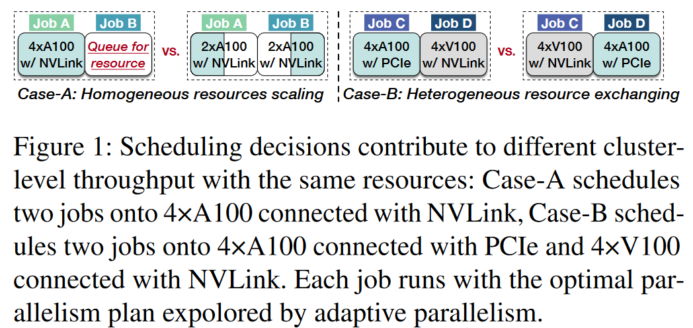

# A Codesign of Scheduling and Parallelization for Large Model Training in Heterogeneous Clusters

## Concept

__(1)自适应并行__ : 通过结合 DP, PP, TP, 自动搜索训练作业在分配资源上的最佳并行策略。通过穷举搜索，自适应并行始终可以充分利用分配的资源。

\
图 2 显示了自适应并行的示例。它通过在相应的资源上运行来枚举所有并行策略以获得实际性能。然后选择其中性能最好的一个作为最终的并行计划，以有效地训练大模型。通过以上过程，自适应并行以硬件资源和调优时间为代价提高了作业的训练效率（在 SOTA 进行一次搜索需要 40 分钟 [8]）。

__(2)Cluster-Friendly Workflow__:每个调度选择首先分配资源，然后确定流水级，最后将每个流水级独立地划分为 DP 和 TP 的组合。虽然在分配资源之前确定并行性似乎也是可行的，但它可能会导致训练吞吐量次优。这是因为所使用的并行性的资源需求与集群的最佳调度决策分配的资源之间可能不匹配。

## Motivation

然而，当前的集群调度器在将异构资源分配给训练作业时没有考虑自适应并行。__如果我们能够共同考虑调度选择和自适应并行性，我们就会找到提高整个训练集群效率的新机会__。

\
如图 1 所示，调度程序通过在作业之间 scaling（case A）和/或 exchange（case B）资源并以自适应并行运行它们来实现更高的集群吞吐量。效率的提高还意味着有可能为个人用户实现更好的调度决策，即更短的排队时间或JCT。

\
图 3(a) 显示了不同调度方案影响集群吞吐量。
图 3(b) 展示了异构资源和并行策略对于集群吞吐量的影响。

当前集群调度的工作主要基于大量性能 profiling 来提高调度效率。它们无法与自适应并行集成以有效利用上述机会，因为在对所有可能的资源进行 profiling，自动搜索会带来巨大的开销。具体来说，__新的调度空间是原始调度空间与自适应并行的并行性探索空间的乘积。指数级扩大的调度空间导致传统profiling开销大__。同时，如果模型在具有自适应并行的特定资源上运行时能够准确估计模型的性能，我们还可以实现高效的调度。然而，__当前的工作仅关注数据并行__。

图 4 中的实验结果表明，通过自适应并行获得的模型最优并行策略是不断变化的，并且作业性能变化差异很大。在这种情况下，这些工作中采用的简单 scaling 无法获得准确的估计结果。而且确定一个直接预测最优并行配置的总方法是很难的。

__低开销和准确的性能估计之间的矛盾阻碍了具有自适应并行性的高效调度__。

## Crius

__核心抽象 Cell__:__Cell__。考虑到 Cluster-Friendly Workflow ，Crius 提供了适当粒度的 Cell 来对调度空间进行分片。如图 6 所示，自适应并行扩大的调度空间被分片为Cell。__每个 Cell 代表一个具有确定的资源分配和流水级的作业__。

\
通过 Cells，集群调度器可以通过寻找合适的 Cells 来调度训练作业。调度 Cell 后，可以使用自适应并行进一步探索其内部并行。这样，不仅Cell可以缩小搜索空间来实现准确、低开销的性能数据采集，而且Crius可以利用这些性能数据进行高效的调度。而且，Crius 仍然遵循 cluster-friendly 工作流程。

\
图 5 展示了 Crius 的 overview。目前，它要求模型开发人员指定提交的训练作业所需的初始 GPU 数量。基于给定GPU数量和集群状态，Crius 为每个排队作业生成多个 Cell 作为集群的调度候选者（§6）。每个 Cell 流水级由指定的资源和作业的模型结构共同确定（第 6.1 节）。对于每个 Cell，Crius 的 agile estimator 提供准确的性能估算。该估计器采用计算通信解耦方法，带来较低的时间和硬件开销（§5.1）。根据估计结果，Crius 针对不同的调度目标对 Cell 进行整体调度（§6）。此外，为了支持自适应并行和作业重新调度的联合使用，并且开销小到忽略不计，Crius 提出了一种 Cell-limited 并行调优器来剪枝搜索空间。

__Cell流水级的确定__。由于 PP 已从并行探索中剥离出来，Crius 需要在集群调度程序级别确定 Cell 的流水级。为了实现流水线的高效率，__Crius 通过遵守公认的原则来划分模型，即保持每个阶段的计算延迟相似并最大限度地减少阶段之间的通信__。一般来说，Crius 根据浮点运算 (FLOP) 将分配的 GPU 映射到模型的各个operators，然后将它们聚集到具有最小化通信的流水级。

\
图 7 展示了 Crius 流水级划分的示例。假设分区模型有 6 个 operators，分配了 8 个 GPU，我们首先根据每个operators 的 FLOP 与整个模型的比率，将 8 个 GPU 映射到每个 operator。例如，由于 OP1 占整个模型的 1/16 FLOP，而 OP2 占 3/16，因此 OP1 获得 0.5 个 GPU，OP2 获得 1.5 个 GPU。同时，每个 operator 的执行时间理论上可以计算为 $T_{elapsed} = FLOPs / Number_{GPU}$ 。这意味着在上述资源分配方案下，所有 operators 的执行时间是相同的。这样，即使每个 operator 都是一个独立的流水级，理论上 operators 也可以构建一个 full-state 流水线。

通过上述映射，Crius可以将 operators 聚集到各个流水级，同时保证所有流水级执行时间的相似性。图 7 显示了一个示例，operator clustering 选择最小的 3 个 inter-operator 通信作为聚类边界，将整个模型分为 4 个流水级。流水级确定完成后，算子映射的 GPU 会累积为该流水级分配的 GPU。请注意，每个阶段累积的 GPU 数量近似于 2 的幂。这是训练集群中常见的 GPU 拓扑。

__如何快速profiling 一个 cell 的性能__？

\
图 8 说明了使用最佳并行计划训练大模型的示例。大模型由 4 个流水级组成，运行在总共 8 个 GPU 上，如图所示。DP 或 TP 将每个流水级进一步划分到 2 个 GPU 上，以充分利用 GPU 的计算能力。 send/recv 和 all_gather 等通信操作连接各个流水级以形成整个训练流水线。

Crius 将端到端性能估计解耦为两部分：计算部分和通信部分。离线时，Crius可以离线获取通信操作的分布式相关性能数据。在运行时，Crius 仅分析计算操作。在这种情况下，我们可以通过积累计算和通信操作的 profiling 数据来减少性能数据获取的开销。

由于解耦，Crius开发了一种快速的 Cell 估计方法。尽管Cell的流水级已经确定，但其并行搜索空间中仍有许多选择。因此，Crius 以 grid-based 的方法对 Cell 的搜索空间进行采样，并使用采样中最好的作为 Cell 的估计。

Crius 使用并行组装对 Cell 的搜索空间进行采样，如图 9 所示。

\
假设Crius 使用仅 TP 和仅 DP 预先了解每个流水级计算的性能数据，并且能够预测相关通信操作的性能，Crius 通过以下方式组装新的并行计划。它结合了每个流水级的两个已知并行计划，并注入通信操作来组装 =$2^{N_S}$ 不同的并行计划。采样过程是明确网格化的，并且可以以两次 profiling 为代价来进行。

__单设备分布式分析__。为了估计采样的并行计划，Crius 进一步提出了单设备分布式分析，以获取指定并行计划和资源下作业的性能。分析也基于解耦观察。我们在图 10 中展示了单设备分布式分析的工作流程。

\
在分析指定的并行计划（仅 DP 或仅 TP）时，Crius 从训练流水线中提取计算和通信操作。然后，Crius 对计算操作执行分布式等效编译并对其进行 profiling。这完全是在单个 GPU 上完成的。但对于通信操作来说，Crius 通过基于流量的插值来估计它们。用于插值的数据是离线获得的。

基于上述方法，Crius可以获得所有组装的并行计划的端到端延迟。其中最好的作为 Cell 的估计。虽然该方法不能直接预测最优计划，但基于网格的采样覆盖了整个探索空间。表现最佳的抽样计划足以实现高效调度。

## Experiment

### 5.2 Cell-guided Parallelism Tuning

当选择一个Cell作为最佳调度选择时，相应的作业需要一个并行计划来最好地利用分配的资源。尽管快速估计足以实现高效调度，但使用估计选择的并行计划可能无法提供最佳性能。这就需要 Crius 探索Cell定义的空间来寻找最优的并行计划。不幸的是，之前的工作中的并行性探索需要枚举并行性计划，这会产生很高的开销。因此，Crius需要设计一种快速的并行调优方法。

在Crius中，我们利用Cell的估计结果来指导和加速Cell内部的调整。我们注意到，Cell 用于估计的并行计划正在接近最优计划。因此，Crius 根据估计来修剪探索空间。

图 11 显示了空间剪枝的示例。在估计计划中选择的每个阶段的并行度被视为该阶段的并行度偏好。 Crius将单个阶段的完整探索空间分为两部分：（仅限数据并行到半混合并行）和（半混合并行到仅张量并行）。如果选择数据并行度作为某个阶段的首选并行度，则该阶段将仅在（数据并行度至半并行度）范围内进行调整，另一半将被修剪。这同样适用于张量并行性。

## 6 Cluster Scheduling Scheme with Cells

本节我们介绍Crius如何基于Cell的估计来高效调度大模型。

__Crius 中的调度__。在讨论调度细节之前，我们想强调一下 Crius 关键设计的目标。 Crius 旨在通过自适应并行为高效调度提供准确的性能数据。因此，__Crius 目前采用一种简单的启发式算法来贪心地调度具有资源扩展性的大模型训练作业__。虽然 Crius 的目标是在本节中最大化集群吞吐量，但 Crius 很容易适应其他调度目标，比如截止时间感知等。

### 6.1 Scheduling Policy

\
__策略__。算法1显示了Crius调度的伪代码。基本上，当新作业到达（第 2-8 行）或作业完成（第 9-13 行）时，就会触发该算法。当新作业到达时，算法初始化 Cells（第 4 行）并根据 Cells 进行调度（第 6 行）。特别的，调度算法（第 14-20 行）探讨了资源扩展的潜在调度选择。通过对 Cell 的性能估计，算法选择最佳选择（例如最大集群吞吐量）并重新调度所有作业。如果找不到可行的调度选择，则作业处于待处理状态。当正在运行的作业完成时，算法首先尝试恢复挂起的作业。如果没有挂起的作业，算法会触发额外的调度，将释放的资源分配给正在运行的作业（第 11 行）。请注意，在每个基于 Cell 的调度中，最佳计划实际上应用于正在运行的作业。真正的作业调度只发生在最后（第 8 行和第 13 行）。

__初始化Cells__。对于即将到来的新任务，Crius 需要为其初始化 Cells。 Crius 现在要求用户为提交的作业指定初始 GPU 数量 $N_G$ 。根据 GPU 数量，Crius 选择 3 个可用值 $（N_G/2、N_G、2N_G）$ 来生成 Cell。至于流水级数，Crius 允许 $\log N_G$ 选择范围为 1 到 $N_G$。由于 Crius 需要单个设备来分析每种 GPU 上的作业，因此异构 GPU 上的分析是并行完成的。因此，为新作业生成 Cell 的总时间复杂度为 $O(3 * \log N_G)$。我们在第 8.2 节中评估了总体 profiling 开销。

__扩大训练任务__。在调度新作业时，Crius 探索了资源扩展的调度选择。此探索尝试扩展正在运行的作业和新加入的作业的 GPU 类型和数量。当集群资源不足时，Crius会选择作业缩减其使用的GPU数量或将其移动到资源充足的另一种类型的GPU。当存在空闲资源时，Crius 执行反向扩展。扩展原则是在集群资源约束下搜索所有的调度选择。具体来说，一次调度选择中所有Cell的资源总和不应超过集群资源限制。为了避免调度开销，Crius 使用了一个称为搜索深度的超参数，它是算法 1 第 18 行中生成调度选择的最大作业扩展时间。我们在第 8.7 节中评估了搜索深度在开销和调度效率方面的影响。

## 7 Implementation
我们使用 10,900 LoC 的 Python 实现 Crius：5,400 行用于调度程序，5,100 行用于 Cell 的敏捷估计器，400 行用于 Cell 引导的并行调优器，而 Crius 模拟器仅 400 行。具体来说，我们使用 gRPC 在调度程序和分布式工作人员之间进行通信。在运行时，Crius 以 5 分钟的间隔调度作业，并每 20 秒检查一次训练作业的运行状态。

我们基于 Alpa [8] 实现了 Crius 的并行调优器。在这种情况下，Crius 的估计器是基于 Jax [34] 和 XLA [35] 构建的，这也是 Alpa 的后端。 Crius 在单个设备上模拟分布式训练，以获得所有管道阶段的分布式等效编译。此外，估计器有一个大约 500 LoC 的 C++ 后端，使 Crius 能够利用 Nvidia CUPTI [36] 捕获计算运算符的延迟。基于这些技术，Crius 的估计器以较低的开销获得了计算算子的准确延迟。对于通信运营商来说，离线分析是基于 XLA [35]、NCCL [37] 和 Ray [38] 对所有使用的 GPU 实现的。

## 8 Evaluation
在本节中，我们评估 Crius 在异构物理集群和具有三个生产轨迹的模拟大型集群上的有效性。

### 8.1 Experimental Setup
物理试验台。我们在由 32 台服务器和 64 个 GPU 组成的异构集群上评估 Crius。具体来说，16台服务器配备了Intel Xeon Gold 5318Y CPU（256 GB内存）和2个Nvidia A40 GPU（48 GB内存）。其他 16 台服务器配备相同的 CPU，但配备 2 个 Nvidia A10 GPU（24 GB 内存）。具有 A40 GPU 的服务器使用 Nvidia Mellanox Infiniband ConnectX-5 [39] 互连，而 A10 GPU 服务器使用 Nvidia Mellanox Infiniband ConnectX-6 [40] 互连。

具有较高异质性的模拟集群。模拟集群拥有 1,280 个 GPU，分为四种类型：A100、A40、Ampere 架构的 A10 和 Volta 架构的 V100。详细规格如表1所示。

工作负载。我们使用表 2 中的三个大型模型作为工作负载。所选模型与最先进的工作相同[8]。我们使用 13,000 多个职位的两周追踪记录从生产费城追踪。此外，我们还使用Helios Venus追踪[47]和阿里巴巴PAI追踪[48]来评估Crius。虽然每个作业记录由作业 ID、提交时间和持续时间组成，但我们随机生成 GPU 数量和 GPU 类型，以使跟踪适应异构场景。 Philly 跟踪中的迭代次数是通过按全局批量大小进行缩放来计算的。在另外两个跟踪中，我们根据跟踪工作负载随机生成迭代量。

基线。我们将 Crius 与四个基线进行比较：

先来先服务（FCFS）：FCFS 广泛应用于集群调度程序（例如 Kubernetes [49]、Yarn [50]）。 

Gandiva：Gandiva [15] 利用特定领域的知识基于运行时分析来内省地完善调度决策。虽然它可以调整 GPU 配额和拓扑，但它忽略了 GPU 异构性。 

Gavel：Gavel [20] 是一种异构感知调度器，设计用于各种调度策略，包括吞吐量最大化。虽然考虑了GPU异构性，但不支持GPU数量的缩放。 

ElasticFlow：ElasticFlow [19] 是一种自适应感知调度程序，可以在同构集群中弹性扩展分布式深度学习作业。它提供了截止日期感知策略和面向吞吐量的策略。

需要指出的是，Crius 是第一个支持资源扩展和自适应并行联合使用的作品。为了公平比较，我们在基线的作业训练过程中启用 Alpa 的自适应并行性，但只允许它们使用数据并行性分析的数据来安排作业。