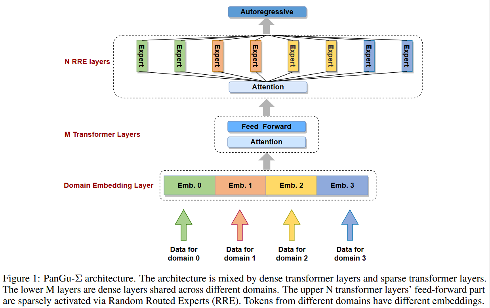
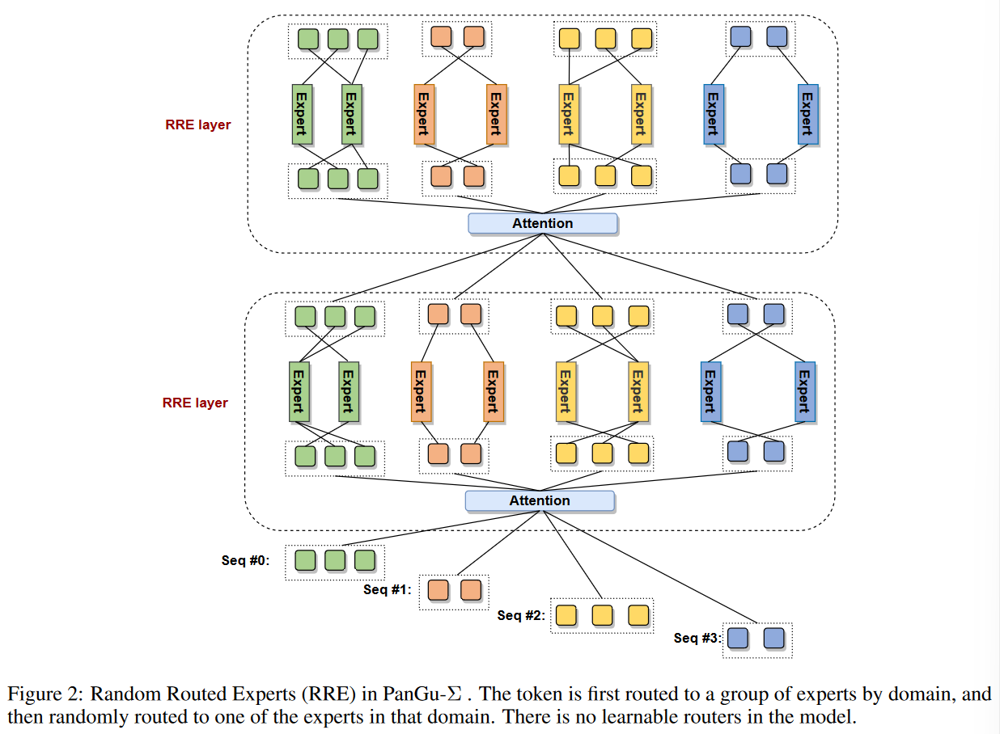
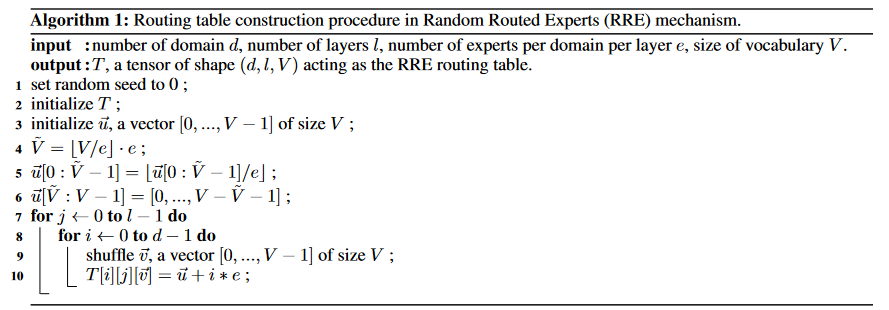
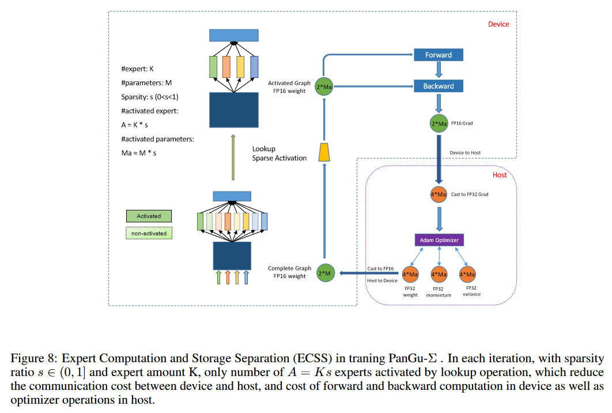
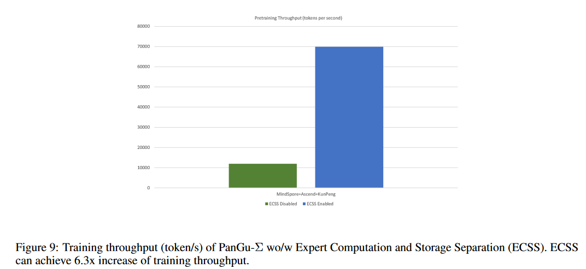

# PANGU-Σ: TOWARDS TRILLION PARAMETER LANGUAGE MODEL WITH SPARSE HETEROGENEOUS COMPUTING

## Abstract
大语言模型的扩展极大地提高了自然语言的理解、生成和推理。在这项工作中，我们开发了一个系统，在 Ascend 910 AI 处理器和 MindSpore 框架集群上训练万亿参数语言模型，并呈现具有 1.085T 参数的语言模型，名为 PanGu-Σ。利用 PanGu-α 固有的参数，我们将密集 Transformer 模型扩展到具有随机路由专家 (Random Route Experts) 的稀疏模型，并通过使用专家计算（Expert Computation）和存储分离 (Expert Computaion and Storage Separation) 有效地训练超过 329B tokens的模型。通过异构计算，训练吞吐量提高了 6.3 倍。

## 1 Introduction

最近关于语言模型 scaling law 的研究证明了用足够数量的训练数据和相应的计算预算来训练 LLM 以实现最佳性能的必要性。因此，这项工作的主要动机之一是设计一个可扩展的模型架构和一个高效的分布式训练系统，可以以高训练吞吐量消耗数据。

• 模型 scaling 。LLM的模型性能预计会随着模型规模的增大而提高。与训练密集 Transformer 模型的昂贵计算成本相比，Mixtureof-Experts (MoE) 等稀疏架构被认为是扩大模型大小而不导致计算成本线性增加的有吸引力的选择。然而，MoE模型存在工作负载不均衡和端到端通信延迟等问题。此外，如何用 MoE 扩展现有的密集模型以及在每一层分配多少专家仍然没解决。因此，设计具有高性能和训练效率的万亿参数稀疏模型是一项重大且具有挑战性的任务。

• 系统 scaling 。已经提出了 DeepSpeed 等框架来支持训练万亿参数模型。在实践中，主要障碍通常在于有限的计算预算，或更具体地说是可以使用的加速设备（例如 GPU、NPU、TPU）的数量。通过利用 TP、PP、Zero 和Rematrialization等技术，可以在数千个加速设备上训练具有可行批量大小的万亿参数模型。或者，从业者可以通过利用异构计算技术来减少计算资源量，例如将一些计算卸载到主机设备。然而，由于主机和设备之间的带宽较慢以及CPU的计算能力较弱的加速设备，当前的技术不可避免地阻碍了训练吞吐量，这阻碍了向大型语言模型提供合理数量的数据并实现最佳性能。因此，如何在有限的计算预算下有效地扩展系统性能对于大语言模型的性能至关重要。

在这项工作中，我们提出了 PanGu-Σ ，这是一种具有稀疏架构的大语言模型，包含 1.085 万亿个参数。我们在 MindSpore 的框架下开发了 PanGu-Σ 模型，并在只有 512 个 Ascend 910 AI 加速器、3290 亿 tokens 的集群上训练了 100 天。 PanGu-Σ 固有参数来自具有 Transformer 解码器架构的 PanGu-α ，并通过随机路由专家 (RRE) 进行扩展。与传统的MoE不同，RRE采用两级路由。在第一级，专家按领域或任务分组，在第二级，token 被随机且统一地映射到每组中的专家，而不像 MoE 那样使​​用任何可学习的 gating 函数。通过 RRE 的设计，人们可以轻松地从 PanGu-Σ 中提取子模型，用于各种下游应用，例如对话、翻译、代码生成或一般自然语言理解。为了使训练系统高效且可扩展，我们提出了专家计算和存储分离（ECSS）机制，该机制在 512 个 Ascend 910 加速器集群上训练 1.085 万亿个 PanGu-Σ 时实现了69905 tokens/s 的吞吐量，并减少了主机到设备设备到主机通信时间以及优化器大幅更新计算。总体而言，与相同超参数但采用 MoE 架构的模型相比，训练吞吐量提高了 6.3 倍。

## 2 Model

### 2.1 Design Principles
PanGu-Σ旨在实现以下目标:
    • 性能：跨多个领域和任务的最先进的 NLP 性能。
    • 效率：在适度的集群上训练万亿参数模型，使其具有最大的系统性能。
    • 可用性：可扩展到各种领域或任务，无需从头开始重新训练模型。
    • 部署：可在各种实际环境中轻松定制和部署。

同时实现上述所有目标非常具有挑战性。考虑到第一个目标，能够跨领域泛化和表现良好的语言模型应该具有大量参数，并根据scaling law 对大量数据进行训练。然而，训练如此大的模型也意味着必须使用高端集群，这在某种程度上与第二个目标相矛盾。并且模型规模越大，也导致部署训练好的模型的成本增加，这与第四个目标有关。

考虑到训练阶段产生的高计算成本，我们希望结果模型在许多实际应用中实用且高效。考虑到这一目标，我们建议在多个领域训练模型，并使其在持续学习范式中进一步扩展到任意数量的领域，具体取决于计算资源。

在训练阶段，万亿参数 PanGu-Σ 模型会输入来自多个领域的数据。然而，在部署阶段，通常没有必要甚至不可能为每个应用程序托管万亿个参数模型。因此，允许基于各种训练和部署设置对其参数进行分组和分离的模型具有显着的优势。

### 2.2 PanGu-Σ Architecture

2.2.1 Overview

PanGu-Σ 采用自回归语言模型，具有堆叠式 Transformer 解码器层和顶部的查询层。 PanGu-Σ 架构提供了灵活的设计。底部 M 层在所有域之间全局共享，顶部 N 层（包括查询层）根据输入数据的领域被稀疏地激活。在每个 RRE 层中，G组中总共有K个专家，每个组中的专家数量可以不同。这种灵活的设计提供了三种模式。
    • 混合模式：当 M > 0、N > 0 和 K > 0 时，模型同时包含稀疏 RRE 层和密集层。
    • 稠密模式：当 N = 0 或 K = 1 时，架构将简化为密集PanGu-α 模型。
    • 稀疏模式：当 M = 0 且K > 1 时，架构将是稀疏模型。

在这个万亿参数建模实践中，我们使用混合模式，将共享参数放置在靠近输入层（底部）的位置，将所有稀疏激活的专家参数放置在靠近输出层（顶部）的位置。在模型设计阶段，我们在较小规模的模型上对各种专家放置策略进行了基准测试，所选策略获得了最低的语言建模困惑度。我们的假设是底层倾向于学习一般知识，而具体知识处于更高的抽象层次，更适合顶层学习。在token embedding 层中，我们选择针对不同的域使用不同的 embedding 矩阵。

2.2.2 Random Routed Experts

在顶部 N 层中，我们将每 FFN 替换为多个有条件激活的FFN（专家），遵循专家混合（MoE）范式。

设计 MoE 架构的一个关键问题是如何将 token 路由给专家。对于 PanGu-Σ ，我们提出了一种随机路由专家（RRE）机制，该机制受到[29]中提出的哈希层的启发。具体来说，RRE通过ID以两级方式路由token。在第一级中，token按领域映射到一组候选专家，然后在第二级中，根据token-专家路由映射选择该组中的一个专家来处理token。路由映射是随机初始化的，每层都有一个独立初始化的映射以平衡计算。

与常用的可学习路由器相比，RRE 有几个优点。

• 在训练期间，PanGu-Σ 允许添加、修改或删除特定领域的专家，而不会对其他专家产生任何影响。这一属性使得 PanGu-Σ 具有高度灵活性，可以缓解常见的灾难性遗忘问题，这对于终身或持续学习至关重要。
• 在大多数实际部署环境中，部署万亿参数模型是不必要或不切实际的。 PanGu-Σ允许根据实际需求提取特定领域的子模型并仅部署该子模型。子模型可能包含数百亿个参数，但仍然保留原始模型对目标域的预测能力。使用这种提取和部署操作，我们可以轻松地为多个工业应用程序部署模型。
• 所有传统的 MoE 模型都依赖于所有对所有的集合通信操作来在保存在不同设备上的专家之间移动数据。通过我们提出的两级路由，来自不同领域的专家不会交换token，并且all-to-all通信都被限制在每个域内。因此，昂贵的全局 all-to-all 操作被减少为分组 all-to-all，节省了大量通信量并减少了端到端的训练延迟。
• 可学习的路由器需要更多的计算，并且可能会遇到专家之间负载不均衡的问题，这通常会使训练过程不太稳定。 RRE 避免了上述所有缺陷，因为没有引入额外的参数，并且随机初始化的路由表有助于平衡专家的负载。

RRE 需要一个在预训练之前初始化的路由映射，算法 1 描述了我们如何构建路由表。

## 4 System
PanGu-Σ 使用 MindSpore 1.6 框架实现，并在 512 个 Ascend 910 加速器（也称为 Ascend 910 NPU）上进行训练。

训练一万亿个参数的语言模型带来了多重挑战。首先，训练时需要大量的内存。虽然稀疏架构可以有效节省计算量，但它并没有减少内存消耗，我们仍然需要将所有参数和优化状态存储在加速器内存中。假设使用带有混合精度训练 [40] 的 Adam 优化器 [39]，1T 模型通常仅用于参数、梯度和优化器状态总共消耗 16TB 内存。在训练期间，模型需要额外的内存来存储输入数据、激活、通信缓冲区和临时变量。我们估计，训练一个具有 1 万亿个参数和合理批量大小的 PanGu-Σ 模型需要超过 32TB 内存，并且需要超过 1,000 个 Ascend 910 加速器或具有 32GB 高带宽内存 (HBM) 的 NVIDIA V100 GPU。

我们的目标不是投入大量硬件资源来扩展模型，而是使用由 512 个 Ascend 加速器组成的合理规模的集群来训练 PanGu-Σ。为此，我们采用异构训练并将优化器状态卸载到CPU。启用异构训练后，所有优化器状态都从加速器转移到具有 750GB 主机内存和 KunPeng 920 CPU 的主机上，我们可以将整个训练过程放入集群中。

其次，启用普通优化器卸载后，系统吞吐量是不可接受的。根本原因还是参数数量过多。梯度和更新的参数需要通过缓慢的主机到设备和设备到主机通信进行交换，CPU 需要迭代所有参数并更新它们。为了提高训练吞吐量，我们利用 PanGu-Σ 架构的稀疏特性。由于PanGu-Σ采用稀疏架构，并且大部分参数都是有条件激活的，优化器只需要在一次迭代中更新部分专家。因此，我们提出了专家计算和存储分离（ECSS）方法，如图8所示。

在专家计算与存储分离中，我们将专家视为知识数据库，用于存储不同任务或领域的特定知识。在每次迭代中，专家都被具有特定域的不同令牌 ID 稀疏地激活。在MindSpore中，我们使用查找算子来选择部分激活的专家，并在反向计算中稀疏地更新它们的参数。在优化器 CPU-offload 计算中，MindSpore将FP16参数从主机CPU复制到 NPU，在 NPU 上计算梯度，将FP16梯度从 NPU 移动到CPU，并在主机CPU中计算优化器状态并更新参数。当专家稀疏率较低（例如 0.1）时，计算成本仅接近完整模型的 10%。

除了使用 Ascend-KunPeng 稀疏异构计算的 ECSS 之外，我们还采用了 MindSpore 和 CANN 提供的其他并行训练和加速技术。我们对所有注意力层和 FFN 层使用8路模型并行，64路无副本专家并行以及针对非专家部分的 64 路数据并行。为了进一步优化内存占用，还采用了重计算[26]和优化器并行[25]来减少峰值内存消耗。我们还使用 FastGelu 和融合 LayerNorm 来加速 point-wise 计算。通过将所有技术结合在一起，与普通的 PanGu-Σ 异构训练相比，我们实现了 6.3 倍的吞吐量提升，如图 9 所示。

## 5 Experiments
### 5.1 Pretraining

5.1.1 Model Configuration
我们使用以下 PanGu-Σ 配置来完成这项工作。配置大多沿用13B版盘古-α型号。这样我们就可以有效继承PanGu-α已经学到的知识。

5.1.2 Pretraining settings
我们使用64个节点的集群，每个节点配备8个Ascend 910加速器和MindSpore框架。高性能集体通信库 华为集体通信库（HCCL）用于促进分布式训练的高速高带宽通信。

PanGu-Σ预训练过程分为两个阶段。在第一阶段，我们激活四个主要领域的专家来消费来自双语、中文、英语和代码等四个主要领域的数据。第二阶段，我们让所有专家消费所有领域的数据。

图 11 显示了如何将 640 名专家分配到 40 个域组。我们训练 PanGu-Σ，每个样本的全局批量大小为 512，序列长度为 1024。预训练持续约100天。图10展示了PanGu-Σ预训练的损失曲线。

启用混合精度训练可以加快训练过程。除了词汇嵌入层、损失函数、Softmax 操作、LayerNorm 层和 Adam 优化器外，所有其他操作均采用 FP16 格式。

故障恢复对于长期大规模分布式训练非常重要，尤其是像 PanGu-Σ 这样的大型模型。因此，保存检查点并从先前的检查点重新启动的严格过程是必不可少的。对于万亿参数模型，存储单次迭代的所有参数和优化器状态的一组检查点的大小已经达到令人瞠目结舌的 10TB。将如此大小的检查点上传到我们的长期对象存储是一项具有挑战性的任务，因为同时上传所有检查点会很快使网络带宽饱和，并不可避免地导致训练失败。为了解决这个问题，我们以循环方式启动上传进程，并限制同时运行的进程数量。事实证明，这个解决方案对于我们的整个训练过程来说是有效且稳定的。