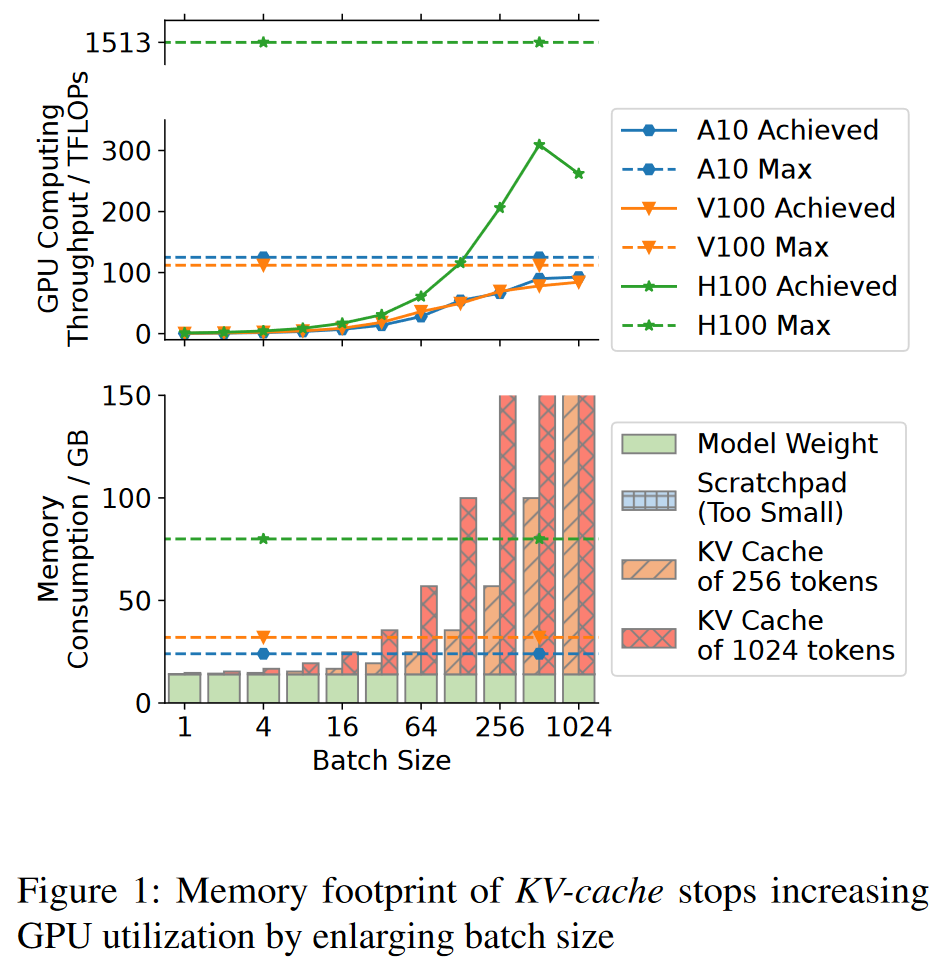
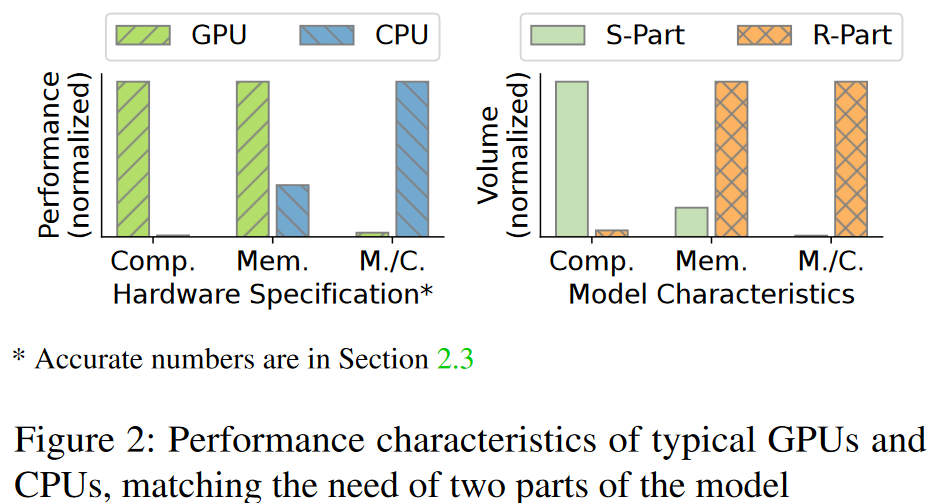
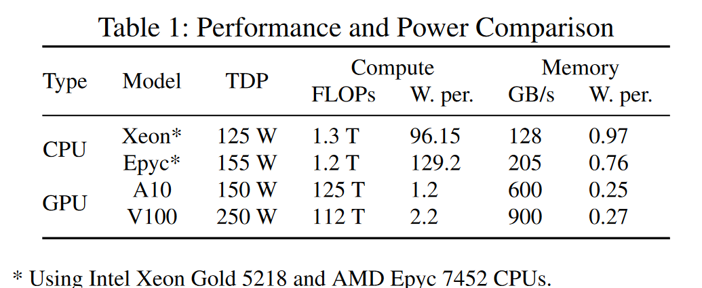

# FASTDECODE: High-Throughput GPU-Efficient LLM Serving using Heterogeneous Pipelines

## Abstract
LLM 的成本很高，但昂贵且稀缺的 GPU 在顺序生成 token 时效率很低，除非扩大序列 batch。然而，batch-size 受到一些不断重用的中间结果（即 KV-Cache）的限制。它们占用太多内存，无法同时将更多序列放入 GPU 中。虽然它们可以 offload 到主机内存，但 CPU-GPU 带宽是不可避免的瓶颈。

我们找到了一种方法将 transformer 模型分解为具有不同特征的两个部分，其中一个部分包括内存绑定的 KV-Cache 访问(memory-bound KV-Cache accessing)。我们的关键观察是，跨多个节点的 CPU 的聚合内存容量、带宽和计算能力是处理这部分的有效选择。性能改进来自于数据传输开销的减少和处理模型另一部分的 GPU 吞吐量的提高。此外，我们使用调度和性能建模技术解决时间和设备间范围内的异构性带来的效率挑战。评估结果表明，当使用相同的 GPU 服务现代 LLM 时，我们的系统实现了 vLLM 吞吐量的 1.88 × −5.04 ×。

## 1 Introduction
大型语言模型（LLM）正在受到高度关注。这些基于 Transformer 的模型在训练和评估时非常硬件友好[18, 20]，因为主要计算工作量是矩阵乘法，这是一种在加速器（例如 GPU）上运行的高度优化的操作。然而，在使用模型时，自回归过程（即解码）效率低下。由于序列中的 token 是逐一生成的，因此其中一个操作数矩阵实际上是一个向量。由于 GPU 利用率较低，将向量与矩阵相乘的吞吐量会低得多。

尽管使用任意数量的 GPU 总能提高吞吐量，但在大多数情况下，GPU 是最稀缺的资源之一。因此，出于多种原因，我们应该提高单个 GPU 的利用率，包括经济性和环保性。

扩大batch size，即同时为多个请求生成token，是在不改变模型的情况下最可行的方法。与之前的神经网络不同，LLM 有更大的机会批量生成，因为 LLM 通常在线为许多用户提供服务。生成 token 的延迟要求比神经网络模型的其他用户案例（例如自动驾驶中的对象检测）宽松得多。跟上用户的阅读速度是文本生成最严格的延迟要求。

然而，生成新 token 依赖于生成先前 token 的巨大中间结果，即KV-cache。处理批量请求会导致更大的内存占用，远远超出 GPU 内存的容量。

图 1 显示了在常见 7b 模型和几种不同 GPU 上运行的困境。增加批量大小可以显着更好地利用 GPU，但 KV cache的内存占用量比 GPU 内存大得多。更糟糕的是，随着生成更多 token 并且序列变得更长，KV-cache 会变得更大。

主机内存自然成为卸载 KV-cache的地方 [14]，因为它比 GPU 内存更大且更便宜。然而，KV-cache 并不是冷数据。完整的 KV-cache 加载到 GPU 内存中以生成每个 token。考虑到如图 1 所示的 KV cache 的巨大尺寸，在 GPU 和主机内存之间频繁传输它是offload 策略的瓶颈。本质上，PCIe的带宽始终远低于 GPU 甚至 CPU 的内存带宽。

我们研究了 GPU 和 CPU 的性能特征，包括计算吞吐量和内存带宽，如图 2 所示。我们发现，与计算能力的巨大差距相比，两种硬件在内存带宽上的差距要小得多。

幸运的是，我们找到了一种方法将 Transformer 模型分为两部分，即 R 部分和 S 部分。 KV-cache 包含在前者中。将受内存限制的部分完全移至主机端时，性能损失很小，因为内存带宽和计算吞吐量的比率可以满足其要求。因此，我们得出的关键结论是，__我们应该在 CPU 上的 KV-cache 附近进行计算。我们不通过任何设备间连接传输 KV cache 数据，而是传输激活张量，该张量比 KV cache 小几个数量级__。

我们的方法完全从 GPU 内存中删除了序列的中间数据，即 KV -cache。因此，batch-size 可以大大增加，并且GPU可以得到最佳利用。然而，这种异构方法要实现高吞吐量面临三个挑战。

挑战1：CPU繁忙但速度慢。它运行多个任务，包括batch gathering、tokenization 和协调 GPU。执行额外的计算会干扰这些任务，从而减慢所有任务的速度。更困难的是，CPU 的内存带宽低于 GPU。

挑战 2：随着生成的序列变长，两个部分之间的工作负载变化模式有所不同。在我们的解决方案中，CPU 和 GPU 轮流执行计算，并将结果相互传递。使用多batch请求的基本流水线来利用它们。然而，随着生成的序列变长，CPU 上的计算需要更长的时间，而 GPU 上的计算延迟则完全没有变化。这使得始终同时利用 CPU 和 GPU 变得很困难。

挑战 3：需要仔细编排以平衡两种类型硬件的性能。瓶颈可能是 GPU 或 CPU，因为它们是紧耦合的。考虑到异构硬件和 token 生成工作负载，我们需要平衡两者。我们寻求能够充分利用 GPU 计算能力的最低 CPU 要求，旨在最大限度地降低总体成本。

我们的系统 FASTDECODE 是一个用于 LLM 推理的 CPU-GPU 异构流水线，通过以下创新解决了挑战。

创新1：我们采用多个远程CPU来进行KV-cache和相关计算。系统的聚合内存容量和带宽得到扩展。分布式 CPU 可以实现足够的吞吐量以使 GPU 饱和，并且通信开销适中。

创新2：我们发明了序列级负载稳定计划，以最大限度地减少空闲并更好地利用两种类型的硬件。 CPU 上的工作负载与其维护的序列总长度成正比。为了保持延迟稳定，序列按照工作负载控制算法输入系统。短序列和长序列由 CPU 工作器同时处理，使序列的总长度保持稳定。因此，CPU 的整体延迟变化更加平缓，并且两种类型的硬件都得到了更好的利用。

创新三：我们采用模型引导的方法来编排GPU和CPU。它定量地描述了考虑到 LLM 推理任务的不同方面的性能瓶颈。聚合内存带宽被认为是选择 CPU 时的关键指标。对于给定的模型和 GPU 设置，根据微基准测试的分析结果，我们可以估计不同批量大小所需的最小聚合 CPU 内存带宽。

总体而言，单个 GPU 的吞吐量随着 batchsize 的显着增大而饱和。得益于跨节点 CPU 的可扩展性和聚合能力，可以通过经济实惠的 GPU 资源实现较高的总体 token 生成吞吐量。在我们的评估中，在同一 GPU 上实现了高达 5 倍的 vLLM 吞吐量，并且延迟可接受。

本文的贡献总结如下。 
• 我们找到了一种非常规的方法来分解自回归 transformer 模型，具有很大的性能改进潜力。 
• 我们提出了一种基于KV cache的近内存处理系统，该系统利用机外 CPU 的聚合内存带宽来实现更高的吞吐量。 
• 我们发明了序列级流水线调度，以平衡使用 LLM 生成 token 时随时间增长的工作负载和固定工作负载。 
• 我们创建了一个性能模型，可以使用我们的系统为不同的模型和要求提供最佳的硬件配置。

本文的结构如下。第 2 部分提供了LLM的背景信息以及为其提供服务的硬件选项。第 3 节展示了我们分解模型的方法，并说明了我们的关键见解：KV-cache 附近的处理可以提高整体吞吐量。第 4 节介绍了我们系统的设计，以及解决工作负载和硬件异构性带来的挑战的技术。第 5 节包含我们实施中的更多细节。第 6 节将我们的系统与其他系统的性能进行了比较，第 7 节显示了更多用于分析我们的性能的实验结果。第 8 节包括对更多相关工作的讨论，第 9 节总结了我们的工作。

## 2 Background and Motivation
#### 2.1 Transformer Model and KV-Cache
自回归模型基于 transformer 结构。这些模型的关键模块是注意力层。我们简要说明其过程如下。将序列中第 i 个 token 的特征向量表示为 $X_i$ 。
首先，$X_i$ 被映射到三个不同的线性空间，由三个全连接层实现。

对于第 i 个token，在其特征向量和其之前的所有标记的 $K_j$ 个特征向量之间应用内积。这实际上是注意力过程，它为当前 token 生成一个注意力向量。

注意力向量被归一化，通常使用softmax操作。然后，将其用作收集信息的权重，即将所有先前 token 的 $V_j$ 向量相加。

使用另一个全连接层对输出进行最终的线性变换。

Transformer 块由一个注意力层和一个 MLP 模块组成，其中包括多个全连接层和中间的非线性激活函数。按顺序连接数十个这样的 Transformer 块就形成了一个完整的 decode 模型。

当在现实世界的任务（包括聊天和文本生成）中使用此类模型时，token是一一生成的。为了获得下一个token，模型只需要处理最新的token，因为全连接层和 MLP 独立处理每个token。然而，等式 (2) 和等式（3）涉及最新 token 和所有先前 token 之间的反应。 $K_j$ 和 $V_j$ 可以保存在内存中并重新用于新生成的令牌，而不用重新计算它们。 KV-cache 指的是这些保存的中间张量。对于长度为S的序列，该技术将特征向量之间的内积计算总量从 $O(S^3)$ 减少到 $O(S^2)$ 。因此，在 LLM 推理中，使用 KV-cache 是必须的。

### 2.2 Accelerating Decoding

使用 LLM 来响应请求有两个步骤。首先，在预填充阶段，模型处理来自用户的整个输入序列，其中序列中的所有标记都可以在 MLP 层中作为 batch 进行处理。然后，在解码阶段，模型使用最后一个已知标记的特征向量来预测要附加到序列中的下一个标记。因此，生成序列的每个新 token 都会一一通过模型。

计算效率极其重要，因为它与 LLM 的服务成本直接相关。不幸的是，使用 GPU 生成单个 token 的效率很低，因为主要计算工作量是在解码阶段将全连接层应用于一个特征向量。换句话说，主要的计算任务是将矩阵与向量相乘（GeMV）。重用近处理器内存中的矩阵数据的机会很小，因此访问全局内存会限制工作负载。 GPU 上的众多浮点数单元未得到充分利用。

为了利用 GPU 的计算吞吐量，增大 batchsize 是最可行的方法。同时生成一批序列，因此同时处理多个令牌。特征向量堆叠在一起成为一个矩阵，GeMV 计算变成将权重矩阵与特征矩阵（GeMM）相乘。 GeMM 是 GPU 上高度优化的操作。只要batch size足够大，GPU的计算能力就可以得到充分发挥。

具体来说，对于基于自回归 transformer 的模型，Orca [30]指出可以降低批处理的粒度以提高性能。与将完整序列一起批处理相比，对单个标记的生成任务进行批处理更有效。该技术通过引入更多批处理机会，极大地提高了 LLM 的吞吐量。

不幸的是，除了未解决 KV-cache 的内存问题之外，Orca 中灵活的批处理机制还引入了严重的内存碎片。 vLLM [14] 采用分页注意力技术来解决内存问题。 KV-cache 的 GPU和主机内存是按页管理的，这样可以更好地利用GPU内存，而不会产生碎片。此外，主机内存可用于存储更多序列的 KV 缓存，因此增加了批处理 token 生成任务的机会。

vLLM 中的批处理机会仍然有限，因为在 GPU 和主机内存之间通过 PCIe 交换大型 KV-cache 会带来很高的开销。因此，vLLM必须降低交换频率。因此，随着序列变长，少数序列的 KV 缓存可以驻留在 GPU 内存中，从而导致 batchsize 变小。该系统在不太常见的情况下实现了高吞吐量，例如，生成具有共享前缀或宽波束搜索的令牌，其中多个独立的新 token 共享相同的 KV-cache。

FlexGen [24] 研究寻找模型权重和 KV 缓存的最佳 offload 顺序。尽管如此，KV 缓存仍然比模型权重大几个数量级。通过 PCIe 链路传输它们的速度比内存带宽慢得多，本质上效率很低。

综上所述，增加 batch-size 是提高吞吐量的最有效方法已成为共识。然而，由于 KV-cache 必须位于 GPU 内存中进行计算，因此很少有工作能够因其巨大的内存占用而实现实际加速。

不同的是，我们发现 KV-cache 不需要存在于 GPU 内存中。在本文中，我们展示了挑战和解决方案，这些解决方案释放了 CPU 的能力来处理 KV 缓存，并通过实现更大的 batchsize 来实现高token生成吞吐量。

### 2.3 Memory-bound Workload Fits CPU

虽然速度较慢但较大的主机内存用于弥补 GPU 内存容量的不足，但 CPU 几乎不用于执行计算。它们具有高达 TFLOP 的浮点计算吞吐量，与 GPU 上的专用张量处理单元实现的数百 TFLOP 相比，可以忽略不计。

但在内存访问带宽方面，CPU和GPU的差距更小。表1列出了几种常见的计算吞吐量和内存带宽。现代服务器级 CPU 可以达到数百 GB/s。中档 GPU 的内存带宽，例如NVIDIA A10 仅比 CPU 大几倍。双路 AMD Epyc 服务器可实现 68% 的内存带宽。即使是顶级 GPU 也只能勉强拥有超过 10 倍的带宽。另外，与不同级别GPU之间的巨大差距不同，每一代CPU从入门级到高端，内存带宽都保持相似。

考虑到成本，CPU 更具吸引力。作为每台计算机中都存在的通用处理器，它们的部署比 GPU 更广泛。以相对较低的成本获得大量CPU是很容易的。我们可以通过在服务器上添加标准 DIMM 来轻松扩大内存容量和带宽。相反，GPU内存不仅价格昂贵，而且由于内存是焊接在电路上的，因此很难扩展其容量。

表 1 包括作为效率指标的硬件功耗。 CPU 的最大功耗比 GPU 低几倍。此外，当内存访问是主要工作负载时，硬件通常不会消耗与TDP一样多的功耗。因此，实际的效率差距比我们的估计还要小。

总之，CPU 对于内存密集型作业来说是一个有吸引力的选择。

## 9 Conclusion
在本文中，我们提出了 FASTDECODE，这是一个使用负担得起的 GPU 资源通过 LLM 实现生成 token 的高吞吐量的系统。与完全使用 GPU 进行计算的典型解决方案不同，我们将模型分解为两部分，并将受内存限制的部分的存储和计算移动到分布式机箱外 CPU，利用它们的聚合计算能力。随时间变化的工作负载和硬件的异构性带来的性能挑战可以通过序列级负载稳定计划和性能模型来解决。最后，由于批量大小的大幅增加，GPU 得到了更好的利用，整体吞吐量也具有竞争力。