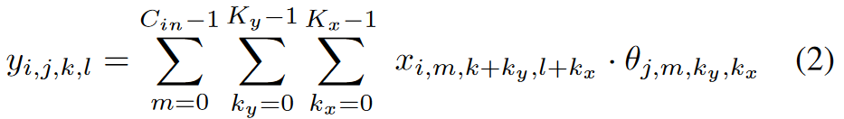

# PipePar: A Pipelined Hybrid Parallel Approach for Accelerating Distributed DNN Training

## Abstract
大规模 DNN 训练任务计算量极大且耗时，通常在高度并行的平台上执行。数据和模型并行是加快跨设备训练的常用方法。然而，由于服务器之间的通信开销和负载不平衡，它们往往无法达到最佳性能。最近出现的流水线解决方案结合了数据和模型并行的优点，缓解了上述问题。在本文中，我们在优化流水线执行方面又迈出了一步。我们引入了 PipePar，一种流水线并行 DNN 训练方法，它提供了layer-stacked DNN 的优化执行策略。 PipePar 考虑了流水线的整个张量划分空间，并探索了流水线中每个流水级的潜在混合并行配置。此外，我们注意到不同 GPU 服务器之间的网络异构性，传输具有不同带宽和延迟的张量是不可避免的。因此，考虑到不同GPU服务器的计算和通信能力，PipePar旨在寻找不同级别的弹性负载分配策略。我们使用 4 个 GPU 服务器上的一组真实 DNN 来评估 PipePar。我们的实验结果表明，PipePar 能够找到比最先进的混合并行化方法快 2.16 倍的有效策略。

## 1 Introduction
过去10年，深度神经网络（DNN）推动了学术界和工业界各个领域的革命。实践已经证明了这样的趋势：海量训练数据和更大的网络通常会在大量应用中产生更好的性能。当在这些复杂的模型上追求更高的准确性时，训练变得越来越困难。单机的计算和存储能力无法完全满足海量数据的大规模DNN的资源需求。分布式深度学习（DDL）是应对这些挑战的常见做法。 DDL 在多个服务器的分布式基础设施中执行 DNN 训练，每个服务器包含多个 GPU。这些服务器通过网络连接（可能是具有不同带宽的异构网络）。根据这些计算节点的逻辑拓扑，DDL 具有三种主要范式，即数据并行、模型并行甚至混合并行。

数据并行是许多流行的深度学习框架的默认选择。数据并行将输入拆分为指定的。通过在批量维度中分块来实现设备。每个设备在本地保存完整的 DNN 副本，并同步每个小批量的参数。模型并行是另一种简单的并行策略。它将层进行分组，并将模型的子模型放置到不同的设备上，并相应地进行前向和反向操作。然而，当参数规模较大时，数据并行不足。由于子模型依赖性，模型并行带来了有限的并行度，因此不一定能加速训练。

混合并行的典型代表是流水线并行DNN训练，它将模型并行与数据并行结合起来。模型被分为不相交的子模型，每个子模型都作为独立任务进行训练，也称为流水级。样本逐级传递，并且在流水线中同时执行多个任务（计算或传播任务）。为了增加批量大小并缩短收敛时间，同一流水级使用多个 GPU，这可以视为流水级级别数据并行。

流水线并行计算的主要挑战是如何将模型拆分为子模型，特别是在具有不同网络带宽的异构环境中。之前的工作提出了一些手动设计的并行化策略。模型的划分很复杂，通常需要专业领域知识的参与。我们的解决方案是让自动搜索算法来接管这项费力且令人不快的任务。据我们所知，之前的工作尚未完全探索流水级级别并行配置，目前主要关注数据并行。也就是说，DNN 中的不同层可能倾向于选择更合适的并行策略而不是数据并行。我们在 VGG 和 ResNet 系列上进行了测试，实验结果证实了我们的猜想：具有大量参数和激活的 DNN 在数据并行性方面表现不佳。

本文提出了 PipePar，一种旨在优化 DNN 训练的新颖方法。与模型并行类似，PipePar 将 DNN 拆分为子模型，允许具有大参数的层适合资源有限的服务器。为了消除纯模型并行的副作用，子模型被分配到不同的流水级，以便我们可以跨多个设备启动流水线。与之前在同一系统中使用数据并行的流水线并行方法不同，PipePar 探索了更全面的搜索空间，其中包含以前未知的潜在张量分区配置。此外，给定 DNN 和 GPU 集群，我们构建了一个成本模型，以处理 GPU 的负载不均衡以及重叠的通信和计算任务。

总而言之，我们的贡献如下：

我们提出了一种模型分区方法，用于在具有异构网络的 GPU 集群中流水化 DNN 训练。 DNN 模型被拆分为子模型，然后映射到在不同服务器上执行的 K 个阶段。

我们探索流水线每个流水级中潜在的并行配置。成本模型定量估计不同分区策略的执行时间，然后选择最好的一种进行分布式训练。

我们描述了一个用于流水线并行 DNN 训练的完整模拟器。我们的模拟器结合了模型profiling、模型分区、流水级优化和流水线执行模拟。

## 2 Introduction
关于优化分布式机器学习的执行有大量的工作。现有的方法中，数据并行是最简单的一种，在训练数据量很大时很容易实现。在某些情况下，模型的峰值 GPU 内存消耗太大，无法适应单个 GPU，此时模型分区是不可避免的。流水线通过前向和反向传播流动传输微批次，而不是一次顺序执行一批，从而提高了模型并行的性能。我们以 2 级流水线为例。首先，在流水线中，上述子模型在同一流水级进行训练。其次，大的小批量被分割成微批量。第一流水级处理完第一个微批次后，该流水级的激活立即传递到下一个流水级。同时，第二个微批次进入第一流水级，以便我们可以在纯模型并行中利用空闲时间。已经提出了几种支持流水线并行 DNN 训练的方案，例如 GPipe、PipeDream。

GPipe 和 PipeDream 类似，但细节有所不同。 GPipe 是一个实现高效且与任务无关的模型并行性的库，可以扩展到任何顺序网络。 GPipe 将网络划分为 K 个单元，并将第 k 个单元放置在第 k 个加速器上。相邻小区之间自动添加cell-to-cell 通信原语。一组 M 个微批次被送入流水线，在所有微批次到达第 K 个加速器后，GPipe 更新参数。也就是说，GPipe 需要每 M 个微批次刷新流水线，因为它维护单一版本的参数。 PipeDream 的流水线并行计算与 GPipe 具有类似的分区策略。但它使用多个版本的参数来避免刷新，其中前向传播和反向传播同时传递。流水线是可持续的，它尽可能地重叠计算和通信时间。尽管这些流水线并行策略比纯数据和模型并行实现了性能改进，但它们并不是最优的。

之前的大多数工作都在同构环境中评估其并行化策略。不幸的是，在现实世界的集群中，设备通常具有不同的架构，导致计算能力和网络带宽的差距。 [AccPar]、[HetPipe]提出了在异构加速器阵列之间分配训练任务的方案。 AccPar 描述了一种基于搜索的原理性算法来探索张量划分空间，其可扩展性通过分层划分来保证。灵活的计算比例用于在不同性能界限的加速器之间分配工作负载。HetPipe [15]通过将流水线模型并行与 virtual worker 形式的数据并行集成来利用独立的弱GPU。worker 性能各不相同，因此 VW 之间的参数同步遵循陈旧同步并行 (SSP) 模型。这些方法弥补了异构感知并行系统设计的空白。但他们都没有考虑并行策略的完整搜索空间，也没有考虑到异构、流水线和负载均衡，所有这些都是分布式机器学习的关键因素。 PipePar 将训练过程制定为成本最小化优化，并使用动态规划来探索可能的策略。

## 3 Parallel Training in PipePar

在本节中，我们首先描述问题建模方法，然后展示 PipePar 基于成本模型的分区算法设计。下一小节将深入了解 PipePar 的模拟器结构，并讨论模拟器的临时限制。

### A. Problem Modeling

DNN 通常包含一系列层，例如输入层、输出层和中间的多个隐藏层。根据任务类型的不同，不同的 DNN 会应用多种层。每层包含多个算子，其中大部分基于稠密矩阵运算。因此，每个算子所花费的时间是高度可预测的。在本文中，我们将并行策略的搜索问题描述为成本最小化问题。搜索过程由成本模型控制：

式(1)中，M是DNN模型，D是设备拓扑。成本 $T_{cm} + T_{cp}$ 是一次迭代中所用的总计算和通信时间。混合并行分区 (HPP) 和阶段分区 (SP) 是 PipePar 中的两个关键算法，我们将在稍后讨论。对于 HPP 给出的所有流水级并行化配置 c ，SP将搜索成本最低的可能的流水级划分策略。该成本由两部分组成，一是前向和反向传播时的计算时间和参数更新时间$T_{cp}$ ，二是通信开销 $T_{cm}$。然后我们将详细解释如何表示这两部分成本。

__计算成本__ 取决于浮点运算量和 GPU 的计算密度。以卷积为例，kernel size 为 $(K_x; K_y; c_o)$ ，输入张量 $T_{in}$ 的大小为 $(N; C_{in}; H; W)$ 。假设我们忽略卷积中的 padding 和 stride 参数，输出张量 $T_{out}$ 的大小 $Size_o = (N; C_{out}; H'; W')$ ，其中 $H' = H - K_y + 1，W' = W - K_x + 1$ ，并且卷积函数是：

从式（2）中，我们可以计算出乘法和加法运算的总数。若单 GPU 计算能力为 d ，则前向传播的浮点运算量为：$Size_o×(C_{in} × K_x × K_y + C_{in} × K_x × K_{y-1}​​)$ 。请注意，反向和更新时间可以用相同的方式计算：

其中 P 是每个输出元素的 operation 量。

__通信成本__ 由两部分组成：节点内通信和节点间通信。 GPU集群中的网络带宽在从1级到L级（本文中L=2）的不同级别上是异构的。如果第i层的带宽为 $b_i$ ，我们将第i层传输数据的通信成本定义为：

其中 $Size_{data}$ 定义为等待传输的张量的大小，它是张量中所有维度的乘积（例如卷积示例中的 $Size_o$ ）。

### B Partition Algorithm
我们的分区算法将 DNN 模型 M 和设备拓扑 D 作为输入，并计算：(a) 将层划分为阶段，(b) 每个阶段的阶段级混合并行化策略，以及 (c) 优化流水线以减少迭代的训练成本。分区算法在搜索空间的二维上进行搜索：算法 1 探索潜在的并行化配置作为预处理，算法 2 搜索最佳阶段分区策略。

算法1描述了混合并行分区的过程。首先我们计算成本最低的三种混合并行策略，如果使用暴力搜索，那么算法复杂度为 $O(3^N)$ 。注意，如果 (i, j) 的问题是最优的，那么 (i, k (k < j)) 的问题也一定是最优的，所以这里我们使用动态规划的方法将复杂度降低到 $O(N)$  。具体算法如算法 1 所示，对于 $all(i, end)$ ，首先从i, i+1 开始查找，保存三个并行策略的成本；然后对于 i,i+2 遍历3 × 3 = 9个组合，找到成本最低的，保存结果。继续循环直到结束。算法1中，流水级级别配置有三种形式，分别对应数据并行（标记为形式0，默认）、模型并行形式1和形式2。Figure 1 描述了3种形式的GPU数量为2时矩阵乘法的划分。第二种形式的结果分区执行逐元素加法，形式 1 复制参数，而形式 2 具有输入矩阵的两​​个副本。

从算法1中，我们得到了每两层之间混合并行成本最低的策略，现在我们需要计算流水线的划分结果。在算法2中，我们使用动态规划来降低复杂性。首先，我们使用任意两层（i, j）之间的 m 个设备计算分区策略。对于每个 k(i < k < j), n(1 nm)，我们在第 k 层和具有 n 个 GPU 的并行 (i; k) 层上分割模型，算法 1 中计算了最低并行成本。一直循环直到结束，就可以得到(i, j, m)的成本最低的划分策略，并将其保存为(time, k, n), time, k, n分别代表流水线时间、层分割、使用的 GPU 数量。该函数的复杂度为 $O(N^2 M^2)。然后，我们分析前面函数计算的结果。我们找到层（0, m）之间的最佳分割，对于剩余部分（k, m），我们继续与剩余设备进行分割，直到分割完成。对于多级设备，将其划分多次就足够了。

### C Simulator Design
PipePar 是一种帮助我们探索并行策略的整个搜索空间的方法。我们设计了一个等效的模拟器来评估使用 PipePar 生成的策略进行 DNN 训练的性能。在设计模拟器时，我们试图实现两个主要目标。首先，我们应该尽最大努力提高分布式深度学习系统的吞吐量。通常情况下，训练现代 DNN 通常需要几天或几周的时间，特别是当训练数据非常大时。因此导致优化模型参数效率低下。

如果您在云服务器实例上测试模型，这也会产生不可忽略的成本，包括时间和金钱。因此，缩短训练周期、扩大系统吞吐量具有重要意义，有助于更好地利用昂贵的GPU资源。其次，模拟器应该是通用的、用户友好的，只需对现有程序进行少量修改，并且适用于广泛的应用程序和框架，例如 PyTorch。

__Data Loading__。 PipePar 将 DNN 模型 M 和设备拓扑 D 作为输入。您也可以使用 PyTorch 创建自定义 DNN 模型。支持本地保存的模型和 PyTorch 创建的模型。我们的目标是提供一个简单方便的 API，最大限度地减少对您的应用程序的更改。如果您在 PyTorch 中构建模型，则可以使用 PipePar 来检测是否存在更好的分布式训练策略。设备拓扑D包含GPU服务器的层次结构和跨设备的连接带宽。设备拓扑用于划分模型并将它们放置在不同的级别。我们在Listing 1 中提供了 PipePar 的示例用法。PipePar 提供了基于 Python 的 API，并且与 PyTorch 无缝兼容。

__Model profiling__。给定 DNN 模型 M 和设备拓扑 D，PipePar 首先构建一个图 G = (M, D)，该图构建层依赖关系并存储 operators 属性以供进一步划分。模型 profiling  的主要任务是初步估计以下值：（a）第 i 层 $L_i \in G$ 的前向和反向计算时间 $t_i$ ，（b）$L_i$ 层的 $IN_i，OUT_i$ 输入和输出张量大小，（c）层 $L_i$ 的参数大小，（d）第 i 层和第 i + 1 层之间的层间通信成本 $C_{inter}（i, i + 1）$ 。 PipePar中的基本时间单位是秒，数据大小以字节为单位计算。 (b)、(c)的值很容易从模型属性中得到，我们需要根据式 (3) - (4) 计算上述值 (a) 和 (d) 。

__阶段优化__。这部分采用上一步中 profiling 的四种值。正如我们之前提到的，流水级内潜在的并行配置尚未得到充分探索。 PipePar根据 profiling 结果调用 HPP 和 SP 算法来找到合适的并行策略。更具体地说，HPP 和 SP 搜索在两个不同的维度：(a) HPP 是模型 profiling 的补充算法，并进一步搜索 operator 内部和 operator 之间的混合并行配置，在更高维度进行搜索，(b) 类似地，SP 算法从较低维度进行搜索，探测层之间的并行性，并将模型 profiling 和 HPP 的结果作为输入。最后，SP生成一个包含三个元素的元组，分别是单轮迭代时间、模型划分策略和流水级级别并行配置。

## 4 SIMULATION RESULTS

在本节中，我们使用六个真实 DNN 进行一组模拟来评估所提出算法的性能。首先我们比较DP、AccPar 和 PipePar 之间的加速比。其次，我们分析了 PipePar 的分区策略和流水级级别混合并行化配置，这将我们的方法与现有工作区分开来。

### A Simulation Settings
我们根据实际环境搭建了一个模拟实验。在模拟实验中，我们使用了四台GPU服务器，每台服务器包含两个RTX 2080Ti。图3给出了具体涉及的参数。 RTX 2080Ti GPU每秒峰值浮点运算（FLOPS）为13.4T，显存为11GB GDDR6，带宽为14Gbps。关于网络设置，我们也用实际带宽进行模拟。服务器之间的连接采用带宽为1Gbps的以太网，单台服务器内部的连接运行在带宽为10Gbps的PCIE 3.0上。

为了评估 PipePar 的有效性，我们将其与 DP 和 AccPar 进行比较。对于模型，我们选择六种常见模型（表一）：VGG13、VGG16、VGG19、ResNet50、ResNet34、ResNet50 和 ResNet152。模拟中的 minibatch size 设置为 64 和 128。

### B Parallel Strategies

我们在表 II 中展示了 VGG16 所有层所选择的分区策略。 “GPU3(06, 17)”表示将 VGG16 的子模型(6, 17)分配给GPU3，其他同理。子模型(25, 38)中最后十层的混合并行配置为[0, 0, 0, 0, 0, 0, 2, 0, 0, 1, 0, 0, 2, 2]。我们可以看到纯数据并行和混合并行的区别。

### C Parallelization Performance

我们对上述六种模型进行了评估，结果如图4所示。横轴表示模型类型，纵轴表示加速比。与数据并行相比，由于混合并行降低了成本，管道提高了GPU利用率，VGG系列的加速比高达x7.62，ResNet系列的加速比为x2.42。

实验结果表明 VGG 系列的加速效果优于 ResNet 系列。从表1中我们可以看到，VGG系列参数较多，而且采用千兆以太网，通信开销较大，占用相当一部分时间，所以DP在很大程度上不是很有效，使得更大的优化空间。而且我们也可以看到 AccPar 在 ResNet 系列中几乎没有什么改进。这是因为其中的卷积层占主导地位，而在 2080Ti 的实验环境下，计算密度较低，所以大部分时候 DP 仍然是最优并行情况，导致相比 DP 几乎没有任何提升。

除此之外，我们可以看到，与批量大小为 128 的情况相比，批量大小为 64 的结果更好，甚至有的型号加速比达到8倍以上。这是由于随着 batchsize 的减小，计算量进一步减小，导致通信份额持续增加，极端情况下 DP 的表现比单机差，导致这样的结果。

### D Limitations

PipePar 的主要限制是，如果模型的 operation 对输入数据有很强的依赖性（例如图卷积网络），则其执行时间很难预测。在这里，图卷积网络（GCN）不是我们研究的主要问题。在第四节中，我们使用 6 个具有线性结构的典型 DNN 来评估 PipePar，其执行时间是可预测的，并且与输入数据内容无关。

## 5 Conclusion

在本文中，我们提出了 PipePar，一种可以分析 DNN 训练过程并生成张量划分和流水级划分策略以实现最佳流水线性能的方法。 PipePar 考虑流水线的整个搜索空间，并提出特定输入的隐藏并行配置。其成本模型考虑了异构环境中的计算和通信开销。该搜索算法适用于分层 DNN，并且可以轻松转移到其他分层平台。我们模拟 PipePar 来训练大型 DNN 模型，例如 ResNet 和 VGG 系列。结果表明，与之前的并行方法相比，PipePar 的性能优于baseline 1.05-2.16× 。