# HPH: Hybrid Parallelism on Heterogeneous Clusters for Accelerating Large-scale DNNs Training

## Abstract

随着深度学习模型变得越来越大，使用单一计算资源训练模型变得不切实际。为了解决这个问题，混合并行技术应运而生，它结合了数据和流水线并行技术，可以使用多个 GPU 来训练大模型。在实践中，由于部分硬件的升级，使用异构 GPU 集群来训练大模型是一种常见的需求。然而，异构环境中现有的混合并行方法在通信效率、GPU 之间的工作负载平衡以及内存受限 GPU 的利用方面效果不佳。为了解决这些问题，我们提出了一种并行 DNN 训练方法，即异构集群上的混合并行性 (HPH)。在 HPH 中，我们提出了一种拓扑设计器，可以最大限度地减少通信时间成本。此外，HPH 使用分区算法，自动在 worker 之间分区 DNN 层，以最大限度地提高吞吐量。此外，HPH 采用重计算感知调度来减少内存消耗，并进一步重新调度流水线以消除重计算的额外时间开销。我们在 32 个 GPU 异构集群上的实验结果表明，与最先进的方法相比，HPH 实现了高达 1.42 倍的训练速度提升。

## 1 Introduction
深度学习 (DL) 模型迅速变得更加复杂和庞大。模型参数从BERT（3.4亿个参数）成长到GPT-3（1750亿个参数）只用了3年时间。训练如此大型的深度神经网络（DNN）可能非常耗时，部署在分布式并行平台中以加速训练是不可避免的。数据并行（DP）、流水线模型并行（PMP）和混合并行方法是流行和主流的分布式训练方法。

DP 在 worker（例如GPU）中部署完整的模型副本，并定期同步所有 worker 之间的梯度。大多数分布式深度学习框架都很好地支持 DP，例如 PyTorch、TensorFlow 和 MXNet 。然而，最新的 (SOTA) 模型（例如 GPT-3）无法安装在单个 GPU 中。 PMP 旨在训练这些 DNN 模型。 PMP 将 DNN 模型的层划分为多个称为流水级的分区，并将每个流水级分配给不同的设备。在训练迭代中，训练样本的小批量被分成多个大小相等的微批量。然后，这些微批次被一一送入各个流水级，以便多个 GPU 可以以流水线方式处理它们。混合并行方法结合了 DP 和 PMP，允许流水级的复制。这些混合并行训练系统通常使用同构加速器，并显示出强大的性能。

然而，在实践中，分布式 DNN 模型训练是在具有许多异构 GPU 的 GPU 集群上执行的。随着DNN加速器（例如GPU）的快速发展和升级，一些分布式平台，例如私有云集群和公共云集群，包含不同的性能特征。

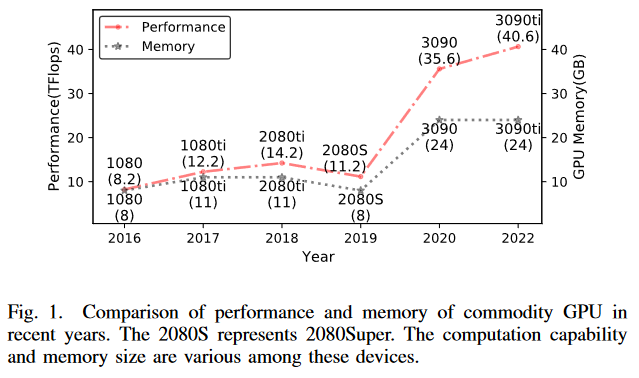

\
图 1 列出了近几年发布的一些GPU；它们都是 DNN 模型训练常用的硬件。所有这些 GPU 在计算性能和内存方面都表现出异构性。直接将传统的混合并行训练方法应用于异构环境无法最大化系统性能，甚至可能训练失败。我们认为，在异构环境中，三个挑战导致了这个问题。

1) 如何设计异构集群中的 GPU 拓扑以实现通信高效的混合并行？

将流水级分配给不同类型的 GPU 对通信时间有显着影响，从而降低了混合并行中的系统吞吐量。我们将此分配称为 GPU 拓扑。 HetPipe 设计了便于在异构集群上应用混合并行策略的GPU拓扑。它将集群中的 GPU 分组为性能相似的 Virtual Worker (VW)。 Hetpipe 在 VW 内通过 PMP 训练模型副本，同时在 VW 之间应用 DP。然而，HetPipe 不考虑 VW 内的 GPU 拓扑，这可能会影响混合并行训练迭代中的梯度同步通信时间。在本文中，我们提出了异构集群（HPH）拓扑设计器上的混合并行性，旨在设计具有高通信效率的 GPU 拓扑。我们观察到，对于混合并行，梯度同步的时间开销也是训练迭代的一部分，并且 DP 在不同流水级的梯度同步时间仍然不同。因此，VW 中 GPU 的排列会影响训练迭代的时间。基于这一观察，HPH 拓扑设计器通过尽可能隐藏流水级的梯度同步通信，确保其排列结果能够最小化迭代中梯度同步时间的比例。我们还证明没有其他安排方案比我们更优越。此外，我们在第一流水级实现了通信优化，将 DP 的 AllReduce 与训练步骤中最后一个微批次的反向传播（BP）重叠，进一步减少了通信的比例。

2) 如何将模型均匀划分到 VW 中多个不同性能的 GPU 上？

在异构环境中，每层 DNN 模型在不同 GPU 上的执行时间可能不相等。因此，划分 DNN 模型时需要考虑不同 GPU 的计算性能和内存大小。 HeteroG 使用图神经网络和强化学习来搜索模型划分方案，这需要花费大量时间才能得到令人满意的结果。为了寻找一种低时间成本的平衡划分方案，我们提出了 HPH 划分算法来对 DNN 模型进行分层划分。 HPH分区算法找到流水线延迟的所有组成部分，其中包括基于流水级之间的执行顺序的通信时间和计算时间，从而对训练迭代进行建模。接下来，我们使用整数规划算法来最小化流水线延迟以获得最佳分区方案。由于 HPH 拓扑设计器设计了 VW 中确定的 GPU 排列，我们在划分模型时不需要考虑 VW 中不同的 GPU 拓扑，从而大大减少了搜索空间。在我们的实验环境中，HPH 分区算法可以在可忽略的时间内给出分区方案。

3) 如何使内存受限的流水线能够训练更大的模型或设置更大的微批量大小以提高流水线吞吐量？

异构 GPU 集群中存在一些内存较小的 GPU 。当模型变得更大或者在这些 GPU 中设置更大的 batch size 时，训练可能会由于内存不足（OOM）的错误而失败。在 PMP 中，每个微批次的中间激活在前向传播（FP）期间必须存储在 GPU 内存中，直到相应的 BP 完成，这导致训练期间消耗很大一部分内存。之前的一些工作，例如 HetPipe、DAPPLE 和 Megatron，使用 1F1B 来安排微批处理的顺序。当将 1F1B 调度应用于具有 S 个流水级的流水线时，第一个流水级需要存储 S 个激活，而最后一个流水级仅存储一个激活。要使用 1F1B ，我们需要在第一流水级设置适合设备硬件资源限制的 batchsize。应用激活检查点可以缓解 1F1B 中的内存问题。激活检查点是一种减少中间激活的内存占用的策略；它在前向传播过程中丢弃它们，并在反向传播过程中重新计算它们，但会增加大约 1/3 的计算时间。为了训练更大的模型或设置更大的微批量大小（MBS）以提高流水线吞吐量，我们在 HPH 中提出了重计算感知调度方法。它重新安排计算并利用流水线气泡来优化内存占用和设备效率。据我们所知，这是第一个在 PMP 中实现无害重计算的工作。

本文的技术贡献总结如下： 
• 我们提出了一种 GPU 拓扑设计器，以减少迭代中的梯度同步开销。我们证明其结果可以最小化通信时间成本。 
• 我们提出了一种异构环境中高效的近似模型划分算法，以最大限度地减少流水线的执行时间。 
• 我们通过迭代中每个流水级的重计算来调整微批次的数量。因此，与不重计算相比，在不增加流水线执行时间的情况下缓解了 stage 的内存压力，从而可以设置更大的batch size。 
• 我们基于 PyTorch 和 NCCL 实现 HPH ，并对 3 个 DNN 模型进行实验评估。我们在由 4 种不同类型的 GPU 组成的 8 个节点（32 个 GPU）集群上将 HPH 与 3 个 SOTA 基线进行比较。结果表明，HPH 比其他基线实现了更好的扩展效率。此外，与 HetPipe 相比，HPH 的速度提高了 1.42 倍。

## 2 Background

### A Data Parallelism
DP 是目前最常用的加速模型训练的方法。 DP 将模型的多个副本放在不同的 worker 上，将训练数据集划分为子集，并为每个 worker 分配不同的子集。每个 worker 处理不同的子集，并定期与 PS 或 AllReduce 同步模型，以确保模型的一致性。对于异构系统上的 DP，之前的一些工作为不同的 GPU 设置了不同的批量大小，以平衡异构 GPU 集群上不同 GPU 的计算时间； SAP-SGD 使用异步参数更新策略来避免落后问题。然而，由于DNN模型的快速增长，GPU 的内存可能无法容纳整个模型，特别是在包含一些内存较小的 GPU 的异构环境中。

### B Model Parallelism and Pipeline Model Parallelism
MP 以逐层的方式将模型划分为 k 个分区，并将每个分区分配给不同的 GPU 作为流水级。每个流水级都对指定分区的层执行前向和反向传播。为了提高 GPU 的利用率，流水线模型并行 (PMP) 以流水线方式处理小批量，将小批量划分为微批次，并将每个微批次送入第一流水级。 PMP 允许多个 GPU 同时执行其指定层的不同微批次的前向或反向传播。

### C Hybrid Parallelism
混合并行将 DP 和 PMP 结合起来，寻求更全面的并行训练策略。 HetPipe 是第一个采用混合并行性在异构集群上训练大模型的工作。 HetPipe 通过将集群中的 GPU 划分为性能相似的不同组（称为虚拟工作器 (VW)）来缓解掉队问题。借助 VW，可以方便地在异构集群上使用混合并行策略。 PMP应用于所有 VW 内部，DP 用于 VW 之间。然而，为了最大化系统的吞吐量，HetPipe 采用了异步更新的思想，过多的陈旧模型参数必然会影响模型的收敛性。 HetPipe 不考虑 VW 内部的拓扑。但对于同步混合并行，VW 内部的拓扑会影响训练迭代中的梯度同步通信时间。

HeteroG 使用 GNN 和强化学习在算子级别处理模型划分和设备放置方案，并采用 PS 和 AllReduce 两种通信架构来同步模型参数。然而，训练 GNN 模型来得出最佳方案是相当耗时的。如果训练任务或硬件环境发生变化，就需要重新训练 GNN 模型，这会导致我们在训练 DNN 模型之前花费大量的时间。

### D Memory consumption of intermediate activations
在前向传播过程中为微批次计算的激活结果需要保存在 GPU 内存中，直到同一微批次的反向传播完成。流水线中的每个 GPU 都需要保存多个激活结果，这会占用大量内存，一些内存较小的 GPU 无法承受。 GPU 内存中存储的激活数量与流水线调度相关。使用 Gpipe 调度，保存的中间激活的峰值数量等于迭代中微批次的数量。1F1B 是一种常见的流水线调度；它比 Gpipe 的调度更节省内存，并且可以减少流水线深度的激活次数。

### E Memory optimization
训练期间的内存消耗主要来自优化器状态、梯度、参数和激活。训练期间激活可能会占用大量内存。激活重计算是一种通过引入 1/3 的计算开销来减少空间占用的策略。中间激活在前向传播期间不会保存，并会在反向传播时重新计算（基于每层保存的输入激活）。 ZeRO 旨在通过在数据并行 worker 之间分片模型状态来优化 DP 中的内存占用。并且具有相同目的的工作进一步将模型参数卸载到 CPU 甚至 NVMe 。这些策略也可以作为 HPH 的补充。

## 3 HPH DESIGN

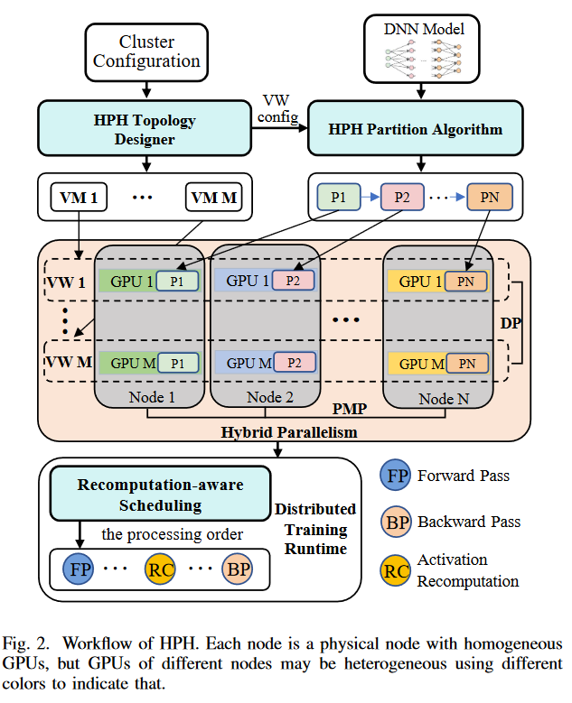

为了加速异构 GPU 集群上大型 DNN 模型的训练，我们设计了 HPH 来解决第一节中演示的挑战。图 2 显示了 HPH 的工作流程。为了实现使用混合并行训练大型 DNN 模型的高效通信，我们提出了用于大众汽车中 GPU 拓扑设计的 HPH 拓扑设计器。我们的拓扑尽可能隐藏了DP的梯度同步通信，大大减少了通信的停顿。为了将 DNN 模型分片到每个 VW 中的异构 GPU，我们提供了模型分区算法。它找到最佳模型分区结果，从而带来高效的流水线过程。为了训练更大的模型或者设置更大的MBS，我们提出了一种重计算感知的调度方法。它为每个流水级生成一个执行安排，其中包含所有微批次的 FP、BP 和重计算操作的顺序。它巧妙地安排重计算，并通过仔细编排利用流水线气泡，从而减少内存占用，而无需额外的时间开销。 HPH 的技术协同工作，极大地促进了异构环境中的分布式训练。此外，在训练过程中，我们采用第一流水级通信优化，以实现更好的计算和通信重叠。

### A HPH Topology Designer
HPH 在 VW 之间实现 DP且每个 VW 内实现 PMP ，以实现模型可用性和训练可扩展性。然而，在异构环境中，我们通过在 PMP 的不同流水级设置不同的计算负载来平衡计算时间，这导致 DP 的梯度同步通信时间不等。

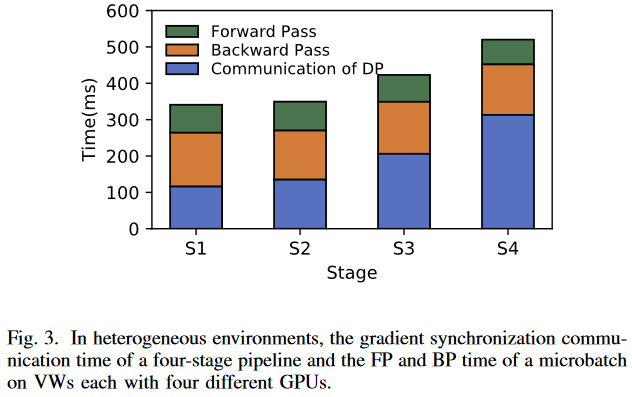

\
如图 3 所示，各个流水级之间的计算时间只有很小的差异，而第 4 流水级的梯度同步通信时间几乎是第 1 流水级的三倍。而且，DP 通信以不同的时间开始，流水线对于流水级 i − 1 的一次 BP 操作，流水级 i 比流水级 i − 1 更早进行通信。如果流水级 i 能够在流水级 i − 1 之前完成 AllReduce 操作，我们可以说它的通信是隐藏的。因此，由于不同的梯度同步通信时间，VW 中不同的 GPU 布置可能会影响训练迭代时间。因此，我们提出了拓扑设计器，它设计每个 VM 内的 GPU 拓扑，以提高 DP 通信效率。

我们将一个流水级的反向计算时间与梯度同步通信时间的比率称为计算通信比（CCR）。设备的计算性能和通信带宽会影响 CCR 值，较低的性能或较高的带宽会导致较大的 CCR。此外，较大的微批量大小还可以通过增加计算时间来提高 CCR，但需要更多的设备内存。流水级的 CCR 的值越大表示隐藏后续流水级的 DP 通信需要更多的计算时间，同时流水级本身的通信量更少。因此，我们根据 CCR 值来排列 GPU：第一流水级保存 CCR 最大的 GPU ，其余的按顺序排列。我们证明我们的 GPU 拓扑可以尽可能隐藏梯度的 AllReduce 通信，并且我们确保没有比我们的 GPU 拓扑更好的 GPU 拓扑。详细证明如下：

考虑处理微批次的每个流水级的计算时间相等的情况。因此，当我们按照 CCR 降序排列 GPU 时，每个流水级的梯度通信时间是非递减的。我们用 $T^i_C$ 来表示第 i 流水级的梯度通信时间，可以得到 $T^i_C ≤ T^j_C ，∀ i < j$ 。那么第 i 流水级迭代的结束时间可以表示为： $T_S +(S − i)T_b + T^i_C$ 。 其中 $T_S$ 表示最后流水级 S BP 的结束时间，$T_b$ 是本流水级 BP 的时间。那么整个流水线的一次迭代的结束时间可以表示如下：

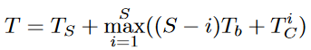

\
对于任意两个流水级 k、j，假设 k > j，则 $T^k_C ≥ T^j_C$ 。在流水级 k 和 j 之间，迭代结束时间的最大值 $t = T_S + max((S − j)T_b + T^j_C , (S − k)T_b + T^k_C)$ 。如果我们交换流水级 k、j 对应的 GPU 位置，我们考虑结束时间的变化。交换 GPU 位置后，两个流水级的最大结束时间变为：$t′ = T_S + max((S − k)T_b + T^j_C , (S − j)T_b + T^k_C)$ 。容易判断 t′ ≥ t。因此，交换任意两个 GPU 位置并不会缩短流水线迭代的结束时间，甚至使流水线的迭代时间变长。这个证明可以表明没有任何 GPU 安排比我们更优越。

### B HPH Partition Algorithm

从拓扑设计器获得 VW 拓扑后，现在我们介绍 HPH 分区算法，该算法将模型划分为 GPU 并形成每个流水线。分区的目标是在内存和资源限制下最大化 VW 中流水线的吞吐量。对于同步PMP，这个优化目标相当于最小化流水线的单次迭代时间。

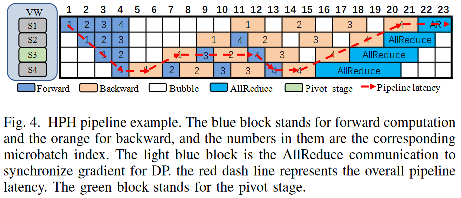

\
图 4 是 VW 上 4 级 PMP 的示例。我们将流水级中 FP 和 BP 以交错的方式执行成为稳定阶段，那么我们可以将稳定阶段中执行时间最长的流水级定义为枢轴流水级。因为枢轴流水级将主导稳定阶段的流水线延迟，为了估计训练迭代的时间，我们可以累加枢轴流水级的计算时间、流水线其他流水级的执行时间以及流水线末端的 AllReduce 通信时间。在图 4 中，第 3 流水级是枢轴流水级，红色虚线表示此示例中的整体流水线延迟。因此图 4 中训练迭代的时间为 $\sum^{4}_{i=1} (f_i + b_i)+2(f_3 + b_3)+(f_4 + b_4)+AR(S_1)$ 其中 $f_i、b_i$ 表示前向和反向计算第一阶段的时间。 $AR(S_i)$ 表示流水级 i 的梯度同步时间。

与图 4 类似，我们可以概括任何具有一组包含枢轴阶段的执行序列的流水线的迭代时间的表示。对于具有 N 层的 DNN 模型，我们需要将其分为 S 个流水级，其中 S 等于 VW 中 GPU 的数量。首先，我们测量 VW 中不同 GPU 上每个模型层（例如 embedding 层、transformer 层）的执行时间，并记录参数大小和激活大小。然后我们可以将分区方案表示为序列 ${m_1,m_2, ..., m_S}$，其中 $m_i$ 是阶段 i 的层数。我们将数组 L 表示为层数序列的前缀和，我们可以得到第 i 级保存第 $L_{i−1} + 1$ 到第 $L_i$ 层。现在训练迭代 T 的流水线延迟可以建模为：

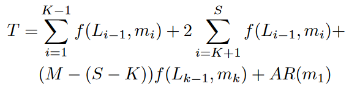

\
其中 $f(L_{i−1},m_i)$ 是一个函数，可以返回第 i 个 GPU 上 $[L_{i−1} + 1,L_{i−1} + m_i]$ 中各层的单微批量执行时间，K 是枢轴阶段的索引，M 是微批次的数量， $AR(m_1)$ 是在第 1 阶段同步 $m_1$ 层梯度所需的 All-Reduce 通信时间。因此，我们可以在某些约束下通过最小化流水线延迟 T 来获得最佳模型划分方案候选:

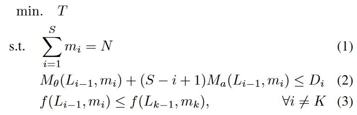

\
我们解释下面剩余的变量和约束：

• 约束(1) 保证每个阶段的层数 $m_i$ 的总和等于 N 。

• 约束(2) 满足了阶段 i 中的总内存开销应小于其设备容量 $D_i$ 的要求。 $M_θ(L_{i−1},m_i)$ 是第 i 阶段各层模型状态的内存消耗。 $M_a(L_{i−1},m_i)$ 是第 i 阶段激活的内存消耗，它必须以 1F1B 调度存储 (S − i +1) 个这样的激活。 

• 约束（3）是为了确保阶段 K 是计算时间最长的枢轴阶段。

我们尝试根据流水线深度设置枢轴阶段以获得相应的最佳流水线延迟，并最终选择延迟最小的分区方案。

由于模型划分的最小单元是 DNN 模型的每一层，因此我们可以将上述优化问题视为整数规划（IP）问题。 IP 公式是使用 Gurobi 8.1 求解的，它可以在 12 个 CPU 内核上快速运行，因此该过程的开销微不足道。

### C Recomputation-aware Scheduling
在异构环境中，小内存的 GPU 无法处理大模型或大微批次，限制了流水线的适用性和吞吐量，因此需要在训练过程中优化小内存 GPU 的内存占用。激活重计算是一种常见的技术，它用额外的计算来换取较低的内存开销。激活重计算可以使更大的模型大小或每 GPU 微批量大小适合内存，从而提高内核的参数容量或算术强度。

为了在不牺牲执行速度的情况下实现低内存占用，我们提出了 HPH 的重计算感知调度方法。它可以通过重新安排计算和利用流水线气泡来优化内存占用和设备效率。

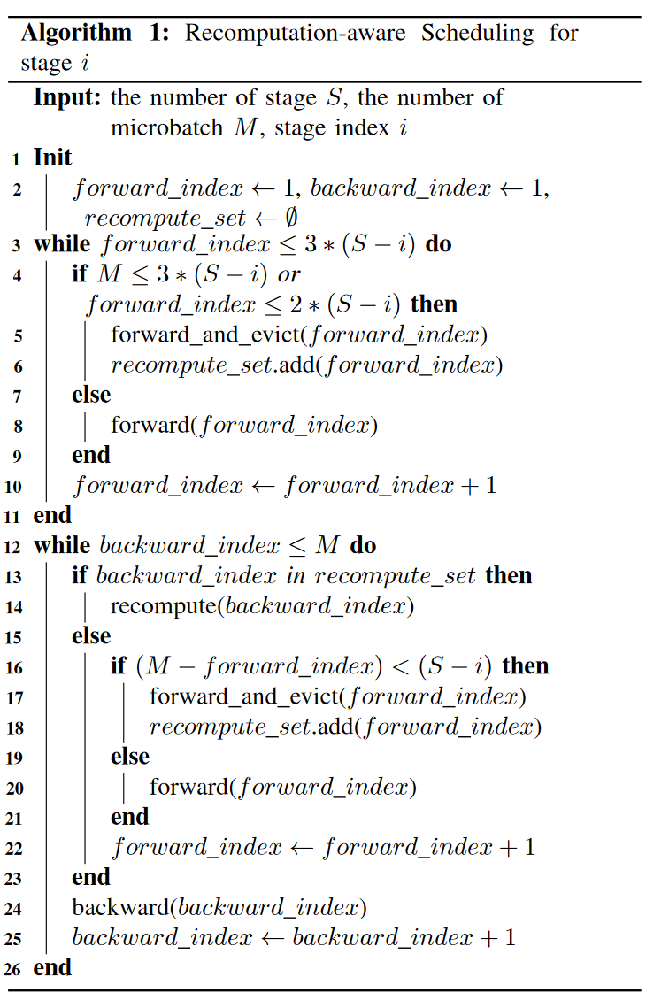

\
算法 1 为阶段 i 中处理的每个微批次设置计算操作的执行顺序，并决定是否对微批次 m 使用重计算。前向（index）和反向（index）表示第 index 微批次的前向和反向计算。 forward_and_evict(index) 表示前向计算，不会存储中间激活。重计算集用于收集执行 forward_and_evict（index）的微批次的索引。重计算集中具有索引的微批次将重计算前向传播，并为后续反向传播保存中间激活。每个阶段都遵循算法 1 代表的离线调度。

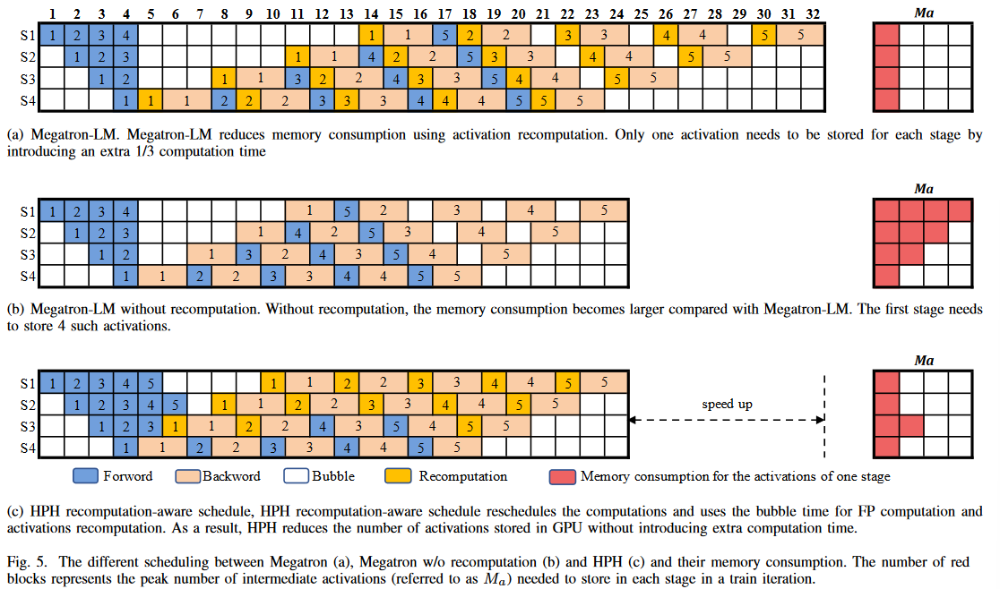

\
图 5 是 HPH 的静态调度与 Megatron-LM 的 5 微批次 4 级流水线调度的直观比较。当使用 Megatron 调度（图5（a））时，内存消耗大大减少，并且每个阶段只需要存储一个激活。然而，流水线迭代的时间增加了 1/3，并且最后一个流水级仍然重计算激活，这对于 1F1B 调度来说是多余的。使用无需重新计算的 Megatron 1F1B 调度（图 5(b)），激活的内存占用与 (S − i +1) 成正比，其中 S 和 i 表示流水线深度和阶段索引。所以，不同流水级的内存压力各不相同：第一流水级最大（图5（b）中的4），最后流水级最小（图5（a）中的1）。通过图 5（c）中的重计算感知调度，流水线的执行由算法 1 重新调度，并且冒泡时间用于激活重计算。与具有重计算功能的 Megatron 1F1B 相比，我们将迭代时间减少到与 Megatron 1F1B 相同，并且仅以在第 3 阶段多存储一次激活为代价。

HPH 主要是在保持流水线速度的同时减少顶级流水线阶段的内存占用。这些流水级主要由内存较小的低级GPU来操作，因此减少这些流水级的内存消耗是非常有意义的。从算法 1 可以得出结论，对于满足 M ≤ 3*(S −i) 的流水级，只需要存储一个这样的激活。通过 HPH 重计算感知调度，我们根据每个阶段需要存储的激活数量来调整约束 2。

### D First Stage Communication Optimization
如图 4 所示，梯度同步第一阶段的 AllReduce 通信是流水线延迟的一部分，从而影响每次迭代的性能。为了减少流水线延迟的通信开销，我们通过与反向传播彻底重叠来优化通信。HPH使用桶来收集第一阶段反向传播中产生的梯度并且一旦存储桶收集到足够的梯度，就会使用 AllReduce 操作将梯度与同一流水级的其他副本同步。因此，第一阶段可以计算梯度，同时通过相同的 DP 进程组与其他 GPU 同步收集的梯度。我们不会将此优化应用于其他流水级，因为我们的 VW 的拓扑可以在流水线气泡中执行它们的 AllReduce 通信，并且非重叠的 AllReduce 可以避免后续流水级之间与 P2P 通信的潜在冲突。我们将展示 IV-F 节中第一阶段通信优化的有效性。

## 4 EVALUATION

### A. Experiment Setup
__测试平台__。我们使用多达 8 台物理机（32 个 GPU）对 HPH 进行全面评估。这些机器通过 100Gbps InfiniBand 连接，配备了四个不同类型的 GPU、两个英特尔至强 4214R @ 2.40 GHz 和 128GB DDR4 内存。所有服务器均运行 64 位 Ubuntu 18.04、CUDA 11.3、cuDNN 8.2.1、NCCL 2.10.3 和 PyTorch 1.10。在所有实验中，我们都以 GPU 类型来区分服务器。

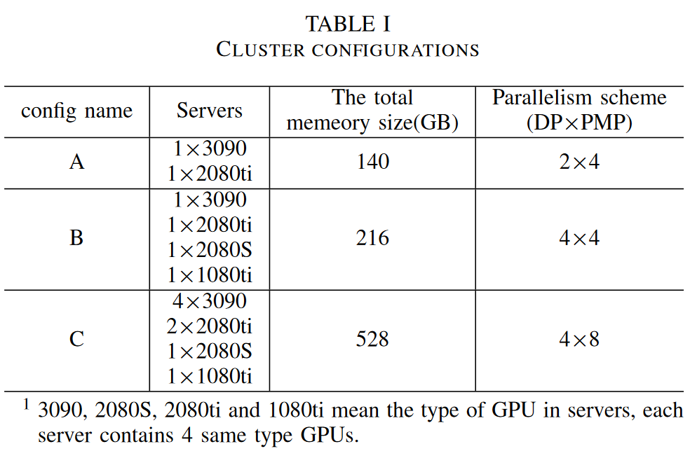

\
利用上述八台物理机，我们构建了三种不同的异构环境，如表 1 所示。在配置 A 中，GPU 的性能在我们的实验中最为接近。DP 和 PMP 的数量分别为 2 和 4，共有 8 个 GPU。对于配置 B，我们添加了两台性能不同的机器：内存最小的 2080S 和性能最低的 1080ti，这使得配置 B 拥有最不同的 GPU 性能。对于配置 C，我们使用了所有物理机；因此我们设计了一个 8 级 PMP。除非另有说明，所有实验均基于配置 B。

__模型和数据集__。我们使用了两种不同的模型架构：BERT 和 GPT-2 。这些模型代表了用于预训练的 NLP 架构的典型类型。对于基于 transformer 编码器层的模型 BERT，我们使用 3.4 亿个参数运行 BERT large。对于基于 transformer 解码器的模型 GPT-2，我们运行了三种配置：参数大小分别为 3.45 亿、7.56 亿和 15.4 亿。在以下实验中，我们根据参数大小对 GPT 模型进行了区分。在 BERT 的预训练中，我们使用了 BooksCorpus 和英文维基百科。在训练 GPT-2 时，我们使用 OpenWebText 数据集。

__基准__。在实验中，我们将三种方法与 HPH 进行了比较：（1）数据并行（DP）：我们使用 torchDDP 实现了 DP。由于 DP 需要在每个 GPU 上训练一个完整的模型，因此与 PMP 方案相比，无法在一次迭代中设置较大的批量大小。我们使用内存最小的 GPU 可用的最大批次大小作为所有 GPU 上的批次大小。我们使用梯度累加来确保 DP 的全局批量大小（GBS）不小于 PMP 方案。(2) 异构集群上的 DP（DP-Het）：DP-Het 与 DP 的不同之处在于，我们会手动修改每个 GPU 处理的小批量大小，目的是使不同 GPU 的训练迭代尽可能相等。与 DP 类似，我们也使用梯度累积来确保 GBS 大于 PMP 方法。(3) HetPipe：由于 HetPipe 没有开源，我们尽量按照他们的论文来实现 HetPipe，并通过在每次训练迭代结束时同步来消除异步训练对模型收敛的负面影响。由于基准模型规模较大，我们在必要时使用了激活重计算，以确保 HetPipe 能够在我们的实验环境中运行所有模型。

由于 HPH 是一种不影响收敛准确性的同步方法，我们将重点放在训练吞吐量（sequences/s）的比较上。所有报告的吞吐量都是相同的 500 次训练迭代的平均值。

### B. Comparison with Existing Studies
我们首先使用 HPH 和三个最相关的作品，比较了不同模型在三个集群配置上的训练吞吐量：DP、DP-Het 和 HetPipe。如图 6 所示，与三种基线相比，HPH 在不同 GBS 下的训练速度显著提高。

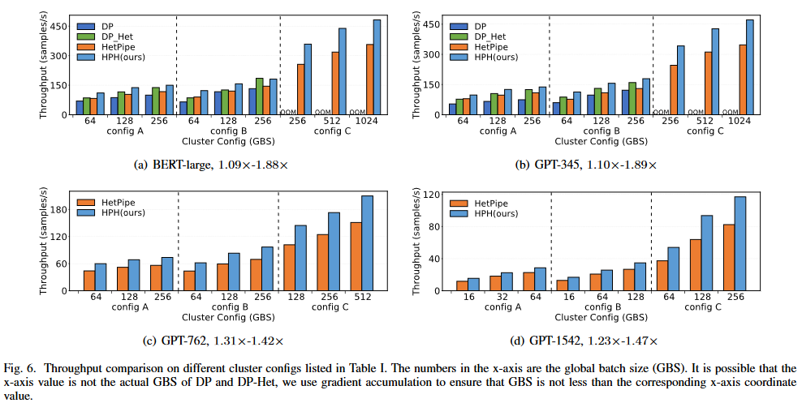

\
__BERT-large/GPT-345__。在配置 A 上，DP 的吞吐量最小，因为它要求每个 GPU 的批量大小相等，并且存在 stragger 问题。HetPipe 的吞吐量高于 DP，但由于额外的激活重计算开销，在批量较大时速度会减慢。DP-Het 的吞吐量更高，因为它的批量大小设置与 GPU 性能相关。需要注意的是，由于梯度累积不可避免，DP-Het 和 DP 使用了更大的批处理量。与 DP-Het 相比，HPH 减少了服务器之间的流量，也减少了其 DP 级的机器内梯度同步流量。而且，HPH 不会产生额外的重计算开销。在配置 A 上，HPH 的性能优于所有基线，在 BERT-large 中的速度提升了 8.5% 至 59.3%，在 GPT-345 中的速度提升了 10.3% 至 89.9%。

在配置 B 上，HPH 的吞吐量高于最佳基线，从 11.9% 到 28.7% 不等，但使用 GBS 256 训练 BERT-Large 时除外。需要注意的是，配置 B 中的 2080S GPU 只有 8G 内存，即使批量大小为 1，也无法用于训练包含 DP 和 DP-Het 的完整 BERT-large 模型，因此我们使用 2080ti 机器代替 2080S 来确保配置 B 下使用 DP 和 DP-Het。在配置 B 上使用 GBS 256 训练 Bert-large 时，由于 GPU 性能更好，GBS 更大（280），DP-Het 比 HPH 获得了更高的吞吐量。

在配置 C 中，我们没有任何机器可以替代 2080S，因此我们在使用 DP 和 DP-Het 时遇到了 OOM 错误。与 HetPipe 相比，HPH 的速度提高了 1.40 倍，而且 HPH 在训练较大模型时表现更好。

GPT-762/GPT-1542。由于 GPT-762 和 GPT-1542 有更多参数，DP 和 DP-Het 无法在这两种集群配置上运行，因此我们只比较了 HetPipe 和 HPH 的吞吐量。对于配置 A，HPH 在 GPT-762 中实现了 1.31×-1.36× 的吞吐量，在 GPT-1542 中实现了 1.24×-1.31× 的速度提升。当机器数量增加时，HPH 的性能表现更好，在配置 B 中比 HetPipe 高出 39.1%-41.1%，在配置 C 中高达 42.0%：在 VW 中，HPH 的拓扑设计可以尽可能隐藏 DP 与气泡的梯度同步通信。HPH 重叠了 DP 的梯度同步通信和第一管道阶段最后一个微批的 BP 计算。更重要的是，在重新计算感知调度的帮助下，HPH 可以重新调度流水线，因此在训练大型模型时，HPH 的重新计算不会带来额外的时间开销。

### C. Topologies in VW
我们比较了给定异构 GPU 环境中不同拓扑结构之间的吞吐量。

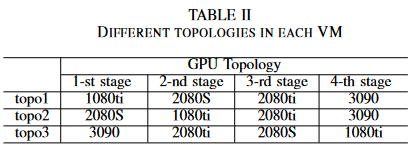

\
如表 2 所示，本实验总共使用了三种 GPU 拓扑。拓扑 1 是根据 HPH 的拓扑设计器给出的排列方式。topo2则是通过交换topo1前两个GPU的顺序得到的。至于 topo3，则是按照 HetPipe 建议的内存大小顺序排列的。为了进行公平比较, 所有拓扑使用 Megatrton 1F1B 调度，关闭重新计算，放弃第一阶段的通信优化。

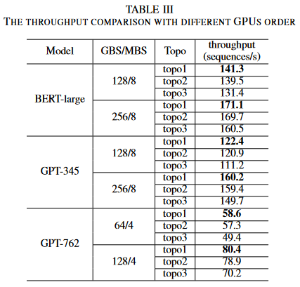

\
如表 3 所示，我们将 BERT-large 和 GPT-345 的微批大小（MBS）设为 8，将 GPT-762 的微批大小（MBS）设为 4。在所有情况下，Topo1 的吞吐量都最高。这是因为，在 topo1下，由于 stage1 在每次迭代结束时需要同步的参数大小较小，因此作为流水线延迟一部分的 AllReduce 通信开销最小。当 GBS 为 256 时，由于 topo1 的计算通信比（CCR）值较大，其速度提升较小。当 CCR 增加时，AllReduce 通信时间对管道延迟的影响较小。不过，由于通信量较大，而批处理量受设备内存限制较小，CCR 会随着模型大小的增加而降低。对于 GPT-762，与其他拓扑相比，topo1 的加速效果更为显著，最高可达 18.6%。因此我们相信，当模型规模进一步增大时，我们的拓扑设计器将带来更多优势。

### D. Model Partition Results

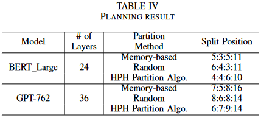

\
本节将对 HPH 分区算法进行评估。表 4 显示了测试的分区方案。基于内存的分区方法是指我们根据配置 B 上设备内存的比例对模型进行分区，其中设备分别为 1080ti (11GB)、2080S (8GB)、2080ti (11GB) 和 3090 (24GB)。在随机方法中，我们使用随机数生成器不断生成分区结果，直至得到可执行分区。分割位置一栏显示了每个模型在相应流水线分区方法下的阶段分区点。

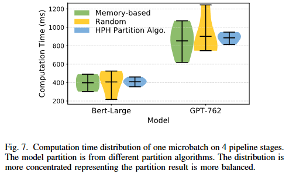

\
图 7 显示了采用不同分区策略的一个微批次的运行分布结果。由于工作量相同，所有方法的平均计算时间相似。但 HPH 分区算法在流水线阶段之间的运行时间明显更均衡。

### E. Effectiveness of Recomputation-aware Scheduling

我们将 HPH 的重新计算感知调度与 Megatron-LM 和 MegatronLM 的流水线调度进行了比较。我们基于开源代码实现了 MegatronLM。为了进行公平比较，这里的实验使用了与 HPH 相同的模型分区策略，并将模型置于相同的 VW 拓扑上，而且 HPH 没有使用第一阶段通信优化。

我们首先比较了 BERT-large、GPT-345、GPT-762 和 GPT-1542 模型的训练吞吐量。对于 BERT-large 和 GPT-345 模型，我们将 GBS 的大小分别设置为 128、256 和 512，而对于 GPT-762 和 GPT-1542 模型，我们分别使用 64 到 256 和 16 到 64 个 GBS。结果如图 8 所示。

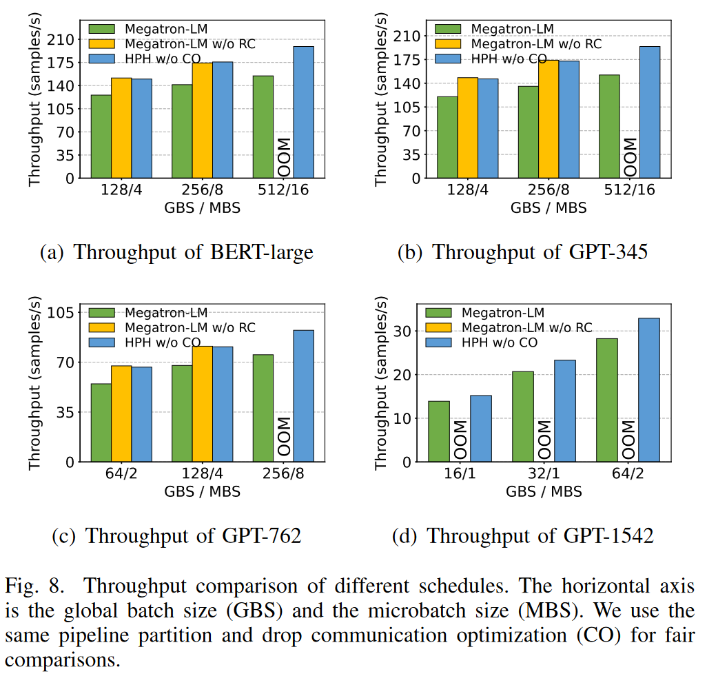

\
对于 BERT-large、GPT-345 和 GPT-762 模型，在处理较小 MBS 的输入样本时，重新计算感知调度几乎可以达到与 Megatron-LM 1F1B 调度相同的吞吐量，但没有激活重新计算，并且比 Megatron-LM 加快了 17% 到 19%。对于比其他基准模型参数更多或 MBS 更大的 GPT-1542，不使用 RC 的 Megatron-LM 会触发 OOM 错误，而 HPH 和 Megatron-LM 则在相同硬件条件下成功运行。由于 HPH 结合激活检查点重新安排了流水线，占用了重新计算的冒泡时间。与 Megatron-LM 相比，HPH 的性能提高了 11% 至 27%。

GPU 效率：我们可以从 GPU 效率的角度来解释为什么 HPH 可以比其他时间表获得更高的吞吐量。我们使用 SM 效率（流式多处理器效率[41]）来表示训练期间的 GPU 效率。SM 效率是一个更细粒度的指标，表示在任何时刻使用 SM 的百分比。由于 GPU 中存在通信流，因此 SM 效率能更好地反映 PMP 的计算时间百分比。

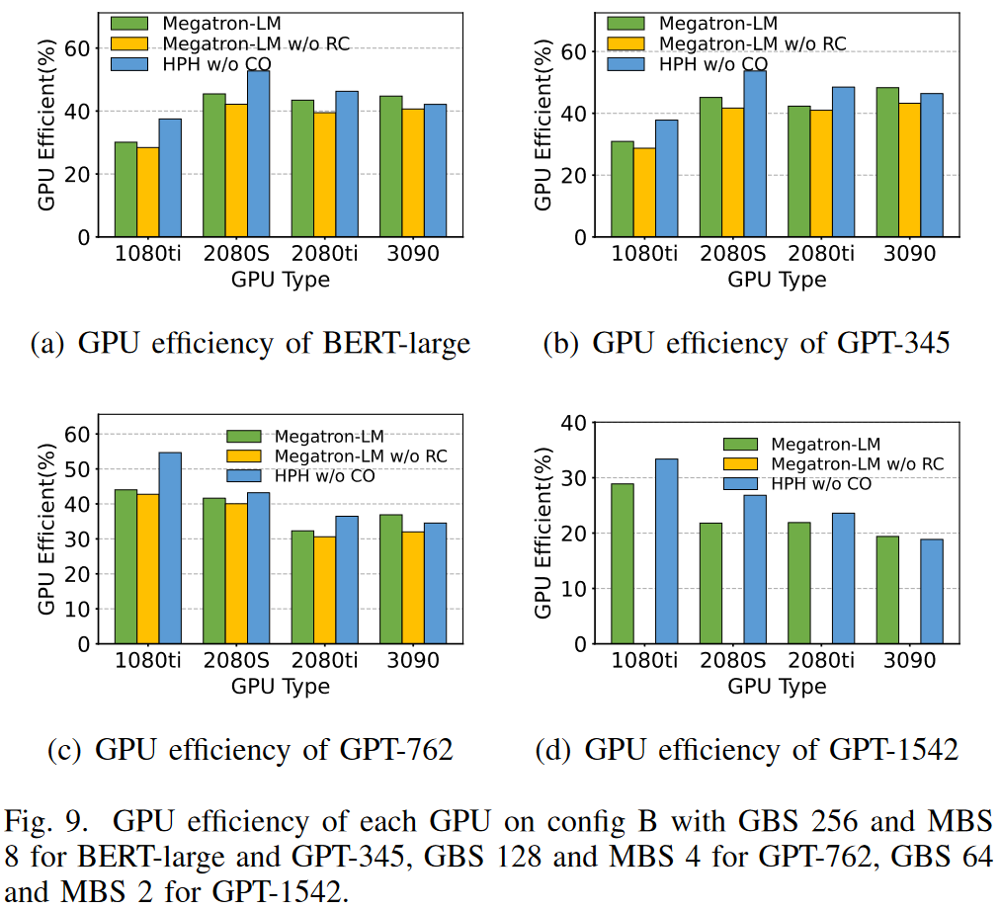

\
如图 9 所示，在训练所有基准模型的过程中，我们测量了每个 GPU 在配置 B 上的 SM 效率。Megatron-LM 的 GPU 效率高于不带 RC 的 MegatronLM，这是因为在后向传递之前需要进行中间激活重新计算，而且在训练迭代中计算时间所占的比例也更大。同时，由于计算时间的增加，Megatron-LM 的吞吐量也低于不带 RC 的 Megatron-LM。虽然最后一级的效率较低，因为放弃重新计算降低了计算比例，但前置流水线级利用泡沫时间进行了重新计算，因此在 HPH 的重新计算感知调度下，GPU 的效率较高。随着空闲时间的减少和 GPU 效率的提高，HPH 的高吞吐量也就可想而知了。将前三个阶段的效率与 Megatron-LM 相比，HPH 可以将 GPU 利用率提高 25.6%。

### F. Effectiveness of Communication Optimization
我们评估了在第一阶段进行和未进行通信优化的 HPH 的吞吐量。

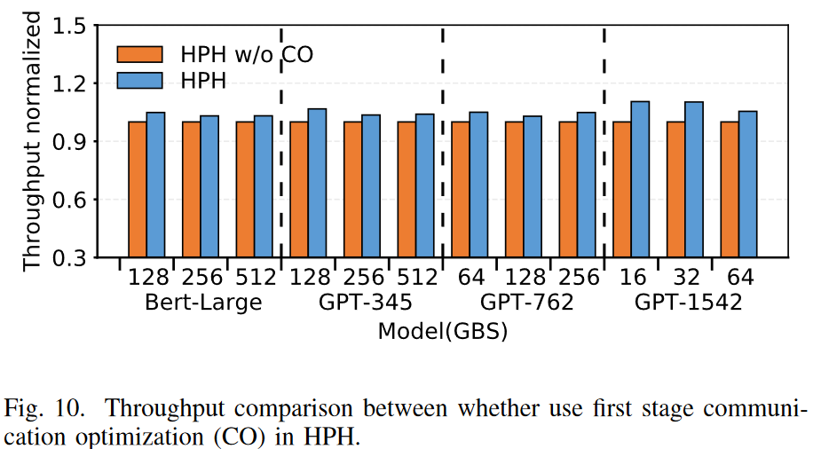

\
图 10 显示了实验结果。由于第一流水线阶段的梯度聚合采用了更好的重叠 AllReduce 通信，通信优化（CO）带来了吞吐量的提高，BERT-large 提高了 4.6%，GPT-345 提高了 5.1%，GPT-762 提高了 5.3%，GPT-1542 提高了 10.3%。当模型规模增大时，性能提升更为明显。

## 5 CONCLUSION
本文介绍了用于在异构 GPU 集群上训练大规模 DNN 模型的同步混合并行框架 HPH。HPH 将集群中的 GPU 分成性能相近的虚拟工作者（VW），并在 VW 中提出了一种通信效率高的 GPU 拓扑，以减少迭代中的梯度同步通信。HPH 为异构集群设计了一种模型分区算法，以最大限度地减少流水线执行时间。此外，HPH 使用重新计算感知调度（Recomputation-aware Scheduling）来调度阶段中每个微批次的执行顺序，从而在不增加额外时间消耗的情况下减少了内存消耗。我们在三个不同的异构集群中测试了 HPH 的性能。与最佳基线相比，HPH 的速度提高了 1.42 倍。