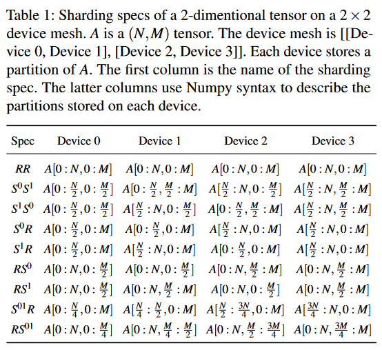
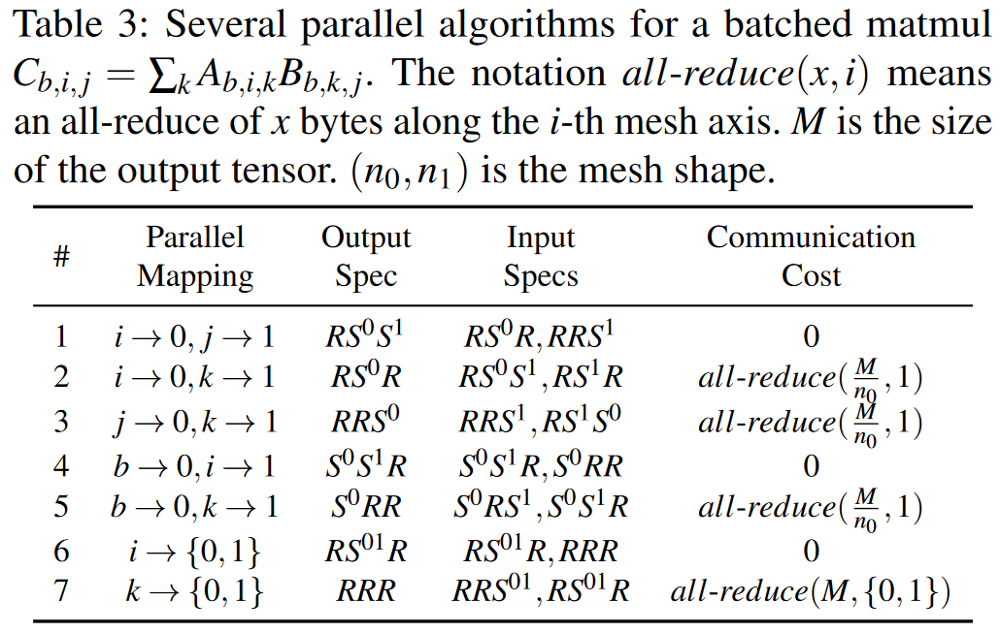

# Alpa: Automating Inter- and Intra-Operator Parallelism for Distributed Deep Learning

## Abstract

Alpa 通过生成统一 DP、TP 和 PP 的执行策略，自动完成大型深度学习（DL）模型的模型并行训练。现有的模型并行训练系统要么要求用户手动创建并行策略，要么从有限的模型并行配置空间自动生成策略。它们不足以在分布式计算设备上扩展复杂的 DL 模型。Alpa 通过将并行视为两个层次：inter-operator 并行和 intra-operator 并行，来分配大型 DL 模型的训练。在此基础上，Alpa 为大规模模型并行执行策略构建了一个新的分层空间。Alpa 设计了一系列编译过程，以自动推导出每个并行级别的高效并行执行策略。Alpa 实现了高效的 runtime，可在分布式计算设备上协调两级并行执行。我们的评估结果表明，Alpa 生成的并行策略即使在其设计的模型上，也能与手工调整的模型并行训练系统相媲美，甚至更胜一筹。与专门的系统不同，Alpa 还适用于具有异构架构的模型和没有人工设计计划的模型。Alpa 的源代码可通过 https://github.com/alpa-projects/alpa 公开获取。

## 1 Introduction
深度学习（DL）最近取得的一些进展都是模型规模大幅增加的直接结果。例如，将语言模型（如 GPT-3）扩展到数千亿个参数，并在更大的数据集上进行训练，从而实现了全新的能力。

然而，在分布式集群上训练这些超大模型目前需要大量的工程设计工作，这些工作既要针对模型定义，又要针对集群环境。例如，训练基于 transformer 的大型语言模型需要进行大量调整，并仔细选择多个并行维度。在 TPU 集群上训练 MoE-transformer 模型需要手动调整每一层的分区轴，而在 AWS GPU 集群上训练相同的模型则需要新的流水线方案，这些方案可能取决于分区的选择（§8.1）。

一般来说，高效的大规模模型训练需要在单个张量算子的粒度上调整 DP 、TP 和 PP 方法的复杂组合。正确调整并行化策略已被证明，可使训练性能提高一个数量级，但这取决于强大的机器学习（ML）和系统专业知识。

大规模模型并行的自动化可以使模型开发人员快速探索新的模型设计，而无需考虑底层系统所面临的挑战，从而大大加快 ML 的研究和生产。遗憾的是，这需要搜索一个复杂的策略空间，该空间会随着并行化维度以及模型和集群规模的增加而呈指数级增长。例如，当所有并行技术都启用时，执行计划的制定需要回答一系列相互依存的问题，如创建多少个数据并行副本、沿哪个轴划分每个 operator 、如何将模型划分为流水线阶段，以及如何将设备映射到生成的并行可执行文件。不同并行化方法之间的相互作用，以及它们对模型和集群设置的强烈依赖性，构成了一个需要优化的计划组合空间。最近 Dapple, PipeDream 等对模型训练进行自动并行的努力，都局限于单一模型并行化方法的空间，或者依赖于对模型和集群规格的强烈假设（§2.1）。

我们的主要观点是，我们可以将不同的并行技术组织到一个分层空间中，并将这些并行技术映射到计算集群的分层结构中。不同的并行技术有不同的通信带宽要求，而典型的计算集群具有相应的结构：距离近的设备可以用高带宽通信，而距离远的设备通信带宽有限。

\
有鉴于此，我们在本文中采取了与传统数据和模型并行不同的观点，将 ML 并行化方法重新归类为 intra-operator 并行和 inter-operator 并行。intra-operator 并行沿着一个或多个张量轴（批处理或非批处理）对 ML 运算器进行分区，并将分区分配到分布式设备上（图 1c）；另一方面，inter-operator 并行将模型分割成互不关联的阶段，并在不同的设备集上对各阶段的执行进行流水线处理（图 1d）。它们发生在模型计算的两个不同粒度上，以是否对算子进行分区来区分。

有鉴于此，并行执行策略可以通过在每个并行类别中指定策略来分层表达，从而带来许多优势。首先，intra-operator 并行和 inter-operator 并行具有不同的特点：intra-operator 并行具有更好的设备利用率，但会导致在每次分割和合并分区运算器时，每次训练迭代都要进行通信；而 inter-operator 并行只在相邻阶段之间进行通信，如果切分得当，通信量可以很低，但由于调度限制，会产生设备空闲时间。我们可以利用计算集群中通信带宽的不对称特性，将 intra-operator 并行映射到通信带宽较高的设备上，同时在带宽相对较低的远距离设备之间协调 inter-operator 并行。其次，这种分层设计使我们能够以接近最优的方式解决每一层的子问题。虽然联合执行策略不能保证全局最优，但它们在训练各种大模型时表现出了强大的实证性能。

在这一新问题表述的指导下，我们设计并实现了 Alpa，它是首个可自动生成并行执行策略的编译器，涵盖所有DP、TP 和 PP。在给出模型描述和集群配置的情况下，Alpa 通过将集群划分为多个设备网格（每个网格都包含具有高带宽连接的设备）以及将模型的计算图划分为多个阶段来实现这一目标。它将阶段分配给设备网格，并自动协调设备网格上的 intra-operator 并行和设备网格之间的 inter-operator 并行。

总之，我们的贡献如下：

-我们构建了一个两级并行执行策略空间（图 1e），在这个空间中，使用 inter-operator 和 intra-operator 并行来分级指定策略。
- 我们设计了可行的优化算法，以在每个层次上推导出接近最优的执行策略。
- 我们在 GPU 集群上实现了分布式 DL 的编译系统 Alpa。Alpa 的特点是：(1)使用分层优化算法生成执行策略的编译通路集合，(2)协调设备网格间并行性的新 runtime 架构，以及(3)改进编译和解决跨网格通信问题的一系列系统优化。
- 我们评估了 Alpa 在训练具有数十亿参数的大模型时的表现。我们在由 8 个 p3.16xlarge instance 和 64 个 GPU 组成的 Amazon EC2 集群上将 Alpa 与最先进的分布式训练系统进行了比较。在 GPT 模型上，Alpa 可以与专业系统 Megatron-LM 相媲美。在 GShard MoE 模型上，与人工调整系统 Deepspeed 相比，Alpa 在 2 节点上的速度提高了 3.5 倍，在 4 节点上提高了 9.7 倍。与专门的系统不同，Alpa 还能通用于没有人工策略的模型，并在 4 节点的 Wide-ResNet 上实现了 80% 的线性扩展效率。这意味着开发人员可以使用 Alpa 轻易获得大型 DL 模型的高效模型并行执行策略。

## Background
流行的 ML 框架通常将 DL 计算表示为数据流图。图中的边代表多维张量；节点是算子，如矩阵乘法（matmul），用于将输入张量转换为输出张量。在一次迭代中训练一个 DL 模型包括通过在图中计算一批数据来计算损失，通过反向传播得出更新，以及通过权重更新将更新应用于参数。在实际操作中，模型开发人员定义数据流图。然后，执行引擎在计算设备上对其进行优化和执行。

当模型或数据量较大，单台设备无法在合理时间内完成训练时，我们就会采用 ML 并行化方法，在分布式设备上进行并行计算。

### 2.1 Conventional View of ML Parallelism
现有的并行方法通常分为 DP 、TP 和 PP。

__数据并行__。在数据并行中，训练数据被分割给分布式工作者，但模型是复制的。每个工作者在其独立的数据分区上计算参数更新，并在权重更新前与其他工作者同步更新，这样所有工作者在整个训练过程中都能观察到一致的模型参数。

__张量并行__。当模型过大而无法在一台设备中安装时，TP 是一种有效的模型并行方案。TP 指的是将特定运算符（下文中缩写为 op）（如图 2b 中的 matmul）的计算按照非批处理轴进行分割，并在多个设备上并行计算运算符的每个部分。

由于输入张量是联合分区的，当一个设备计算其 op 分区时，所需的输入张量部分可能不在其本地内存中。因此，需要通过通信从其他设备获取输入数据。当张量被平均分割时，即 SPMD [57]，所有设备都将遵循相同的集体通信模式，如all-reduce、all-gather 和 all-to-all。

__流水线并行__。如图 2d 所示，流水线并行并不是对操作进行分区，而是将模型图中的不同操作组（称为阶段）放在不同的工作站上；同时，它将训练批次分割为若干微批次，并在分布式工作站上对微批次的前向和反向传播进行流水线处理。与 TP 不同，流水线并行通过点对点通信在不同工作站之间传输前向和反向传播的中间激活。

__手动组合并行__。最近的发展表明，要扩展当今的大型 DL 模型，需要将上述方法结合起来。最先进的训练系统，如 Megatron-LM ，会手动设计一个专门的执行策略，将这些并行方法结合到 transformer 语言模型中，这也被称为 3D 并行性。通过假定模型重复了相同的 transformer 层，它为每个流水线阶段分配了相同数量的层，并对所有层统一应用手工设计的 TP 和 DP 配置。尽管需要很强的专业性，但手工计划并不能适用于不同的模型或者不同的集群配置(§8.1)。

__自动组合并行__。每种并行方式的配置、它们之间的相互依存关系以及它们对模型和集群设置的依赖性构成了一个难以处理的空间，这使得自动组合这些并行方式的工作无法顺利实现。例如，当与 TP 相结合时，每次添加 DP 副本都需要分配一组新的设备（而不是单个设备）作为 Worker，并在这些设备中找出最佳的 TP 配置。当包括 PP 时，最佳流水线方案取决于每个流水线阶段的 DP 和 TP 选择，以及如何为每个阶段分配设备。基于这种传统观点，之前对自动并行的探索仅局限于将 DP 与最多一种模型并行方法相结合，从而错失了大量的性能机会。接下来，我们将阐述我们对 ML 并行性的看法。

### 2.2 Intra- and Inter-Operator Parallelisms

\
与传统观点不同，在本文中，我们将现有的并行方法重新分类为两个正交类别：intra-operator 并行和 inter-operator 并行。它们的区别在于是否涉及沿任意张量轴划分算子。接下来，我们用图 2 中的示例来介绍这两类并行化方法。

__intra-operator 并行__。运算器在多维张量上工作。我们可以沿某些维度对张量进行分区，将分区后的计算分配给多个设备，让它们同时执行运算器的不同部分。我们将使用这种工作流程的所有并行化方法定义为 intra-operator 并行。

图 2a-c 展示了 intra-operator 并行在 MLP 上的几种典型应用。根据定义，DP 属于 intra-operator 并行，即输入张量和矩阵沿 batch 维度分割，权重张量复制。另外，当权重非常大时，对权重进行分区（图 2b）也会导致 Megatron-LM 所采用的上述 TP。除了前向或反向传播中的算子，我们还可以对权重更新阶段的算子进行分区，从而产生权重更新分片或等效的 ZeRO 技术，这通常被理解为 DP 的优化。

由于分区的原因，在 operator 的拆分和合并时需要进行集合通信。因此，TP 的一个主要特点是，它会导致分布式设备之间的大量通信。

__inter-operator 并行__。我们将 inter-operator 并行定义为不执行操作符分区，而是将图中的不同操作符分配到分布式设备上执行的正交类方法。图 2d 展示了批量拆分流水线并行作为操作符间并行的一种情况。流水线执行可以遵循不同的调度，如 Gpipe 、PipeDream 和同步 1F1B 。我们在本文中始终采用同步 1F1B 计划，因为它尊重同步一致性，与 Gpipe 相比，具有相同的流水线延迟，但内存使用峰值更低。

在 inter-operator 并行中，设备只在流水线阶段之间进行通信，通常使用设备对之间的点对点通信。所需的通信量可能远小于操作员内部并行的集体通信量。无论使用哪种调度，由于各阶段之间的数据依赖性，inter-operator 并行都会导致某些设备在前向和反向计算期间处于空闲状态。

按照这种分类，两种并行方式在 DL 计算的不同粒度上进行，并具有不同的通信要求，而这恰好与当今计算集群的结构相匹配。我们将利用这些特性设计分层算法和编译通路，以自动生成执行策略。一些并行工作[Varuna, Terapipe, Memory-efficient pipelineparallel dnn training, Piper]已经提出了类似的分类方法，但 Alpa 是第一个使用这种分类方法从完整空间自动生成并行策略的端到端系统。

## 3 Overview
Alpa 是一种编译器，它通过在两个不同层次（intra-operator 并行和 inter-operator 并行）对计划进行分层优化，生成模型并行执行策略。在 intra-operator 层面，Alpa 根据其 intra-operator 并行策略，在给定的设备网格上最小化执行计算图的某个阶段（即子图）的成本。根据分配的工作负载，不同的网格可能有不同数量的计算设备。在 inter-operator 层面，Alpa 将 inter-operator 并行延迟降至最低，这与如何将模型和设备集群划分为阶段和设备网格以及如何将它们映射为阶段网格对有关。inter-operator 优化取决于是否知道操作内优化器报告的每个阶段-网格对的执行成本。通过这种分层优化过程，Alpa 生成的执行策略包括 intra-op 计划和 inter-op 计划, 在每个层面上都是接近最优的。

如图 3 所示，为了实现这一目标，Alpa 实现了三种新颖的编译通路。给定以 Jax [9] 中间表示（IR）形式的模型描述和集群配置后，inter-op 编译传递将 IR 切分为若干阶段，并将设备集群切分为若干设备网格。inter-op 编译程序使用动态规划算法将阶段分配给网格，并在每个阶段-网格对上调用 intra-op 编译程序，以查询该分配的执行成本。一旦调用，intra-op 编译程序会使用整数线性规划（ILP）公式，通过最小化执行成本，优化在所分配网格上运行的阶段的 intra-op 并行执行策略，并将成本反馈给 inter-op 编译程序。通过对每个阶段-网格对的分配反复查询 intra-op pass，inter-op pass 使用 DP 使 inter-op 并行执行延迟最小化，并获得阶段和网格的最佳切分方案。

根据输出的分层计划和指定的流水线-并行策略，每个阶段首先在其所在的网格上编译为并行可执行文件。调用运行时协调传递来满足相邻两个阶段之间的通信要求，这些阶段需要在它们所在的两个网格之间进行通信。然后，运行时协调程序根据流水线-并行计划生成针对每个网格的静态指令，并在所有网格上调用执行。

__API__。Alpa 有一个简单的 API，如图 4 所示。Alpa 要求开发人员使用 Python 装饰器 @parallelize 对要并行化的函数（如 train_step()）进行注释。第一次调用 train_step()时，Alpa 会跟踪整个函数以获取模型 IR，调用编译，并将函数转换为并行版本。

由于inter-op pass 依赖于 intra-op pass，因此在下文中，我们首先介绍intra-op pass，然后介绍 inter-op pass，最后介绍 runtime 协调 pass。

## 4 Intra-Operator Parallelism
Alpa 优化了设备网格内的 intra-operator 并行策略。Alpa 采用 SPMD 式 intra-op 并行 [Gshard, Gspmd]，它将 operator 平均分配到各个设备上，并在所有设备上执行相同的指令，因为单个网格内的设备具有同等的计算能力。这种 SPMD 风格大大减少了 intrta-op 并行策略的空间；同时，它方便地表达和统一了许多重要方法，如DP、ZeRO、Megatron-LM 的 TP 及其组合，而现有的自动 operator 并行系统（如 Tofu [55] 和 FlexFlow [25]）并未完全涵盖这些方法。与执行随机搜索[25]或假设线性图[55]的系统不同，Alpa 将问题形式化为整数线性规划（ILP），并证明它可以高效地解决具有数万个算子的计算图问题。接下来，我们将介绍 intra-op 并行空间和我们的解决方案。

### 4.1 The Space of Intra-Operator Parallelism
给定计算图中的一个算子，就有多种可能的并行算法在设备网格上运行。例如，矩阵乘法 $C_{ij} = \sum_{k}A_{ik}B_{kj}$ 相当于一个三级 for 循环。要对其进行并行，我们可以在不同设备上并行化循环 i、循环 j、循环 k 或它们的组合，这将产生不同的计算和通信成本，需要不同的输入张量布局，并产生不同布局的输出张量。如果输入张量不符合布局要求，则需要进行布局转换，这将带来额外的通信成本。intra-op pass的目标是为每个算子选择一种并行算法，以尽量减少整个图的执行时间。接下来，我们将正式定义设备网格和张量布局，并讨论布局转换的成本。

__设备网格__。设备网格是一组物理设备的二维逻辑视图。网格中的每个设备都具有相同的计算能力。设备可沿着第一网格维度和第二网格维度以不同的带宽通信。我们假设沿同一网格维度的不同设备组具有相同的通信性能。对于一组物理设备，可以有多种逻辑视图。例如，给定 2 个节点和每个节点 8 个 GPU（即总共 16 个设备），我们可以将它们视为 2 × 8、1 × 16、4 × 4、8 × 2 或 16 × 1 设备网格。物理设备与逻辑设备网格视图之间的映射通过 inter-op pass 进行优化（第 5 节）。在本节的其余部分，我们将考虑一种固定的设备网格视图。

__分片规范__。我们使用分片规范来定义张量的布局。对于一个 N 维张量，其分片规格定义为 $X_0X_1...X_{n-1}$，其中 $X_i ∈ {S, R}$。如果 $X_i = S，则表示张量的第 i 轴被分割。否则，第 i 轴被复制。例如，对于二维张量（即矩阵），SR 表示行分割，RS 表示列分割，SS 表示行列都分割。RR 表示没有任何分区的复制。在定义了张量的分区轴后，我们必须将分区后的张量轴映射到网格轴。我们只考虑二维设备网格，因此分区张量轴可以映射到设备网格的第一轴或第二轴，也可以同时映射到这两个轴。我们在 S 上添加了一个上标来表示设备分配。例如，$S^0$ 意味着表示沿网格的 0 轴进行分区，$S^{01}$ 表示沿网格的两个轴进行分区。$S^{0R}$ 表示将张量划分为两部分--第一部分在设备 0 和设备 1 上复制，第二部分在设备 2 和设备 3 上复制。

表 1 显示了一个 2 维张量在 4 个设备的 2 × 2 网格上所有可能的分片规格。

__重新分片__。当运算符的输入张量不符合运算符所选并行算法的分片规范时，需要进行布局转换，即重新分片，这可能需要跨设备通信。

表 2 列出了几种重新分片的情况。例如，要将完全复制的张量转换为任何其他分片规格（情况 #1），我们可以在本地对张量进行切片，而无需通信；要交换分区轴（情况 #4），我们要执行 all-to-all。

__算子的并行算法__。根据上述定义，考虑在二维网格上并行处理一个分批矩阵 $C_{b,i,j} = \sum_k A_{b,i,k}B_{b,k,j} - 表 3 列出了几种分批矩阵的操作内并行算法。

算法 #1 将循环 i 映射到第 0 个网格轴，将循环 j 映射到第 1 个网格轴，得到分片规格为 $RS^0S^1$ 的输出张量 C。由于 LHS 操作数 $A_{b,i,k}$ 和 RHS 操作数 $B_{b,k,j}$ 都只有一个并行索引，它们的分片规格分别写为 $RS^0R$ 和 $RRS^1$。在该算法中，每个设备都在本地存储了计算其输出分片所需的所有输入分片（即张量的一个分区），因此不存在通信成本。在表 3 中的算法 #2 中，当 reduction 循环 k 被并行化时，需要 all-reduce 通信来汇总部分和。类似地，我们还可以推导出其他并行算法的分片规格和通信成本。

对于卷积和 reduction 等其他基本运算符，我们可以通过对其数学表达式的类似分析，获得可能的并行算法列表。在 intra-op 中，模型图以 XLA 的 HLO 格式表示[51]，该格式将常见的 DL 运算符归纳为不到 80 个原始运算符，因此我们可以手动枚举每个原始运算符的可能并行算法。

### 4.2 ILP Formulation
计算图 G = (V, E) 的总执行成本是所有节点 v ∈ V 上的计算成本和通信成本之和，以及所有边 e ∈ E 上的重定向成本。

对于节点 v 来说，可能的并行算法数量为 $k_v$。因此它有一个长度为 $k_v$ 的通信成本向量 $c_v$，或 $c_v ∈ R^{k_v}$ ，其中 $c_{vi}$ 是第 i 个算法的通信成本。同样，节点 v 也有一个计算成本向量 $d_v ∈ R^{k_v}$。对于每个节点 v，我们定义了一个独热决策向量 $s_v ∈ {0, 1}^{k_v}$ 来表示它所使用的算法。对于节点 v 和节点 u 之间的重分片成本，我们定义了一个重分片成本矩阵 $R_{vu} ∈ R^{k_v × k_u}$ ，其中 $R_{vuij}$ 是节点 v 第 i 种策略的输出到节点 u 第 j 种策略的输入之间的重分片成本。问题的目标是：

其中，第一项是节点 v 的计算和通信成本，第二项是边 (v, u) 的重分片成本。在这个公式中，s 是变量，其余为常量。公式 1 中的 $s_v^T R_{vu}s_u$ 项是二次项，无法输入 ILP 求解器。我们通过引入一个新的决策向量 $e_{vu} ∈ {0, 1}^{k_vk_u}$ 来线性化二次项 [19]，该向量表示节点 v 和 u 之间的重分片决策。

虽然我们可以使用 profiling 来获得 $c_v、d_v$ 和 $R_{vu}$ 的精确成本，但为了简单起见，我们使用以下方法来估算它们。对于通信成本 $c_v$ 和 $R_{vu}$，我们计算通信字节数，然后除以网格维度带宽，得出成本。对于计算成本 $d_v$，我们根据 [55] 中的相同动机将其全部设为零。这样做是合理的，因为：(1) 对于 Matmul 等重运算符，我们不允许复制计算。所有并行算法总是将工作平均分配给所有设备，因此一个算子的所有并行算法具有相同的算术复杂度；(2) 对于轻量级算子，如元素向算子，我们允许对其进行复制计算，但其计算成本可以忽略不计。

为了简化图，我们将计算繁琐的运算符（如 element-wise 运算符、转置和 reduction）合并到其中一个操作数中，并从操作数中传播分片规格。这大大减少了图中节点的数量，从而缩小了 ILP 问题的规模。我们采用 BFS ，计算每个节点的深度。节点被合并到最深的操作数。

一旦通过 ILP 确定了并行策略，我们还会应用一系列后 ILP 通信优化，例如在适用的情况下，用 reduce-scatter 和 all-gather 替换 all-reduce，因为后者可以减少复制张量和相应计算的数量，同时保持通信量不变。这就达到了权重更新分片[56]或 ZeRO 优化器[44]的效果。

## 5 Inter-Operator Parallelism

在本节中，我们开发了将模型和设备集群切分为阶段网格对的方法。我们的优化目标是最小化整个计算图的端到端流水线执行延迟。之前的研究 [DAPPLE, TerePipe] 考虑了简化的问题，例如假设每个阶段的设备都是预先分配的，并且所有阶段都有固定的数据或运算符并行计划。Alpa 通过联合考虑设备网格分配和每个阶段存在不同的操作内并行计划，打破了这些假设。

### 5.1 The Space for Inter-Operator Parallelism
假设计算图包含一连串按照图的拓扑顺序排列的算子，记为 $o_1，..., o_k$ 。其中，算子 $o_k$ 的输入来自算子 $o_1、., o_{k-1}$。我们将算子切分为 S 个阶段 $s_1, ..., s_S$ ,其中，每个阶段 $s_i$ 由运算符 $(o_{l_i} , ... , o_{r_i})$ 组成, 我们将每个阶段 $s_i$ 分配给一个大小为 $n_i × m_i$ 的子网格，该子网格是从包含设备的计算机集群中切分出来的，记为形状为 $N × M$ 的集群网格。让 $t_i = t_{intra}(s_i，Mesh(n_i，m_i))$ 成为在 $n_i × m_i$ 的子网格上执行阶段 $s_i$ 的延迟，该延迟由 ILP 最小化，并由 intra-op pass（§4）报告。如图 5 所示，假设流水线有 B 个不同的输入微批，则整个计算图的总最小延迟可写成:

总延迟包含两个项：第一个项是所有阶段的总延迟，解释为通过流水线的第一个微批次的延迟；第二个项是其余 B - 1 个微批次的流水线执行时间，以最慢的阶段（图 5 中的第 3 阶段）为界。

我们的目标是通过两个额外的约束条件来求解公式 2：（1）对于图的前向传递中的算子，我们希望将其与其对应的后向算子置于同一子网格上。由于后向传播通常在前向传播过程中使用相似的张量集，这就有效减少了将前向传播生成的所需张量获取到后向传播的通信量。我们使用 $t_{intra}$ 的前向和反向延迟之和，因此公式 2 反映了包括前向传播和反向传播在内的总延迟。(2) 我们需要分片子网格 $(n_1, m_1), ., (n_S, m_S)$ 以完全覆盖 $N × M$ 集群网格--我们不会浪费任何计算设备资源。接下来，我们将详细介绍我们的 DP 方案。

### 5.2 DP Formulation
为确保所有子网格 $(n_1, m_1), ..., (n_S, m_S)$ 完全覆盖 N × M 簇网格，我们将可用的子网格形状简化为两种选择：(1) 大小为 $(1, 1)、(1, 2)、(1, 4) ...(1, 2^m)$ 的一维子网格；(2) 大小为 $(2, M)、(3, M) ...(N, M)$ 的二维子网格以充分利用集群网格的第二个维度（即在 GPU 集群上，这意味着要使用每台物理机器上的所有计算设备）。我们在附录 A 中提供了一个定理，证明这些子网格形状总能完全覆盖集群网格。为了将集群中的物理设备分配给 DP 算法找到的子网格，我们先将设备分配给较大的子网格，然后再分配给较小的子网格。当有多个流水线阶段具有相同的子网格形状时，我们倾向于将相邻的流水线阶段放在设备网格上更近的位置，以减少通信延迟。

对子网格形状的简化适用于大多数可用的云深度学习设置：在 AWS ，GPU 实例有 1、2、4 或 8 个 GPU；在 GCP，TPU 实例有 8、32、128、256 或 512 个 TPU。假设排除的子网格形状（n, m）集合为 n > 1，m < M，我们观察到这会导致较差的结果，因为另一种子网格形状（n′, M）（其中 n′ * M = n * m）有更多的设备可以进行高带宽通信。有了这种减少，我们只需确保 $\sum^S_{i=1} n_i × m_i = N × M$ 。

为了找到公式 2 中的 $T^∗$ ，我们开发了一种 DP 算法。DP 算法首先枚举第二个项 $t_{max} = max_{1≤ j ≤ S} t_j $ ，然后针对每个不同的 $t_{max}$ 最小化第一个项 $t_{total}(t_{max}) = \sum_{1 ≤ i ≤ S} t_i$ 。具体来说，我们使用函数 $F(s, k, d;t_{max})$ 表示将 $o_k$ 到 $o_K$ 的运算符切分为 s 个阶段并将其放到 d 个设备上时的最小总延迟，这样每个阶段的延迟都小于 $t_{max}$。我们从 $F(0, K + 1, 0;t_{max}) = 0$ 开始，推导出 F 的最优子结构为:

得出最佳总延迟时间为:

$t_{intra}((o_k, ... , o_i), Mesh(n_s, m_s), s)$ 的值由 intra-op pass 决定。它是在网格 $Mesh(n_s,m_s)$ 上执行子图 $（o_k, ... , o_i）$ 和 s 个后续阶段的最低延迟。请注意，$Mesh(n_s,m_s)$ 是一组物理设备--因此，我们列举了逻辑设备网格形状 $(n_l, m_l)$ 的所有可能选择，满足 $n_l - m_l = n_s - m_s$ 。对于每种选择，我们都会以子图 $(o_k, ... , o_i)$、逻辑网格 $(n_l, m_l)$ 和其他 intra-op 选项为输入，查询 intra-op pass，并得到一个 intra-op pass 计划。然后，我们利用该计划和所有其他底层编译器优化（如融合、内存规划）对子图进行编译，得到一个可执行文件，用于精确剖析。对可执行文件进行剖析是为了获得阶段延迟 $（t_l）$ 以及每个设备上运行阶段 $（mem_{stage}）$ 和存储中间激活 $（mem_{act}）$ 所需的内存。我们会根据所选的流水线执行调度，检查所需内存是否与设备内存 $（mem_{device}）$ 相匹配。例如，对于 1F1B 计划[17, 39]，我们检查:

我们选取 $t_l$ 最小且适合设备内存的逻辑网格形状。如果都不合适，我们就设置 $t_{intra} = ∞$ 。

我们的算法建立在 TeraPipe [33] 算法的基础之上。不过，TeraPipe 假设所有流水线阶段都是相同的，其目标是找到将输入标记批量化为不同大小的微批量的最佳方法。相反，Alpa 的目标是将计算图中的算子分组到不同的管道阶段，同时假设输入的微批次大小相同。此外，Alpa 还在 DP 算法中优化了每个流水线阶段在操作间并行的网格形状。

__复杂性__。对于固定的 $t_{max}$，我们的 DP 算法只需 $O(K^3NM(N+log(M)))$ 时间就能计算出切片。$t_{max}$ 最多有 $O(K^2(N+log(M)))$ 个选择：$t_{intra}((o_i, ... , o_j), Mesh(n_s, m_s)) for i, j = 1, ..., K$ 和所有子网格选择。因此，这种 DP 算法的复杂度为 $O(K^5NM(N+log(M))^2)$ 。

这样的复杂度对于超过一万个算子的大型计算图来说是不可行的。为了加快 DP 的运行速度，我们引入了一些实用的优化方法。

__性能优化 #1：早期剪枝__。我们使用了一种与 TeraPipe [33] 类似的优化方法。我们从小到大枚举 $t_{max}$。当 $B - t_{max}$ 大于当前最佳 $T^∗$ 时，我们会立即停止枚举。这是因为更大的 $t_{max}$ 不再能提供更好的解决方案。此外，在枚举 $t_{max}$ 的过程中，我们只评估比上次 $t_{max}$ 大得多（至少 ε）的 $t_{max}$。我们根据经验选择了 $ ε = 10^{-6} s $，结果发现在所有评估设置下，我们算法输出的解与实际最优解（ε = 0）相同。

__性能优化 2：算子聚类__。计算图中的许多算子都不是计算密集型算子（如 ReLU），这些算子的确切位置对总执行时间影响不大。我们开发了另一种 DP 算法 [4] 来聚类相邻的算子减小公式 2 适用的图形的总大小。我们将算子 $(o_1, ... , o_K)$ 聚类为一系列层 $(l_1, ... , l_L)$ ，其中 L << K。该算法的目标是合并两类运算符：(1) 计算量不大，但会延长计算图的算子；(2) 如果放在不同设备网格上，可能会引起大量通信的相邻算子。我们将函数 $G(k,r)$ 定义为将算子 $（o_1, ... , o_k）$ 聚类到 r 层时，单层接收到的最大数据量的最小值。请注意，G 具有以下最优子结构：

其中，$C(i, k)$ 表示从 $(o_1, ... , o_{i-1})$ 接收到的 $(o_i, ... , o_k)$ 输入的总大小，$FLOP_{total} = FLOP(o_1, ... , o_K)$ 是整个计算图的总 FLOP。我们确保每个聚类层的 FLOP 在每层平均 FLOP 的 1 + δ 倍以内，同时尽量减少通信量。对于通信成本相同的解决方案，我们也通过最小化每层 FLOP 的方差来选择结构最统一的方案。利用我们的 DP 算法，我们可以在 $O(K^2L)$ 的时间内计算出最佳的层聚类。请注意，这里的 L 是算法的一个超参数。在实践中，我们根据设备数量和图中重算子的数量选择一个较小的 L。我们发现，L 的不同选择不会对最终性能产生明显影响。

算法 1 总结了 inter-op pass 的工作流程，并说明了它与第 4 节中 intra-op pass 的互动。

## 6 Parallelism Orchestration
在确定了阶段、设备网格及其分配之后，Alpa 会在操作内级别根据分配的设备网格对每个阶段进行编译，同时尊重 ILP 求解器输出的操作内并行计划。编译依赖于 XLA [51] 和 GSPMD [57]，并为每个阶段-网格对生成并行可执行文件。需要时，编译会自动插入集体通信原语（见第 4 节），以解决由操作内并行性引起的网格内通信问题。

在互操作层面，Alpa 实现了额外的并行性协调传递，以解决阶段之间的跨网格通信问题，并为互操作并行执行生成静态指令。

__跨网格重分片__。现有的人工系统，如 Megatron-LM [45, 49]，限制所有流水线阶段具有相同程度的数据和张量模型并行性，因此流水线阶段之间的通信可以通过对应两个等效设备网格设备(图 6a)之间的 P2P 发送/接收来实现。在 Alpa 中，相邻两级的设备网格可能具有不同的网格形状，两级之间通信的张量可能具有不同的分片规格（图 6b 和图 6c）。我们将这种通信模式称为跨网格重分片，这是一个多对多的组播问题。

鉴于发送方和接收方网格上的张量分片规格，Alpa 通过两次迭代生成通信计划，以解决跨网格分片问题。在第一次迭代中，Alpa 会计算源网格和目标网格上的张量分区（又称瓦片）之间的对应关系。在此基础上，它在源设备和目标设备之间生成 P2P 发送/接收基元，以完成通信。然后，它会进行第二次迭代，以确定目的地张量在其分片规范中是否有复制的机会。在这种情况下，张量只需在两个网格之间传输一次，然后利用目标网格上更高的带宽，通过 all-gather 在设备间交换（图 6）--它将第一次迭代生成的发送/接收重写为 all-gather，以避免重复通信。

我们称这种方法为局部全收集交叉网格重分片。由于根据我们的设计，阶段间的通信量通常较小，因此我们的实验表明它的性能令人满意（第 8.5 节）。我们将把最优跨网格重分片方案的开发工作推迟到今后的工作中。

__生成流水线执行指令__。最后一步，Alpa 生成静态执行指令，在集群上启动训练。由于每个阶段都有不同的运算器集，而且可能位于不同形状的网格上，与许多 SPMD 流水线并行训练系统[40, 57]不同，Alpa 采用了 MPMD 风格的运行时来协调操作间的并行执行--Alpa 为每个设备网格生成不同的静态执行指令。

Alpa 开发了一套用于跨操作并行执行的指令集，包括为阶段中的张量分配和取消分配内存的指令、按照跨网格重分片计划在阶段间通信张量的指令、同步指令和计算指令等。根据用户选择的流水线计划，Alpa 使用一个驱动进程提前生成指令，并在执行前将整个指令列表分派给每个 Worker，从而避免了运行时驱动程序与 Worker 之间的协调开销。

## 7 局限性和讨论
在本节中，我们将讨论我们并行观点的优势以及我们算法的一些局限性。

与三维并行 [45] 和 PTD-P [40] 等手动结合数据、运算器和流水线并行的现有工作相比，Alpa 对操作间和操作内并行的分层视图具有三大灵活性，大大提高了工作效率：(1) 流水线阶段可以包含数量不等的运算器或层；(2) Alpa 中的流水线阶段可以映射到不同形状的设备网格；(3) 在每个阶段中，数据和运算器并行配置可以在逐个运算器的基础上进行非统一定制。这些因素结合在一起，使 Alpa 能够统一所有现有的模型并行方法，并推广到具有更多异构性的模型架构和集群设置。

尽管有这些优势，Alpa 的优化算法目前还存在一些局限性：

- Alpa 不对不同阶段之间的通信成本建模，因为跨阶段通信成本本质上很小。事实上，在 DP 或 ILP 中建立通信成本模型是可行的，但这需要枚举指数级更多的操作过程和 DP 状态。
- 操作间传递目前有一个超参数：微批量数量 B，我们目前的表述没有对其进行优化，但可以通过枚举进行搜索。
- 跨操作传递使用静态线性计划对流水线并行性进行建模，而不考虑更多动态计划，例如在不同设备上对计算图中的不同分支进行并行化。
- Alpa 不会优化计算和通信重叠的最佳方案；Alpa 只能处理编译时已知所有张量形状的静态计算图。

尽管如此，我们关于弱扩展的结果（§8）表明，Alpa 能够为许多著名模型生成接近最优的执行计划。

## 8 Evaluation
Alpa 使用 Python 和 C++ 分别实现了约 16K LoC 和 6K LoC。Alpa 使用 Jax 作为前端，XLA 作为后端。编译器传递在 Jax 和 XLA 的中间表示（即 Jaxpr 和 HLO）上实现。在分布式运行时方面，我们使用 Ray [37] actor 实现设备网格工作者，XLA 运行时用于执行计算，NCCL [41] 用于通信。

我们在训练具有数十亿参数的大型模型时对 Alpa 进行了评估，这些模型包括 GPT-3 [10]、GShard Mixtureof-Experts (MoE) [31] 和 Wide-ResNet [59]。测试平台是一个由 8 个节点和 64 个 GPU 组成的典型集群。每个节点都是亚马逊 EC2 p3.16xlarge 实例，配备 8 个 NVIDIA V100 16 GB GPU、64 vCPU 和 488 GB 内存。一个节点中的 8 个 GPU 通过 NVLink 连接。8 个节点在一个放置组内启动，跨节点带宽为 25Gbps。

我们将 Alpa 与在 GPU 上训练大规模模型的两个最先进的分布式系统进行了比较。然后，我们分离出不同的编译通路，并对我们的优化算法进行了消融研究。我们还对 Alpa 找到的执行计划进行了案例研究。

### 8.1 End-to-End Performance

__模型和训练工作量__。我们的目标是表 4 所列的三类模型，包括同构和异构架构的模型。GPT-3 是基于同构 transformer 的 LM，通过堆叠多个 transformer 层，其模型并行方案已被广泛研究。GShard MoE 是一种混合密集和稀疏的 LM，其中使用了专家混合层（mixed-of-experts layers）来取代 transformer 末端的 MLP，每两层一个。Wide-ResNet 是 ResNet 的一种变体，具有更大的通道尺寸。它与 transformer 模型有很大不同，而且目前还没有人工设计的策略。

为了研究训练大模型的能力，我们按照常见的 ML 实践，随着 GPU 数量的增加而扩大模型规模，参数范围见表 4。更确切地说，对于 GPT-3，我们按照文献的建议增加了隐藏大小和层数，同时增加了 GPU 数量；而对于 MoE，我们主要按照文献[GShard, Gspmd]的建议增加了专家数量。对于 Wide-ResNet，我们增加了卷积层的通道大小和宽度因子。对于每种模型，我们都采用根据 ML 实践建议的全局批量大小，以保持相同的统计行为。然后，我们为每个模型和系统配置调整最佳微批大小，使系统性能最大化。梯度在各微批之间累积。详细的模型规格见附录 B。

__Baseline__。对于每个模型，我们都将 Alpa 与一个强大的基线进行比较。我们使用 Megatron-LM v2 作为 GPT-3 的基线系统。Megatron-LM 是在 GPU 上训练基于同构 transformer 的 LM 的最先进系统。它结合了 DP、PP 和人工设计的 TP 。这些技术的组合由三个整数参数控制，这些参数指定了分配给每种技术的并行度。我们按照他们论文的指导对这三个参数进行网格搜索，并报告最佳配置的结果。Megatron-LM 专门用于类似 GPT 的模型，因此不支持表 4 中的其他模型。

我们使用 DeepSpeed 作为 MoE 的基准。DeepSpeed 为在 GPU 上训练 MoE 提供了最先进的实现。它结合了 MoE 层的手工算子并行性和基于 ZeRO 的数据并行性。这些技术的组合由几个整数参数控制，这些参数指定了分配给每种技术的并行程度。我们还对它们进行了网格搜索，并报告了最佳结果。DeepSpeed 在 GPT-3 上的性能与 Megatron-LM 相近或更差，因此我们跳过了它在 GPT-3 上的表现。请注意，GShard-MoE 的原始实现只能在 TPU 上使用，因此我们不包含其结果，尽管其策略已被 Alpa 的策略空间覆盖。

对于大型 Wide-ResNet，目前还没有专门的系统或人工设计方案。我们使用 Alpa 建立了一个基线 "PP-DP"，其空间仅由数据并行性和流水线并行性组成，模仿了 PipeDream 和 Dapple 的并行空间。

对于所有模型，我们还包括了使用 Alpa 时只有一个运算符内部和运算符之间并行的结果，这模拟了其他一些自动并行系统的性能。开源的 Flexflow [25] 不支持我们评估的模型，因为它缺乏对许多必要运算符的支持（如层规范化 [5]、混合精度运算符）。Tofu [55] 只支持单节点执行，而且没有开源。由于理论和实践上的限制，我们没有将它们的结果包括在内，我们也不指望 Flexflow 或 Tofu 在我们的评估中优于最先进的人工基线。

评估指标。Alpa 不会修改同步梯度下降算法的语义，因此不会影响模型的收敛性。因此，我们在评估中衡量的是训练吞吐量。随着模型规模和 GPU 数量的增加，我们对系统的弱扩展性进行了评估。按照文献Megatron-LM v2，我们使用整个集群的每秒聚合浮点运算（PFLOPS）作为衡量指标。我们在适当预热后，用虚拟数据运行几个批次来测量。我们的所有结果（包括后面章节中的结果）的标准偏差都在 0.5% 以内。

__GPT-3 结果__。GPT-3 的并行计划已被广泛研究。从图 7a 中我们可以看到这种使用最佳网格搜索参数的手动计划使 Megatron-LM 在 GPT-3 上实现了超线性弱扩展。尽管如此，与 Megatron-LM 相比，Alpa 会自动生成执行计划，甚至在一些设置上实现了稍好的扩展。如果与只使用运算器内部并行性的方法相比，我们的结果与最近的研究结果一致--"只使用运算器内部并行性 "在大于 16 个 GPU 上的表现很差，因为即使是最好的计划也必须在跨节点连接上大量通信张量，从而使通信成为瓶颈。令人惊讶的是，"仅跨操作 "在多达 64 个 GPU 上表现良好并保持线性扩展。

我们研究了 Megatron-LM 上人工计划的网格搜索参数，并将其与 Alpa 生成的计划进行比较。这揭示了两个主要发现。首先，在 Megatron-LM 中，最佳手动计划的 TMP 为 1，除非是在极少数情况下，例如在 64 个 GPU 上拟合 39B 模型时，仅靠管道并行性无法在 GPU 内存中拟合模型（阶段）；同时，只要内存允许，数据并行性就会最大化。在实践中，梯度累加（GA）被开启，以达到所需的全局批量大小（例如，在我们的设置中为 1024）。GA 摊销了数据并行的通信量，减少了流水线并行的气泡，但 TMP 的通信量随 GA 步数线性增长，这使得 TMP 处于不利地位。其次，Alpa 生成的计划与 Megatron-LM 中表现最好的计划非常相似，其特点是：(1) 阶段大小均匀；(2) 在内存不紧张时，沿阶段的批次维度进行分区，而在内存紧张时，则沿非批次维度进行分区。我们的计划与人工计划的一个主要区别是，Alpa 还会在数据并行时对权重更新操作进行分区，这使得我们的性能略高于 Megatron-LM。这归因于 Alpa 作为通用编译系统，可以编译多种并行方法，而 Megatron-LM 目前还不支持权重更新分片。

__MoE 结果__。DeepSpeed 采用了由 GShard [31] 开发的针对 MoE 模型的手动运算符并行方案，称为专家并行，它使用了一个简单的规则：它为 MoE 层中的运算符划分了专家轴，但为非专家层切换回数据并行。然后，专家并行与 ZeRO 数据并行和 TMP 相结合。所有这些技术都属于运算器内部并行。遗憾的是，DeepSpeed 的专门实现不包括任何运算器间并行方法,这在节点间带宽较低的情况下，需要在多个节点之间进行扩展。因此，Deepspeed 只能在该集群的一个节点（≤ 8 个 GPU）内保持良好的性能。由于同样的原因，"仅限内部操作 "无法在多个节点上扩展。在 32 个 GPU 和 64 个 GPU 上，"仅限内部操作 "会耗尽内存，因为当 GPU 的数量大于模型的层数时，不容易对模型进行均衡切分。不平衡的切分使得一些内存密集型阶段的内存耗尽。

相比之下，Alpa 能自动发现结合运算器内并行和运算器间并行的最佳执行计划。对于运算器内并行，Alpa 会找到与专家并行类似的策略，并将其与 ZeRO 数据并行相结合，这要归功于其基于 ILP 的运算器内传递。然后，Alpa 构建阶段并使用运算器间并行性，以便在慢速连接上实现较小的通信量。Alpa 能在 16 个 GPU 上保持线性扩展，并能很好地扩展到 64 个 GPU。与 DeepSpeed 相比，Alpa 在 2 节点上实现了 3.5 倍的速度提升，在 4 节点上实现了 9.7 倍的速度提升。

__Wide-ResNet 的结果__。与前两个堆叠相同层的模型不同，Wide-ResNet 采用了更加异构的架构。随着数据批次在各层中的转发，激活张量的大小会缩小，而权重张量的大小则会膨胀。这导致内存使用和计算强度在各层之间的分布不平衡。对于这种模型，手动设计一个计划即使不是不可能，也是很困难的。不过，Alpa 仍能在 32 个 GPU 上实现 80% 的可扩展性能。基线 "PP-DP "和 "Inter-op only "在训练大型模型时会耗尽内存，因为它们无法划分权重以减少内存使用量，而且很难为它们构建内存平衡的阶段。"仅内部 "需要在慢速连接上进行大量通信，因此无法在多个节点上扩展。关于 Wide-ResNet 生成计划的案例研究见第 8.6 节。

### 8.2 Intra-Op Parallelism Ablation Study
我们研究了操作员内部并行性优化算法的有效性。我们将基于 ILP 的解决方案与 ZeRO 优化器和基于规则的分区策略等替代方案进行了比较。

__实验设置__。我们运行了与第 8.1 节类似的模型规模弱扩展基准，但禁用了流水线并行性和梯度累积来控制变量。基准测试是在一个带有 8 个 GPU 的 AWS p3.16xlarge 实例上完成的。为了在一个节点上模拟大规模训练的执行环境，与第 8.1 节中的模型配置相比，我们使用了更大的隐藏大小、更小的批量大小和更少的层数。

__基准__。我们比较了运算器内部并行性的自动解决方案。"Data "是虚构的数据并行。"ZeRO-2"[44]是数据并行的内存效率版本，它对梯度和优化器状态进行了分区。"ZeRO-3" [44] 在 "ZeRO-2 "的基础上增加了参数分区。"启发式 "使用的规则与 GSPMD 中的分片传播相结合。它将每个输入张量的最大维度标记为分区，并运行分区传播以获得图中所有节点的分区规格。"ILP "是我们基于 ILP 求解器的解决方案。

结果如图 8 所示，"Data "很快就会耗尽内存，无法训练大型模型。"ZeRO-2 "和 "ZeRO3 "解决了数据并行性的内存问题，但它们并没有对通信进行优化，因为它们总是通信梯度。当梯度远大于激活度时，它们的性能就会下降。"启发式 "通过对所有张量进行分区，解决了内存问题，但由于通信量较大，速度可能会减慢。而 "自动分片 "在所有情况下都表现最佳，并能保持接近线性的扩展，因为它能找出正确的分片方案，始终将通信开销降至最低。

### 8.3 Inter-Op Parallelism Ablation Study
我们研究了运算器间并行性优化算法的有效性。我们用 "DP "表示我们的算法。

__实验设置__。我们报告了 DP 算法的三种变体在 GPT 和 Wide-ResNet 上的性能。基准设置与第 8.1 节中的设置相同。

__基准__。我们将 DP 算法与两种基于规则的算法进行了比较。"同等运算符 "禁用我们基于 DP 的运算符聚类，但为每个聚类分配相同数量的运算符。"相等层 "限制我们的 DP 算法在所有阶段使用相同数量的层。

__结果__。图 9 显示了结果。"DP" 总是优于 "相等算子"。这是因为 "相等算子 "合并了本应放在不同设备网格上的算子。Alpa 算法可以根据通信成本和计算平衡对算子进行分组。DP" 是否优于 "平等层 "取决于模型架构。在像 GPT 这样的同构模型上，我们的 DP 算法的解决方案在所有阶段都使用相同的层数，因此 "相等层 "与 "DP "的性能相同。在 Wide-ResNet 上，最优解可以为不同阶段分配不同的层，因此 "相等层 "比完全灵活的 DP 算法差。对于 32 个 GPU 上的 Wide-ResNet，我们的算法分别比 "相等算子 "和 "相等层 "高出 2.6 倍和 1.6 倍。

### 8.4 Compilation Time

图 10 显示了第 8.1 节中所有 GPT 设置下 Alpa 的编译时间。图 10 显示了第 8.1 节中所有 GPT 设置下 Alpa 的编译时间。根据结果，Alpa 可以很好地扩展到大型模型或大型集群，因为编译时间与模型大小和集群中 GPU 的数量呈线性增长。

表 5 报告了我们评估中最大的 GPT 模型（39B，64 个 GPU）的编译时间明细。大部分时间都花在枚举阶段网格对和剖析上。对于编译部分，我们通过使用分布式工作者并行编译不同阶段来加速编译。在剖析方面，我们使用在 XLA 指令级建立的简单成本模型进行加速，该模型通过片断线性模型估算矩阵乘法和通信原语的成本。通过这些优化，编译和搜索一个模型最多需要几个小时，这是可以接受的，因为这比实际训练时间要短得多，实际训练时间可能需要几周。

### 8.5 Cross-Mesh Resharding

我们评估了 Wide-ResNet 上不同形状的网格之间的跨网格重新分片的广义局部全收集优化，如图 11 所示。“信号发送/接收”是一种综合情况，其中我们仅在阶段之间发送 1 个信号字节，这可以看作是性能的上限。“w/o local all-gather”禁用我们的本地all-gather优化并仅使用send/recv。 “w/ local all-gather”使我们的本地 all-gather 优化能够将更多通信从慢速连接转移到快速本地连接，从而在 32 个 GPU 上带来 2.0 倍的加速。

### 8.6 Case Study: Wide-ResNet

我们在图 12 中可视化了 Alpa 在 16 个 GPU 上为 WideResNet 找到的并行化策略。我们还在附录 C 中包含了 4 个和 8 个 GPU 上结果的可视化。在 4 个 GPU 上，Alpa 仅使用算子内并行性。算子内解决方案沿批处理轴对前几十层进行分区，然后切换到对最后几层进行通道轴分区。在 16 个 GPU 上，Alpa 将模型分为 3 个阶段，并分别为阶段 1、2、3 分配 4、4、8 个 GPU。数据并行在前两个阶段是首选，因为激活张量大于权重张量。在第三阶段，ILP 求解器找到了一种划分卷积算子的重要方法。结果表明，即使对于领域专家来说，为 Wide-ResNet 这样的异构模型手动创建这样的策略也可能是不透明的。

## 9 Related Work
__数据并行训练系统__。 Horovod [47] 和 PyTorch DDP [32] 是两种常用的数据并行训练系统，它们使用 all-reduce 来同步梯度。 BytePS [26, 43] 统一了 all-reduce 和参数服务器，并利用数据中心集群中的异构资源。 AutoDist [60] 使用基于学习的方法来构建数据并行训练策略。 ZeRO [44, 56] 通过减少复制张量来提高数据并行性的内存使用率。 MiCS [61] 最小化了 ZeRO 之上的通信规模，以便在公共云上获得更好的可扩展性。在 Alpa 中，数据并行性 [27] 简化为算子内并行性的特殊情况——沿批处理轴分区。

__模型并行训练系统__。两类主要的模型并行性已在第 2 节中讨论。Mesh_TensorFlow[48]、GSPMD [31, 57] 和 OneFlow [58] 为用户提供注释 API 来手动指定操作内并行计划。 ColocRL[36]将不相交的模型分区放在不同的设备上，而不进行流水线操作，因此仅当模型中存在并行分支时才会发生并发。相比之下，Gpipe [22] 将输入数据分割成微批次并形成管道并行性。 PipeDream [38, 39] 通过使用异步训练算法、减少内存使用并将其与数据并行性集成来改进 GPipe。然而，PipeDream 是异步的，而 Alpa 是同步训练系统。 TeraPipe [33] 为基于 Transformer 的 LM 发现了一个新的管道并行维度。谷歌的Pathway系统[7]是Alpa的并发作品。 Pathway提倡结合“单程序多数据”（SPMD）和“多程序多数据”（MPMD）模型的单控制器运行时架构。这与Alpa的运行时部分类似，其中SPMD用于操作内并行，MPMD用于操作间并行。

__自动并行__。另一条工作重点是模型并行训练计划的自动发现。 Tofu [55]开发了一种动态编程算法来为单个节点上的线性图生成最佳的操作内策略。 FlexFlow [25] 提出了“SOAP”公式并开发了基于 MCMC 的随机搜索算法。但是，它仅支持设备放置，不支持管道并行。其搜索算法无法扩展到大型图或集群，并且没有最优性保证。 TensorOpt [11] 开发了一种动态编程算法来自动搜索同时考虑内存和计算成本的操作内策略。 Varuna [2] 针对低带宽集群，专注于自动化管道和数据并行性。 Piper [50]还发现了一种具有操作间和操作内并行性的并行策略，但它依赖于手动设计的操作内并行策略，并对统一网络拓扑和异步管道并行调度进行分析。

__训练大型模型的技术__。除了并行化之外，还有其他补充技术可用于训练大规模模型，例如内存优化,通信压缩 [6, 53] 和低精度训练 [35]。 Alpa 可以整合其中许多技术。例如，Alpa 使用重新物化来减少内存使用，并使用混合精度训练来加速计算。

用于深度学习的编译器。编译器技术已被引入来优化深度学习模型的执行[13,24,34,51,52,54,62]。其中大多数专注于优化单个设备的计算。相比之下，Alpa 是一个支持分布式训练的全面执行计划空间的编译器。

其他领域的分布式张量计算。除了深度学习之外，还为线性代数 [8] 和模板计算 [15] 开发了用于分布式张量计算的库和编译器。与 Alpa 不同，他们没有考虑深度学习必要的并行化技术。

## 10 Conclusion
我们提出了 Alpa，一种用于自动化模型并行分布式训练的新架构，它建立在机器学习并行化方法的新观点之上：操作员内和操作员间并行性。 Alpa 构建了一个分层空间，并使用一组编译通道在每个并行级别导出高效的并行执行计划。 Alpa 以两种不同的粒度协调分布式计算设备上的并行执行。为分布式模型并行深度学习提出高效的并行化计划历来是一项劳动密集型任务，我们相信 Alpa 将使分布式模型并行学习民主化，并加速新兴大型深度学习模型的采用。