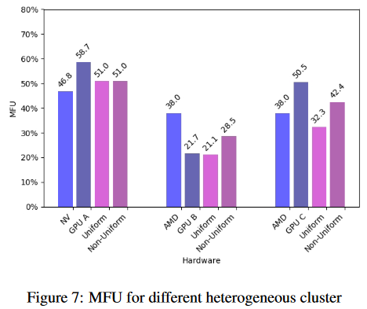

# HETHUB：大模型的异构分布式混合训练系统

## Abstract

大模型的开发依赖于大量的计算资源。例如，GPT-4 模型（1.8 万亿个参数）需要 25000 个 A100 GPU 进行训练。使用 GPU 加速器构建大规模集群是一个挑战。使用多种类型的GPU加速器构建集群是解决同构GPU加速器不足问题的有效途径。然而，__现有的大规模模型分布式训练系统仅支持同构GPU加速器，而不支持异构GPU加速器__。为了解决这个问题，本文提出了一种分布式训练系统，支持大模型的异构 GPU 加速器上的混合并行。它引入了分布式统一通信器来实现异构 GPU 加速器之间的通信、一个分布式性能预测器和一个自动混合并行模块，以利用异构 GPU 加速器高效地开发和训练模型。与具有同构 GPU 加速器的分布式训练系统相比，我们的系统可以支持六种不同的异构 GPU 加速器组合，并且异构 GPU 加速器的最佳性能至少达到同构 GPU 加速器理论上限性能的90％。

## 1 Introduction

随着人工智能技术的快速发展，大语言模型（LLM）如 GPT-4 (Achiam et al., 2023) 增长迅速。然而，它们的参数规模通常非常巨大，从数百万到数十亿、数万亿甚至数千万亿不等。这种规模的升级使得训练 LLM 所需的容量和计算能力变得异常庞大。例如，GPT-4 拥有约 1.8 万亿个参数，需要约 25,000 个 A100 GPU 进行训练。

目前，研究人员使用 Megatron-LM、DeepSpeed 、Pytorch 以及 NVIDIA GPU，如 A100、V100、H800 等来训练大模型。近年来，不同厂商的 GPU 加速器发展迅速，如海光、华为、汉无极等。然而，在很多场景下，使用单一类型的 GPU 加速器构建大规模集群是非常困难的。利用多种类型的 GPU 加速器训练大规模模型是解决 GPU 加速器不足问题的有效途径。例如，具有 700 亿个参数的 Llama3-70B 模型需要 900 个 Nvidia H100 GPU 训练超过 10 个月。如果有 500 个 Nvidia H100 GPU（1000  TOPs）、400 个华为 GPU 加速器（320 个 TOPs）和 700 个 AMD GPU 加速器（383 个 TOPs），我们无法使用单一类型的 GPU 训练 Llama3-70B 模型 -加速器，因为任何一种类型的 GPU 加速器都无法满足需求。但如果我们使用所有类型的 GPU 加速器，我们就可以训练 Llama3-70B 模型。因此，充分利用不同类型的 GPU 加速器来训练大模型是解决大量计算资源需求的好方法。

现有的大规模模型分布式训练系统（参数服务器， Prague 等）仅支持同构 GPU 加速器。为了使用异构 GPU 加速器训练大模型，我们确定了使用异构 GPU 加速器训练大模型的两个主要挑战：__1）通信挑战。目前，多种类型 GPU 加速器之间的有效通信非常复杂。这是因为制造商通常开发专有的通信库针对他们各自的加速器的架构做通信优化。2）发展和训练挑战。由于各类大模型的层结构和参数数量不同，在异构 GPU 集群上设计和实现分布式训练策略是很困难的。为集群上的特定模型确定分布式训练策略具有挑战性。这包括确定如何拆分数据和模型、将分区映射到设备、安排计算和通信等。优化空间随着模型层和 GPU 加速器的数量呈指数增长__。

针对上述挑战，我们提出了一种针对大模型的异构分布式混合训练系统。我们的主要贡献可概括如下：
1. 我们构建了一个分布式统一通信器来支持不同 GPU 加速器之间的通信。该通信器包括两个通信库，一个是带以太网或 IPoIB 基于 CPU 的 通信器；另一种是带有 IB 或 RoCE 的基于 GPU 的通信器，它定义了统一的通信接口以适应 GPU 加速器。 
2. 提出了一种分布式性能预测器来帮助评估模型在异构 GPU 加速器上的训练策略。我们对一个小集群进行自动 profiling 并构建性能评估模型。然后，该性能评估模型可用于进行性能预测，以指导更大规模集群上的分布式训练策略的决策。 
3. 我们引入了自动混合并行模块，它可以针对给定模型和异构集群拓扑自动搜索最佳分布式并行策略，提高开发和模型计算效率。

## 2 Background

自然语言处理、机器翻译等领域的大模型的成功，源于其庞大的参数，能够充分挖掘数据特征。然而，大量的参数也给大模型的分布式训练带来了挑战。大模型的分布式训练通常涉及数据并行、张量并行、流水线并行和自动并行策略。而如果我们使用不同类型的 GPU 加速器来训练大规模模型，还涉及到异构训练。接下来，我们将详细介绍这些策略。

### 2.1 Data Parallelism
数据并行（DP）是一种数据分割的并行方法。在数据并行中，数据集被分割成多个子数据集，而模型则在 GPU 之间复制。每个 GPU 分别训练其分配的子数据集，并在前向和反向传播后更新模型参数。然而，内存冗余带来了挑战，因为每个 GPU 都存储模型参数、优化器状态和梯度的重复副本。为了解决这个问题，DeepSpeed 引入了 Zero ，跨设备分布模型参数、优化器状态和梯度。因此，在数据更新期间，GPU 只需要更新各自的分区参数，而不是整个模型。

### 2.2 Tensor Parallelism
张量并行性 (TP) 涉及跨设备同时处理张量的不同部分。在张量并行中，输入张量被划分为子张量并分布在设备上。在完成某一层的计算后，设备可以将部分结果传输到下一层或其他设备以进行进一步处理。因此，像 All-Reduce 和 Broadcast 这样的通信操作通常在不同层之间或层内实现，以促进设备之间的数据交换和同步。然而，由于 All-Reduce 需要所有节点之间进行通信，而 Broadcast 需要将数据从一个节点传输到其他节点，因此对于节点数量较多的情况，这两种方法的通信开销很大。

### 2.3 Pipeline Parallelism
流水线并行（PP）将整个模型分割为多个阶段，并将一个阶段调度到一个节点或 GPU 加速器上，其中一个阶段包括 1 到 k 个模型层。在流水线并行中，批次通常在每个流水级内分为多个微批次，并且每个流水级的参数在模型初始化期间分配到各自的计算 GPU。这种方法通过跨不同阶段和微批次的重叠计算和通信来优化端到端训练时间。

目前主流的流水线并行方案包括 Gpipe 、PipeDream-1F1B 、PipeDream-2BW 和 Chimera 。 Gpipe 将每个阶段的批次划分为多个按顺序计算的微批次，从而允许微批次的计算在不同流水级之间重叠。然而，在这种安排中，阶段必须等待所有微批次的前向传播完成才能开始反向传播，因此需要存储微批次数量的激活，这会导致大量的内存消耗。相反，PipeDream-1F1B 布置交错前向和反向计算，要求每个流水级最多存储级数的激活，从而减少内存使用。虽然 PipeDream-1F1B 与 Gpipe 具有类似的流水线利用率，但它对气泡比进行了很大的优化。 PipeDream-2BW 比 PipeDream-1F1B 更进一步，将流水线分为两个桶，以改善计算和通信的重叠。它可能会带来更高的吞吐量和更好的利用率，但代价是增加复杂性和更高的通信负载，而异构集群不支持这些。 Chimera 是一种双向调度管道方法。两个微批次从第一个和最后一个流水级同时开始训练。因此与普通单向流水线相比气泡较少。然而，该方法需要每个流水级包含两部分模型参数，这增加了GPU内存的负担。

### 2.4 Auto-Parallel Strategy
由于模型结构的复杂性，模型的分布式并行策略的数量随着模型层数或算子的数量呈指数级增长。这使得基于专家经验手动调整并行策略的要求很高。为了解决这个问题，研究人员提出了自动并行方法。这些方法利用动态规划和图算法等技术来自动搜索模型的分布式并行策略。这些方法可以通过自动识别最佳或接近最佳的分布式并行策略来提高效率。

近年来，自动并行算法发展迅速诞生了一些著名的框架，如 FlexFlow 、D- rec、Piper 和 Alpa 。 FlexFlow 构建  SOAP  搜索空间并采用马尔可夫链蒙特卡罗 (MCMC) 算法来识别最佳的 intra-op 并行策略。双递归算法（D-rec）同时考虑 intra-op 和 inter-op 的通信成本，利用双层递归算法来确定最佳张量分片策略。

然而，这些方法只能搜索部分并行策略。对于训练大模型，必须结合多种并行方法。 Piper 引入两级动态规划来寻找数据并行和模型并行的分布式并行策略。 Alpa支持多种并行策略的联合搜索，将策略分为 intra-op 并行和 inter-op 并行，采用整数线性规划优化intra-op 并行，采用动态规划安排 inter-op 并行。然而，当 GPU 加速器是异构的时，这些框架的适用性仅限于设备具有相同计算时间的假设。

### 2.5 Heterogeneous Training
与使用一种 GPU 加速器的同构集群中的并行训练不同，异构场景引入了不同的计算和通信能力。__在通信方面，不同制造商的 GPU 加速器通常不共享统一的通信库，从而妨碍了远程直接内存访问（RDMA）的直接利用__。因此，采用基于 CPU 的通信会减少节点间带宽，从而降低数据传输速率。

在计算方面，各种 GPU 加速器的处理速度不同，意味着均匀的计算工作负载分布会导致不同的计算时间。这种现象会导致某些 GPU 加速器闲置，从而降低整体硬件利用率。因此需要合理安排计算以实现负载平衡。此外，硬件精度的异构性提出了必须解决的额外挑战，以确保模型的正确收敛。

支持异构集群的现有框架包括 BPT-CNN 、AccPar  和 Whale 。 BPT-CNN是一种适用于异构环境的数据并行算法，根据每个硬件的计算能力分配批次数量。它在每次训练迭代后根据硬件的实际性能动态调整批次分布。 AccPar 是一种张量并行算法，采用动态规划为每个算子导出最佳张量分片策略。

然而，这些并行方法仅限于单策略配置。 Whale 通过支持数据并行和流水线并行来扩展这些功能。它根据 GPU 加速器的计算能力采用数据并行划分，并根据 GPU 内存容量按降序排列流水级。综上所述，与同构 Cluster 中的模型训练相比，异构训练需要解决两个主要问题，模型结构复杂度和多种类型 GPU 造成的不同类型 GPU 加速器之间的通信问题和训练开发的效率问题。

## 3 DESIGN AND IMPLEMENTATION

我们提出了一种基于 Megatron-LM 和 Megatron-DeepSpeed 的异构分布式混合训练系统，适用于具有不同类型 GPU 加速器的集群中的大模型。与现有的分布式系统相比，我们的系统在通信层和计算层进行了优化。在通信层，我们提出了一种分布式统一通信器来支持异构 GPU 加速器之间的通信。该通信器包括一个基于 CPU 的以太网或 IPoIB 通信器（Kashyap，2006）和一个基于 GPU 的 IB 通信器。在计算层，引入了分布式性能预测器和自动混合并行模块，以协助异构 GPU 加速器的模型部署和训练。异构分布式混合训练系统的优化如图 1 所示，其中硬件层显示了我们系统支持的 GPU 加速器。接下来，我们将详细描述这些优化。

### 3.1 Distributed Unified Communicator
为了解决不同类型GPU加速器之间的通信问题，我们提出了一种分布式统一通信器。我们根据软硬件适配、通信性能等多个维度，提出了两种通信器，一种是基于 CPU 的带以太网或 IPoIB 的通信器，一种是基于 GPU 的带 IB 的通信器。

\
对于图 2 所示的基于 CPU 的以太网或 IPoIB 通信器，其通用性是通过对其性能进行部分权衡来保证的。数据信息首先 deep copy 到 CPU 内存（节点1）中，然后通过以太网或 IPolB 传输到另一个 CPU 内存（节点2）。然后，数据从 CPU 内存深度复制回节点 2 中的 GPU。这种解决方案具有高度通用性，可以支持与任何类型的 GPU 加速器的异构通信。但这种结构的通信链路较长，导致传输性能受到整个过程中通信效率最差的限制，并且涉及多次数据复制操作，导致整体性能较差。

图 3 所示的带有 IB 的基于 GPU 的通信器基于 RDMA 理论（Kalia et al., 2014）。RDMA 通过重构底层 API 来实现通用的集合通信库（Kułakowski，2012），以确保使用我们的框架在不同的硬件架构上执行数据通信。RDMA 允许只要数据封装一致，通过网络接口控制器直接传输存储在设备存储器中的数据，通信效率更高。

\
然而，不同的 GPU 制造商总是开发自己的集合通信库。不同的库导致不同的数据通信封装和方案。为了解决这个问题，我们提出了一个通用的集合通信库，它在调用 RDMA 之前解压缩自封装的数据，然后在传输数据之前将其重新打包成一致的格式。在通信库实现的基础上，进一步定义了通用的通信协议和标准算子接口，可供其他新产生的 GPU 加速器构建通信库，从而实现彼此之间的异构通信。

### 3.2 Distributed Performance Predictor
精心设计的分布式并行策略可以显着提高集群的吞吐量。但为大模型开发有效的分布式并行性是一个挑战，因为这些模型结构复杂，需要数千个 GPU 进行训练。手动设计最佳的分布式并行策略可能非常耗时且耗电，因为有大量的分布式并行策略可用于训练具有数千个 GPU 的大规模模型。性能预测器（Fan et al., 2021；Jia et al., 2019）是一种高效且省时的替代方案，用于模拟不同的并行策略。但现有的性能预测器只能为同构 GPU 加速器上的大模型提供最佳并行策略指导，而不能为合适的异构 GPU 加速器提供指导。本文提出了一种分布式性能预测器，它可以呈现异构集群拓扑，以模拟异构集群中大模型的分布式训练。它将给出计算不同并行策略下最大内存使用量和运行时间的模拟或预测结果。详细信息如图4所示。

\
分布式性能预测器包括两个主要模块：

1.分布式图生成器：该模块根据模型结构和给定的分布式并行策略生成分布式子图。模型 operators 将分配给每个图，并且通信 operators 将插入到图之间。 

2.工作负载模拟器：该模块旨在模拟异构 GPU 集群中训练的整体 runtime 行为。它首先分析真实的集群信息，包括 GPU 带宽、同构 GPU 通信、异构 GPU 通信以及 fp16 精度的 GPU TFLOPs。随后，它使用 profiling 结果和生成的分布式图来模拟模型的工作负载。这涉及前向和反向传播、参数更新以及训练过程中涉及的其他计算。模拟器记录每个迭代步骤的时间成本和最大内存使用量。

基于分布式性能预测器，我们可以为大规模异构集群中的模型找到最优的分布式并行策略，且效率高、成本低。

### 3.3 Automatic Hybrid Parallelism
GPU集群的异构性导致分布式并行策略的数量随着设备或模型层的数量呈指数增长。之前的研究（Kennedy and Kremer，1998；Liang et al.，2023）声称寻找最优的分布式并行策略是一个 NP 难问题。针对这个 NP 难问题，我们在本文中提出了一种自动混合并行方法。它可以根据给定的模型结构和异构集群拓扑自动搜索最优或接近最优的分布式并行策略。

由于 all-reduce 算子聚合模型参数，数据并行和张量并行具有较高的通信成本。相比之下，流水线并行只需要子模型之间进行点对点的数据通信。我们的方法采用数据并行与同构节点上的节点内张量并行和跨异构节点的流水线并行性相结合。为了保证训练结果的正确性，流水线并行满足 Pipedream-1F1B 方案的数据约束。具体设计如图5所示：

\
3.3.1 Construct search space
基于 3D 并行策略构建三层搜索树，其中根节点代表整个模型，其他节点代表分裂后的子模型。此外，叶节点代表在单个 GPU 加速器中执行的最终模型。第一层使用非均匀流水线并行划分策略根据 transformer 层的总数分割模型。拆分的目的是确保不同类型 GPU 加速器的计算负载平衡。第二层使用统一的数据并行策略将子模型分割为同构节点。第三层使用统一张量并行策略将模型分割为 GPU 加速器。经过三层分裂后，完整的模型可以映射到异构混合集群上进行训练。

3.3.2
为了充分利用异构 GPU 加速器资源，我们给出了两条以负载均衡和最小端到端训练时间为目标的规则，以指导在构建的搜索树中进行分布式并行策略搜索。

1.负载均衡：根据异构 GPU 加速器的计算资源和模型层的计算需求，对模型层进行不规则划分，尽可能平衡不同 GPU 加速器之间的计算任务。也就是说，具有高计算资源的 GPU 加速器可以执行更多层。 

2.最小端到端训练时间：在流水线并行方法中，最慢的流水级决定端到端训练时间，而所有其他 GPU 加速器必须等待。如果最慢的流水级最后执行，模型的端到端训练时间会特别长。但如果最慢的流水级是在开始时，第一个 GPU 加速器的等待时间将会减少，从而减少模型的端到端训练时间。因此，我们根据不同类型 GPU 加速器上的计算时间降序来安排流水级，以优化端到端训练时间。

基于上述规则，我们使用深度优先搜索（DFS）算法结合分布式性能模拟器来为大模型搜索分布式并行策略。我们使用分布式性能模拟器来评估模型的 1 到 N 个解码器层的每个流水级所需的时间。然后，我们使用 DFS 算法遍历搜索树，检查搜索树节点的当前状态是否满足我们的规则。__到达叶节点后，我们根据当前分配下的估计时间对流水级进行降序排序，以生成候选的分布式并行策略__。并使用分布式性能模拟器来评估候选的分布式并行策略。最终，我们选择评估成本最低的分布式并行策略。

## 4 EXPERIMENTS
为了验证混合分布式训练系统的有效性和性能，本文使用Llama2-7B、Lllama2-13B 模型在 NV、AMD 等类型的 GPU 加速器上进行异构训练实验。此外，本文还比较了同构集群环境下的通信效率、吞吐量和 MFU 。

### 4.1 Model and DataSet
在本实验中，我们使用语言模型 Llama2-7B 作为测试模型。 Llama2（Touvron 等人，2023）是预先训练和微调的大型语言模型 (LLM) 的集合，其规模从 70 亿到 700 亿个参数不等。

对于数据集，本文使用 Dolma 和 MAP-CC 。 Dolma 数据集（Soldaini 等人，2024）是一个包含 3 万亿 tokens 的开放数据集，这些 tokens 来自各种网络内容、学术出版物、代码、书籍和百科全书材料。 MAP-CC（Massive Appropriate Pretraining Chinese Corpus）数据集（Du et al., 2024）是由多模态艺术投影、复旦大学、北京大学等机构开发的大规模开源中文预训练数据集。该数据集包含 800 亿个 tokens，由多个子集组成，每个子集来自不同的数据源，例如博客、新闻文章、中文百科全书、中文学术论文、中文书籍等。

本文使用通信、model flop utilization (MFU) 和吞吐量作为性能指标。

4.1.1 Test Environment
我们的异构分布式混合训练系统是基于 Megatron-LM 和 Megatron-DeepSpeed 构建的。硬件环境和实验参数配置如下。

硬件环境：我们测试了五种类型的GPU加速器，分别标记为 NV、AMD、GPU A、GPU B 和 GPU C。我们使用 8 个相同类型的 GPU 加速器作为同构训练环境，并使用三组两种类型的 GPU-异构训练环境采用加速器，包括8 NV + 8 GPU A、8 AMD + 8 GPU B、8 AMD + 8GPU C。

\
实验参数：同构训练的实验参数配置如表 1 所示。实验时设置数据并行度(DP)=2，张量并行度(TP)=2，实验精度为 fp16，序列长度=1024 ，批量大小 = 1024 ，微批量大小 = 1，并使用 flash-attn 。对于异构训练，除了数据并行度扩展至 4 之外，实验参数的配置与同构训练几乎相同。

### 4.2 Performance Analysis

4.2.1 Communication

在本研究中，我们使用 Llama2-7B 和 Llama2-13B 模型以及流水线并行度（PP） = 2 和 P P = 4 的流水线并行度配置来评估不同节点之间的通信效率。基于 CPU 的以太网通信器的实验表明，可以实现节点内通信效率 4.7GB/s，节点间通信效率 2.1GB/s。Llama2 模型中点对点通信的通信成本 $T_{com}$ :

\
其中 B 表示批量大小，L 是序列长度，H 表示每个隐藏状态中的特征数量。

根据等式（1），我们确定节点内理论点对点通信时间为 5 ms，节点间通信理论点对点通信时间为 3 ms。在流水线并行期间，计算时间和流水级间通信时间可以重叠。因此，为了减轻基于 CPU 的以太网通信器造成的性能损失，必须确保每个流水级的实际计算时间超过理论的通信时间。

4.2.2 Throughput
吞吐量是通过一个 GPU 加速器在一秒钟内计算的 tokens 数量来衡量的。可以根据式（2）计算：

\
其中 L 表示训练数据的序列长度，G 表示一次迭代的全局批量大小，S 表示训练中使用的 GPU 加速器的数量，T 代表训练一次迭代所花费的时间。本文进行了 3 次异构训练实验来验证吞吐量性能。

实验结果包括非均匀切片策略和均匀切片策略。非均匀切片策略根据异构集群计算能力的差异，按 Transformer 层对模型进行分割。统一切片策略根据流水线并行阶段均匀地分割模式。

实验结果表明，异构集群下，非均匀切片策略的吞吐量明显优于均匀切片策略。在我们的测试中，通过使用非均匀切片策略，根据式（3），吞吐量性能 $P_{throughput}$ 达到加性同构 GPU 加速器理论性能的至少 90%。 

\
其中 $TGS_{all}$ 和  $S_{all}$ 表示异构集群中每个 GPU 每秒的 token 数和 GPU 集群的总数，$TGS_A$ 和 $TGS_B$ 表示 GPU A 和 GPU B 的每个 GPU 每秒的 token 数，$S_A$ 和 $S_B$ 是 GPU 加速器 A 和 GPU 加速器 B 的大小。

实验结果如图 6 所示。

\
该图显示，当两个异构集群的性能接近时，通过保持模型均匀分割可以保持良好的整体吞吐量性能。异构训练几乎没有性能损失。当两个 GPU 加速器之间的性能差异较大时，需要采用非均匀分割策略。例如，Llama2-7B 的训练吞吐量在采用 AMD GPU 加速器的同构集群中可达到 1478 T/G/s，在采用 GPU 加速器 B 的同构集群中可达到 673 T/G/s，在采用 GPU 加速器的同构集群中可达到 748 T/G/s。 AMD GPU 加速器和 GPU 加速器 B 的异构。与同构训练的吞吐量相比，异构训练的性能损失约为 31%。采用 28:4 比例的非均匀切片策略，AMD GPU加速器和 GPU 加速器 B 的异构吞吐性能可达 985 T/G/s。与同构训练相比，性能损失为8%。

同样，Llama2-7B 的训练吞吐量在使用 AMD GPU 加速器的同构集群中可以达到 1341 T/G/s，在使用 GPU 加速器 C 的同构集群中可以达到 887 T/G/s，在使用 GPU 加速器的同构集群中可以达到 795 T/G/s。异构与 AMD GPU 加速器和 GPU 加速器 C。与同构训练的吞吐量相比，异构训练的性能损失约为 29% 。采用 20:12 比例的非均匀切片策略，AMD GPU 加速器和 GPU 加速器 C 异构下吞吐量性能可达 1044 T/G/s。与同构训练相比性能损失 6% 。

4.2.3 MFU
模型 FLOP 利用率（MFU）是假设 100% 峰值 FLOP 时实际吞吐量与理论最大吞吐量的比率。MFU 的定义如式（4）所示。 我们在与上一节相同的环境中计算 MFU。

其中，$T_{test} $ 代表集群中每个 GPU 以 fp16 精度测试的 TFLOPS，$T_{peak}$ 指以 fp16 精度计算的理论峰值 TFLOPS。如果测试异构集群，峰值 TFLOPS 是所有 GPU 加速器的平均值。

结果表明，在确定的前提下，MFU 在同构集群中，由于负载不平衡，在异构集群中使用统一切片策略会导致整体 MFU 与同构集群中较低的 MFU 相似。然而，使用非均匀切片可以充分利用每个 GPU 加速器的计算能力，并且 MFU 位于两个 GPU 加速器的 MFU 之间的中间。

\
图 7 显示，在 Llama2-7B 上训练时，使用 Nvidia GPU 加速器的同构集群中，MFU 可以达到 46.8%，使用 GPU 加速器 A 的同构集群中，MFU 可以达到 58.7%。在使用 Nvidia GPU 加速器和 A GPU 加速器的异构集群中采用 16:16 比例均匀切片，MFU 可达51.0%。此外，这也是使用非均匀切片的最佳结果。

在采用 AMD GPU 加速器的同构集群中，MFU 可以达到 38.0%；在采用 GPU 加速器 B 的同构集群中，MFU 可以达到 21.7%；在采用 AMD GPU 加速器和 GPU 加速器 C 的异构集群中，MFU 可以达到 21.1%，低于两个同构集群的性能。采用28:4 比例的非均匀切片策略，AMD GPU 加速器和 GPU 加速器 B 异构中的 MFU 可以达到 28.5%，位于两个同构集群的中间。

同样，在使用 GPU 加速器 C 的同构集群中，MFU 可以达到 50.5%，在使用 AMD GPU 加速器和 GPU 加速器 C 的异构集群中，MFU 可以达到 32.3%，低于两个同构集群的性能。采用 20:12 比例的非均匀切片策略，AMD GPU 加速器和 GPU 加速器 C 异构中的 MFU 可以达到 42.4%，位于两个同构集群的中间。

## Conclusion
在这项工作中，我们设计并实现了一个在异构 GPU 加速器上支持混合并行的分布式训练系统。它支持不同类型 GPU 加速器之间的通信，通过自动并行和性能模拟器实现模型的高效开发、部署和训练。实验表明，该系统可以支持六种不同的异构 GPU 加速器组合，并且每种组合的最优性能至少达到了加性同构 GPU 加速器理论上限性能的 90%。该方法同样可以将集群规模扩展到一百甚至一千个 GPU 加速器，有效支持大规模异构集群上的训练任务。