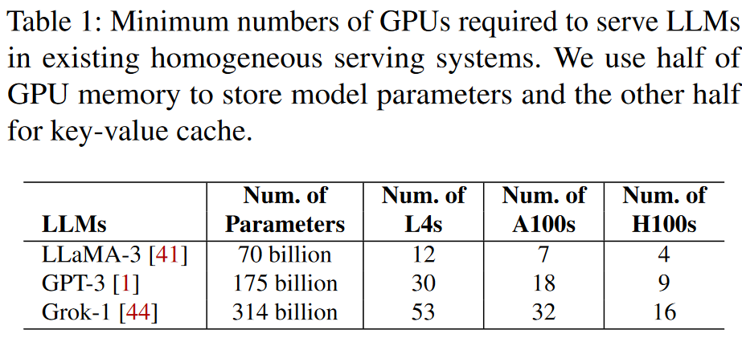
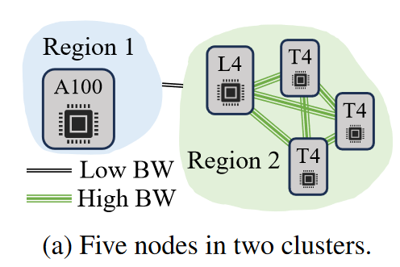
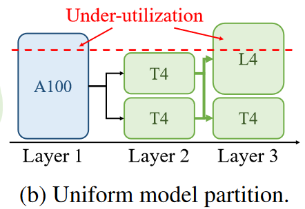
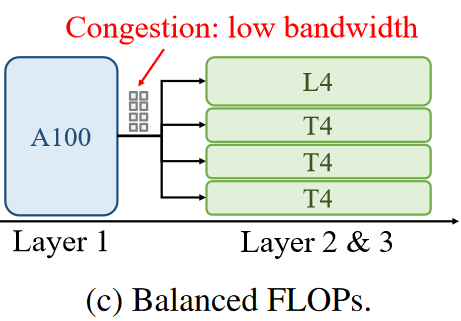
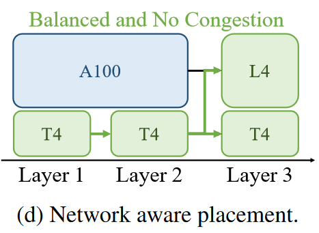
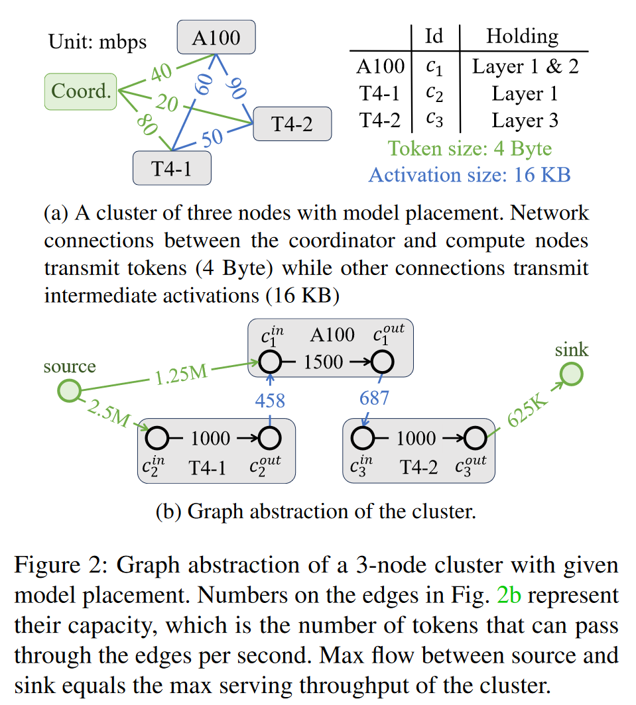
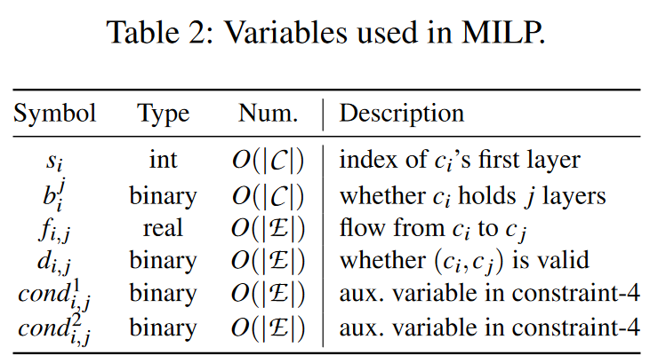
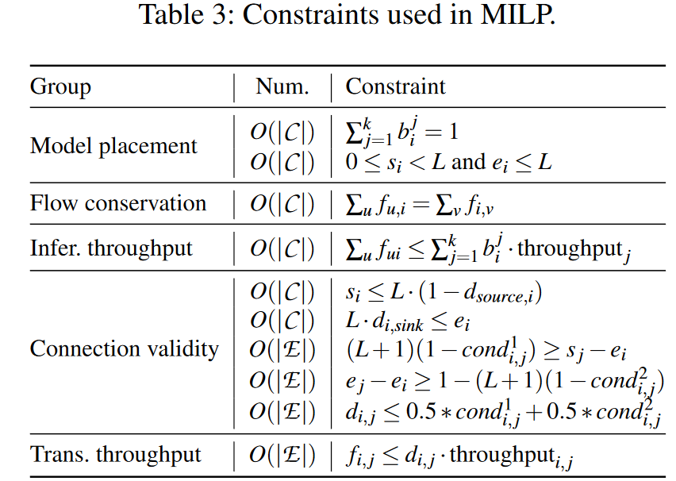
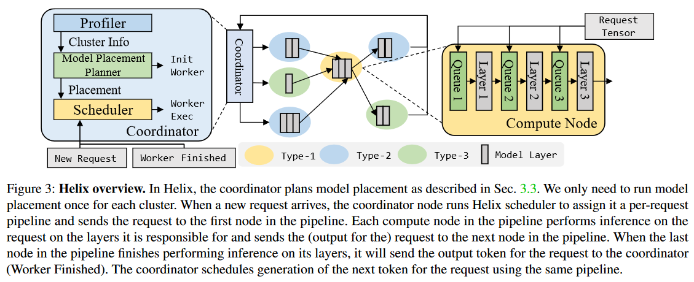
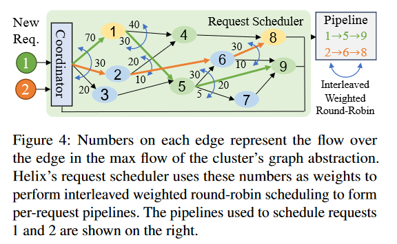

# Helix: Distributed Serving of Large Language Models via Max-Flow on Heterogeneous GPUs

## Abstract
本文介绍了 Helix，这是一种服务于异构 GPU 集群的高吞吐量、低延迟大语言模型 (LLM) 分布式系统。 Helix 背后的一个关键思想是将异构 GPU 和网络连接上的 LLM 推理计算制定为有向加权图的最大流问题，其节点代表 GPU，边通过其能力捕获 GPU 和网络异构性。然后，Helix 使用混合整数线性规划 (MILP) 算法来发现高度优化的策略来服务LLM 。这种方法允许 Helix 联合优化模型放置和请求调度，这是异构 LLM 服务中两个高度纠缠的任务。我们对 24 到 42 个 GPU 节点的多种异构集群设置的评估表明，与现有最佳方法相比，Helix 将服务吞吐量提高了 2.7 倍，并将 prompting 和 decoding 延迟分别降低了 2.8 倍和 1.3 倍。

## 1 Introduction
GPT-4 和 LLaMA-3 等生成式大语言模型 (LLM) 已展现出在一系列应用领域创建自然语言文本的卓越能力。然而，现代 LLM 日益庞大的模型规模和高计算要求使得在现代云平台上廉价高效地为其提供服务变得具有挑战性。特别是，当今大多数 LLM 服务系统（例如 Orca 和 vLLM ）都以同构 GPU 集群 为目标，其中所有 GPU 都属于同一类型，并且具有相同的内存容量和计算资源。由于模型大小不断增加，使用同构 GPU 服务 LLM 需要越来越多的 GPU，如表 1 所示。此外，为行业中使用的最先进的 LLM 提供服务需要更多资源。我们观察到用单个云域给其分配 GPU 不可行。

\
由于 GPU 架构设计的进步以及随着时间推移的增量部署，现代云平台越来越多地由多种 GPU 类型组成。这些异构 GPU 分布在世界各地的数据中心，与单个 GPU 类型相比，它们共同提供更大的内存容量和更多的计算资源，从而为 LLM 服务提供更易于访问和扩展的方法。同样，还有一种趋势是使用自愿消费 GPU 来解决 GPU 稀缺问题。然而，与同构 GPU 相比，在地理分布式异构实例上部署 LLM 需要适应各种 GPU 设备和网络条件。

先前的工作已经介绍了几种用于在异构设备 [HetPipe, HAP] 或地理分布式环境 [Gaia] 上运行机器学习 (ML) 计算的系统。但它们大多数都是为长时间运行的训练工作负载而设计的，无法适应具有实时推理请求的 LLM 服务场景。例如，与我们最密切相关的工作是 Petals [4]，它使用流水线模型并行将 LLM 划分为多个流水级，并采用贪心算法以循环方式将异构 GPU 分配给这些流水级。这种吞吐量优化设计对于长时间任务有效，但缺乏交互式 LLM 应用程序（如需要快速响应的聊天机器人）所需的响应能力。

为了利用异构 GPU 资源进行 LLM 服务，我们提出了 Helix，这是一种分布式系统，可在异构 GPU 上实现高吞吐量、低延迟的 LLM 服务。 Helix 背后的关键思想是 __将异构 GPU 和网络上服务的 LLM 的执行表述为不同 GPU 计算能力、内存容量以及复杂的 GPU 间连接约束下的数据流问题__ 。据我们所知，Helix 是第一个专为地理分布式异构 GPU 设计的服务系统。接下来，我们介绍 Helix 必须解决的关键挑战以及 Helix 的解决方案。

首先，由于 LLM 的规模不断增加，在现代 GPU 上为它们提供服务需要采用张量和流水线模型并行将 LLM 划分为多个流水级，并将这些流水级放置在不同的 GPU 上，我们将这一任务称为模型放置。同构服务系统（例如 Orca ）将 LLM 划分为大小相等的流水级并将它们分配给 GPU。这种方法会导致高性能 GPU 的利用率不佳，因为它适应了功能较弱的 GPU 的内存和计算限制。现有的异构感知服务系统（例如 Petals [4]）依靠不同的启发式方法将模型划分为多个流水级并将其分配给 GPU。现有的启发式方法并未同时考虑 GPU 和网络异构性。

__Helix 将模型布局表述为有向加权图的最大流问题，其节点代表 GPU ，边通过其在最大流问题中的能力捕获 GPU 和网络异构性。然后，Helix 使用混合整数线性规划 (MILP) 算法来发现高度优化的模型放置策略，该策略在很大程度上优于先前工作中使用的启发式方法 [4]__。

Helix 必须解决的第二个挑战是请求调度。为了满足 LLM 请求，Helix 需要选择 GPU 流水线来计算 LLM 的所有层。现有系统通常采用一组固定流水线，并以循环方式将请求分配给这些流水线。使用固定流水线不够灵活，无法适应异构计算和网络条件，并且经常导致利用率不足。相反，Helix 引入了按请求流水线，其中每个请求都分配有自己的流水线。因此，潜在流水线的总数等于集群图形表示中从源到接收器的路径数量，这为 Helix 提供了足够的灵活性，可以最大限度地利用 GPU 及其之间的网络连接的全部容量。

我们在 vLLM 之上实现了 Helix，并在 24 到 42 个节点、最多 7 种不同节点类型的三个异构集群上对其进行了评估。我们评估的型号包括 LLaMA 30B 和 70B。与异构感知 Baseline 相比，Helix 将服务吞吐量提高了 2.7 倍，同时将平均 Prompting 和 Decoding 延迟分别减少了 2.8 倍和 1.3 倍。

总之，本文做出了以下贡献：（1）第一个在异构 GPU 上提供高吞吐量、低延迟 LLM 服务的系统，（2）LLM 服务的最大流公式和优化模型放置的 MILP 算法； (3) 每个请求的流水线以最大化 GPU 利用率； (4) 我们的技术的实施以及对各种 LLM 基准的评估。我们将在论文审核后发布 Helix，以方便未来的研究。

## 2 Background
### 2.1 LLM Architecture and Serving
当今大多 LLM 都采用仅解码器的 Transformer 架构，该架构首先将自然语言查询转换为 token 序列。然后，模型将 token 转换为隐藏状态向量，其大小称为模型的隐藏大小。 Transformer 模型由输入和输出嵌入以及一系列相同的 Transformer 层组成，每个层都包含一个自注意力和一个前馈块。自注意力块计算每对 token 之间的“分数”，并根据上下文相关性得分更新每个 token 的隐藏状态。前馈块通过非线性函数独立修改每个 token 的隐藏状态。

给定输入序列，Transformer 模型计算下一个 token 的概率分布，并从该概率分布中采样。因此，该模型应用自回归来生成整个输出序列：给定输入提示，模型运行多次迭代。在第一次迭代（称为 prompt 阶段​​）时，模型处理所有提示 token 并生成第一个输出 token 。在随后的迭代中，即所谓的 decode 阶段，模型结合提示和先前生成的 token 来预测下一个输出标记。当模型产生特殊的句尾信号（⟨eos⟩）时，该迭代过程停止。由于生成输出是不可预测的，因此在序列完全生成之前，确切的迭代次数仍然不确定。

除了不可预测的执行迭代之外，LLM 服务的另一个特点是高内存需求。自注意力块需要所有先前 token 的隐藏状态作为输入。为了存储新生成的 token 的隐藏状态（称为 KVcache），内存需求随着生成过程不断增加。

为了解决这些挑战，Orca [46]提出了迭代级调度，它在每次迭代时更新一个批次，以避免当请求完成但同一批次中的其他人需要更多迭代时资源保留； vLLM [16] 引入了 PagedAttention，为具有相同页面的 KV 缓存管理内存，并仅在请求用完其所有页面时才分配新页面；多查询[33]和组查询注意[3]修改了自注意机制以减少为每个 token 存储的 KV-cache 的大小。

### 2.2 Distributed Model Serving
开源 LLM 现在具有多达数千亿个参数，远远超过单个 GPU 的内存容量。因此，为 LLM 提供服务需要多个 GPU 并行运行。张量并行性 (TP) 在 GPU 之间划分每个算子的权重，通过 AllReduce/AllGather 操作收集每个设备上的部分结果。然而，TP 对网络状况高度敏感。对于每个 Transformer 层，它需要两次通信。因此，TP 在高延迟网络中具有显着的开销，并且仅在节点内的 GPU 之间使用。

相反，流水线并行 (PP)  在 GPU 上分配不同的运算符（通常是多个层）以创建多个流水级。然后，它将输入分割成微批次，并通过流水线运行它们。 PP 仅在流水级的边界传输激活张量。因此，PP 对网络的敏感性要低得多。然而，完美划分模型和输入批次具有挑战性，这会导致气泡。因此，PP 会遭受气泡时设备空闲的问题，需要仔细调度才能保持性能。

传统的数据中心设置通常假设同构集群：具有统一带宽的统一节点。因此，模型被均匀地划分为流水级并分配给每个设备。然而，随着 LLM 服务规模的不断扩大以及最新一代 GPU 的短缺，使用异构设备服务 LLM 成为了一项关键需求，而之前的工作并未对此进行充分研究。

在异构 GPU 上为 LLM 提供服务需要考虑硬件和网络的异构性。例如，模型层的均匀划分可能无法充分利用功能更强大的设备。此外，节点可能位于多个区域中。必须考虑不同区域之间的带宽差异。

为了应对这些挑战，Petals [4] 引入了贪婪的设备分配和请求路由。它专注于分布式设置，允许设备热插拔。对于设备放置，它将新设备分配到效率最低的流水级。对于网络拓扑，它通过优先考虑低延迟网络来路由每个请求。然而，这种贪婪的在线方法在异构集群场景中是次优的，其中所有节点的信息都是已知的先验。 SWARM [31] 专注于异构集群中的模型训练。它将模型均匀地划分为流水级。当将请求路由到下一个流水级时，它会根据每个候选者的实时吞吐量选择副本。

## 3 Optimization Formulation in Helix
本节首先提供 LLM 服务系统的数学抽象。基于这个公式，我们将异构 LLM 建模为最大流问题。最后，我们应用混合整数线性规划（MILP）来搜索具有最高最大流量的模型放置策略。

### 3.1 Formulation of LLM Serving
为LLM提供服务的集群通常包含一个协调节点 h 和一组计算节点 C 。每个计算节点 $c_i ∈ C$ 都有一个计算吞吐量 $T_i$ 和给定的 GPU VRAM 大小。集群中节点之间的网络连接已经给出了它们的吞吐量和延迟。基于集群信息，LLM 服务需要找到模型层到计算节点的位置，以最大限度地提高服务性能。模型放置函数 $Ψ : C → P ( M )$ 将计算节点作为输入并返回模型 M 的（通常是连续的）子集。评估模型放置的一种广泛使用的指标是具有最低计算能力 $min_i \sum_j capacity( j) · 1_{i∈Ψ(j)}$ 的流水级的性能。正如我们将在下面展示的，仅考虑计算容量会导致异构集群的次优模型放置。

基于模型放置，LLM 服务需要一个能够高效服务集群中请求的请求调度策略。请求调度策略 $φ : R → C^k$ 输入一个请求并输出一系列计算节点，这些计算节点形成执行 LLM 所有层的完整流水线。

在深入研究异构 LLM 服务的 Max-Flow 公式之前，我们首先使用一个示例来说明为什么我们需要在 Max-Flow 问题中共同优化模型分区、设备放置和请求调度。

\
在此示例中，设备如图 1a 所示。有两个区域之间的带宽较低。区域 1 拥有强大的 A100 GPU，而区域 2 拥有性能稍弱的 L4 GPU 和 3 个 T4 GPU，但该区域内的带宽较高。如果我们按照常见的方法，首先对模型进行分区，然后将设备分配给每个分区，则放置计划将如图 1b 所示。

\

在这个计划中，虽然最后一个流水级有一个 T4 和一个 L4  GPU，但它的吞吐量受到前一个流水级的输出吞吐量的限制，而前一个流水级只有 2 个 T4 GPU。这表明有必要共同优化流水线划分策略和流水级的放置。

\
然而，即使每个流水级的算力完全平衡，如图 1c 所示，解决方案仍然可能不是最优的。在此解决方案中，它分配强大的 A100 单独服务某些层，而其他 GPU 以数据并行方式运行其余层。然而，从一个流水级到另一流水级的通信成为瓶颈。对于每个请求，其中间状态通过低带宽从区域 1 发送到区域 2。这最终会在 A100 的发送端造成拥塞。

\
相反，图 1d 分配了两个与 A100 并行运行的 T4 GPU。这样可以在 A100 GPU 和两个 T4 GPU 之间分配工作负载，从而减少慢速链路上的通信量。

### 3.2 Heterogeneous LLM Serving as Max-Flow
为了优化模型放置，Helix 需要一种方法来确定不同模型放置的最大服务吞吐量。为了实现这一目标，我们将具有指定模型层的计算节点集群转换为具有边缘容量的有向图。__边缘容量表示计算节点和网络连接每秒可以处理和传输的 token 数量__。图中源点和汇点之间的最大流量（代表协调器节点）为我们提供了当前模型放置的集群的最大服务吞吐量。下面我们展示了具有给定模型放置的集群图抽象的形式化构建。

对于具有协调节点 h、一组计算节点 C 和模型放置 Ψ 的给定集群，我们可以将集群中的实体转换为其图抽象的元素，如下所示。图 2 显示了具有给定模型放置的集群的图形示例。

\
__计算节点__。对于每个计算节点 $c_i ∈ C$ ，我们用图中的两个连接的顶点来表示它。我们将这两个顶点命名为 $c^{in}_i$ 和 $c^{out}_i$ 。有向边的容量 ($c^{in}_i$, $c^{out}_i$) 表示该节点在一秒内可以处理的最大 token 数。它是节点计算和网络吞吐量的最小值。 Helix 执行一次 profiling 来测量所有计算节点的吞吐量。

__协调节点__。我们将协调节点表示为图中的源点和汇点。

__网络连接__。在给定的集群中，节点可以与任何其他节点通信，从而在不同节点之间创建 $O(|C|^2)$ 可能的定向网络连接。但是，根据模型放置，这些连接中只有一部分是有效的，如下所述。有效的连接应满足以下三个标准之一： (1) 连接是从协调器节点 h 到计算节点 $c_i$ 且 $c_i$ 持有模型的第一层； (2) 连接是从计算节点 $c_j$ 到协调节点 h 的，并且 $c_j$ 保存模型的最后一层； (3) 连接是从一个计算节点 $c_i$ 到另一计算节点 $c_j$ 的，并且 $c_j$ 保存在对 $c_i$ 进行推理后立即需要的模型层。对于第一种和第二种情况，我们分别表示与有向边（source，$c^{in}_i$）和（$c^{out}_i$，sink）的连接，其容量等于连接带宽除以 token 的传输大小（几个字节）。对于第三种情况，我们用有向边 ($c^{in}_i$ , $c^{out}_i$) 表示连接，容量等于连接带宽除以激活的传输大小（数十千字节）。该模型对不同节点之间的网络连接速度所施加的吞吐量约束进行了建模。我们将可能的网络连接的完整集合表示为 $E$ 。

在构建集群的等效图抽象之后，__我们运行预流推送算法[6]来获得源点和汇点之间的最大流量__。这里的一个流量单位代表一个可以通过计算节点的 token 或一秒内的网络连接。因此，最大流量为我们提供了当前模型放置的集群的最大可能服务吞吐量。

### 3.3 Optimal Model Placement with MILP
上一节介绍了一种获取给定模型放置的集群最大服务吞吐量的方法。在本节中，我们将介绍一种基于混合整数线性规划 (MILP) 的方法，以找到最大化最大流量的模型放置，从而最大化服务吞吐量。 MILP 公式具有线性数量的变量以及关于计算节点和网络连接数量的约束。解决的关键挑战包括（1）将系统级约束表述为要满足的线性数量的条件，（2）用线性数量的变量表达这些条件，以及（3）使用辅助变量（具体而言，每个约束）对每个条件进行线性化在最多两个辅助变量的帮助下表示为最多三个线性约束。表 2 和 3 中显示了变量和约束的概述。

\
__节点变量__。为了表示每个计算节点上的模型放置，我们在 MILP 公式中引入了两组变量。假设模型总共有 L 层，每个计算节点保存模型的连续子集。对于每个计算节点 $c_i$ ，我们引入一个整形变量 $s_i$ 来表示 $c_i$ 持有的第一层。假设计算节点 $c_i$ 的 GPU 上最多可以容纳 k 层，我们进一步引入 k 个二进制变量 $b^1_i, b^2_i,..., b^k_i$ 来表示节点 c 拥有的层数 ( $b^j_i = 1$ 如果 $c_i$ 有 j 层)。我们选择用 k 个二元变量（而不是层数的一个整数）来表达模型布局，因为这一公式有助于表达推理吞吐量约束，如下所述。 $c_i$ 的末端层索引可表示为 $e_i = s_i + \sum^k_{j=1} j · b^j_i$ 。因此，$c_i$ 保留范围 $[s_i, e_i)$ 内的层。

__连接变量__。我们引入两组变量来限制可以通过集群中每个网络连接的推理请求的数量。对于计算节点 $c_i$ 和 $c_j$ 之间的网络连接，我们引入一个实数变量 $f_{i,j}$ 来表示图抽象中从 $c^{out}_i$ 到 $c^{in}_j$ 的流量。我们进一步引入一个二进制变量 $d_{i,j}$ 来表示网络连接是否有效（如 3.2 节中定义）。下面我们介绍的约束将使用 $d_{i,j}$ 来保证请求只能通过有效的连接进行传输。对于协调器节点和计算节点之间的网络连接，我们类似地引入两个变量，但将 i/j 替换为 source/sink。

__约束1：模型放置__。为了确保 MILP 求解器找到的模型放置有效，我们需要对每个计算节点 $c_i$ 有以下两个约束。首先，$c_i$ 应该只有一个有效的模型放置，即 $Σ^k_{j=1} b^j_i = 1。此外，$c_i$ 所持有的第一层和最后一层必须在 L 层范围内，即 $0 ≤ s_i < L$ 且 $e_i ≤ L$ 。

__约束2：流量守恒__。对于每个计算节点 $c_i$，由于流量守恒，进入 $c^{in}_i$ 的流量之和必须等于流出 $c^{out}_i$ 的流量之和。该约束可以表示为 $Σ_u f_{u,i} = Σ_v f_{i,v}，其中 u 和 v 枚举除 i 之外的所有节点。

__约束 3：推理吞吐量__。对于计算节点$c_i$，通过($c^{in}_i , c^{out}_i$ )的流量不应大于其最大推理吞吐量。我们可以用 $Σ_u f_{ui} ≤ Σ^k_{j=1} b^j_i · T_j$来施加这个约束。这里，$T_j$ 是一个常量，表示节点 $c_i$ 在持有 j 层时一秒钟可以处理的最大 token 数量，这是通过一次性分析过程获得的。

__约束4：连接有效性__。我们需要判断网络连接的有效性，以了解请求是否可以通过它们传输。对于从协调节点到计算节点 $c_i$ 的网络连接，仅当 $c_i$ 持有模型的第一层时才有效。为了用 MILP 表达这个约束，我们需要将其线性化为以下形式：$s_i ≤ L·(1 − d_{source,i})$。类似地，对于从计算节点 $c_i$ 到协调器的网络连接，我们用 $L·d_{i,sink} ≤ e_i$ 约束其有效性。

__约束5：传输吞吐量__。我们只允许流量通过有效的网络连接，并且通过的流量不应大于该连接的最大传输吞吐量。为了强制执行此约束，我们将 $f_{i,j} ≤ d_{i,j} · S_{i,j}$ 作为约束添加到 MILP 问题中。 $S_{i, j}$ 是可以通过网络连接传输的最大 token 数，可以通过分析并使用第 3.2 节中提到的方法来计算。

__优化目标__。 MILP 问题旨在找到满足所有约束并为集群产生最高最大流量的模型放置。该优化目标可以表示为最大化来自源的流量之和，即最大化 $Σ_i f_{source,i}$。

__MILP 解决方案编排__。 MILP求解器找到满足所有约束的解决方案后，我们可以将其编排成模型放置计划并构建集群的图抽象。对于计算节点 $c_i，s_i$ 和 $e_i$ 为我们提供了 $c_i$ 应加载到其 GPU 中的模型层。

### 3.4 Analyzing and Speeding up MILP
如表 2 和表 3 所示，MILP 问题中的变量和约束的数量与计算节点和网络连接的数量呈线性关系。对于超过 40 个节点的大型集群，MILP 求解器可能需要几个小时才能给出相当好的解决方案。为了加快大型集群的 MILP 求解过程，我们引入了三种优化。首先，我们修剪集群中一些慢速的网络连接。 5.8 节表明，这有效地减小了问题规模，而不会牺牲太多性能。其次，我们用启发式方法找到的解决方案来提示 MILP 求解器。由于问题具有指数解空间，MILP 求解器只能在有限的求解时间预算内覆盖一小部分。使用启发式方法的解决方案作为 MILP 问题的起点可以加快优化过程，特别是对于大型集群。5.8 节显示了从大型集群的启发式解决方案开始的必要性。最后，我们注意到集群的最大服务吞吐量始终受到所有计算节点的计算吞吐量的总和（除总层数的平均值）的限制。 MILP 求解器使用此作为早期停止标准，并在找到非常接近此上限的解时停止。(剪枝+早停+启发式)

加速 MILP 问题的常见方法是将整数变量放宽为线性变量，并通过舍入所得线性变量等方法获得原始问题的有效解，从而将其放宽为线性规划 (LP)。我们注意到，这种方法对于上面模型放置的 MILP 问题表述是不可行的。这是因为 LP 得到的解决方案无法轻松转换为原始问题的有效解决方案。模型放置的变量（$s_i$ 和 $b^j_i$）决定边有效性变量 $d_{i,j}$，进而决定流变量 $f_{i, j}$。对宽松解决方案中模型放置变量的非整数值进行四舍五入可能会使部分或全部网络连接无效，从而极大地改变集群的最大流量。

## 4 Helix Runtime
本节讨论 Helix 中请求的运行时调度。当协调节点收到新请求时，它会运行 Helix 的请求调度程序，为该请求分配一个 $per_{request}$ 流水线，我们将在第 4.1 节中介绍。 然后协调节点将请求发送到流水线中的第一个计算节点。当计算节点收到请求时，它会使用其在该流水线中负责的层对请求进行推理，并将请求发送到后续计算节点。图 3 显示了 Helix 的概述。

### 4.1 Scheduler Design: Per-Request Pipelines

为了推断集群中的请求，调度程序需要为该请求分配流水线。该流水线包含一系列阶段，其中每个阶段指定一个计算节点以及在计算节点上推断的层。当顺序运行各阶段时，有效的流水线必须以正确的顺序推断模型的每一层。在 Helix 中，我们没有像以前的工作[4, 15] 那样拥有一组固定的流水线并向它们分配请求，而是提出了一种按请求流水线分配方法，其中每个请求都有自己的流水线。可能的流水线总数等于集群的图形抽象中从源点到汇点的可能路径的数量。丰富的流水线数量使得调度能够更好地适应计算节点和网络连接的容量。我们的最大流公式使我们能够创建每个请求的流水线。

Helix 中的调度程序使用集群的图抽象以及 MILP 的模型放置解决方案及其最大流解决方案来指导请求调度。调度器在协调节点上运行，并使用交错加权循环（IWRR）[37]来执行请求调度。 IWRR 调度采用候选列表及其权重作为输入。当查询调度时，它会选择频率与其权重成比例的候选者。使用 IWRR 允许我们按照集群的最大流量来调度请求，而不会产生突发。下面我们详细介绍基于最大流的 IWRR 调度过程。集群中的每个节点（包括协调器节点）都由 Helix 调度程序中的一个 IWRR 实例表示。每个 IWRR 实例的候选者包含通过来自相应节点的有效网络连接连接的所有节点。每个候选的权重等于第 3.3 节中获得的最大流量解中相应网络连接上的流量。当新的请求到达时，调度器从代表协调节点的 IWRR 实例开始调度。它查询 IWRR 实例并获取计算节点 $c_1$，该节点将托管第一个流水级。由于请求未推断任何层，因此第一个流水级将推断 $c_1$ 保留的所有层。对于第二个流水级，调度程序将使用代表 $c_1$ 的 IWRR 实例来确定运行第二个流水级的计算节点 $c_2$。由于第 3.3 节中提到的部分推论, $c_1$ 和 $c_2$ 所持有的层可能部分重叠。因此，调度程序将检查重叠，并且仅推断先前在第二阶段中未推断出的层上的请求。调度程序重复此过程，直到我们形成有效的流水线。基于我们在第 3 节中构建集群的图抽象的方式， 调度器始终可以为集群构建有效的流水线。图 4 中的示例显示了使用 Helix 的请求调度程序来调度两个请求。

\

### 4.2 KV-Cache Estimation
当服务 LLM 时，每个 GPU 都有有限数量的 VRAM 来存储推理期间请求的 KV 缓存。如果在 GPU 上并发运行的请求需要的 KV 缓存数量超过此限制，则执行引擎必须将一些请求卸载到主内存，这会严重损害吞吐量。因此，在调度程序中，我们维护对所有计算节点的 KV 缓存使用情况的估计，并在运行交错加权循环时屏蔽掉超出高显存线的计算节点。仅当当前在这些节点上运行的某些请求完成后，我们才能向这些计算节点调度更多请求。

